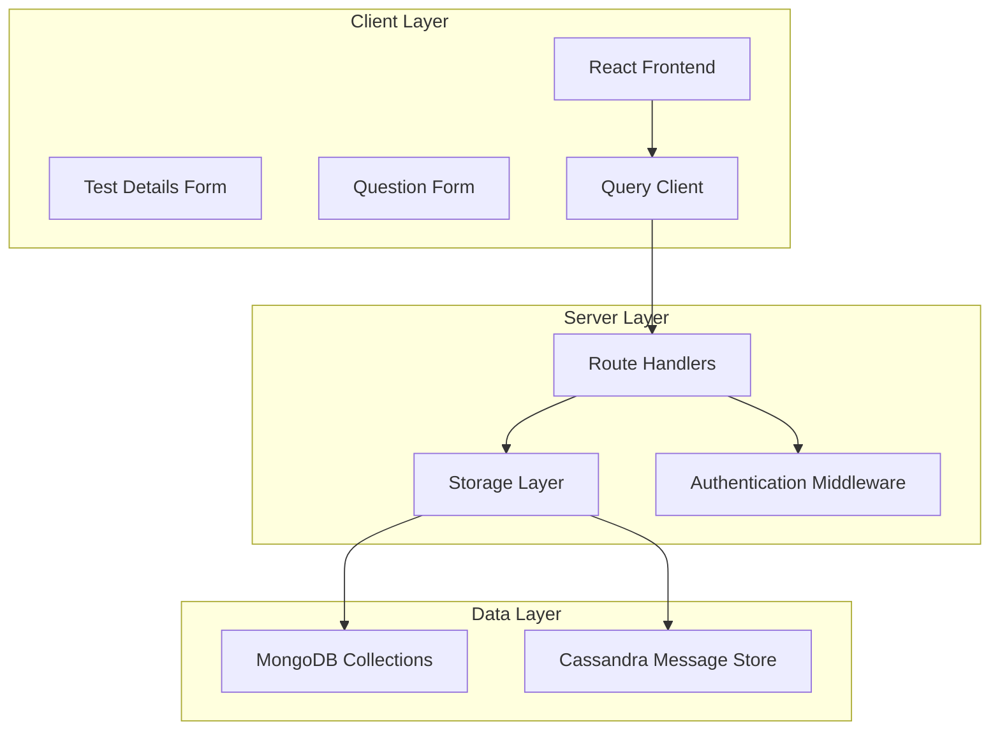
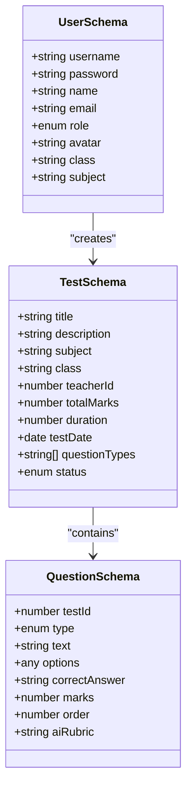
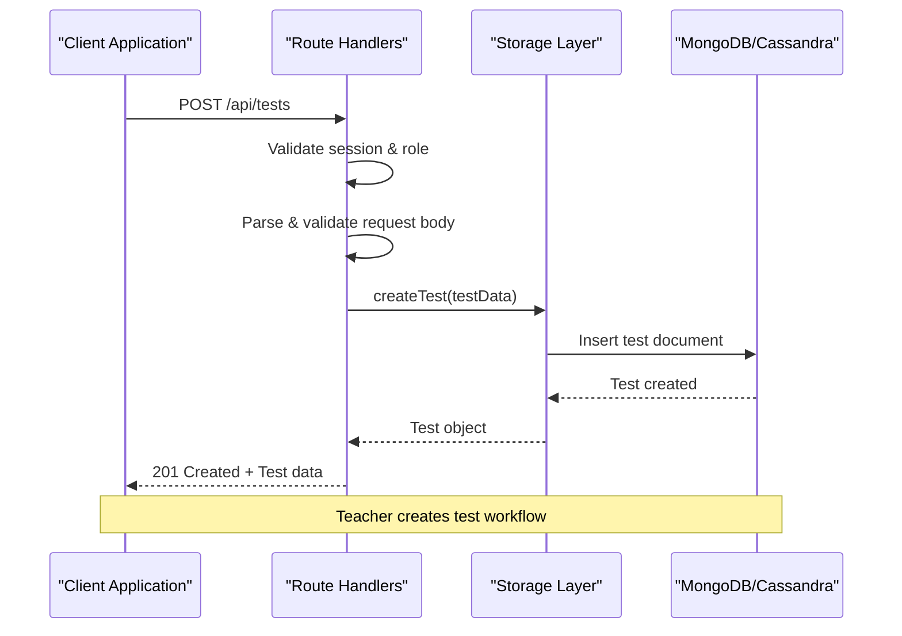
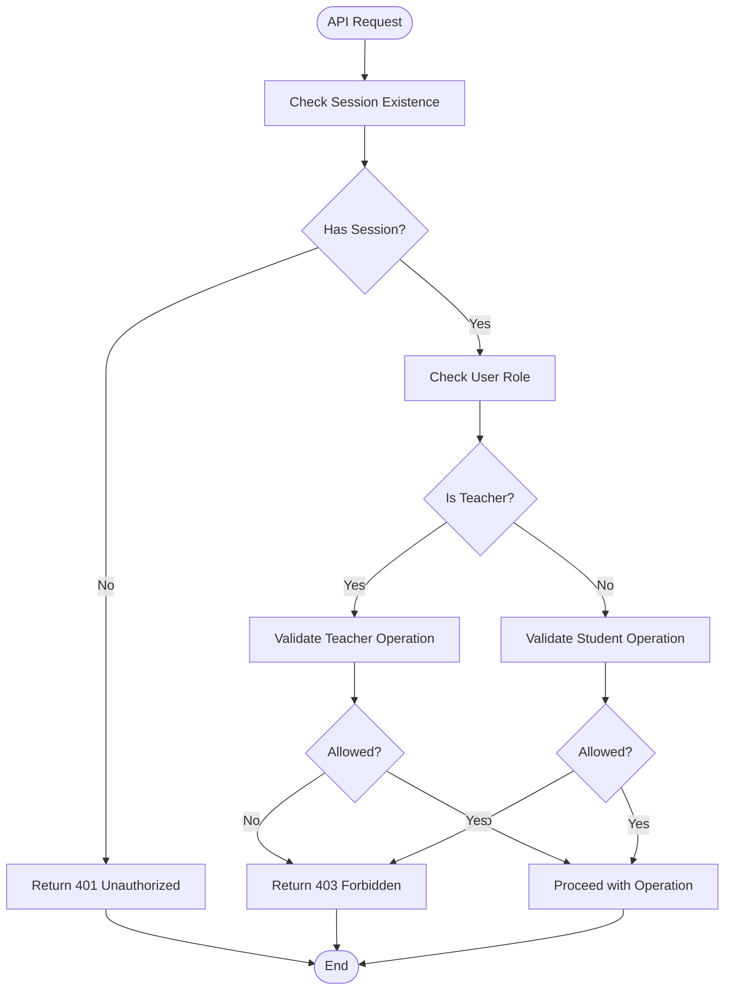
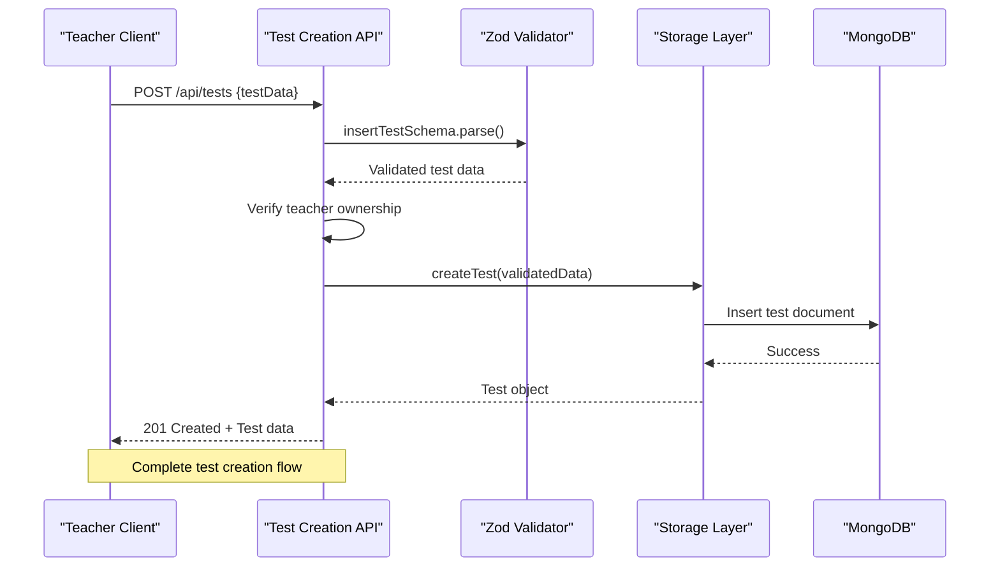
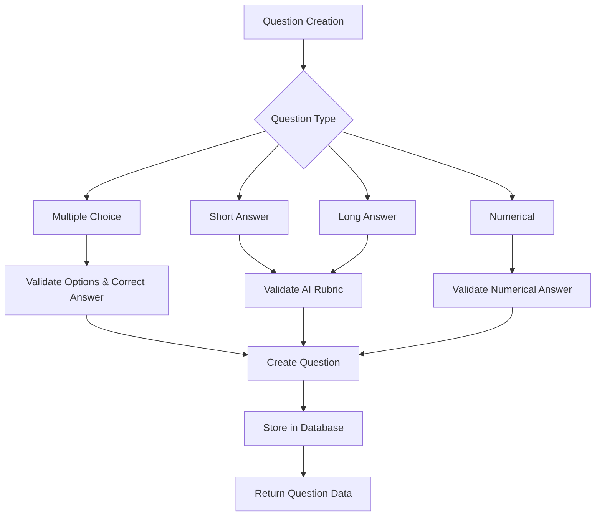
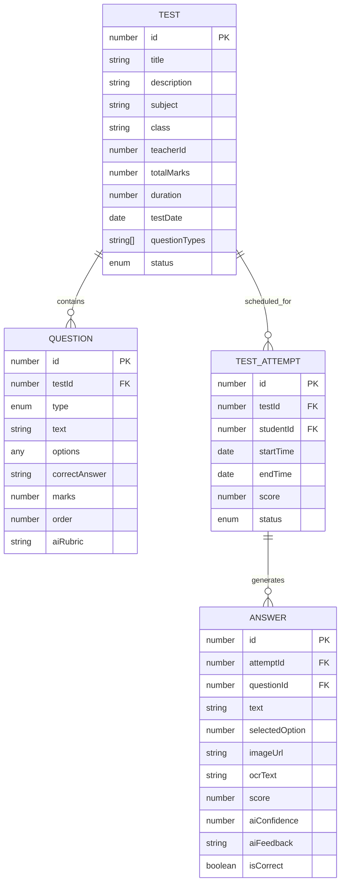
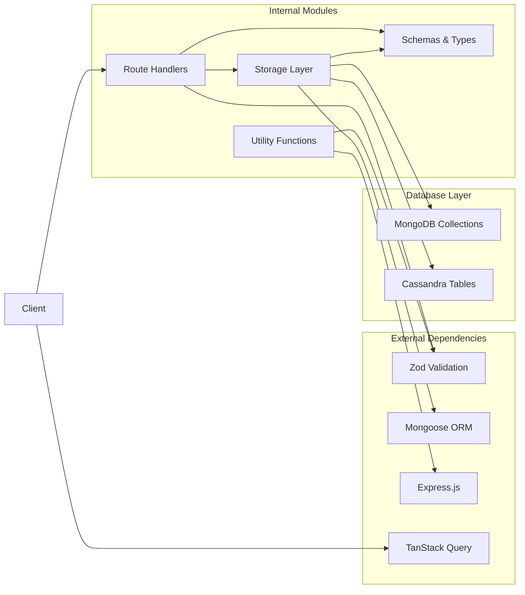

# Assessment & Test Management Endpoints

<cite>
**Referenced Files in This Document**
- [server/routes.ts](file://server/routes.ts)
- [shared/schema.ts](file://shared/schema.ts)
- [server/storage.ts](file://server/storage.ts)
- [client/src/lib/queryClient.ts](file://client/src/lib/queryClient.ts)
- [client/src/components/test/test-details-form.tsx](file://client/src/components/test/test-details-form.tsx)
- [client/src/components/test/question-form.tsx](file://client/src/components/test/question-form.tsx)
- [shared/mongo-schema.ts](file://shared/mongo-schema.ts)
</cite>

## Table of Contents
1. [Introduction](#introduction)
2. [Project Structure](#project-structure)
3. [Core Components](#core-components)
4. [Architecture Overview](#architecture-overview)
5. [Detailed Component Analysis](#detailed-component-analysis)
6. [Dependency Analysis](#dependency-analysis)
7. [Performance Considerations](#performance-considerations)
8. [Troubleshooting Guide](#troubleshooting-guide)
9. [Conclusion](#conclusion)

## Introduction

This document provides comprehensive API documentation for the assessment and test management system. The platform enables teachers to create, manage, and publish assessments while allowing students to take and complete tests. The system includes robust validation, role-based access control, and comprehensive CRUD operations for tests and questions.

The assessment system supports multiple question types (multiple choice, short answer, long answer, and numerical problems) with AI-powered evaluation capabilities for subjective responses. Teachers can create detailed test configurations with timing, marking schemes, and question categorization.

## Project Structure

The assessment system follows a layered architecture with clear separation between presentation, business logic, and data persistence:

**Diagram sources**
- [server/routes.ts](file://server/routes.ts#L11-L1102)
- [server/storage.ts](file://server/storage.ts#L110-L519)

**Section sources**
- [server/routes.ts](file://server/routes.ts#L1-L1104)
- [server/storage.ts](file://server/storage.ts#L1-L519)

## Core Components

### Test Management Endpoints

The system provides comprehensive CRUD operations for test management:

#### Test Creation (`POST /api/tests`)
- **Purpose**: Create new assessment instances
- **Authentication**: Teacher-only operation
- **Validation**: Full schema validation using Zod
- **Authorization**: Teachers can only create tests for themselves
- **Response**: Returns complete test object with auto-generated ID

#### Test Listing (`GET /api/tests`)
- **Purpose**: Retrieve test collections with filtering
- **Query Parameters**: 
  - `teacherId`: Filter by specific teacher
  - `status`: Filter by test status (draft, published, completed)
- **Role-based Access**:
  - Teachers: See their own tests or all tests if admin
  - Students: See tests for their class only

#### Individual Test Retrieval (`GET /api/tests/:id`)
- **Purpose**: Fetch specific test details
- **Access Control**: 
  - Teachers: Own tests only
  - Students: Tests in their class only

#### Test Updates (`PATCH /api/tests/:id`)
- **Purpose**: Modify existing test configurations
- **Authentication**: Teacher-only
- **Authorization**: Teachers can only modify their own tests
- **Partial Updates**: Supports selective field updates

### Question Management Endpoints

#### Question Creation (`POST /api/questions`)
- **Purpose**: Add questions to existing tests
- **Authentication**: Teacher-only
- **Authorization**: Must own the test being modified
- **Validation**: Comprehensive question schema validation

#### Question Retrieval (`GET /api/tests/:testId/questions`)
- **Purpose**: List all questions in a specific test
- **Access Control**: Same as test access rules

### Data Validation and Schemas

The system uses Zod schemas for comprehensive input validation:

**Diagram sources**
- [shared/schema.ts](file://shared/schema.ts#L15-L37)
- [shared/schema.ts](file://shared/schema.ts#L4-L13)

**Section sources**
- [shared/schema.ts](file://shared/schema.ts#L1-L142)
- [server/routes.ts](file://server/routes.ts#L109-L316)

## Architecture Overview

The assessment system implements a multi-tier architecture with clear separation of concerns:

**Diagram sources**
- [server/routes.ts](file://server/routes.ts#L110-L132)
- [server/storage.ts](file://server/storage.ts#L160-L166)

The architecture supports both MongoDB and Cassandra backends, with automatic fallback mechanisms and optimized query patterns.

**Section sources**
- [server/routes.ts](file://server/routes.ts#L1-L114)
- [server/storage.ts](file://server/storage.ts#L413-L422)

## Detailed Component Analysis

### Authentication and Authorization System

The system implements role-based access control with comprehensive session management:

**Diagram sources**
- [server/routes.ts](file://server/routes.ts#L112-L121)
- [server/routes.ts](file://server/routes.ts#L194-L203)

### Test Creation Workflow

The test creation process involves multiple validation steps and role verification:

**Diagram sources**
- [server/routes.ts](file://server/routes.ts#L110-L132)
- [shared/schema.ts](file://shared/schema.ts#L15-L26)

### Question Management Operations

Question management supports dynamic addition and retrieval with type-specific validation:

**Diagram sources**
- [server/routes.ts](file://server/routes.ts#L250-L278)
- [client/src/components/test/question-form.tsx](file://client/src/components/test/question-form.tsx#L77-L126)

### Data Model Relationships

The assessment system maintains clear relationships between entities:

**Diagram sources**
- [shared/mongo-schema.ts](file://shared/mongo-schema.ts#L25-L87)

**Section sources**
- [server/routes.ts](file://server/routes.ts#L109-L316)
- [shared/mongo-schema.ts](file://shared/mongo-schema.ts#L1-L159)

## Dependency Analysis

The system maintains loose coupling between components through well-defined interfaces:

**Diagram sources**
- [server/routes.ts](file://server/routes.ts#L1-L11)
- [server/storage.ts](file://server/storage.ts#L1-L31)

The dependency structure ensures maintainability and testability while supporting horizontal scaling through the dual database architecture.

**Section sources**
- [server/routes.ts](file://server/routes.ts#L1-L1104)
- [server/storage.ts](file://server/storage.ts#L1-L519)

## Performance Considerations

### Database Optimization Strategies

The system implements several performance optimization techniques:

1. **Indexing Strategy**: Strategic indexing on frequently queried fields like `teacherId`, `studentId`, and `testId`
2. **Query Optimization**: Efficient filtering and sorting patterns for test and question retrieval
3. **Caching Patterns**: Session-based caching for user data and permissions
4. **Pagination Support**: Built-in pagination for large result sets

### Scalability Features

- **Dual Database Architecture**: MongoDB for flexible document storage, Cassandra for high-write throughput
- **Connection Pooling**: Optimized database connection management
- **Memory Store**: In-memory session storage for improved performance
- **Lazy Loading**: Deferred loading of related entities

## Troubleshooting Guide

### Common Authentication Issues

**Problem**: Users receive 401 Unauthorized responses
**Solution**: Verify session establishment and ensure proper authentication flow

**Problem**: Teachers cannot access student tests
**Solution**: Check class enrollment and teacher-student relationship validation

### Validation Error Handling

**Problem**: Request validation fails with 400 Bad Request
**Solution**: Review request payload against Zod schemas and ensure all required fields are present

**Problem**: Permission denied errors (403)
**Solution**: Verify user roles and ownership relationships for the requested resource

### Database Connectivity Issues

**Problem**: MongoDB connection failures
**Solution**: Check connection string configuration and network connectivity

**Problem**: Cassandra write failures
**Solution**: Verify Cassandra cluster availability and proper partition key usage

**Section sources**
- [server/routes.ts](file://server/routes.ts#L42-L46)
- [server/routes.ts](file://server/routes.ts#L112-L121)
- [server/storage.ts](file://server/storage.ts#L413-L422)

## Conclusion

The assessment and test management system provides a comprehensive solution for educational testing environments. The implementation demonstrates strong architectural principles with clear separation of concerns, robust validation, and comprehensive access control.

Key strengths include:
- **Security**: Multi-layered authentication and authorization
- **Flexibility**: Support for multiple question types and evaluation methods
- **Scalability**: Dual database architecture with optimized query patterns
- **Maintainability**: Clean code structure with comprehensive error handling

The system successfully balances functionality with performance, providing educators with powerful tools for assessment creation while maintaining strict access controls and data integrity.