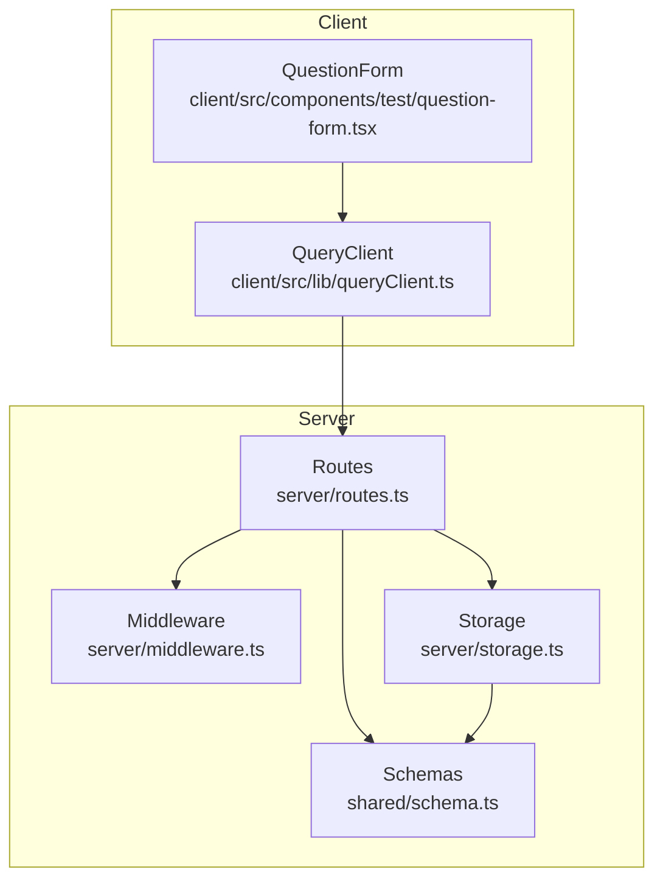
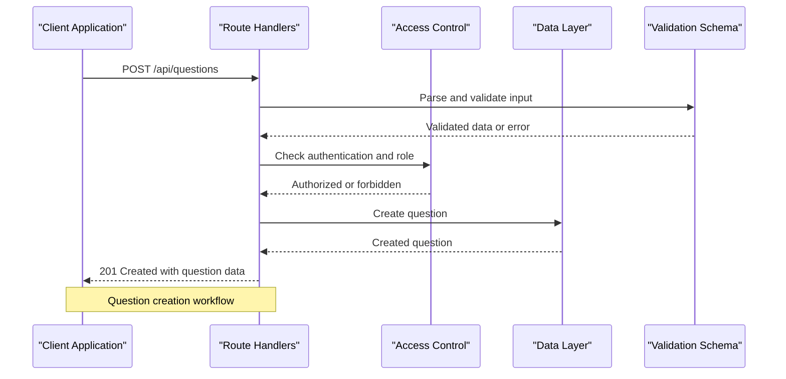
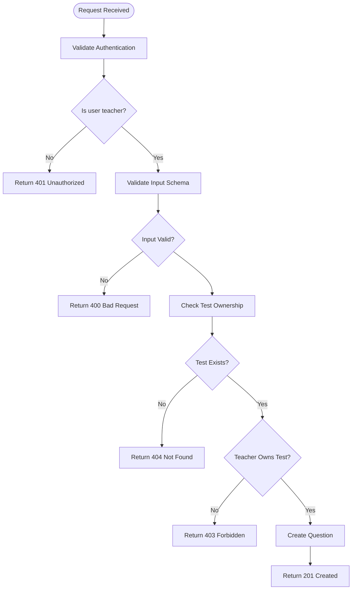
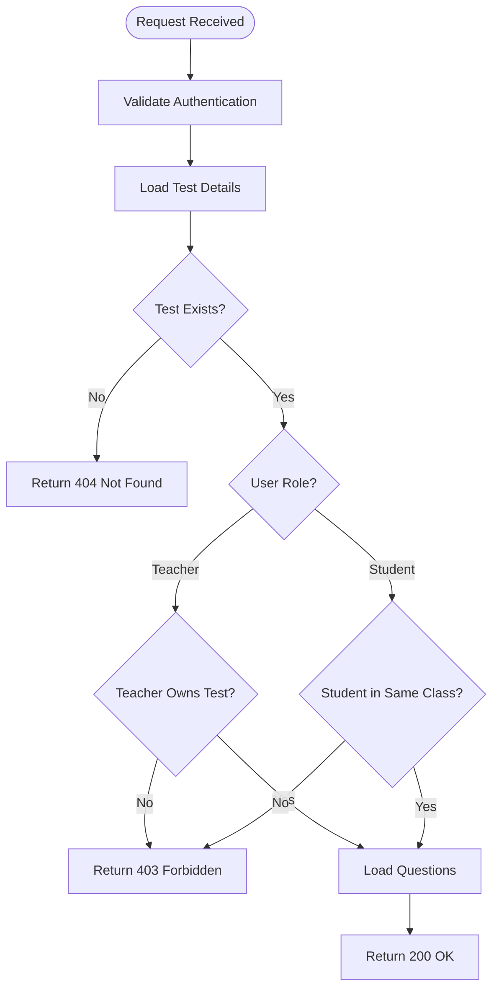
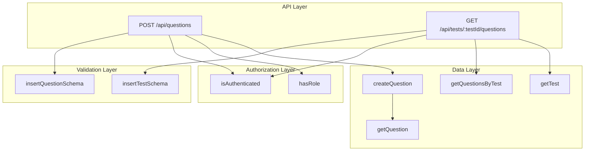
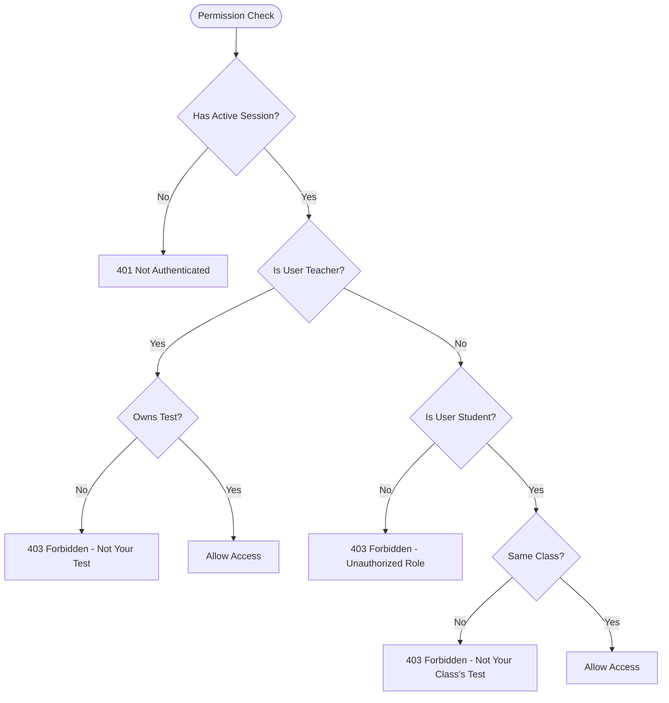

# Question Management Endpoints

<cite>
**Referenced Files in This Document**
- [routes.ts](file://server/routes.ts)
- [schema.ts](file://shared/schema.ts)
- [storage.ts](file://server/storage.ts)
- [middleware.ts](file://server/middleware.ts)
- [question-form.tsx](file://client/src/components/test/question-form.tsx)
- [queryClient.ts](file://client/src/lib/queryClient.ts)
</cite>

## Table of Contents
1. [Introduction](#introduction)
2. [Project Structure](#project-structure)
3. [Core Components](#core-components)
4. [Architecture Overview](#architecture-overview)
5. [Detailed Component Analysis](#detailed-component-analysis)
6. [Dependency Analysis](#dependency-analysis)
7. [Performance Considerations](#performance-considerations)
8. [Troubleshooting Guide](#troubleshooting-guide)
9. [Conclusion](#conclusion)

## Introduction
This document provides comprehensive API documentation for question management endpoints in the Personal Learning Pro system. It covers:
- POST /api/questions for question creation with teacher-only access control and test ownership validation
- GET /api/tests/:testId/questions for retrieving questions associated with a specific test with proper access control checks
- Request/response schemas, validation rules, authorization requirements, and access control patterns for both teachers and students
- Examples of question creation workflows and test question retrieval patterns
- Error handling scenarios for unauthorized access, invalid test IDs, and missing question data

## Project Structure
The question management functionality spans server-side route handlers, shared validation schemas, and client-side integration components:
- Server routes define the API endpoints and enforce access control
- Shared schemas provide strict input validation for question creation
- Storage layer manages persistence and retrieval of questions
- Client components demonstrate usage patterns for creating and viewing questions

**Diagram sources**
- [routes.ts](file://server/routes.ts#L249-L316)
- [schema.ts](file://shared/schema.ts#L28-L37)
- [storage.ts](file://server/storage.ts#L191-L211)
- [middleware.ts](file://server/middleware.ts#L3-L17)
- [question-form.tsx](file://client/src/components/test/question-form.tsx#L77-L126)
- [queryClient.ts](file://client/src/lib/queryClient.ts#L10-L28)

**Section sources**
- [routes.ts](file://server/routes.ts#L249-L316)
- [schema.ts](file://shared/schema.ts#L28-L37)
- [storage.ts](file://server/storage.ts#L191-L211)
- [middleware.ts](file://server/middleware.ts#L3-L17)
- [question-form.tsx](file://client/src/components/test/question-form.tsx#L77-L126)
- [queryClient.ts](file://client/src/lib/queryClient.ts#L10-L28)

## Core Components
This section outlines the key components involved in question management:

### Question Creation Endpoint
- Endpoint: POST /api/questions
- Purpose: Create a new question associated with a test
- Access Control: Requires authenticated user with role "teacher"
- Ownership Validation: Validates that the teacher owns the test before creating the question
- Input Validation: Uses shared schema for strict validation

### Test Question Retrieval Endpoint
- Endpoint: GET /api/tests/:testId/questions
- Purpose: Retrieve all questions for a specific test
- Access Control: Requires authentication; enforces role-based access
- Ownership/Class Validation: Teachers can access their own tests; students can access questions only for their class's tests

### Shared Validation Schema
- insertQuestionSchema: Defines required fields and validation rules for question creation
- Fields include testId, type, text, options, correctAnswer, marks, order, and optional aiRubric

### Storage Operations
- createQuestion: Persists new questions with auto-generated IDs
- getQuestionsByTest: Retrieves questions sorted by order for a given test
- getQuestion: Retrieves individual question by ID

**Section sources**
- [routes.ts](file://server/routes.ts#L249-L316)
- [schema.ts](file://shared/schema.ts#L28-L37)
- [storage.ts](file://server/storage.ts#L191-L211)

## Architecture Overview
The question management architecture follows a layered approach with clear separation of concerns:

**Diagram sources**
- [routes.ts](file://server/routes.ts#L249-L278)
- [schema.ts](file://shared/schema.ts#L28-L37)
- [middleware.ts](file://server/middleware.ts#L3-L17)
- [storage.ts](file://server/storage.ts#L191-L197)

## Detailed Component Analysis

### POST /api/questions - Question Creation

#### Endpoint Definition
- Method: POST
- Path: /api/questions
- Authentication: Required
- Authorization: Teacher role only

#### Request Schema
The endpoint expects a JSON payload conforming to the insertQuestionSchema:

| Field | Type | Required | Description |
|-------|------|----------|-------------|
| testId | number | Yes | ID of the test this question belongs to |
| type | enum | Yes | Question type: mcq, short, long, numerical |
| text | string | Yes | Question content |
| options | array | Conditional | Options for MCQ questions |
| correctAnswer | string | Conditional | Correct answer identifier |
| marks | number | No | Marks allocated (default: 1) |
| order | number | Yes | Display order within test |
| aiRubric | string | No | Evaluation criteria for AI scoring |

#### Response Schema
Successful creation returns the created question object with auto-generated ID:

| Field | Type | Description |
|-------|------|-------------|
| id | number | Auto-generated question ID |
| testId | number | Associated test ID |
| type | string | Question type |
| text | string | Question content |
| options | array | Options (if applicable) |
| correctAnswer | string | Correct answer identifier |
| marks | number | Allocated marks |
| order | number | Display order |
| aiRubric | string | AI evaluation criteria |

#### Processing Logic

**Diagram sources**
- [routes.ts](file://server/routes.ts#L249-L278)
- [schema.ts](file://shared/schema.ts#L28-L37)

#### Access Control Patterns
- Session-based authentication: Requires active session with userId
- Role-based authorization: Only users with role "teacher" can create questions
- Ownership verification: Ensures teacher owns the test before allowing question creation
- Input validation: Uses Zod schema for comprehensive data validation

#### Client-Side Implementation
The client-side form handles question creation through a React component that:
- Validates form data locally before submission
- Handles MCQ-specific logic for correct answers
- Integrates with TanStack Query for optimistic updates
- Manages loading states and error handling

**Section sources**
- [routes.ts](file://server/routes.ts#L249-L278)
- [schema.ts](file://shared/schema.ts#L28-L37)
- [question-form.tsx](file://client/src/components/test/question-form.tsx#L77-L126)
- [queryClient.ts](file://client/src/lib/queryClient.ts#L10-L28)

### GET /api/tests/:testId/questions - Retrieve Test Questions

#### Endpoint Definition
- Method: GET
- Path: /api/tests/:testId/questions
- Authentication: Required
- Authorization: Depends on user role and test ownership/class membership

#### Path Parameter
- testId: Number representing the test ID (validated as integer)

#### Response Schema
Returns an array of question objects:

| Field | Type | Description |
|-------|------|-------------|
| id | number | Question ID |
| testId | number | Test ID |
| type | string | Question type |
| text | string | Question content |
| options | array | Options for MCQ |
| correctAnswer | string | Correct answer |
| marks | number | Marks |
| order | number | Display order |
| aiRubric | string | AI evaluation criteria |

#### Access Control Logic

**Diagram sources**
- [routes.ts](file://server/routes.ts#L280-L316)

#### Processing Logic
The endpoint performs the following steps:
1. Validates authentication (requires active session)
2. Parses and validates the testId parameter
3. Loads test details from storage
4. Enforces access control based on user role:
   - Teachers: Must own the test
   - Students: Must belong to the same class as the test
5. Retrieves questions sorted by order for the specified test
6. Returns questions in JSON format

#### Client-Side Integration
The client-side implementation uses TanStack Query for:
- Automatic caching of test questions
- Optimistic updates when new questions are added
- Error handling and loading states
- Refetching when question data changes

**Section sources**
- [routes.ts](file://server/routes.ts#L280-L316)
- [storage.ts](file://server/storage.ts#L204-L207)
- [queryClient.ts](file://client/src/lib/queryClient.ts#L30-L46)

## Dependency Analysis
The question management system exhibits clear dependency relationships:

**Diagram sources**
- [routes.ts](file://server/routes.ts#L249-L316)
- [schema.ts](file://shared/schema.ts#L28-L37)
- [middleware.ts](file://server/middleware.ts#L3-L17)
- [storage.ts](file://server/storage.ts#L191-L211)

**Section sources**
- [routes.ts](file://server/routes.ts#L249-L316)
- [schema.ts](file://shared/schema.ts#L28-L37)
- [middleware.ts](file://server/middleware.ts#L3-L17)
- [storage.ts](file://server/storage.ts#L191-L211)

## Performance Considerations
- Database Indexing: Questions should be indexed by testId for efficient retrieval
- Sorting Efficiency: Questions are sorted by order field; ensure proper indexing on this field
- Caching Strategy: Client-side caching with TanStack Query provides automatic cache invalidation
- Batch Operations: Consider implementing bulk question creation for large-scale test development
- Pagination: Current implementation loads all questions; consider pagination for tests with many questions

## Troubleshooting Guide

### Common Error Scenarios

#### Authentication Issues
- **401 Unauthorized**: Occurs when accessing endpoints without valid session
- **401 Not Authenticated**: Returned when session.userId is missing
- **403 Forbidden**: Returned for insufficient permissions

#### Input Validation Errors
- **400 Bad Request**: Returned for invalid question data
- **Zod Validation Errors**: Detailed field-specific validation failures

#### Resource Access Issues
- **404 Not Found**: Test or question does not exist
- **400 Invalid Test ID**: testId parameter is not a valid number

#### Permission Validation Scenarios

**Diagram sources**
- [routes.ts](file://server/routes.ts#L249-L316)

### Debugging Steps
1. Verify session establishment and role assignment
2. Check test ownership relationship in database
3. Validate input data against schema requirements
4. Confirm user class membership matches test class
5. Review server logs for detailed error information

**Section sources**
- [routes.ts](file://server/routes.ts#L249-L316)

## Conclusion
The question management endpoints provide a robust foundation for educational assessment systems with comprehensive access control and validation. The implementation ensures:
- Strong authorization boundaries between teachers and students
- Comprehensive input validation using Zod schemas
- Clear error handling and user feedback
- Efficient data retrieval with proper sorting
- Client-side integration for seamless user experience

The architecture supports future enhancements such as bulk operations, pagination, and advanced AI-powered question features while maintaining security and performance standards.