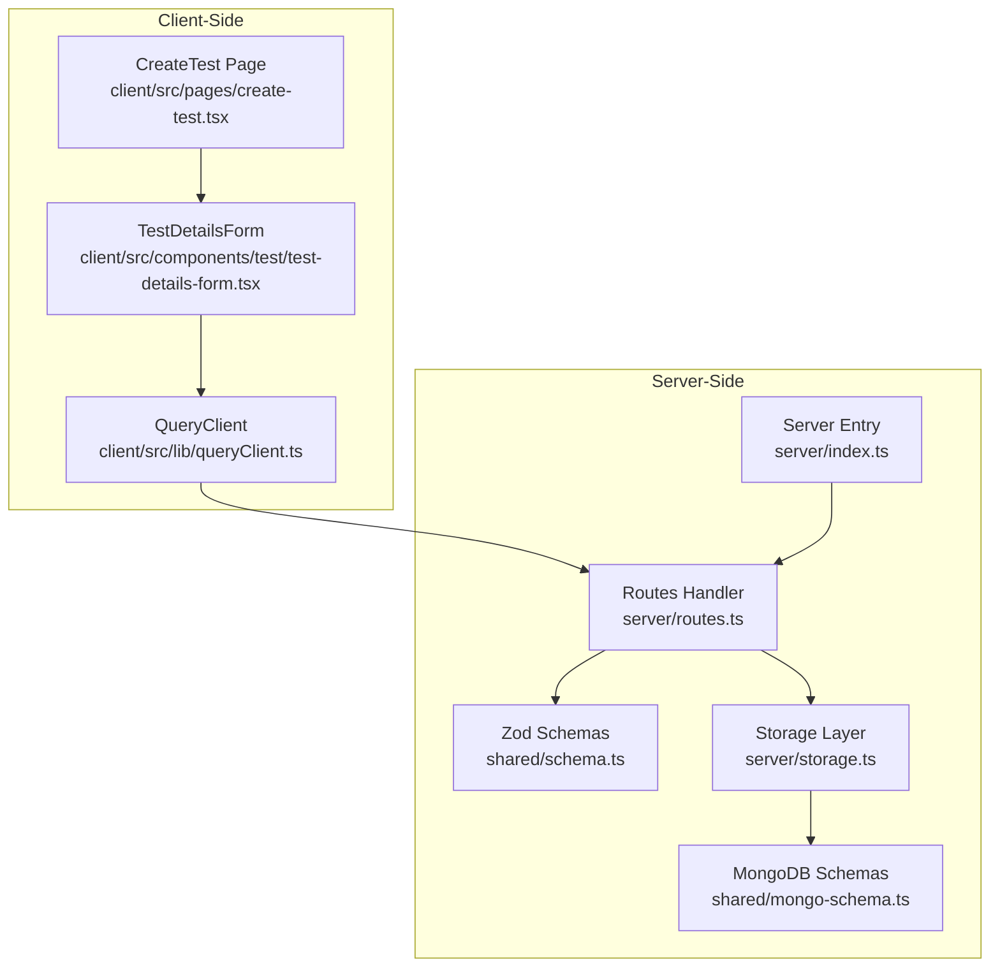
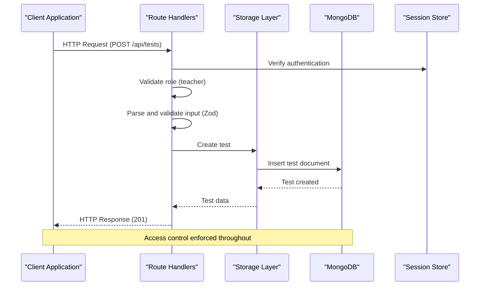
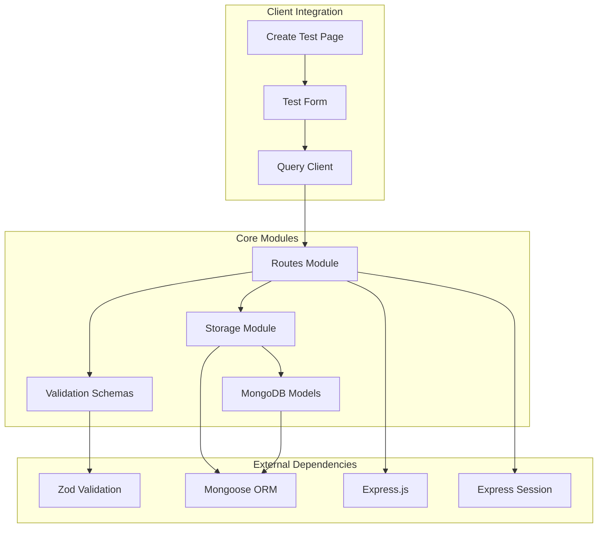

# Test Management Endpoints

<cite>
**Referenced Files in This Document**
- [server/index.ts](file://server/index.ts)
- [server/routes.ts](file://server/routes.ts)
- [shared/schema.ts](file://shared/schema.ts)
- [shared/mongo-schema.ts](file://shared/mongo-schema.ts)
- [server/storage.ts](file://server/storage.ts)
- [client/src/pages/create-test.tsx](file://client/src/pages/create-test.tsx)
- [client/src/components/test/test-details-form.tsx](file://client/src/components/test/test-details-form.tsx)
- [client/src/lib/queryClient.ts](file://client/src/lib/queryClient.ts)
</cite>

## Table of Contents
1. [Introduction](#introduction)
2. [Project Structure](#project-structure)
3. [Core Components](#core-components)
4. [Architecture Overview](#architecture-overview)
5. [Detailed Component Analysis](#detailed-component-analysis)
6. [Dependency Analysis](#dependency-analysis)
7. [Performance Considerations](#performance-considerations)
8. [Troubleshooting Guide](#troubleshooting-guide)
9. [Conclusion](#conclusion)

## Introduction
This document provides comprehensive API documentation for test management endpoints in the system. It covers the four primary endpoints for managing tests:
- POST /api/tests: Create a new test with teacher-only access control
- GET /api/tests: List tests with query parameters (teacherId, status) supporting both teacher-owned tests and student-class filtering
- GET /api/tests/:id: Retrieve a specific test with proper access validation
- PATCH /api/tests/:id: Update a test with ownership verification

The documentation includes request/response schemas validated by Zod schemas, role-based access control implementation, permission checking logic, error handling patterns, and practical examples for teacher test creation workflows, student test access patterns, and administrative test management scenarios.

## Project Structure
The test management functionality spans both server-side and client-side components:

**Diagram sources**
- [server/index.ts](file://server/index.ts#L1-L114)
- [server/routes.ts](file://server/routes.ts#L1-L1104)
- [shared/schema.ts](file://shared/schema.ts#L1-L142)
- [shared/mongo-schema.ts](file://shared/mongo-schema.ts#L1-L159)
- [server/storage.ts](file://server/storage.ts#L1-L519)

**Section sources**
- [server/index.ts](file://server/index.ts#L1-L114)
- [server/routes.ts](file://server/routes.ts#L1-L1104)

## Core Components
The test management system consists of several key components working together:

### Zod Validation Schemas
The system uses Zod schemas for strict input validation:
- `insertTestSchema`: Defines the structure and validation rules for test creation/update
- `insertUserSchema`: Provides user-related validation for session management
- Database schema mapping: MongoDB document structure for persistent storage

### Storage Layer
The storage layer provides database abstraction with methods for:
- Test CRUD operations (create, read, update)
- Test listing with filtering by teacherId and status
- Student-class based filtering for test discovery
- Ownership verification for access control

### Route Handlers
Each endpoint implements comprehensive validation and access control:
- Authentication checks using session data
- Role-based authorization (teacher vs student)
- Ownership verification for test operations
- Proper error handling with appropriate HTTP status codes

**Section sources**
- [shared/schema.ts](file://shared/schema.ts#L15-L26)
- [shared/mongo-schema.ts](file://shared/mongo-schema.ts#L25-L38)
- [server/storage.ts](file://server/storage.ts#L44-L49)

## Architecture Overview
The test management architecture follows a layered approach with clear separation of concerns:

**Diagram sources**
- [server/routes.ts](file://server/routes.ts#L110-L132)
- [server/storage.ts](file://server/storage.ts#L161-L166)

The architecture ensures:
- **Security**: All operations require authenticated sessions with role validation
- **Data Integrity**: Strict input validation using Zod schemas
- **Access Control**: Fine-grained permissions based on user roles and ownership
- **Scalability**: Clear separation between presentation, business logic, and data access layers

## Detailed Component Analysis

### POST /api/tests - Test Creation
This endpoint enables teachers to create new tests with comprehensive validation and access control.

#### Request Schema
The request body must conform to the `insertTestSchema` with the following structure:
- title: string (required, min length 1)
- description: string (optional)
- subject: string (required, min length 1)
- class: string (required, min length 1)
- teacherId: number (required, must match authenticated user)
- totalMarks: number (default: 100)
- duration: number (default: 60)
- testDate: string or date (required)
- questionTypes: array of strings (required, min length 1)
- status: enum ["draft", "published", "completed"] (default: "draft")

#### Response Schema
Successful creation returns a complete test object with additional fields:
- id: number (auto-generated)
- createdAt: date (auto-generated)
- All fields from the request schema

#### Access Control Logic
1. **Authentication**: Requires active session (`req.session.userId`)
2. **Role Verification**: Must be "teacher" role
3. **Ownership Validation**: `teacherId` must match the authenticated user's ID
4. **Input Validation**: Uses Zod schema for comprehensive validation

#### Error Handling
- 401 Unauthorized: Missing or invalid session
- 400 Bad Request: Invalid input data (Zod validation errors)
- 403 Forbidden: Non-teacher users or ownership mismatch
- 500 Internal Server Error: Database or system errors

**Section sources**
- [server/routes.ts](file://server/routes.ts#L110-L132)
- [shared/schema.ts](file://shared/schema.ts#L15-L26)

### GET /api/tests - Test Listing
This endpoint provides flexible test listing with support for both teacher-owned tests and student-class filtering.

#### Query Parameters
- teacherId: number (optional) - Filter by specific teacher
- status: string (optional) - Filter by test status

#### Access Control Logic
1. **Authentication**: Requires active session
2. **Role-Based Filtering**:
   - **Teachers**: Can access their own tests or all tests if admin (admin role not explicitly defined in code)
   - **Students**: Can only access tests for their class
3. **Class-Based Filtering**: Students receive tests filtered by their class enrollment

#### Response Schema
Returns an array of test objects matching the query criteria, each with:
- Complete test data including id, createdAt, and all request fields

#### Practical Examples
- **Teacher Workflow**: `GET /api/tests?teacherId=123&status=published`
- **Student Workflow**: `GET /api/tests?status=completed` (automatically filtered by student's class)

**Section sources**
- [server/routes.ts](file://server/routes.ts#L134-L173)
- [server/storage.ts](file://server/storage.ts#L173-L184)

### GET /api/tests/:id - Individual Test Retrieval
This endpoint retrieves a specific test with comprehensive access validation.

#### Path Parameter
- id: number (required) - Test identifier

#### Access Control Logic
1. **Authentication**: Requires active session
2. **Existence Check**: Validates test existence
3. **Permission Validation**:
   - **Teachers**: Can access tests where `teacherId` matches their ID
   - **Students**: Can access tests where `class` matches their class enrollment
4. **Input Validation**: Converts path parameter to integer with error handling

#### Response Schema
Returns the complete test object if accessible, otherwise returns appropriate error

#### Error Handling
- 400 Bad Request: Invalid test ID format
- 401 Unauthorized: Missing session
- 403 Forbidden: Insufficient permissions or class mismatch
- 404 Not Found: Test does not exist

**Section sources**
- [server/routes.ts](file://server/routes.ts#L175-L209)

### PATCH /api/tests/:id - Test Updates
This endpoint allows authorized updates to existing tests with ownership verification.

#### Path Parameter
- id: number (required) - Test identifier to update

#### Request Schema
Partial test data using `insertTestSchema.partial()` allowing selective field updates:
- title, description, subject, class, totalMarks, duration, testDate, questionTypes, status

#### Access Control Logic
1. **Authentication**: Requires teacher role
2. **Existence Check**: Validates test existence
3. **Ownership Verification**: Ensures teacher owns the test
4. **Partial Validation**: Uses Zod partial schema for flexible updates

#### Response Schema
Returns the updated test object with all fields

#### Error Handling
- 400 Bad Request: Invalid test ID or validation errors
- 401 Unauthorized: Non-teacher users
- 403 Forbidden: Test ownership verification failed
- 404 Not Found: Test does not exist

**Section sources**
- [server/routes.ts](file://server/routes.ts#L211-L247)

## Dependency Analysis

**Diagram sources**
- [server/routes.ts](file://server/routes.ts#L1-L1104)
- [server/storage.ts](file://server/storage.ts#L1-L519)
- [shared/schema.ts](file://shared/schema.ts#L1-L142)
- [shared/mongo-schema.ts](file://shared/mongo-schema.ts#L1-L159)

### Key Dependencies
- **Zod Validation**: Provides compile-time type safety and runtime validation
- **Mongoose**: Handles MongoDB operations and document modeling
- **Express Session**: Manages user authentication state across requests
- **React Query**: Client-side caching and state management for API calls

### Coupling Analysis
- **Low Coupling**: Routes depend only on storage interface, not implementation details
- **High Cohesion**: Each module has a single responsibility (routing, validation, storage)
- **Clear Contracts**: Interfaces define explicit boundaries between components

**Section sources**
- [server/storage.ts](file://server/storage.ts#L33-L106)

## Performance Considerations
The test management system incorporates several performance optimizations:

### Database Indexing
- Test queries support filtering by teacherId and status efficiently
- Test assignment queries utilize composite indexes for optimal performance
- Auto-increment counters prevent ID conflicts and improve insertion performance

### Caching Strategy
- React Query provides automatic client-side caching for test lists
- Session-based authentication reduces repeated database lookups
- Query invalidation ensures data consistency across updates

### Scalability Features
- Modular architecture allows for horizontal scaling
- Database abstraction enables potential migration to other storage systems
- Stateless route handlers support load balancing

## Troubleshooting Guide

### Common Authentication Issues
- **401 Unauthorized**: Verify user session is active and contains role information
- **Session Not Persisting**: Check session store configuration and cookie settings
- **Role Mismatch**: Ensure user role is properly set during registration/login

### Validation Errors
- **400 Bad Request**: Review Zod validation error messages for specific field issues
- **Missing Fields**: Ensure all required fields are present in request body
- **Type Mismatches**: Verify data types match schema expectations

### Access Control Problems
- **403 Forbidden**: Confirm user has proper role and ownership permissions
- **Class Filtering Issues**: Verify student class enrollment matches test class
- **Teacher vs Student Confusion**: Check that teacherId matches authenticated user

### Database Connectivity
- **Connection Failures**: Verify MongoDB connection string and network connectivity
- **Query Performance**: Monitor slow query logs and consider adding appropriate indexes
- **Data Consistency**: Use transactions for operations requiring atomicity

**Section sources**
- [server/routes.ts](file://server/routes.ts#L110-L247)
- [server/storage.ts](file://server/storage.ts#L161-L189)

## Conclusion
The test management endpoints provide a robust, secure, and scalable solution for educational assessment management. The implementation demonstrates strong adherence to security best practices through comprehensive role-based access control, strict input validation, and proper error handling.

Key strengths of the implementation include:
- **Security**: Multi-layered access control with session-based authentication
- **Data Integrity**: Comprehensive validation using Zod schemas
- **Flexibility**: Support for both teacher-owned tests and student-class filtering
- **Maintainability**: Clean separation of concerns with modular architecture
- **Developer Experience**: Clear error messages and comprehensive documentation

The system successfully balances security requirements with usability, providing appropriate access patterns for different user roles while maintaining data consistency and performance. The modular design facilitates future enhancements such as administrative test management capabilities and expanded filtering options.