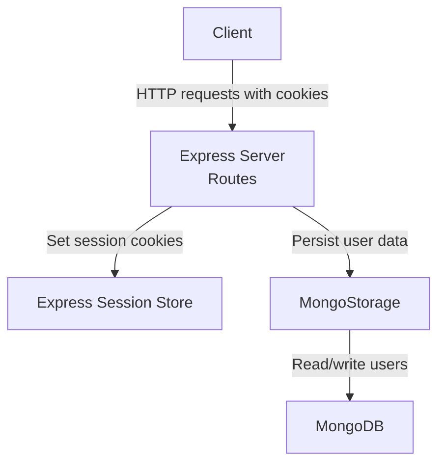
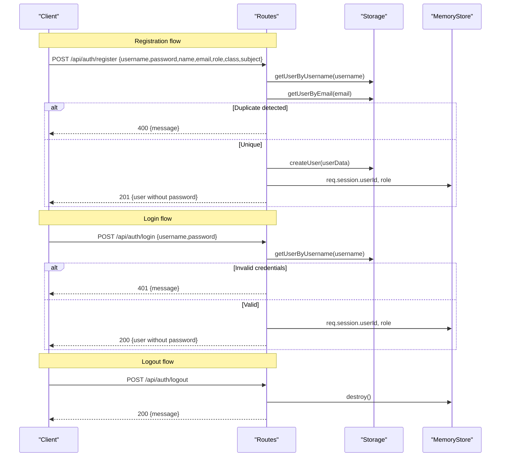
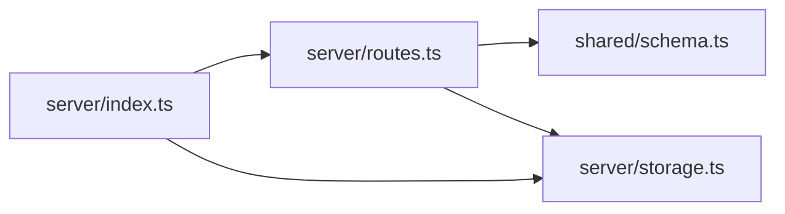

# Authentication Endpoints

<cite>
**Referenced Files in This Document**
- [routes.ts](file://server/routes.ts)
- [schema.ts](file://shared/schema.ts)
- [storage.ts](file://server/storage.ts)
- [index.ts](file://server/index.ts)
- [chat-api.ts](file://client/src/lib/chat-api.ts)
- [.env.example](file://.env.example)
</cite>

## Table of Contents
1. [Introduction](#introduction)
2. [Project Structure](#project-structure)
3. [Core Components](#core-components)
4. [Architecture Overview](#architecture-overview)
5. [Detailed Component Analysis](#detailed-component-analysis)
6. [Dependency Analysis](#dependency-analysis)
7. [Performance Considerations](#performance-considerations)
8. [Troubleshooting Guide](#troubleshooting-guide)
9. [Conclusion](#conclusion)

## Introduction
This document provides comprehensive API documentation for the authentication endpoints used by the backend service. It covers the registration, login, and logout endpoints, including HTTP methods, request/response schemas, validation rules, and session management. It also outlines security considerations such as password handling, session creation, and role-based access control.

## Project Structure
The authentication endpoints are implemented in the server routes and backed by a storage layer. Client-side session handling is performed via HTTP cookies with the Express session store.

**Diagram sources**
- [routes.ts](file://server/routes.ts#L11-L85)
- [index.ts](file://server/index.ts#L35-L44)
- [storage.ts](file://server/storage.ts#L110-L118)

**Section sources**
- [routes.ts](file://server/routes.ts#L11-L85)
- [index.ts](file://server/index.ts#L35-L44)

## Core Components
- Registration endpoint: Validates input, checks for duplicate username/email, creates a user, and initializes a session.
- Login endpoint: Validates credentials, sets session, and returns user info excluding sensitive fields.
- Logout endpoint: Destroys the session and returns a success message.
- Session middleware: Configures cookie security, lifetime, and store.
- Validation schemas: Define allowed fields and constraints for user registration.

**Section sources**
- [routes.ts](file://server/routes.ts#L13-L85)
- [schema.ts](file://shared/schema.ts#L4-L13)
- [index.ts](file://server/index.ts#L35-L44)

## Architecture Overview
The authentication flow integrates HTTP sessions with a persistent store. On successful registration or login, the server sets session cookies. Subsequent requests carry these cookies, enabling role-based access control on protected routes.

**Diagram sources**
- [routes.ts](file://server/routes.ts#L13-L85)
- [storage.ts](file://server/storage.ts#L132-L147)
- [index.ts](file://server/index.ts#L35-L44)

## Detailed Component Analysis

### Registration Endpoint
- Path: POST /api/auth/register
- Purpose: Create a new user account after validating input and ensuring uniqueness of username and email.
- Request body schema (validation enforced):
  - username: string, required
  - password: string, required
  - name: string, required
  - email: string, required (valid email format)
  - role: enum ["student","teacher"], defaults to "student"
  - avatar: string, optional
  - class: string, optional
  - subject: string, optional
- Response:
  - 201 Created: Returns user object without password and with auto-generated numeric id.
  - 400 Bad Request: If input fails validation or username/email already exists.
  - 500 Internal Server Error: On unexpected failure.
- Validation rules:
  - Username and password must be non-empty.
  - Email must match a valid email format.
  - Role must be one of the allowed values.
- Session management:
  - On success, the server sets session fields: userId and role.
- Security considerations:
  - Password is stored in the database; the API response excludes it.
  - Session cookie is configured with security flags based on environment.

**Section sources**
- [routes.ts](file://server/routes.ts#L13-L47)
- [schema.ts](file://shared/schema.ts#L4-L13)
- [storage.ts](file://server/storage.ts#L132-L147)
- [index.ts](file://server/index.ts#L35-L44)

### Login Endpoint
- Path: POST /api/auth/login
- Purpose: Authenticate a user by verifying credentials and initializing a session.
- Request body schema:
  - username: string, required
  - password: string, required
- Response:
  - 200 OK: Returns user object without password and with auto-generated numeric id.
  - 400 Bad Request: If username or password are missing.
  - 401 Unauthorized: If credentials are invalid.
  - 500 Internal Server Error: On unexpected failure.
- Validation rules:
  - Both username and password must be provided.
  - Credentials are validated against stored user data.
- Session management:
  - On success, the server sets session fields: userId and role.
- Security considerations:
  - Password comparison is performed in plain text in the current implementation. This is a significant risk and should be addressed by hashing passwords and comparing hashes.

**Section sources**
- [routes.ts](file://server/routes.ts#L49-L76)
- [storage.ts](file://server/storage.ts#H132-L139)
- [index.ts](file://server/index.ts#L35-L44)

### Logout Endpoint
- Path: POST /api/auth/logout
- Purpose: Destroy the current session and invalidate the user’s authenticated state.
- Request body: None required.
- Response:
  - 200 OK: { message: "Logged out successfully" }
  - 500 Internal Server Error: On failure to destroy the session.
- Session management:
  - Uses the session store to destroy the session.
- Security considerations:
  - Ensure the session cookie is cleared by the client if necessary.

**Section sources**
- [routes.ts](file://server/routes.ts#L78-L85)
- [index.ts](file://server/index.ts#L35-L44)

### Session Management
- Middleware configuration:
  - Secret: SESSION_SECRET environment variable (required in production).
  - Cookie security: secure flag enabled in production; max age 24 hours.
  - Store: MemoryStore for sessions.
- Client behavior:
  - The client sends cookies with credentials included for authenticated requests.

**Section sources**
- [index.ts](file://server/index.ts#L31-L44)
- [chat-api.ts](file://client/src/lib/chat-api.ts#L44-L55)
- [.env.example](file://.env.example#L25-L28)

### Role-Based Access Control
- Sessions store role alongside userId.
- Many routes enforce role checks using req.session.role.
- Example enforcement points:
  - Tests creation restricted to "teacher".
  - Workspace member management restricted to owners or "teacher".
  - Channel creation restricted to "teacher".

**Section sources**
- [routes.ts](file://server/routes.ts#L112-L113)
- [routes.ts](file://server/routes.ts#L64-L67)

## Dependency Analysis
The authentication endpoints depend on:
- Route handlers for registration, login, and logout.
- Validation schemas for input sanitization.
- Storage layer for user lookup and persistence.
- Session middleware for cookie-based authentication.

**Diagram sources**
- [routes.ts](file://server/routes.ts#L1-L11)
- [schema.ts](file://shared/schema.ts#L1-L13)
- [storage.ts](file://server/storage.ts#L1-L12)
- [index.ts](file://server/index.ts#L10-L12)

**Section sources**
- [routes.ts](file://server/routes.ts#L1-L11)
- [schema.ts](file://shared/schema.ts#L1-L13)
- [storage.ts](file://server/storage.ts#L1-L12)
- [index.ts](file://server/index.ts#L10-L12)

## Performance Considerations
- Session store: MemoryStore is suitable for development; consider a scalable store (e.g., Redis) for production to avoid memory pressure and enable horizontal scaling.
- Validation: Zod schemas are efficient; keep validation logic minimal and centralized.
- Database queries: Ensure indexes exist on username and email for fast lookups during registration and login.

## Troubleshooting Guide
Common issues and resolutions:
- 400 Bad Request on registration:
  - Ensure username, password, name, and email are provided and valid per schema.
  - Verify username and email are unique.
- 401 Unauthorized on login:
  - Confirm username and password match stored records.
  - Check that the session middleware is initialized and cookies are being sent.
- 500 Internal Server Error:
  - Review server logs for stack traces.
  - Verify database connectivity and session store availability.
- Session not persisting:
  - Ensure cookies are sent with credentials and domain/path match.
  - Confirm SESSION_SECRET is set in production.

**Section sources**
- [routes.ts](file://server/routes.ts#L13-L47)
- [routes.ts](file://server/routes.ts#L49-L76)
- [index.ts](file://server/index.ts#L31-L44)

## Conclusion
The authentication endpoints provide a straightforward registration, login, and logout mechanism backed by HTTP sessions and input validation. While functional, the current implementation stores passwords in plain text and relies on MemoryStore for sessions, which should be improved for production readiness. Implementing hashed passwords, a robust session store, and secure cookie policies will significantly enhance security and scalability.