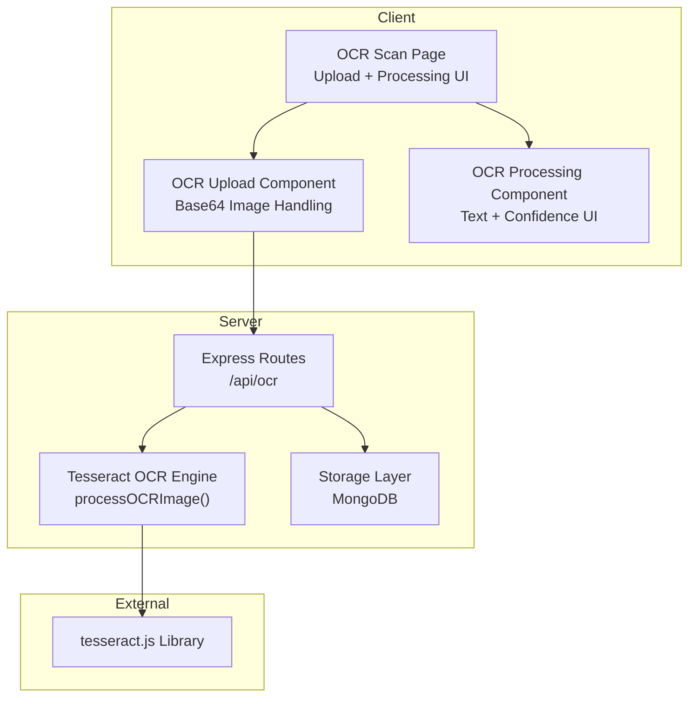
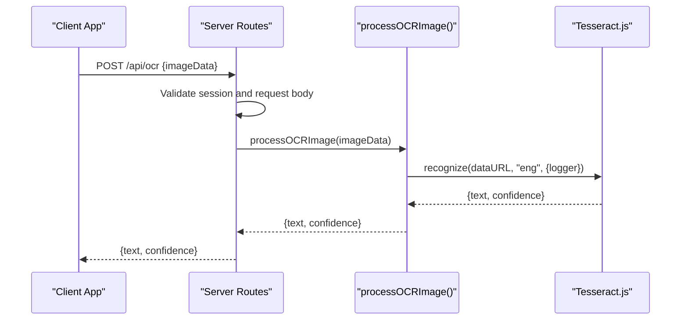
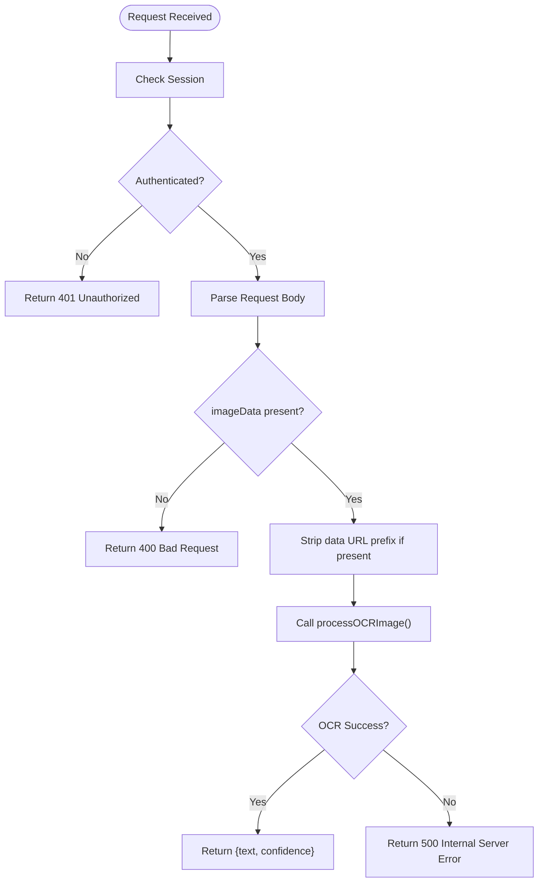
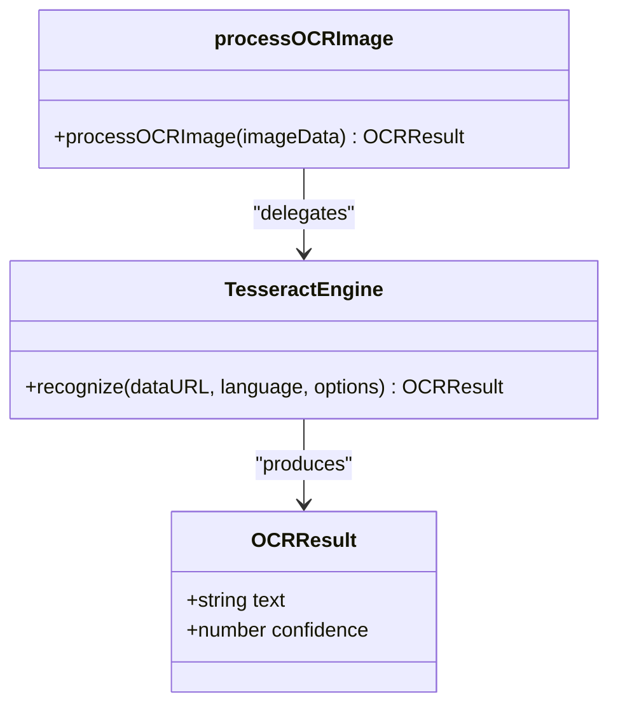
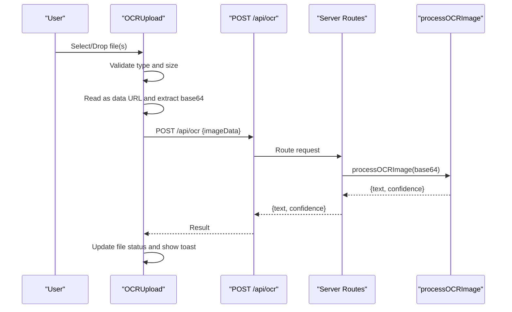
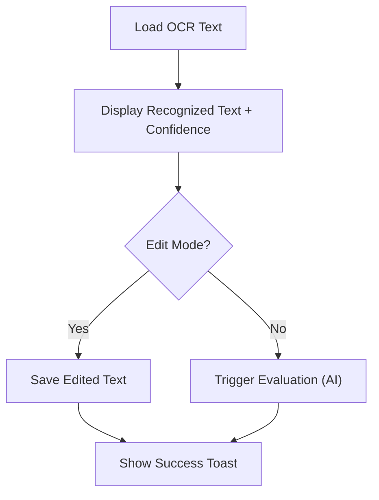
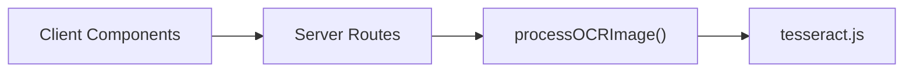

# OCR Processing Endpoints

<cite>
**Referenced Files in This Document**
- [routes.ts](file://server/routes.ts)
- [tesseract.ts](file://server/lib/tesseract.ts)
- [ocr-upload.tsx](file://client/src/components/test/ocr-upload.tsx)
- [ocr-processing.tsx](file://client/src/components/test/ocr-processing.tsx)
- [ocr-scan.tsx](file://client/src/pages/ocr-scan.tsx)
- [schema.ts](file://shared/schema.ts)
- [README.md](file://README.md)
- [package.json](file://package.json)
</cite>

## Table of Contents
1. [Introduction](#introduction)
2. [Project Structure](#project-structure)
3. [Core Components](#core-components)
4. [Architecture Overview](#architecture-overview)
5. [Detailed Component Analysis](#detailed-component-analysis)
6. [Dependency Analysis](#dependency-analysis)
7. [Performance Considerations](#performance-considerations)
8. [Troubleshooting Guide](#troubleshooting-guide)
9. [Conclusion](#conclusion)

## Introduction
This document provides comprehensive API documentation for the OCR processing endpoints, focusing on POST /api/ocr for extracting text from handwritten test scans. It covers request/response schemas, OCR processing workflows, response formats, image preprocessing requirements, supported image formats, accuracy considerations, integration examples with test creation, error handling, and performance optimization tips for large image processing.

## Project Structure
The OCR functionality spans the server and client sides:
- Server exposes the OCR endpoint and integrates with Tesseract.js for OCR processing.
- Client provides UI components for uploading images, displaying OCR results, and integrating with test creation workflows.
- Shared schemas define the data structures used across the stack.

**Diagram sources**
- [routes.ts](file://server/routes.ts#L465-L485)
- [tesseract.ts](file://server/lib/tesseract.ts#L1-L33)
- [ocr-upload.tsx](file://client/src/components/test/ocr-upload.tsx#L32-L91)
- [ocr-processing.tsx](file://client/src/components/test/ocr-processing.tsx#L23-L62)

**Section sources**
- [README.md](file://README.md#L1-L148)
- [package.json](file://package.json#L82-L82)

## Core Components
- OCR Endpoint: POST /api/ocr validates authentication, extracts base64 image data, and delegates to the OCR engine.
- OCR Engine: processOCRImage() removes data URL prefixes, recognizes text using Tesseract.js, and returns extracted text and confidence.
- Client Upload Component: Handles file selection/drop, reads as base64, enforces size/type constraints, and triggers OCR processing.
- Client Processing Component: Displays recognized text and confidence, supports editing, and integrates with evaluation workflows.

**Section sources**
- [routes.ts](file://server/routes.ts#L465-L485)
- [tesseract.ts](file://server/lib/tesseract.ts#L8-L32)
- [ocr-upload.tsx](file://client/src/components/test/ocr-upload.tsx#L25-L196)
- [ocr-processing.tsx](file://client/src/components/test/ocr-processing.tsx#L23-L97)

## Architecture Overview
The OCR workflow follows a client-server pipeline:
- Client uploads an image and sends base64 data to /api/ocr.
- Server validates session, parses request body, and calls processOCRImage().
- processOCRImage() strips data URLs, invokes Tesseract.js, and returns text and confidence.
- Client updates UI with OCR results and allows manual edits.

**Diagram sources**
- [routes.ts](file://server/routes.ts#L465-L485)
- [tesseract.ts](file://server/lib/tesseract.ts#L8-L32)

## Detailed Component Analysis

### API Definition: POST /api/ocr
- Method: POST
- Path: /api/ocr
- Authentication: Session required; unauthorized requests return 401.
- Request Body Schema:
  - imageData: string (required). Accepts either raw base64 or a data URL string. The server strips the data URL prefix if present.
- Response Body Schema:
  - text: string. Extracted text from the image.
  - confidence: number. OCR confidence score (percentage).
- Error Responses:
  - 400: Missing image data.
  - 500: OCR processing failure.

**Diagram sources**
- [routes.ts](file://server/routes.ts#L465-L485)
- [tesseract.ts](file://server/lib/tesseract.ts#L8-L32)

**Section sources**
- [routes.ts](file://server/routes.ts#L465-L485)
- [tesseract.ts](file://server/lib/tesseract.ts#L8-L32)

### OCR Processing Workflow
- Base64 Handling:
  - Accepts raw base64 or data URLs (e.g., data:image/jpeg;base64,...).
  - Removes the data URL prefix to isolate pure base64 content.
- Engine Invocation:
  - Uses Tesseract.js with English language model.
  - Logs OCR progress via logger hook.
- Output:
  - Returns recognized text and confidence score suitable for downstream evaluation.

**Diagram sources**
- [tesseract.ts](file://server/lib/tesseract.ts#L3-L32)

**Section sources**
- [tesseract.ts](file://server/lib/tesseract.ts#L8-L32)

### Client Integration: OCR Upload Component
- Features:
  - Drag-and-drop and browse file selection.
  - Validates file type (JPG, PNG, PDF) and size (max 10 MB).
  - Reads files as data URLs and extracts base64 content.
  - Triggers OCR processing via POST /api/ocr and updates UI with results.
- State Management:
  - Tracks file upload status, progress, and OCR results.
- Error Handling:
  - Displays user-friendly toast notifications for failures and unsupported types.

**Diagram sources**
- [ocr-upload.tsx](file://client/src/components/test/ocr-upload.tsx#L32-L91)
- [routes.ts](file://server/routes.ts#L465-L485)
- [tesseract.ts](file://server/lib/tesseract.ts#L8-L32)

**Section sources**
- [ocr-upload.tsx](file://client/src/components/test/ocr-upload.tsx#L25-L196)

### Client Integration: OCR Processing Component
- Purpose:
  - Displays recognized OCR text and confidence.
  - Allows manual editing of recognized answers.
  - Integrates with evaluation workflows (placeholder for AI evaluation).
- UI Indicators:
  - Confidence icons and labels (High/Medium/Low) based on percentage thresholds.
- Interaction:
  - Selects answers, toggles edit mode, saves edits, and triggers evaluation.

**Diagram sources**
- [ocr-processing.tsx](file://client/src/components/test/ocr-processing.tsx#L23-L97)

**Section sources**
- [ocr-processing.tsx](file://client/src/components/test/ocr-processing.tsx#L23-L97)

### OCR Scan Page Integration
- The page composes the upload and processing components, maintains OCR text and confidence state, and conditionally renders a confidence analysis card with tips for improving recognition quality.

**Section sources**
- [ocr-scan.tsx](file://client/src/pages/ocr-scan.tsx#L13-L95)

### Data Model Considerations
- The shared schema defines Answer fields that can store OCR results:
  - text: string (optional)
  - ocrText: string (optional)
  - aiConfidence: number (optional)
- These fields enable storing OCR-derived text alongside evaluation metadata.

**Section sources**
- [schema.ts](file://shared/schema.ts#L48-L59)

## Dependency Analysis
- External Dependencies:
  - tesseract.js: OCR engine used by processOCRImage().
- Internal Dependencies:
  - routes.ts registers the /api/ocr endpoint and calls processOCRImage().
  - client components depend on the server endpoint for OCR results.

**Diagram sources**
- [routes.ts](file://server/routes.ts#L6-L6)
- [tesseract.ts](file://server/lib/tesseract.ts#L1-L1)
- [package.json](file://package.json#L82-L82)

**Section sources**
- [package.json](file://package.json#L82-L82)
- [routes.ts](file://server/routes.ts#L6-L6)
- [tesseract.ts](file://server/lib/tesseract.ts#L1-L1)

## Performance Considerations
- Image Size and Quality:
  - Limit file size to reduce processing time and memory usage. The client enforces a 10 MB cap.
  - Prefer high-resolution images with clear, legible handwriting for higher accuracy.
- Supported Formats:
  - The client accepts JPG, PNG, and PDF. Ensure images are oriented correctly and well-lit to minimize reprocessing.
- Concurrency and Batch Processing:
  - For multiple images, process sequentially to avoid overwhelming the OCR engine and server resources.
- Caching and Reuse:
  - Store OCR results (text and confidence) to avoid redundant processing for the same image.
- Client-Side Optimization:
  - Debounce OCR requests if users rapidly upload multiple files.
  - Pre-validate image metadata (dimensions, DPI) before OCR to reduce retries.

[No sources needed since this section provides general guidance]

## Troubleshooting Guide
- Common Issues and Resolutions:
  - Invalid image data:
    - Symptom: 400 Bad Request on /api/ocr.
    - Cause: Missing imageData field.
    - Resolution: Ensure the client sends a valid base64 string or data URL.
  - Unsupported file type:
    - Symptom: Client shows “Unsupported file type” toast.
    - Cause: File type not in [JPG, PNG, PDF].
    - Resolution: Convert to supported formats.
  - Large file size:
    - Symptom: Client shows “File too large” toast.
    - Cause: Exceeds 10 MB limit.
    - Resolution: Compress or resize the image.
  - OCR processing failure:
    - Symptom: 500 Internal Server Error on /api/ocr.
    - Cause: Tesseract.js error or invalid base64.
    - Resolution: Verify base64 correctness and network connectivity; retry with clearer images.
- Accuracy Tips:
  - Improve lighting and minimize glare.
  - Keep the camera perpendicular to the page.
  - Use good contrast between ink and paper.
  - Avoid smudges and overlapping text.

**Section sources**
- [routes.ts](file://server/routes.ts#L465-L485)
- [ocr-upload.tsx](file://client/src/components/test/ocr-upload.tsx#L102-L120)

## Conclusion
The OCR processing endpoint provides a streamlined workflow for converting handwritten test scans into editable, evaluable text. By adhering to supported formats and preprocessing guidelines, and by leveraging client-side feedback and confidence indicators, educators can efficiently digitize answer sheets and integrate OCR results into broader assessment workflows.