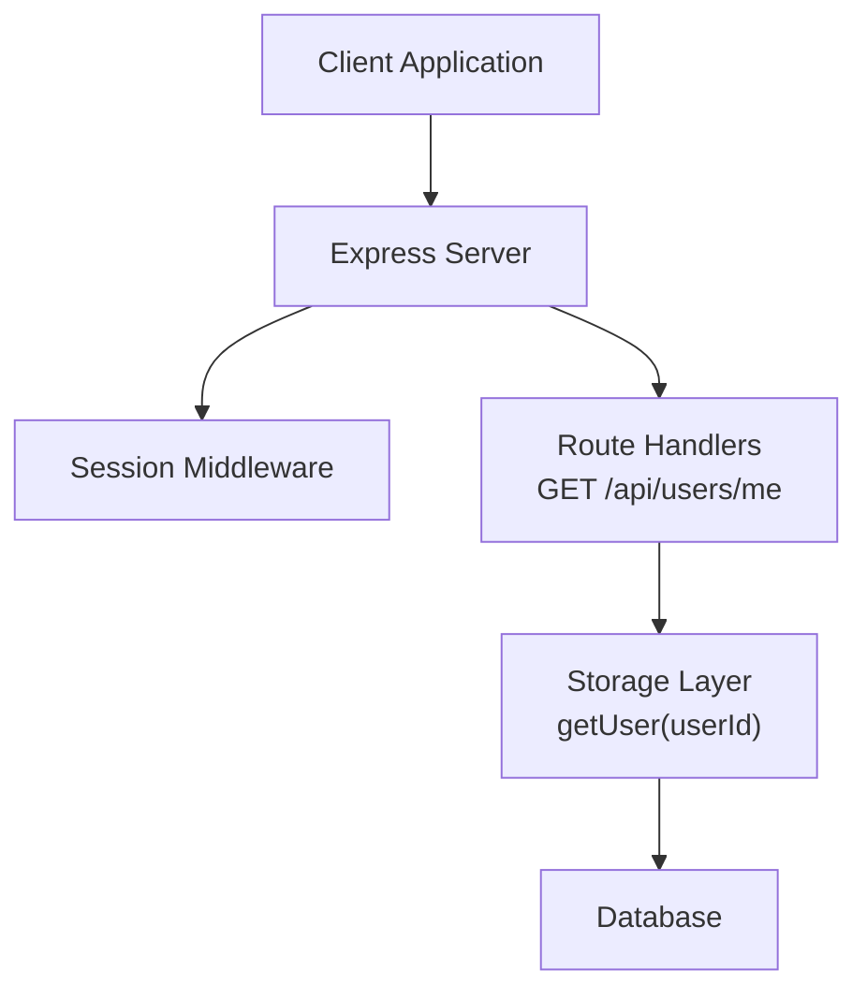
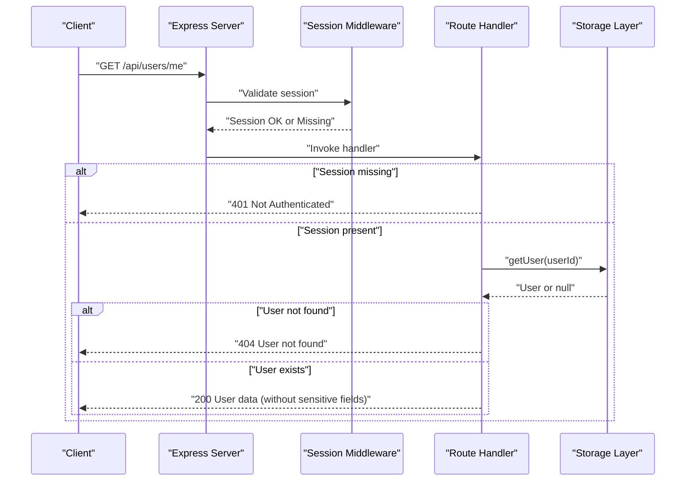
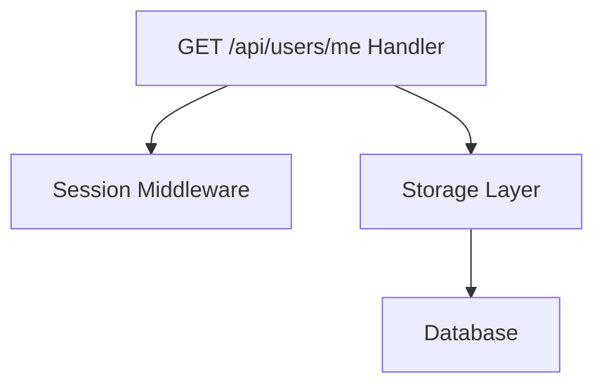

# User Management Endpoints

<cite>
**Referenced Files in This Document**
- [routes.ts](file://server/routes.ts)
- [index.ts](file://server/index.ts)
</cite>

## Table of Contents
1. [Introduction](#introduction)
2. [Project Structure](#project-structure)
3. [Core Components](#core-components)
4. [Architecture Overview](#architecture-overview)
5. [Detailed Component Analysis](#detailed-component-analysis)
6. [Dependency Analysis](#dependency-analysis)
7. [Performance Considerations](#performance-considerations)
8. [Troubleshooting Guide](#troubleshooting-guide)
9. [Conclusion](#conclusion)

## Introduction
This document provides detailed API documentation for the user management endpoint GET /api/users/me. It explains the endpoint's purpose, authentication requirements, response schema, error handling, and role-based access patterns. The documentation focuses on the backend implementation and how the system enforces session-based authentication and user data filtering.

## Project Structure
The user management endpoint is implemented in the server routing module and integrated into the main server bootstrap. The routing module defines the endpoint and handles session-based authentication and user data retrieval. The server initialization sets up session middleware and registers all routes.

**Diagram sources**
- [index.ts](file://server/index.ts#L30-L44)
- [routes.ts](file://server/routes.ts#L87-L107)

**Section sources**
- [index.ts](file://server/index.ts#L19-L44)
- [routes.ts](file://server/routes.ts#L11-L107)

## Core Components
- Route Handler: Implements GET /api/users/me with session-based authentication and user data retrieval.
- Session Middleware: Manages user sessions using express-session with MongoDB-backed stores.
- Storage Layer: Provides user retrieval by ID and related operations.

Key behaviors:
- Authentication: Requires a valid session with userId and role stored in req.session.
- Authorization: Ensures the authenticated user exists in storage before responding.
- Response Filtering: Excludes sensitive fields (e.g., password) from the response payload.

**Section sources**
- [routes.ts](file://server/routes.ts#L87-L107)
- [index.ts](file://server/index.ts#L30-L44)

## Architecture Overview
The GET /api/users/me endpoint follows a straightforward flow:
1. Validate session presence and user identity.
2. Retrieve user data from storage by session userId.
3. Verify user existence and respond with filtered user information.
4. Return appropriate HTTP status codes for success, unauthorized, and not found scenarios.

**Diagram sources**
- [routes.ts](file://server/routes.ts#L87-L107)

## Detailed Component Analysis

### Endpoint Definition: GET /api/users/me
Purpose:
- Retrieve the authenticated user's profile information.

Authentication Requirements:
- Session-based authentication is mandatory.
- The session must contain userId and role.
- If the session is missing or invalid, the endpoint responds with 401.

Authorization and Access Control:
- The endpoint does not enforce role-specific restrictions; any authenticated user can retrieve their own profile.
- The handler validates that the user record exists in storage; if not, it returns 404.

Response Schema (excluding sensitive fields):
- id: Unique identifier for the user.
- username: Unique username chosen by the user.
- email: User's email address.
- role: User's role (e.g., student, teacher, admin).
- class: User's class identifier (if applicable).
- profile: Additional profile information (e.g., name, avatar URL, bio).

Notes:
- The response excludes sensitive fields such as password.
- The exact shape of profile depends on the storage schema and may include additional fields beyond those listed here.

HTTP Status Codes:
- 200 OK: Successful retrieval of user data.
- 401 Unauthorized: Missing or invalid session.
- 404 Not Found: Session exists but user record is missing in storage.
- 500 Internal Server Error: Unexpected server error during processing.

Error Scenarios and Examples:
- Unauthorized Access Attempt:
  - Request: GET /api/users/me without a valid session.
  - Response: 401 with message "Not authenticated".
- User Not Found:
  - Request: GET /api/users/me with a valid session whose userId does not correspond to any user in storage.
  - Response: 404 with message "User not found".
- Successful Retrieval:
  - Request: GET /api/users/me with a valid session.
  - Response: 200 with user object excluding sensitive fields.

Role-Based Access Patterns:
- The endpoint does not restrict access by role; any authenticated user can access their own profile.
- If role-based access is required elsewhere in the system, it is enforced in other endpoints (e.g., teacher-only routes).

Data Filtering Based on Permissions:
- The handler strips sensitive fields (e.g., password) before responding.
- No additional filtering is performed based on roles for this endpoint.

**Section sources**
- [routes.ts](file://server/routes.ts#L87-L107)

## Dependency Analysis
The endpoint relies on:
- Session Middleware: Validates session and provides req.session.userId and req.session.role.
- Storage Layer: Provides getUser(userId) to fetch user data by ID.
- Express Router: Registers the route and binds the handler.

**Diagram sources**
- [routes.ts](file://server/routes.ts#L87-L107)
- [index.ts](file://server/index.ts#L30-L44)

**Section sources**
- [routes.ts](file://server/routes.ts#L87-L107)
- [index.ts](file://server/index.ts#L30-L44)

## Performance Considerations
- Session Validation: Minimal overhead; checks req.session presence and userId.
- Single Storage Lookup: getUser(userId) invoked once per request.
- Response Filtering: Lightweight object destructuring to exclude sensitive fields.
- Recommendations:
  - Ensure session store performance aligns with expected traffic (MongoDB-backed store configured).
  - Keep user records lean; avoid large profile payloads unless necessary.
  - Consider caching frequently accessed user data at the application level if needed.

[No sources needed since this section provides general guidance]

## Troubleshooting Guide
Common Issues and Resolutions:
- 401 Not Authenticated:
  - Cause: Missing or invalid session.
  - Resolution: Ensure the client sends the session cookie with subsequent requests and that the session middleware is initialized correctly.
- 404 User not found:
  - Cause: Session exists but user record is missing in storage.
  - Resolution: Verify that user creation and session assignment are consistent; check storage integrity.
- 500 Internal Server Error:
  - Cause: Unexpected error during user retrieval or response construction.
  - Resolution: Review server logs for stack traces; validate storage connectivity and handler logic.

Operational Checks:
- Confirm session middleware is initialized before route registration.
- Verify that req.session.userId and req.session.role are populated upon successful authentication.
- Ensure storage.getUser(userId) returns a user object or null, not an error.

**Section sources**
- [routes.ts](file://server/routes.ts#L87-L107)
- [index.ts](file://server/index.ts#L30-L44)

## Conclusion
The GET /api/users/me endpoint provides a secure and straightforward mechanism for authenticated users to retrieve their profile information. It enforces session-based authentication, validates user existence, and returns a filtered response excluding sensitive data. The endpoint does not impose role-based restrictions, aligning with self-service user profile access patterns. Proper session configuration and storage integrity are essential for reliable operation.