# Analytics & Reporting

<cite>
**Referenced Files in This Document**
- [analytics.tsx](file://client/src/pages/analytics.tsx)
- [performance-chart.tsx](file://client/src/components/dashboard/performance-chart.tsx)
- [top-students.tsx](file://client/src/components/dashboard/top-students.tsx)
- [recent-tests-table.tsx](file://client/src/components/dashboard/recent-tests-table.tsx)
- [chart.tsx](file://client/src/components/ui/chart.tsx)
- [mockData.ts](file://client/src/data/mockData.ts)
- [routes.ts](file://server/routes.ts)
- [openai.ts](file://server/lib/openai.ts)
- [storage.ts](file://server/storage.ts)
- [db.ts](file://server/db.ts)
- [schema.ts](file://shared/schema.ts)
</cite>

## Table of Contents
1. [Introduction](#introduction)
2. [Project Structure](#project-structure)
3. [Core Components](#core-components)
4. [Architecture Overview](#architecture-overview)
5. [Detailed Component Analysis](#detailed-component-analysis)
6. [Dependency Analysis](#dependency-analysis)
7. [Performance Considerations](#performance-considerations)
8. [Troubleshooting Guide](#troubleshooting-guide)
9. [Conclusion](#conclusion)
10. [Appendices](#appendices)

## Introduction
This document describes the analytics and reporting capabilities of PersonalLearningPro with a focus on performance tracking, visualization, and AI-driven insights. It covers dashboard components, chart implementations, metrics collection, trend analysis, comparative reporting, interactive features, filtering, export readiness, data aggregation, real-time update pathways, historical analysis, customizable layouts, user preferences, report generation workflows, and the integration between analytics data and AI insights for predictive learning recommendations.

## Project Structure
The analytics surface is primarily implemented in the client under the pages and components directories, while backend routes and data access are provided by the server. Shared schemas define the analytics data model. The UI leverages reusable chart primitives and React Query for data fetching.

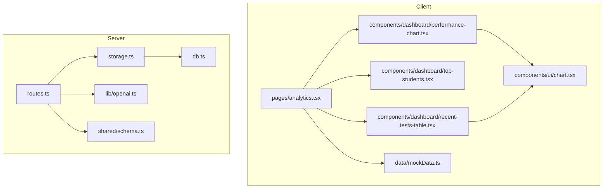

**Diagram sources**
- [analytics.tsx](file://client/src/pages/analytics.tsx#L1-L177)
- [performance-chart.tsx](file://client/src/components/dashboard/performance-chart.tsx#L1-L98)
- [top-students.tsx](file://client/src/components/dashboard/top-students.tsx#L1-L74)
- [recent-tests-table.tsx](file://client/src/components/dashboard/recent-tests-table.tsx#L1-L234)
- [chart.tsx](file://client/src/components/ui/chart.tsx#L1-L364)
- [mockData.ts](file://client/src/data/mockData.ts#L1-L240)
- [routes.ts](file://server/routes.ts#L1-L1104)
- [openai.ts](file://server/lib/openai.ts#L1-L217)
- [storage.ts](file://server/storage.ts#L68-L281)
- [db.ts](file://server/db.ts#L1-L21)
- [schema.ts](file://shared/schema.ts#L61-L68)

**Section sources**
- [analytics.tsx](file://client/src/pages/analytics.tsx#L1-L177)
- [performance-chart.tsx](file://client/src/components/dashboard/performance-chart.tsx#L1-L98)
- [top-students.tsx](file://client/src/components/dashboard/top-students.tsx#L1-L74)
- [recent-tests-table.tsx](file://client/src/components/dashboard/recent-tests-table.tsx#L1-L234)
- [chart.tsx](file://client/src/components/ui/chart.tsx#L1-L364)
- [mockData.ts](file://client/src/data/mockData.ts#L1-L240)
- [routes.ts](file://server/routes.ts#L1-L1104)
- [openai.ts](file://server/lib/openai.ts#L1-L217)
- [storage.ts](file://server/storage.ts#L68-L281)
- [db.ts](file://server/db.ts#L1-L21)
- [schema.ts](file://shared/schema.ts#L61-L68)

## Core Components
- Performance Analytics Dashboard: A responsive grid layout combining a bar chart of class vs school averages, a top-performing students panel, pie charts for test completion and subject distribution, and an AI-generated insights tabbed card.
- PerformanceChart: A Recharts bar chart component that renders class and school averages per subject with tooltips, legends, and theme-aware styling. It currently uses mocked data and includes a disabled React Query hook placeholder for API integration.
- TopStudents: A ranked list of top students with avatars and scores, backed by a similar disabled React Query hook pattern.
- RecentTestsTable: A paginated, sortable table of tests with status badges, completion progress, and actions, using skeleton loaders during loading states.
- Chart Utilities: A reusable chart container and tooltip/legend helpers that support theming and consistent styling across visualizations.

**Section sources**
- [analytics.tsx](file://client/src/pages/analytics.tsx#L15-L177)
- [performance-chart.tsx](file://client/src/components/dashboard/performance-chart.tsx#L15-L98)
- [top-students.tsx](file://client/src/components/dashboard/top-students.tsx#L6-L74)
- [recent-tests-table.tsx](file://client/src/components/dashboard/recent-tests-table.tsx#L22-L150)
- [chart.tsx](file://client/src/components/ui/chart.tsx#L6-L364)

## Architecture Overview
The analytics pipeline integrates client-side dashboards with server-side data access and AI insights. The client renders charts and tables, while the server exposes REST endpoints for test and analytics data and provides AI-powered analysis functions.

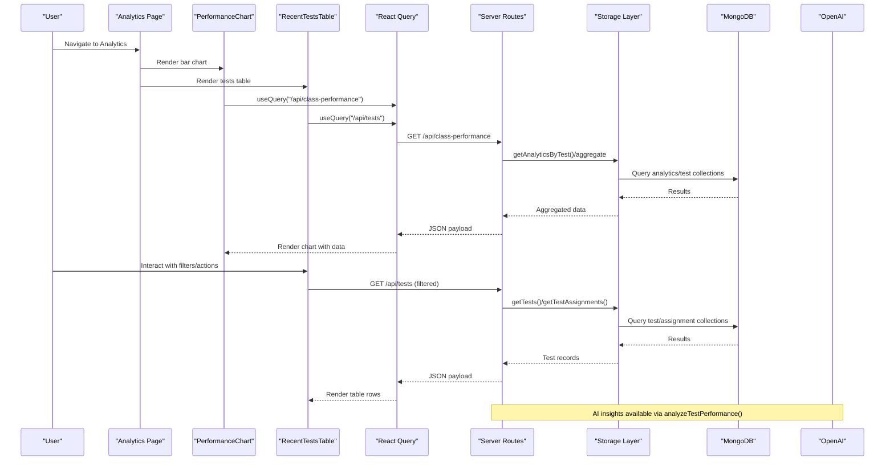

**Diagram sources**
- [analytics.tsx](file://client/src/pages/analytics.tsx#L22-L177)
- [performance-chart.tsx](file://client/src/components/dashboard/performance-chart.tsx#L25-L43)
- [recent-tests-table.tsx](file://client/src/components/dashboard/recent-tests-table.tsx#L34-L73)
- [routes.ts](file://server/routes.ts#L134-L173)
- [storage.ts](file://server/storage.ts#L68-L281)
- [db.ts](file://server/db.ts#L8-L20)
- [openai.ts](file://server/lib/openai.ts#L165-L216)

## Detailed Component Analysis

### Performance Analytics Dashboard
- Layout: Grid-based composition with a primary bar chart, a secondary top students panel, and two pie charts for completion and subject distribution. Includes an AI insights tabbed card.
- Interactivity: Responsive containers, tooltips, legends, and theme-aware styling.
- Data: Uses sample datasets for pie charts and a mocked dataset for the bar chart. Includes a disabled React Query hook for class performance data.

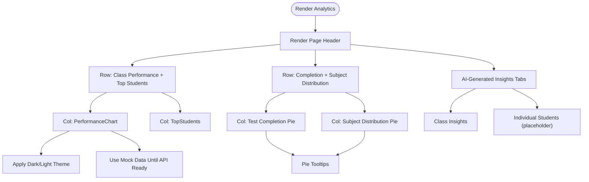

**Diagram sources**
- [analytics.tsx](file://client/src/pages/analytics.tsx#L40-L177)

**Section sources**
- [analytics.tsx](file://client/src/pages/analytics.tsx#L15-L177)

### PerformanceChart Component
- Purpose: Visualize class average versus school average per subject.
- Implementation: Recharts BarChart with CartesianGrid, X/Y axes, tooltip, legend, and theme-aware colors.
- Data Fetching: React Query hook configured with a placeholder endpoint; defaults to mock data when disabled.
- Loading: Skeleton fallback while data is loading.

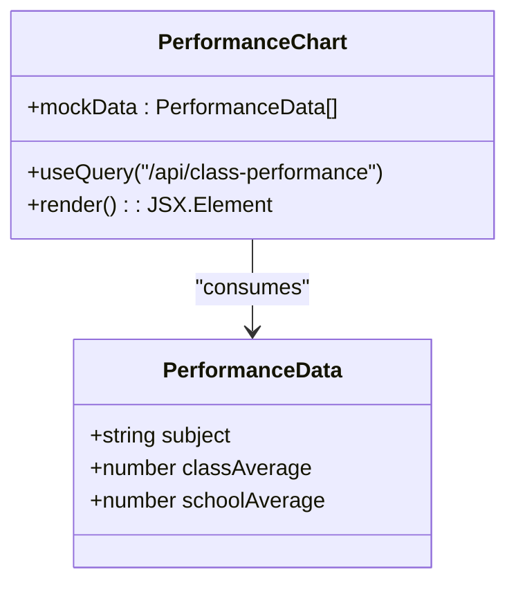

**Diagram sources**
- [performance-chart.tsx](file://client/src/components/dashboard/performance-chart.tsx#L15-L98)

**Section sources**
- [performance-chart.tsx](file://client/src/components/dashboard/performance-chart.tsx#L15-L98)

### TopStudents Component
- Purpose: Display top-performing students with avatar, class, and score.
- Implementation: React Query hook with a placeholder endpoint; skeleton loader during loading.
- Data Model: TopStudentProps with id, name, class, avatar, and score.

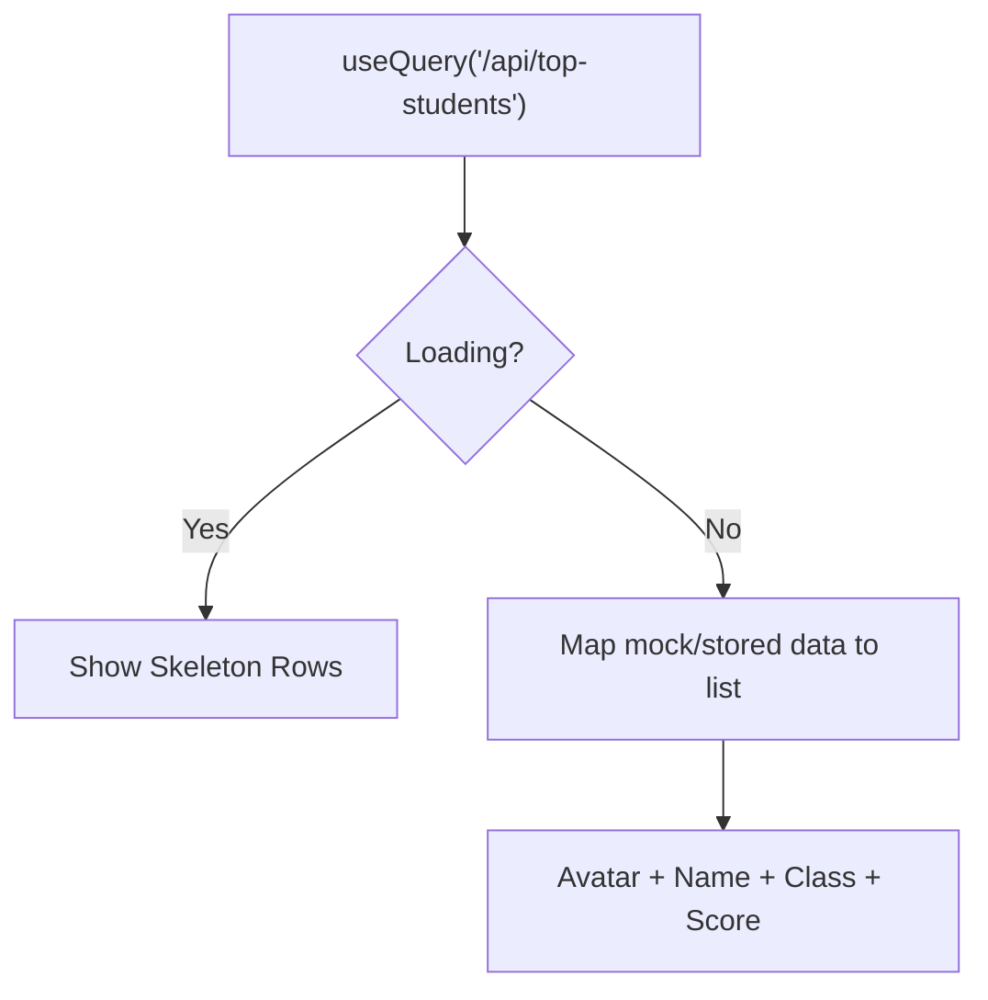

**Diagram sources**
- [top-students.tsx](file://client/src/components/dashboard/top-students.tsx#L14-L74)

**Section sources**
- [top-students.tsx](file://client/src/components/dashboard/top-students.tsx#L6-L74)

### RecentTestsTable Component
- Purpose: Present recent tests with status, completion rate, average score, and actions.
- Implementation: Recharts-based progress bars, status badges, and skeleton loaders.
- Data Model: Test interface with id, title, subject, class, testDate, status, completionRate, averageScore.

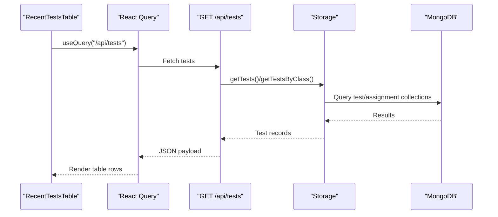

**Diagram sources**
- [recent-tests-table.tsx](file://client/src/components/dashboard/recent-tests-table.tsx#L34-L150)
- [routes.ts](file://server/routes.ts#L134-L173)
- [storage.ts](file://server/storage.ts#L68-L281)

**Section sources**
- [recent-tests-table.tsx](file://client/src/components/dashboard/recent-tests-table.tsx#L22-L150)

### Chart Utilities (Reusable Primitives)
- ChartContainer: Provides theming and responsive container behavior for Recharts.
- ChartTooltipContent: Customized tooltip with label formatting and indicators.
- ChartLegendContent: Customized legend rendering.

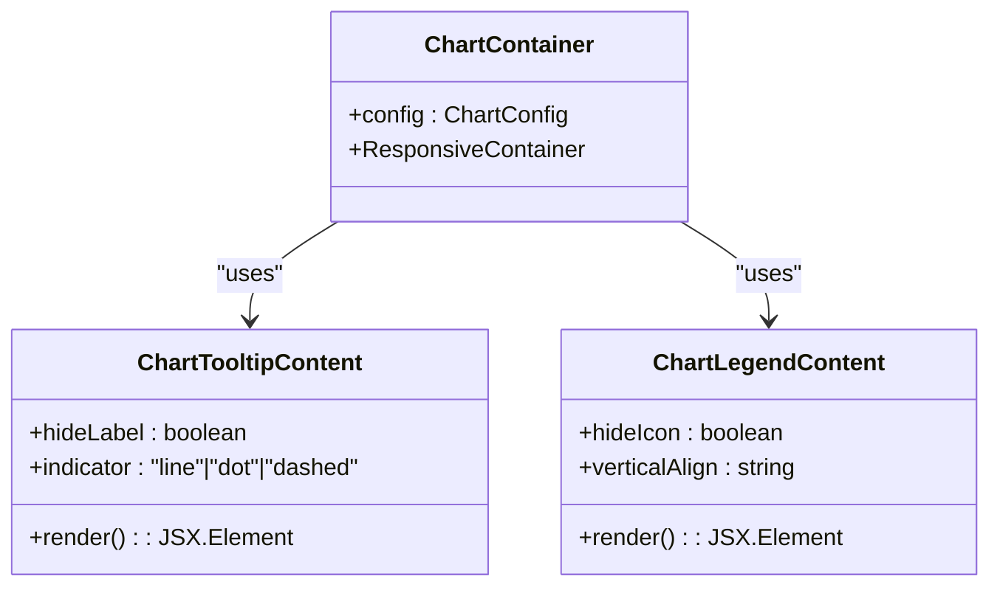

**Diagram sources**
- [chart.tsx](file://client/src/components/ui/chart.tsx#L35-L364)

**Section sources**
- [chart.tsx](file://client/src/components/ui/chart.tsx#L6-L364)

### AI-Generated Learning Insights
- Current State: The analytics page includes an AI insights card with tabs for class and individual views. The individual tab is marked as a future enhancement.
- AI Capabilities: The server exposes an AI analysis function that evaluates test performance and returns average scores, hardest questions, and recommendations. This can power the “Class Insights” tab.

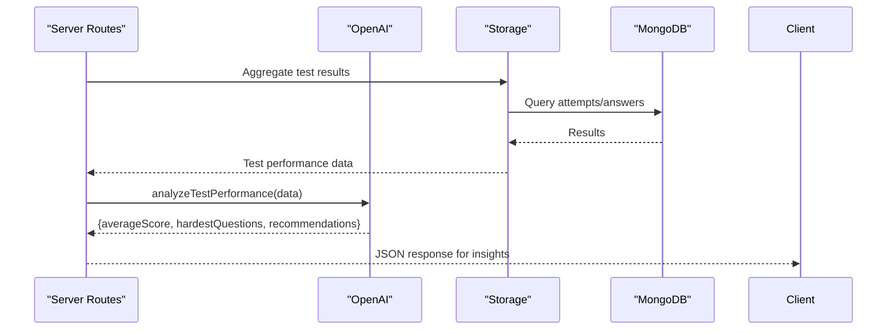

**Diagram sources**
- [openai.ts](file://server/lib/openai.ts#L165-L216)
- [routes.ts](file://server/routes.ts#L1-L1104)
- [storage.ts](file://server/storage.ts#L68-L281)

**Section sources**
- [analytics.tsx](file://client/src/pages/analytics.tsx#L135-L174)
- [openai.ts](file://server/lib/openai.ts#L165-L216)

## Dependency Analysis
- Client-side:
  - Analytics page depends on PerformanceChart, TopStudents, and RecentTestsTable.
  - Charts depend on Recharts and the reusable chart utilities.
  - Data fetching uses React Query with placeholder endpoints.
- Server-side:
  - Routes expose endpoints for tests and analytics data.
  - Storage layer abstracts MongoDB operations for analytics and test entities.
  - OpenAI integration provides AI analysis for test performance.
  - Shared schemas define the Analytics entity used by the storage layer.

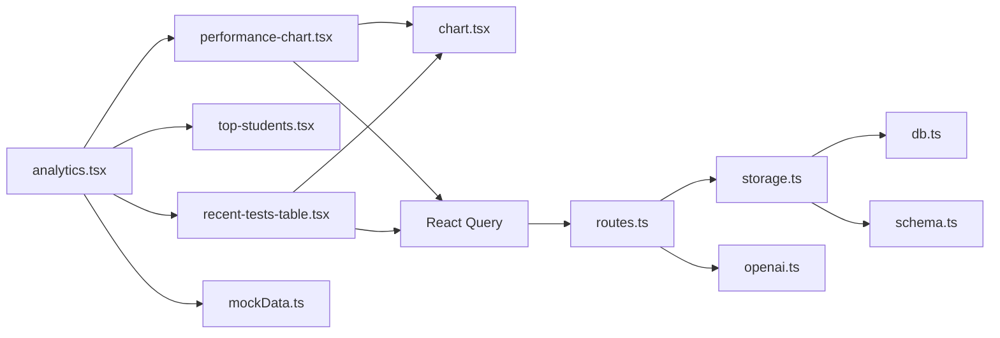

**Diagram sources**
- [analytics.tsx](file://client/src/pages/analytics.tsx#L1-L177)
- [performance-chart.tsx](file://client/src/components/dashboard/performance-chart.tsx#L1-L98)
- [top-students.tsx](file://client/src/components/dashboard/top-students.tsx#L1-L74)
- [recent-tests-table.tsx](file://client/src/components/dashboard/recent-tests-table.tsx#L1-L234)
- [chart.tsx](file://client/src/components/ui/chart.tsx#L1-L364)
- [mockData.ts](file://client/src/data/mockData.ts#L1-L240)
- [routes.ts](file://server/routes.ts#L1-L1104)
- [storage.ts](file://server/storage.ts#L68-L281)
- [openai.ts](file://server/lib/openai.ts#L1-L217)
- [db.ts](file://server/db.ts#L1-L21)
- [schema.ts](file://shared/schema.ts#L61-L68)

**Section sources**
- [routes.ts](file://server/routes.ts#L1-L1104)
- [storage.ts](file://server/storage.ts#L68-L281)
- [schema.ts](file://shared/schema.ts#L61-L68)

## Performance Considerations
- Data Fetching:
  - React Query caching and stale-while-revalidate strategies can reduce redundant network calls.
  - Placeholder endpoints are disabled; enable them to avoid unnecessary initial loads.
- Rendering:
  - Recharts components are efficient for moderate-sized datasets; consider virtualization for large tables.
  - Skeleton loaders improve perceived performance during data transitions.
- Theming:
  - The chart utilities apply theme-specific styles; ensure minimal re-renders by avoiding frequent theme toggles.
- AI Latency:
  - OpenAI requests are asynchronous; implement local caching for repeated insights and consider streaming responses for improved UX.

[No sources needed since this section provides general guidance]

## Troubleshooting Guide
- Missing API Endpoints:
  - The PerformanceChart and TopStudents components currently disable their React Query hooks. Enable the query keys and implement server endpoints to populate data.
- Empty or Missing Data:
  - Verify that the server routes for tests and analytics are reachable and that the storage layer returns results for the given filters.
- MongoDB Connectivity:
  - The server connects to MongoDB with a warning on failure; ensure the environment variable is set and the database is available.
- AI Feature Availability:
  - OPENAI_API_KEY must be configured; otherwise, AI features will log warnings and fall back to manual evaluation.

**Section sources**
- [performance-chart.tsx](file://client/src/components/dashboard/performance-chart.tsx#L25-L28)
- [top-students.tsx](file://client/src/components/dashboard/top-students.tsx#L15-L18)
- [routes.ts](file://server/routes.ts#L134-L173)
- [db.ts](file://server/db.ts#L8-L20)
- [openai.ts](file://server/lib/openai.ts#L4-L9)

## Conclusion
PersonalLearningPro’s analytics and reporting layer combines responsive dashboards, reusable chart primitives, and AI-driven insights to deliver actionable performance data. While several endpoints are currently placeholders, the architecture supports scalable data fetching, theming, and AI integration. Future enhancements should focus on enabling backend endpoints, implementing filtering and export capabilities, and expanding individual student analytics.

[No sources needed since this section summarizes without analyzing specific files]

## Appendices

### Data Models and Aggregation Strategies
- Analytics Entity:
  - Fields include user identifier, test identifier, weak topics, strong topics, recommended resources, and insight date.
  - Used by the storage layer to persist and retrieve analytics insights.
- Aggregation:
  - Server-side aggregation can compute averages, hardest questions, and recommendations from test attempts and answers.
  - Client-side charts consume normalized datasets for rendering.

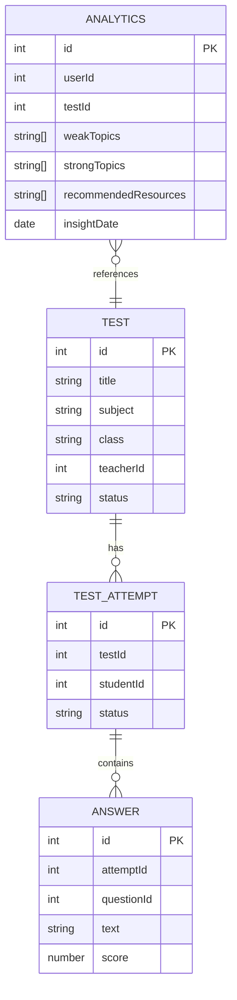

**Diagram sources**
- [schema.ts](file://shared/schema.ts#L61-L68)
- [schema.ts](file://shared/schema.ts#L39-L46)
- [schema.ts](file://shared/schema.ts#L48-L59)
- [storage.ts](file://server/storage.ts#L68-L281)

**Section sources**
- [schema.ts](file://shared/schema.ts#L61-L68)
- [storage.ts](file://server/storage.ts#L68-L281)

### Report Generation Workflow
- Data Collection:
  - Gather test results and answers from storage.
- AI Analysis:
  - Call analyzeTestPerformance to derive insights.
- Presentation:
  - Render class insights in the AI insights card; expand to individual reports as endpoints become available.

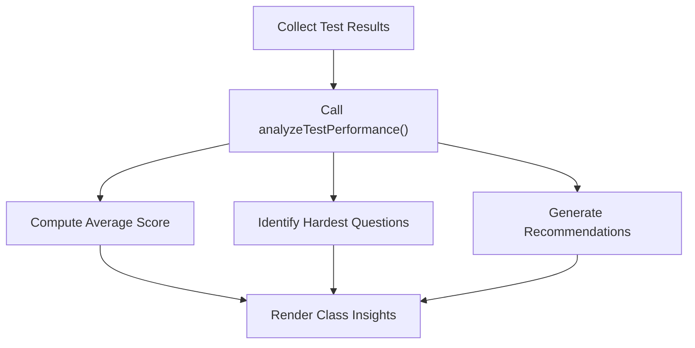

**Diagram sources**
- [openai.ts](file://server/lib/openai.ts#L165-L216)
- [routes.ts](file://server/routes.ts#L1-L1104)

**Section sources**
- [openai.ts](file://server/lib/openai.ts#L165-L216)
- [routes.ts](file://server/routes.ts#L1-L1104)