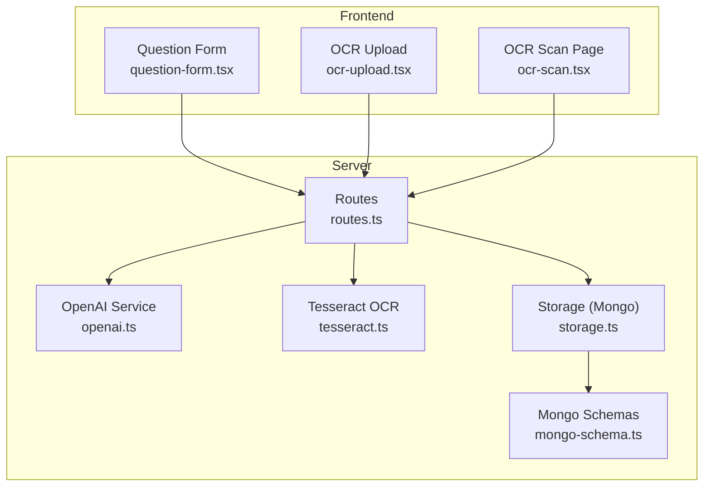
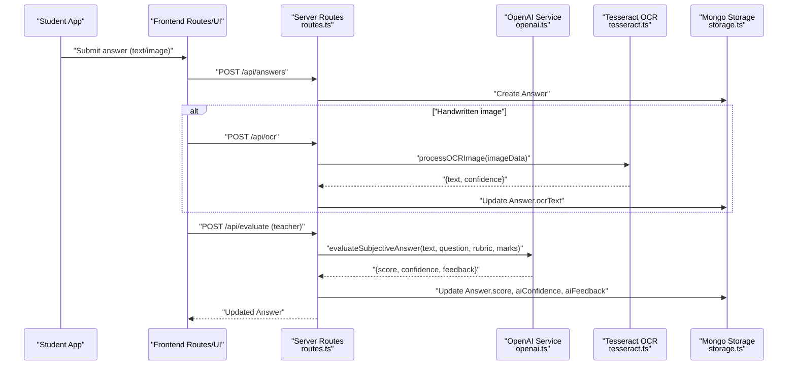
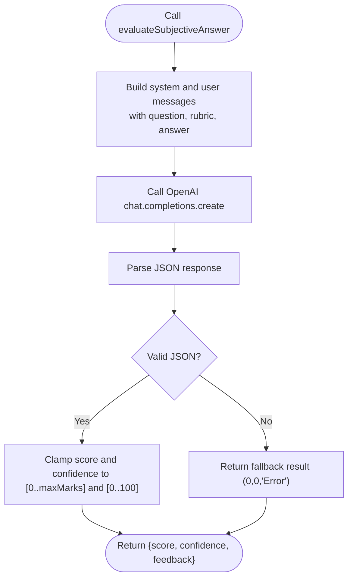
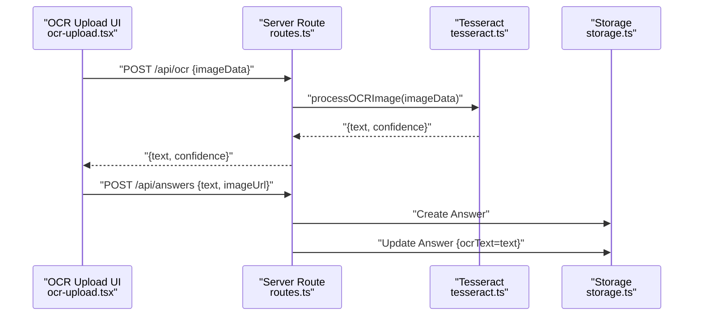
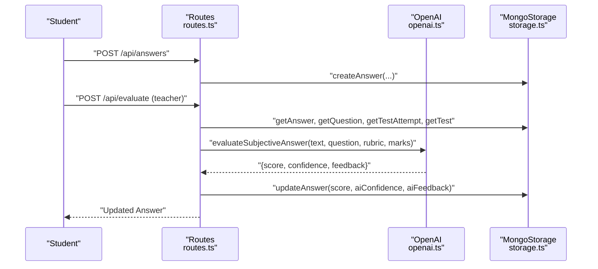
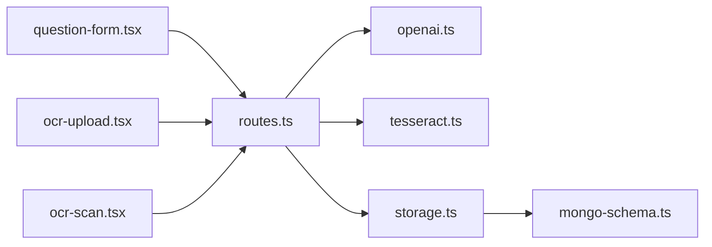
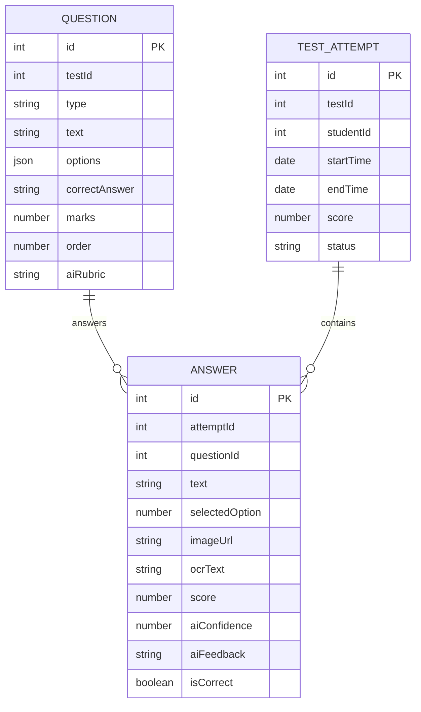

# AI-Powered Evaluation System

<cite>
**Referenced Files in This Document**
- [openai.ts](file://server/lib/openai.ts)
- [routes.ts](file://server/routes.ts)
- [storage.ts](file://server/storage.ts)
- [mongo-schema.ts](file://shared/mongo-schema.ts)
- [question-form.tsx](file://client/src/components/test/question-form.tsx)
- [ocr-upload.tsx](file://client/src/components/test/ocr-upload.tsx)
- [ocr-scan.tsx](file://client/src/pages/ocr-scan.tsx)
- [tesseract.ts](file://server/lib/tesseract.ts)
</cite>

## Table of Contents
1. [Introduction](#introduction)
2. [Project Structure](#project-structure)
3. [Core Components](#core-components)
4. [Architecture Overview](#architecture-overview)
5. [Detailed Component Analysis](#detailed-component-analysis)
6. [Dependency Analysis](#dependency-analysis)
7. [Performance Considerations](#performance-considerations)
8. [Troubleshooting Guide](#troubleshooting-guide)
9. [Conclusion](#conclusion)
10. [Appendices](#appendices)

## Introduction
This document describes the AI-powered evaluation system in PersonalLearningPro. It covers OpenAI integration for automated answer evaluation, prompt engineering for subjective questions, rubric-based assessment, and the end-to-end evaluation workflow from answer submission to grade calculation. It also documents OCR integration for handwritten answer processing, configuration options, and troubleshooting guidance.

## Project Structure
The evaluation system spans backend AI services, routing, persistence, and frontend components:
- Backend AI services: OpenAI integration and OCR pipeline
- Routes: Answer submission, manual AI evaluation, and OCR processing
- Storage: MongoDB-backed persistence for tests, questions, attempts, and answers
- Frontend: Question creation UI with rubric fields and OCR scanning UI

**Diagram sources**
- [routes.ts](file://server/routes.ts#L416-L559)
- [openai.ts](file://server/lib/openai.ts#L1-L217)
- [tesseract.ts](file://server/lib/tesseract.ts#L1-L33)
- [storage.ts](file://server/storage.ts#L1-L519)
- [mongo-schema.ts](file://shared/mongo-schema.ts#L40-L74)
- [question-form.tsx](file://client/src/components/test/question-form.tsx#L354-L372)
- [ocr-upload.tsx](file://client/src/components/test/ocr-upload.tsx#L1-L309)
- [ocr-scan.tsx](file://client/src/pages/ocr-scan.tsx#L1-L77)

**Section sources**
- [routes.ts](file://server/routes.ts#L416-L559)
- [openai.ts](file://server/lib/openai.ts#L1-L217)
- [tesseract.ts](file://server/lib/tesseract.ts#L1-L33)
- [storage.ts](file://server/storage.ts#L1-L519)
- [mongo-schema.ts](file://shared/mongo-schema.ts#L40-L74)
- [question-form.tsx](file://client/src/components/test/question-form.tsx#L354-L372)
- [ocr-upload.tsx](file://client/src/components/test/ocr-upload.tsx#L1-L309)
- [ocr-scan.tsx](file://client/src/pages/ocr-scan.tsx#L1-L77)

## Core Components
- OpenAI integration for chat, rubric-based evaluation, study plan generation, and test performance analysis
- Routes for answer submission, manual AI evaluation, and OCR processing
- MongoDB schemas for questions (including aiRubric), test attempts, and answers (with AI evaluation fields)
- Frontend question creation form supporting rubric input for short/long answers
- OCR pipeline using Tesseract for handwritten answer recognition

Key evaluation fields persisted in the database:
- Question: aiRubric, marks, type
- Answer: text, ocrText, score, aiConfidence, aiFeedback, isCorrect

**Section sources**
- [openai.ts](file://server/lib/openai.ts#L44-L105)
- [routes.ts](file://server/routes.ts#L416-L559)
- [mongo-schema.ts](file://shared/mongo-schema.ts#L40-L74)
- [question-form.tsx](file://client/src/components/test/question-form.tsx#L354-L372)
- [tesseract.ts](file://server/lib/tesseract.ts#L8-L32)

## Architecture Overview
The evaluation workflow integrates frontend uploads, backend routes, AI services, and persistent storage.

**Diagram sources**
- [routes.ts](file://server/routes.ts#L416-L559)
- [openai.ts](file://server/lib/openai.ts#L50-L105)
- [tesseract.ts](file://server/lib/tesseract.ts#L8-L32)
- [storage.ts](file://server/storage.ts#L241-L262)

## Detailed Component Analysis

### OpenAI Integration and Prompt Engineering
- Model: gpt-4o is used consistently for chat completions.
- Chat endpoint: Provides a default system message for high school tutoring.
- Rubric-based evaluation: Uses a strict JSON response format with score, confidence, and feedback. The system enforces bounds for score and confidence.
- Study plan generation and test performance analysis: Return structured JSON for actionable insights.

Prompt engineering highlights:
- Clear role definition for the evaluator
- Explicit instruction to respond in JSON with required fields
- Bounds enforcement to ensure valid numeric ranges

**Diagram sources**
- [openai.ts](file://server/lib/openai.ts#L50-L105)

**Section sources**
- [openai.ts](file://server/lib/openai.ts#L1-L217)

### Evaluation Algorithms and Rubric-Based Assessment
- Short answer and long answer evaluation rely on rubric-based prompts and JSON output parsing.
- Score clamping ensures grades stay within question marks.
- Confidence indicates model certainty; feedback provides rationale.
- MCQ questions are auto-graded on submission; subjective answers require AI evaluation via a dedicated endpoint.

Partial credit and feedback:
- Feedback is embedded in the evaluation result; partial credit can be represented by fractional scores.
- Teachers can override AI results by updating answers after evaluation.

**Section sources**
- [routes.ts](file://server/routes.ts#L447-L452)
- [routes.ts](file://server/routes.ts#L540-L553)
- [openai.ts](file://server/lib/openai.ts#L50-L105)
- [mongo-schema.ts](file://shared/mongo-schema.ts#L62-L74)

### Integration with AI Models for Content Analysis
- Study plan generation: Returns a plan and recommended resources as JSON.
- Test performance analysis: Computes average score, identifies hardest questions, and provides recommendations.

These capabilities support holistic assessment beyond individual answers.

**Section sources**
- [openai.ts](file://server/lib/openai.ts#L107-L163)
- [openai.ts](file://server/lib/openai.ts#L165-L216)

### OCR Integration for Handwritten Answers
- Frontend upload component supports drag-and-drop and file validation.
- Backend OCR route processes images using Tesseract and returns recognized text and confidence.
- On successful OCR, the answer record is updated with ocrText for subsequent AI evaluation.

**Diagram sources**
- [ocr-upload.tsx](file://client/src/components/test/ocr-upload.tsx#L32-L91)
- [routes.ts](file://server/routes.ts#L466-L485)
- [tesseract.ts](file://server/lib/tesseract.ts#L8-L32)
- [storage.ts](file://server/storage.ts#L241-L262)

**Section sources**
- [ocr-upload.tsx](file://client/src/components/test/ocr-upload.tsx#L1-L309)
- [ocr-scan.tsx](file://client/src/pages/ocr-scan.tsx#L1-L77)
- [routes.ts](file://server/routes.ts#L466-L485)
- [tesseract.ts](file://server/lib/tesseract.ts#L1-L33)
- [storage.ts](file://server/storage.ts#L241-L262)

### Evaluation Workflow: From Submission to Grade Calculation
- Student submits answers (MCQ or subjective) via POST /api/answers.
- MCQ answers are auto-graded; subjective answers are stored for later AI evaluation.
- Teachers trigger AI evaluation via POST /api/evaluate, which calls evaluateSubjectiveAnswer and updates the answer with score, confidence, and feedback.
- Test attempts and analytics can leverage additional AI insights for study plans and performance analysis.

**Diagram sources**
- [routes.ts](file://server/routes.ts#L416-L559)
- [openai.ts](file://server/lib/openai.ts#L50-L105)
- [storage.ts](file://server/storage.ts#L241-L262)

**Section sources**
- [routes.ts](file://server/routes.ts#L416-L559)
- [openai.ts](file://server/lib/openai.ts#L50-L105)
- [storage.ts](file://server/storage.ts#L241-L262)

### Configuration Options and Model Selection
- Model selection: The system uses gpt-4o for chat completions. To change models, update the model field in the OpenAI calls.
- Environment: OPENAI_API_KEY must be configured; otherwise AI features are disabled with a warning.
- Response format: JSON is enforced for evaluation and analysis endpoints to ensure structured output parsing.

Operational parameters:
- Max marks per question: derived from question.marks
- Confidence range: normalized to 0–100
- Feedback: free-text explanation returned by the model

**Section sources**
- [openai.ts](file://server/lib/openai.ts#L3-L9)
- [openai.ts](file://server/lib/openai.ts#L57-L76)
- [openai.ts](file://server/lib/openai.ts#L173-L189)

### Examples of Evaluation Scenarios
- Short answer evaluation: Teacher creates a question with aiRubric and assigns marks; student submits answer; teacher triggers AI evaluation to obtain score, confidence, and feedback.
- Long answer evaluation: Same flow as short answer, with rubric guiding semantic alignment and completeness.
- Mixed assessment: MCQ auto-graded on submission; subjective evaluated later with AI.
- OCR-assisted evaluation: Student uploads scanned answer; OCR extracts text; AI evaluates the recognized text.

**Section sources**
- [question-form.tsx](file://client/src/components/test/question-form.tsx#L354-L372)
- [routes.ts](file://server/routes.ts#L447-L452)
- [routes.ts](file://server/routes.ts#L540-L553)
- [tesseract.ts](file://server/lib/tesseract.ts#L8-L32)

## Dependency Analysis
The evaluation system exhibits clear separation of concerns:
- Frontend depends on server routes for OCR and evaluation
- Server routes depend on OpenAI service and storage
- Storage encapsulates MongoDB operations and schema mapping
- OpenAI service centralizes model calls and prompt orchestration

**Diagram sources**
- [routes.ts](file://server/routes.ts#L416-L559)
- [openai.ts](file://server/lib/openai.ts#L1-L217)
- [tesseract.ts](file://server/lib/tesseract.ts#L1-L33)
- [storage.ts](file://server/storage.ts#L1-L519)
- [mongo-schema.ts](file://shared/mongo-schema.ts#L40-L74)
- [question-form.tsx](file://client/src/components/test/question-form.tsx#L354-L372)
- [ocr-upload.tsx](file://client/src/components/test/ocr-upload.tsx#L1-L309)
- [ocr-scan.tsx](file://client/src/pages/ocr-scan.tsx#L1-L77)

**Section sources**
- [routes.ts](file://server/routes.ts#L416-L559)
- [openai.ts](file://server/lib/openai.ts#L1-L217)
- [tesseract.ts](file://server/lib/tesseract.ts#L1-L33)
- [storage.ts](file://server/storage.ts#L1-L519)
- [mongo-schema.ts](file://shared/mongo-schema.ts#L40-L74)

## Performance Considerations
- Model latency: OpenAI chat completions introduce network latency; batch operations and caching of rubrics can help reduce repeated calls.
- Prompt size: Long rubrics and questions increase token usage; keep rubrics concise while preserving clarity.
- JSON parsing: Ensure robust error handling for malformed responses; the system already clamps values and falls back gracefully.
- OCR quality: Confidence thresholds can gate AI evaluation; low-confidence OCR text should prompt re-scans or manual review.
- Rate limits: Respect OpenAI rate limits; implement retries with exponential backoff.

[No sources needed since this section provides general guidance]

## Troubleshooting Guide
Common issues and resolutions:
- Missing OPENAI_API_KEY: AI features log a warning and disable functionality. Set the environment variable to enable AI features.
- JSON parse errors in evaluation: The system falls back to zero-score results with an error message; verify rubric formatting and ensure response_format is respected.
- Evaluation failures: The system returns a fallback with zero score and empty feedback; retry or adjust rubric clarity.
- OCR processing errors: Verify image format and size; ensure Tesseract recognizes the language and lighting conditions are adequate.
- Unauthorized access: Teacher-only endpoints enforce ownership checks; ensure the logged-in user matches the test’s teacherId.
- Answer not found: Validate answerId and associated attempt/question/test records exist before evaluation.

**Section sources**
- [openai.ts](file://server/lib/openai.ts#L4-L6)
- [openai.ts](file://server/lib/openai.ts#L89-L104)
- [routes.ts](file://server/routes.ts#L488-L559)
- [tesseract.ts](file://server/lib/tesseract.ts#L28-L32)

## Conclusion
PersonalLearningPro’s AI-powered evaluation system leverages OpenAI for rubric-based subjective assessment, integrates OCR for handwritten answers, and persists evaluation metadata for transparency and auditability. The modular design enables incremental improvements, such as refining rubrics, adding grammar/Plagiarism checks, and expanding AI insights for study plans and performance analysis.

[No sources needed since this section summarizes without analyzing specific files]

## Appendices

### Data Model Overview for Evaluation

**Diagram sources**
- [mongo-schema.ts](file://shared/mongo-schema.ts#L40-L74)