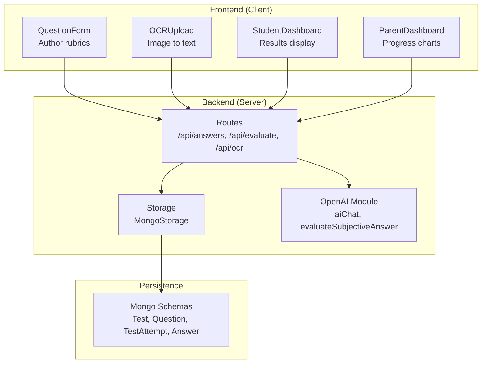
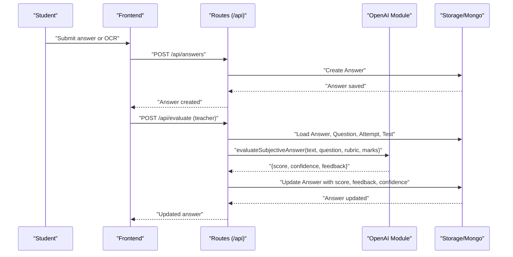
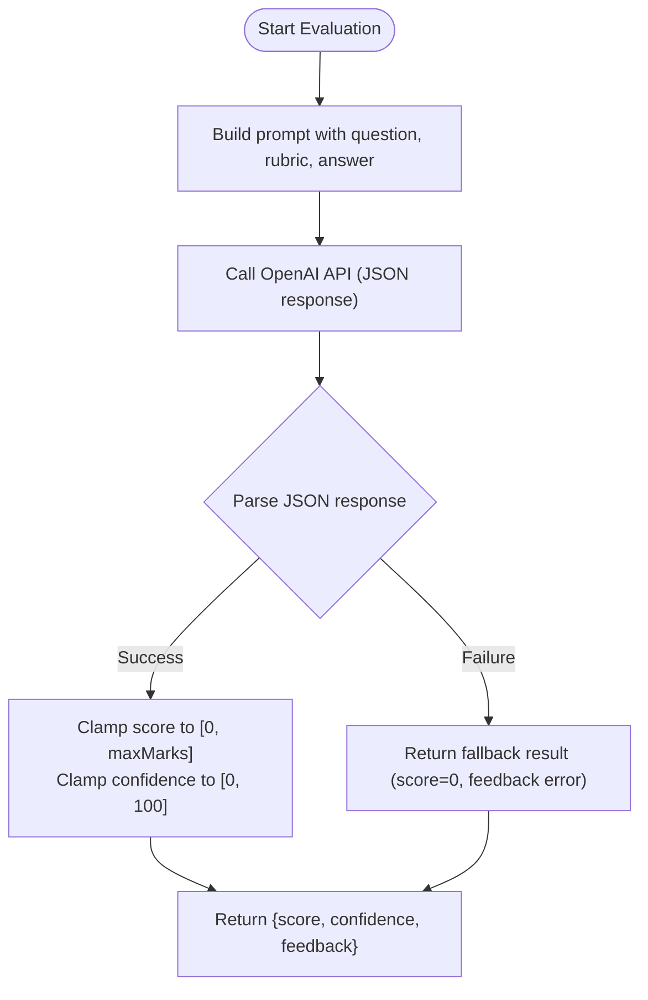
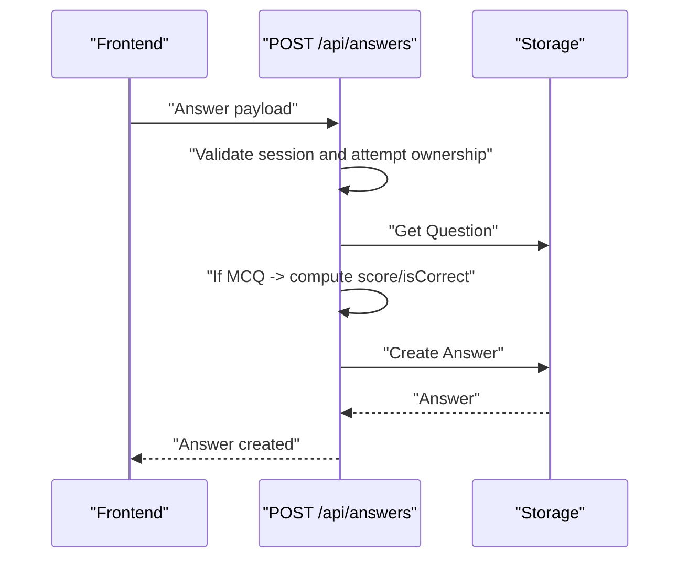
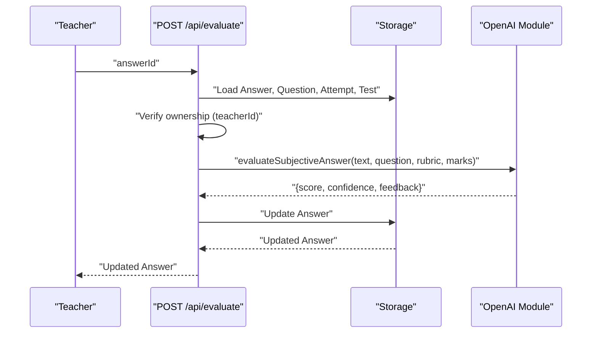
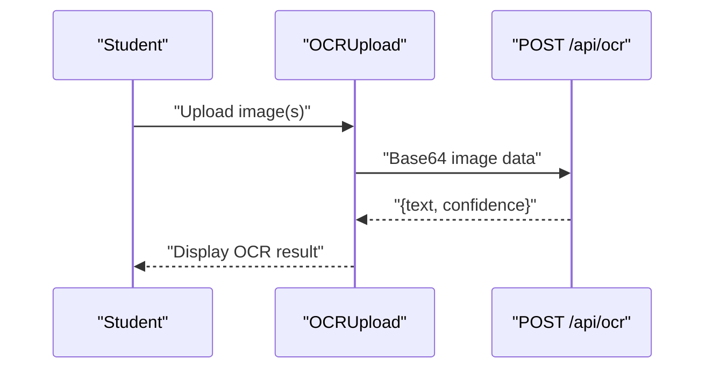
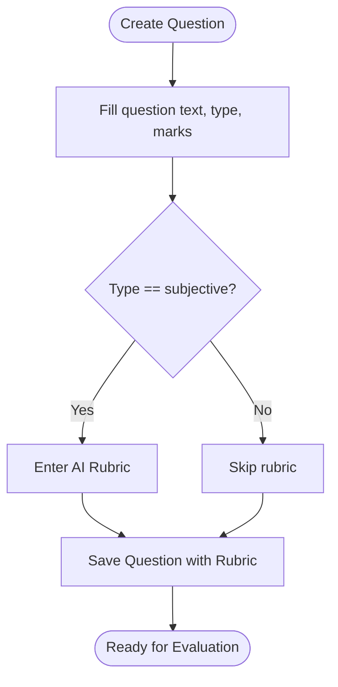
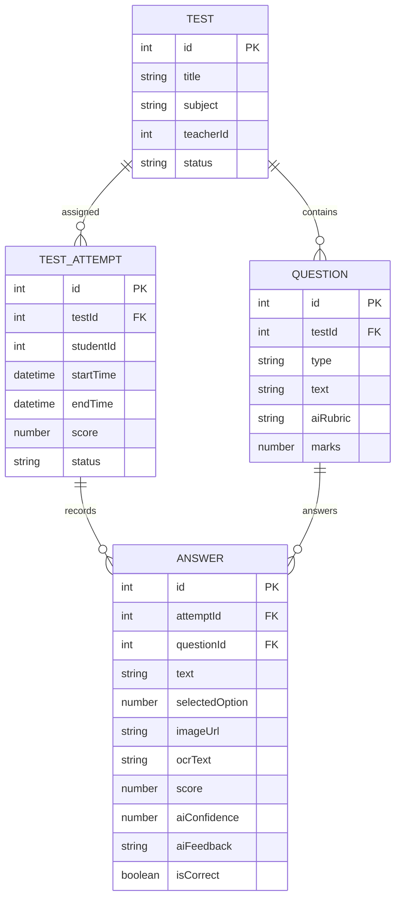
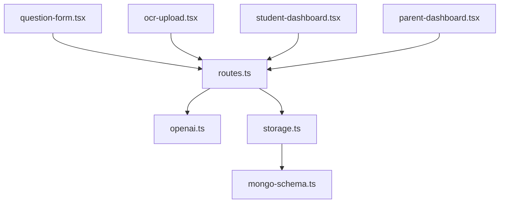

# Evaluation Workflow

<cite>
**Referenced Files in This Document**
- [openai.ts](file://server/lib/openai.ts)
- [routes.ts](file://server/routes.ts)
- [storage.ts](file://server/storage.ts)
- [mongo-schema.ts](file://shared/mongo-schema.ts)
- [question-form.tsx](file://client/src/components/test/question-form.tsx)
- [ocr-upload.tsx](file://client/src/components/test/ocr-upload.tsx)
- [student-dashboard.tsx](file://client/src/pages/student-dashboard.tsx)
- [parent-dashboard.tsx](file://client/src/pages/parent-dashboard.tsx)
</cite>

## Table of Contents
1. [Introduction](#introduction)
2. [Project Structure](#project-structure)
3. [Core Components](#core-components)
4. [Architecture Overview](#architecture-overview)
5. [Detailed Component Analysis](#detailed-component-analysis)
6. [Dependency Analysis](#dependency-analysis)
7. [Performance Considerations](#performance-considerations)
8. [Troubleshooting Guide](#troubleshooting-guide)
9. [Conclusion](#conclusion)

## Introduction
This document explains the complete AI evaluation workflow in PersonalLearningPro, from answer submission to grade calculation and feedback delivery. It covers the end-to-end process across frontend submission, backend evaluation processing, and persistent storage. It also documents the evaluation pipeline stages (AI assessment, score normalization, feedback generation), workflow coordination between evaluation functions, and data persistence. Examples of complete evaluation scenarios, error handling, and performance optimization strategies are included, along with API endpoint definitions and data flow.

## Project Structure
The evaluation workflow spans three layers:
- Frontend (client): Submission of answers, OCR processing, and rubric authoring for subjective questions.
- Backend (server): Route orchestration, authorization checks, AI evaluation, and persistence.
- Persistence (shared): MongoDB schemas for tests, attempts, questions, and answers.

**Diagram sources**
- [routes.ts](file://server/routes.ts#L416-L580)
- [storage.ts](file://server/storage.ts#L110-L519)
- [openai.ts](file://server/lib/openai.ts#L1-L216)
- [mongo-schema.ts](file://shared/mongo-schema.ts#L40-L76)

**Section sources**
- [routes.ts](file://server/routes.ts#L416-L580)
- [storage.ts](file://server/storage.ts#L110-L519)
- [openai.ts](file://server/lib/openai.ts#L1-L216)
- [mongo-schema.ts](file://shared/mongo-schema.ts#L40-L76)

## Core Components
- AI evaluation module: Provides AI-assisted evaluation for subjective answers and test performance analysis.
- Routes: Expose endpoints for answer submission, OCR processing, and manual/automatic evaluation.
- Storage: Implements CRUD operations for tests, attempts, questions, and answers with MongoDB.
- Frontend forms: Allow teachers to define rubrics and enable students to submit answers and OCR text.

Key responsibilities:
- Authorization: Ensure only authorized roles access evaluation endpoints.
- Data validation: Validate inputs using Zod schemas before persisting.
- AI scoring: Normalize scores to question max marks and return confidence and feedback.
- Persistence: Store answers, scores, and feedback for later retrieval and reporting.

**Section sources**
- [openai.ts](file://server/lib/openai.ts#L50-L105)
- [routes.ts](file://server/routes.ts#L416-L580)
- [storage.ts](file://server/storage.ts#L241-L262)
- [mongo-schema.ts](file://shared/mongo-schema.ts#L40-L76)

## Architecture Overview
The evaluation workflow integrates frontend submission, backend orchestration, AI services, and persistent storage.

**Diagram sources**
- [routes.ts](file://server/routes.ts#L416-L580)
- [openai.ts](file://server/lib/openai.ts#L50-L105)
- [storage.ts](file://server/storage.ts#L241-L262)

## Detailed Component Analysis

### AI Evaluation Pipeline
The AI evaluation pipeline performs:
- Prompt construction with question, rubric, and student answer.
- JSON response parsing with strict validation and bounds checking.
- Normalization of score to the question’s max marks.
- Confidence and feedback delivery for teacher review.

**Diagram sources**
- [openai.ts](file://server/lib/openai.ts#L50-L105)

**Section sources**
- [openai.ts](file://server/lib/openai.ts#L50-L105)

### Answer Submission Endpoint
- Validates session role (student), attempt ownership, and attempt status.
- Supports automatic evaluation for MCQ questions.
- Persists answer and returns created record.

**Diagram sources**
- [routes.ts](file://server/routes.ts#L416-L463)
- [storage.ts](file://server/storage.ts#L241-L247)

**Section sources**
- [routes.ts](file://server/routes.ts#L416-L463)
- [storage.ts](file://server/storage.ts#L241-L247)

### Manual AI Evaluation Endpoint
- Requires teacher role and validates ownership of the test.
- Uses either raw text or OCR-derived text for evaluation.
- Updates answer with AI-generated score, confidence, and feedback.

**Diagram sources**
- [routes.ts](file://server/routes.ts#L487-L559)
- [openai.ts](file://server/lib/openai.ts#L50-L105)
- [storage.ts](file://server/storage.ts#L259-L262)

**Section sources**
- [routes.ts](file://server/routes.ts#L487-L559)
- [openai.ts](file://server/lib/openai.ts#L50-L105)
- [storage.ts](file://server/storage.ts#L259-L262)

### OCR Processing Endpoint
- Accepts base64 image data and returns extracted text and confidence.
- Enforces file size/type constraints in the frontend.

**Diagram sources**
- [routes.ts](file://server/routes.ts#L465-L485)
- [ocr-upload.tsx](file://client/src/components/test/ocr-upload.tsx#L32-L91)

**Section sources**
- [routes.ts](file://server/routes.ts#L465-L485)
- [ocr-upload.tsx](file://client/src/components/test/ocr-upload.tsx#L32-L91)

### Rubric Authoring for Subjective Questions
- Teachers define rubrics during question creation to guide AI evaluation.
- Rubrics are stored with the question and used during evaluation.

**Diagram sources**
- [question-form.tsx](file://client/src/components/test/question-form.tsx#L36-L45)
- [mongo-schema.ts](file://shared/mongo-schema.ts#L40-L50)

**Section sources**
- [question-form.tsx](file://client/src/components/test/question-form.tsx#L36-L45)
- [mongo-schema.ts](file://shared/mongo-schema.ts#L40-L50)

### Data Models and Persistence
- Answers store both raw text and OCR-derived text, plus AI-assigned score, confidence, and feedback.
- Test attempts track status and can be updated to evaluated after AI scoring.

**Diagram sources**
- [mongo-schema.ts](file://shared/mongo-schema.ts#L25-L76)

**Section sources**
- [mongo-schema.ts](file://shared/mongo-schema.ts#L25-L76)
- [storage.ts](file://server/storage.ts#L241-L262)

### Example Evaluation Scenarios

#### Scenario 1: Automatic MCQ Evaluation
- Student submits an MCQ answer.
- Backend computes correctness and score immediately.
- Answer persisted with isCorrect and score.

**Section sources**
- [routes.ts](file://server/routes.ts#L447-L452)
- [storage.ts](file://server/storage.ts#L241-L247)

#### Scenario 2: Manual AI Evaluation for Subjective Answer
- Teacher triggers AI evaluation using stored rubric.
- AI returns normalized score, confidence, and feedback.
- Answer updated with AI results.

**Section sources**
- [routes.ts](file://server/routes.ts#L540-L553)
- [openai.ts](file://server/lib/openai.ts#L50-L105)

#### Scenario 3: OCR-Assisted Evaluation
- Student uploads scanned answer sheet.
- OCR extracts text and confidence.
- Teacher evaluates using OCR text and rubric.

**Section sources**
- [routes.ts](file://server/routes.ts#L465-L485)
- [ocr-upload.tsx](file://client/src/components/test/ocr-upload.tsx#L32-L91)
- [routes.ts](file://server/routes.ts#L533-L538)

## Dependency Analysis
- Routes depend on Storage for database operations and OpenAI module for AI evaluation.
- OpenAI module depends on environment configuration for API keys.
- Frontend components depend on routes for data operations and schemas for type safety.

**Diagram sources**
- [routes.ts](file://server/routes.ts#L416-L580)
- [openai.ts](file://server/lib/openai.ts#L1-L216)
- [storage.ts](file://server/storage.ts#L110-L519)
- [mongo-schema.ts](file://shared/mongo-schema.ts#L40-L76)

**Section sources**
- [routes.ts](file://server/routes.ts#L416-L580)
- [openai.ts](file://server/lib/openai.ts#L1-L216)
- [storage.ts](file://server/storage.ts#L110-L519)
- [mongo-schema.ts](file://shared/mongo-schema.ts#L40-L76)

## Performance Considerations
- Minimize AI calls: Prefer automatic MCQ scoring; batch manual evaluations when feasible.
- Cache rubrics and question metadata to reduce repeated loads.
- Use pagination and indexing for analytics and reporting views.
- Optimize OCR uploads: Validate file size/type early to avoid unnecessary processing.
- Monitor OpenAI rate limits and implement retry/backoff strategies.

## Troubleshooting Guide
Common issues and resolutions:
- Unauthorized access: Ensure session role and ownership checks pass for evaluation endpoints.
- Missing data: Verify answer, question, attempt, and test exist before evaluation.
- AI parsing failures: The AI evaluation function returns safe defaults when JSON parsing fails.
- OCR errors: Validate image constraints and handle frontend errors gracefully.

**Section sources**
- [routes.ts](file://server/routes.ts#L487-L559)
- [openai.ts](file://server/lib/openai.ts#L78-L105)
- [ocr-upload.tsx](file://client/src/components/test/ocr-upload.tsx#L92-L91)

## Conclusion
PersonalLearningPro’s evaluation workflow integrates frontend submission, backend orchestration, AI-powered scoring, and robust persistence. The system supports automatic MCQ scoring and manual AI evaluation for subjective questions, with rubrics authored by teachers. Data is normalized and persisted for reporting and analytics, while error handling ensures resilience. By following the documented endpoints, data flows, and best practices, stakeholders can reliably evaluate student performance and improve learning outcomes.