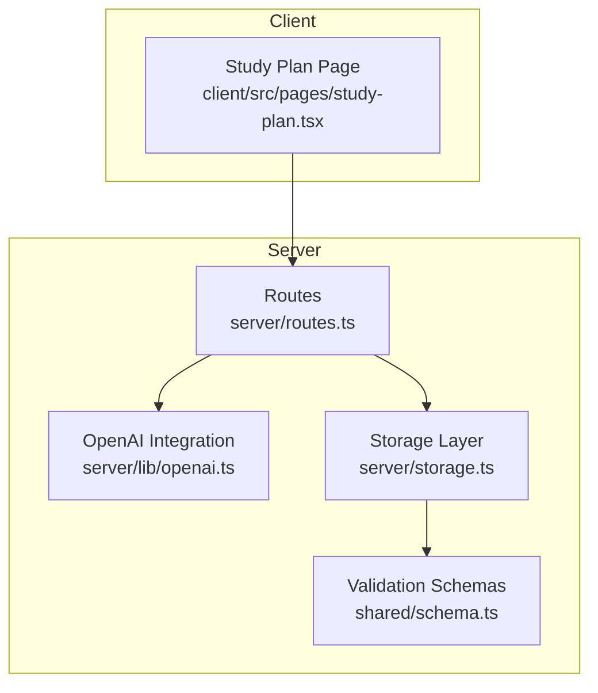
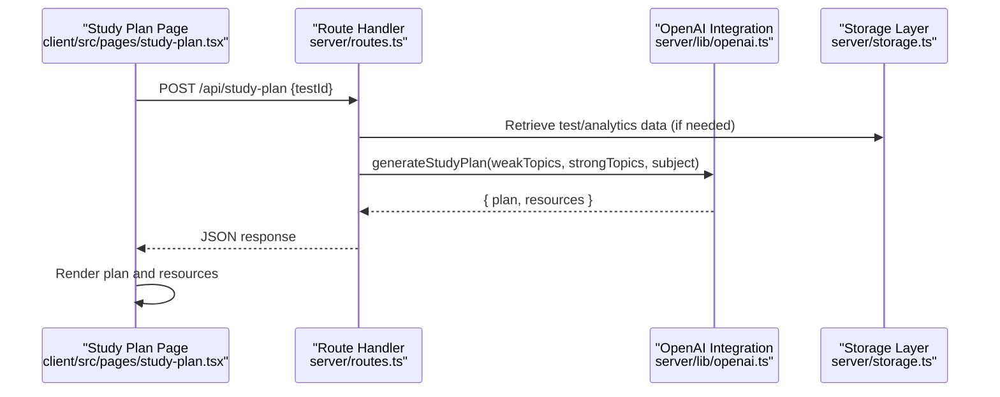
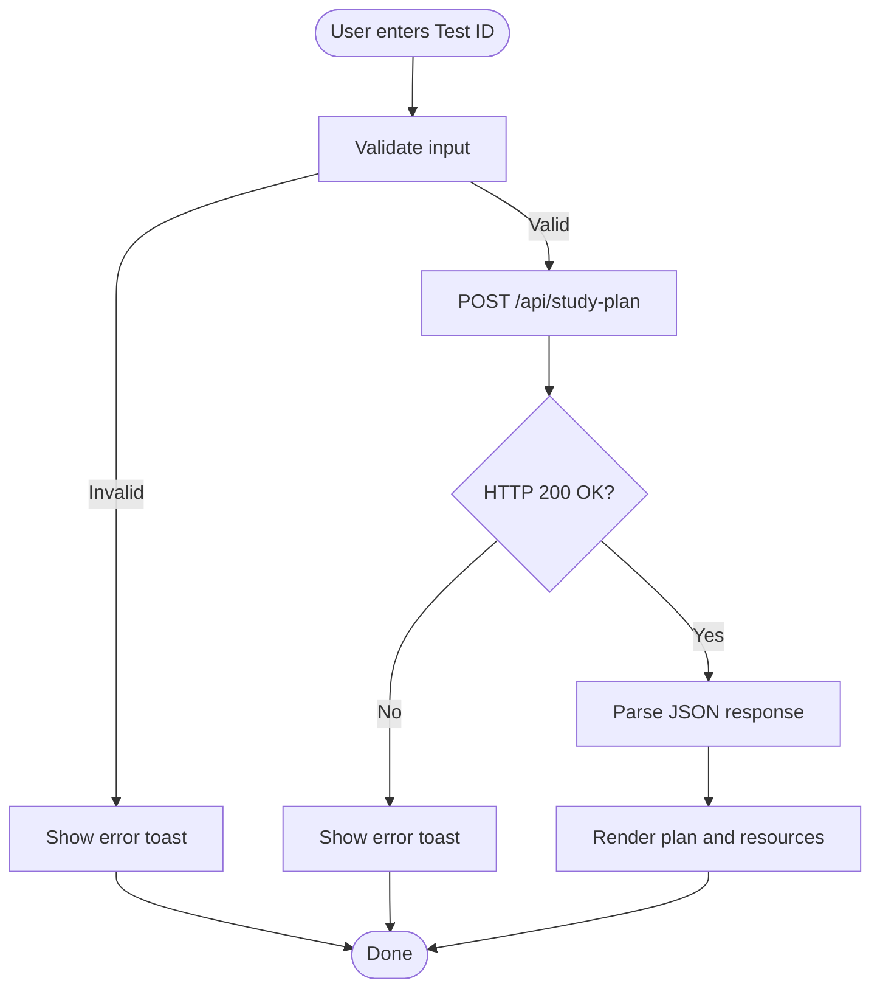
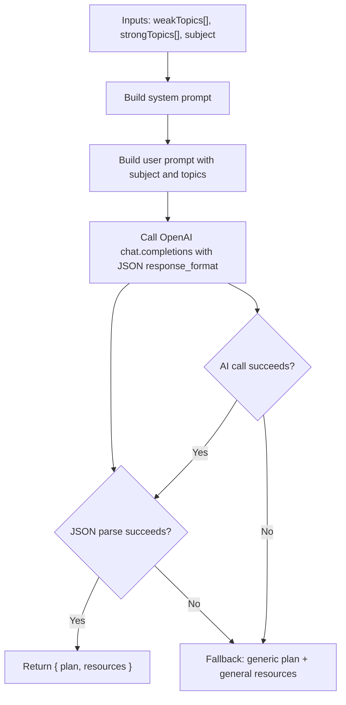
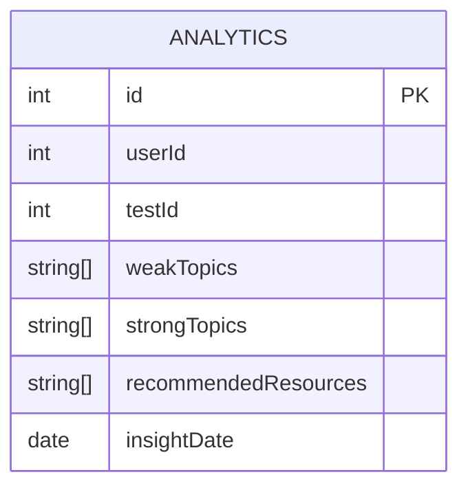
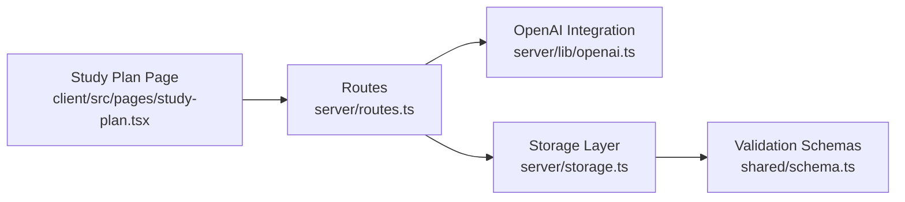

# Study Plan Generation

<cite>
**Referenced Files in This Document**
- [README.md](file://README.md)
- [server/lib/openai.ts](file://server/lib/openai.ts)
- [client/src/pages/study-plan.tsx](file://client/src/pages/study-plan.tsx)
- [server/routes.ts](file://server/routes.ts)
- [server/storage.ts](file://server/storage.ts)
- [shared/schema.ts](file://shared/schema.ts)
- [server/index.ts](file://server/index.ts)
</cite>

## Table of Contents
1. [Introduction](#introduction)
2. [Project Structure](#project-structure)
3. [Core Components](#core-components)
4. [Architecture Overview](#architecture-overview)
5. [Detailed Component Analysis](#detailed-component-analysis)
6. [Dependency Analysis](#dependency-analysis)
7. [Performance Considerations](#performance-considerations)
8. [Troubleshooting Guide](#troubleshooting-guide)
9. [Conclusion](#conclusion)

## Introduction
This document explains the AI-powered study plan generation system. It focuses on the generateStudyPlan function that produces personalized learning plans based on student performance data, detailing input parameters, AI prompt engineering, resource recommendation system, response structure, and fallback mechanisms. It also covers the frontend UI that triggers plan generation and displays results.

## Project Structure
The study plan feature spans the frontend React page and the backend Express server:
- Frontend: A dedicated page that collects a test ID and renders the generated plan and resources.
- Backend: An OpenAI integration that generates the plan and resources, and a route handler that orchestrates data retrieval and response.

**Diagram sources**
- [client/src/pages/study-plan.tsx](file://client/src/pages/study-plan.tsx#L17-L112)
- [server/routes.ts](file://server/routes.ts#L1-L1104)
- [server/lib/openai.ts](file://server/lib/openai.ts#L107-L163)
- [server/storage.ts](file://server/storage.ts#L1-L519)
- [shared/schema.ts](file://shared/schema.ts#L61-L68)

**Section sources**
- [README.md](file://README.md#L70-L102)
- [server/index.ts](file://server/index.ts#L1-L114)

## Core Components
- Frontend Study Plan Page: Collects a test ID, calls the backend endpoint, and renders the plan and recommended resources.
- Backend Route Handler: Receives the test ID, retrieves related data, and invokes the AI plan generator.
- AI Plan Generator: Sends a structured prompt to OpenAI to produce a JSON response containing a study plan and resources.
- Storage Layer: Provides access to user, test, attempt, and analytics data used to derive weak and strong topics.
- Validation Schemas: Define the shape of analytics data, including weak topics, strong topics, and recommended resources.

Key responsibilities:
- Input validation and routing on the backend.
- Prompt construction and JSON parsing on the AI integration layer.
- Rendering and UX on the frontend.

**Section sources**
- [client/src/pages/study-plan.tsx](file://client/src/pages/study-plan.tsx#L17-L112)
- [server/routes.ts](file://server/routes.ts#L1-L1104)
- [server/lib/openai.ts](file://server/lib/openai.ts#L107-L163)
- [server/storage.ts](file://server/storage.ts#L1-L519)
- [shared/schema.ts](file://shared/schema.ts#L61-L68)

## Architecture Overview
The study plan generation follows a client-server architecture:
- The client sends a POST request with a test ID.
- The server validates and processes the request, optionally retrieving performance analytics.
- The server calls the AI integration to generate a structured plan and resources.
- The server returns a JSON response to the client.
- The client renders the plan and resource links.

**Diagram sources**
- [client/src/pages/study-plan.tsx](file://client/src/pages/study-plan.tsx#L35-L59)
- [server/routes.ts](file://server/routes.ts#L1-L1104)
- [server/lib/openai.ts](file://server/lib/openai.ts#L107-L163)
- [server/storage.ts](file://server/storage.ts#L1-L519)

## Detailed Component Analysis

### Frontend: Study Plan Page
- Purpose: Accepts a test ID, triggers plan generation, and displays results.
- Behavior:
  - Validates that the test ID is present.
  - Calls the backend endpoint with a JSON payload.
  - Handles non-OK responses and displays toast notifications.
  - Renders the study plan as HTML and lists recommended resources with optional links.

**Diagram sources**
- [client/src/pages/study-plan.tsx](file://client/src/pages/study-plan.tsx#L23-L59)

**Section sources**
- [client/src/pages/study-plan.tsx](file://client/src/pages/study-plan.tsx#L17-L112)

### Backend: Route Handler and Data Access
- Route registration: The server registers routes and attaches middleware.
- Study plan endpoint: The handler receives the test ID, performs access checks, and orchestrates plan generation.
- Data retrieval: Uses the storage layer to fetch test-related data and analytics (weak topics, strong topics, subject).
- Response: Returns a JSON object with the plan and resources.

Note: The route handler integrates with storage and OpenAI. The exact implementation of data extraction for weak/strong topics is encapsulated within the handler and storage layer.

**Section sources**
- [server/routes.ts](file://server/routes.ts#L1-L1104)
- [server/storage.ts](file://server/storage.ts#L1-L519)
- [server/index.ts](file://server/index.ts#L1-L114)

### AI Integration: generateStudyPlan
- Inputs:
  - weakTopics: array of strings representing topics the student struggles with.
  - strongTopics: array of strings representing topics the student excels in.
  - subject: string indicating the subject focus.
- Prompt engineering:
  - System message instructs the model to return a JSON object with:
    - plan: a structured study plan with bullet points and time estimates.
    - resources: an array of recommended resources, each with title, type (video, article, practice), and optional URL.
  - User message includes subject, weak topics, and strong topics.
- Output:
  - JSON-parsed object with plan and resources.
  - Fallback responses in case of JSON parse errors or AI service failures.

**Diagram sources**
- [server/lib/openai.ts](file://server/lib/openai.ts#L107-L163)

**Section sources**
- [server/lib/openai.ts](file://server/lib/openai.ts#L107-L163)

### Data Model: Analytics and Resource Recommendations
- Analytics schema includes arrays for weak topics, strong topics, and recommended resources.
- These fields are used to populate the AI prompt with accurate, performance-driven insights.

**Diagram sources**
- [shared/schema.ts](file://shared/schema.ts#L61-L68)

**Section sources**
- [shared/schema.ts](file://shared/schema.ts#L61-L68)

## Dependency Analysis
- The frontend depends on the backend API endpoint for plan generation.
- The backend route handler depends on:
  - Storage layer for data retrieval.
  - OpenAI integration for plan generation.
- The OpenAI integration depends on the OpenAI SDK and environment configuration.

**Diagram sources**
- [client/src/pages/study-plan.tsx](file://client/src/pages/study-plan.tsx#L17-L112)
- [server/routes.ts](file://server/routes.ts#L1-L1104)
- [server/lib/openai.ts](file://server/lib/openai.ts#L107-L163)
- [server/storage.ts](file://server/storage.ts#L1-L519)
- [shared/schema.ts](file://shared/schema.ts#L61-L68)

**Section sources**
- [server/routes.ts](file://server/routes.ts#L1-L1104)
- [server/lib/openai.ts](file://server/lib/openai.ts#L107-L163)
- [server/storage.ts](file://server/storage.ts#L1-L519)
- [shared/schema.ts](file://shared/schema.ts#L61-L68)

## Performance Considerations
- Network latency: The plan generation involves an external API call; consider caching or precomputing insights when feasible.
- JSON parsing overhead: The AI response is parsed once per request; keep prompts concise to minimize token usage.
- Rendering: The frontend renders plan HTML directly; ensure sanitized content to avoid XSS risks.
- Scalability: If many concurrent requests occur, monitor OpenAI rate limits and consider batching or queuing.

## Troubleshooting Guide
Common failure modes and fallback behavior:
- Missing or invalid test ID: The frontend validates input and shows an error toast.
- Non-200 HTTP response: The frontend catches errors and displays a toast with the message.
- JSON parse error from AI: The AI integration falls back to a generic plan and a general resource suggestion.
- AI service failure: The AI integration returns a fallback plan advising focus on weak topics and a general resource suggestion.
- Missing environment configuration: If the OpenAI API key is not set, AI features are disabled with a warning.

Resolution steps:
- Verify the test ID exists and is accessible to the requesting user.
- Confirm the OPENAI_API_KEY environment variable is configured.
- Retry the request; the fallback ensures a meaningful response even if AI parsing fails.
- Inspect server logs for detailed error messages.

**Section sources**
- [client/src/pages/study-plan.tsx](file://client/src/pages/study-plan.tsx#L23-L59)
- [server/lib/openai.ts](file://server/lib/openai.ts#L135-L163)

## Conclusion
The study plan generation system combines a clean frontend UI with a robust backend pipeline that leverages OpenAI to produce structured, actionable plans. Its design emphasizes resilience through explicit fallbacks and clear separation of concerns across the UI, routing, AI integration, and storage layers. By focusing on weak topics while acknowledging strengths and subject context, the system supports targeted, personalized learning outcomes.