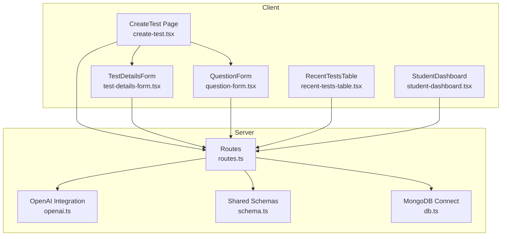
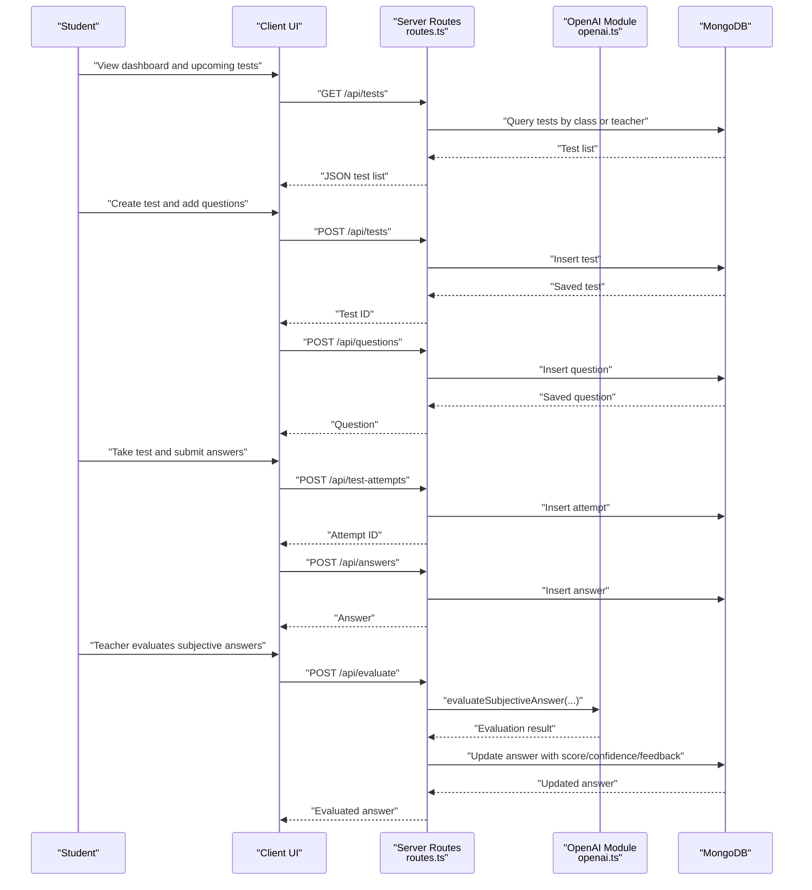
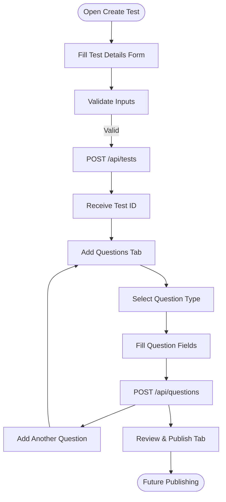
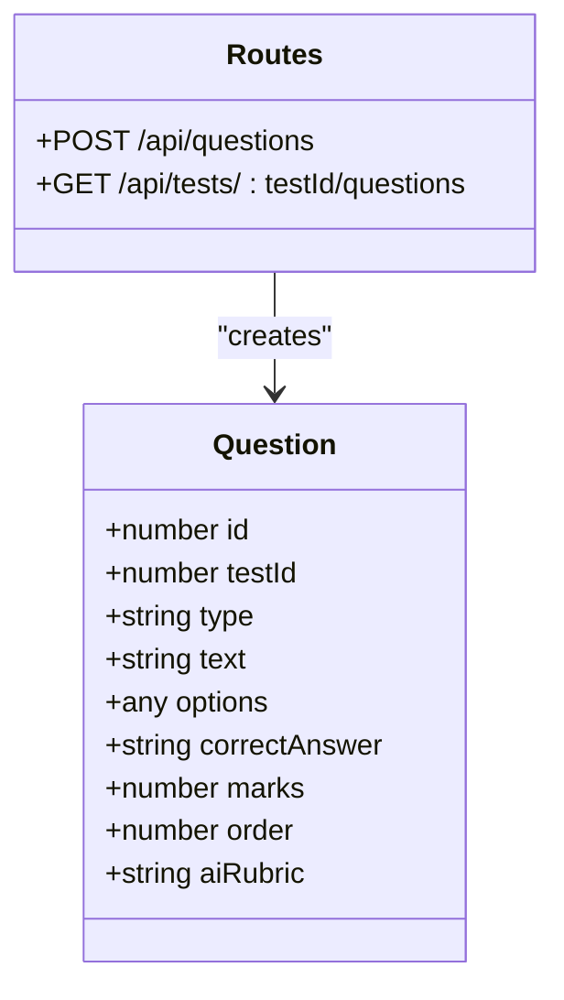
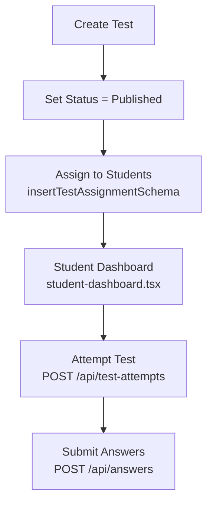
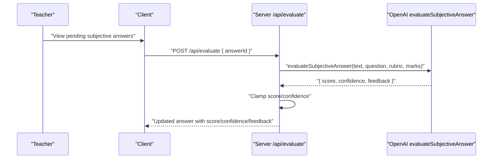
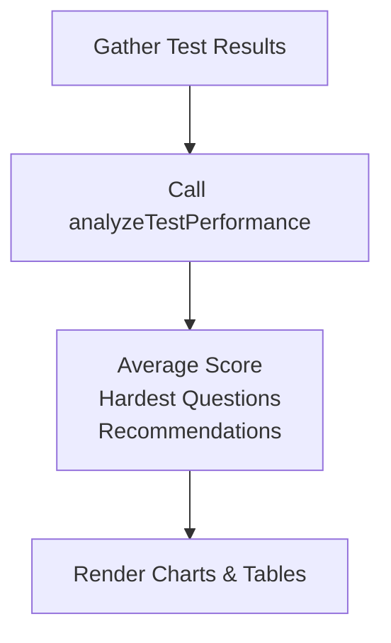
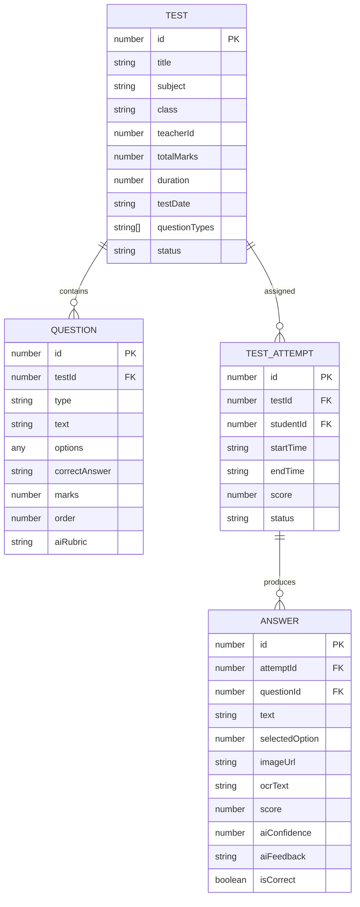
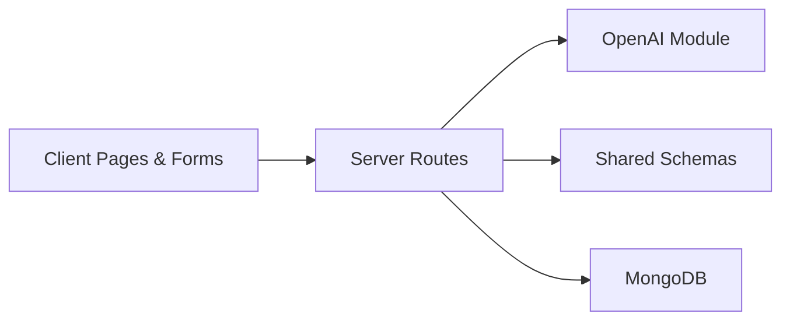

# Assessment & Test Management

<cite>
**Referenced Files in This Document**
- [openai.ts](file://server/lib/openai.ts)
- [routes.ts](file://server/routes.ts)
- [schema.ts](file://shared/schema.ts)
- [db.ts](file://server/db.ts)
- [create-test.tsx](file://client/src/pages/create-test.tsx)
- [test-details-form.tsx](file://client/src/components/test/test-details-form.tsx)
- [question-form.tsx](file://client/src/components/test/question-form.tsx)
- [recent-tests-table.tsx](file://client/src/components/dashboard/recent-tests-table.tsx)
- [student-dashboard.tsx](file://client/src/pages/student-dashboard.tsx)
</cite>

## Table of Contents
1. [Introduction](#introduction)
2. [Project Structure](#project-structure)
3. [Core Components](#core-components)
4. [Architecture Overview](#architecture-overview)
5. [Detailed Component Analysis](#detailed-component-analysis)
6. [Dependency Analysis](#dependency-analysis)
7. [Performance Considerations](#performance-considerations)
8. [Troubleshooting Guide](#troubleshooting-guide)
9. [Conclusion](#conclusion)

## Introduction
This document describes the Assessment & Test Management system in PersonalLearningPro. It covers the complete lifecycle from test creation to evaluation, including AI-assisted question generation, test distribution, and automated evaluation. It documents multi-question formats (MCQ, short answer, long answer, numerical), scheduling and assignment workflows, AI-powered answer evaluation, performance analysis, test data models, question bank management, result tracking, security and anti-cheating considerations, grade-level organization, and integration with OpenAI for intelligent test creation and evaluation.

## Project Structure
The assessment and test management spans client and server layers:
- Client-side pages and forms for creating tests, adding questions, and viewing recent tests.
- Server-side routes for CRUD operations on tests, questions, attempts, and answers.
- Shared schemas for validation and typed models.
- OpenAI integration for AI chat, subjective answer evaluation, study plan generation, and test performance analysis.
- Database connectivity for persistence.

**Diagram sources**
- [create-test.tsx](file://client/src/pages/create-test.tsx#L1-L122)
- [test-details-form.tsx](file://client/src/components/test/test-details-form.tsx#L1-L325)
- [question-form.tsx](file://client/src/components/test/question-form.tsx#L1-L390)
- [recent-tests-table.tsx](file://client/src/components/dashboard/recent-tests-table.tsx#L1-L234)
- [student-dashboard.tsx](file://client/src/pages/student-dashboard.tsx#L1-L1001)
- [routes.ts](file://server/routes.ts#L1-L800)
- [openai.ts](file://server/lib/openai.ts#L1-L217)
- [schema.ts](file://shared/schema.ts#L1-L142)
- [db.ts](file://server/db.ts#L1-L21)

**Section sources**
- [create-test.tsx](file://client/src/pages/create-test.tsx#L1-L122)
- [routes.ts](file://server/routes.ts#L110-L316)
- [schema.ts](file://shared/schema.ts#L15-L59)
- [openai.ts](file://server/lib/openai.ts#L20-L105)
- [db.ts](file://server/db.ts#L8-L20)

## Core Components
- Test creation UI: Multi-step form with tabs for test details, adding questions, and review.
- Question creation UI: Supports MCQ, short-answer, long-answer, and numerical formats with rubrics for AI scoring.
- Backend routes: Teachers can create tests and questions; students can attempt tests and submit answers; AI evaluates subjective answers; analytics summarize performance.
- Shared schemas: Define test, question, attempt, answer, and assignment models with validation.
- OpenAI integration: AI chat, evaluation of subjective answers, study plan generation, and test performance analysis.
- Database connectivity: MongoDB connection and operations for persistence.

**Section sources**
- [test-details-form.tsx](file://client/src/components/test/test-details-form.tsx#L30-L104)
- [question-form.tsx](file://client/src/components/test/question-form.tsx#L36-L45)
- [routes.ts](file://server/routes.ts#L110-L316)
- [schema.ts](file://shared/schema.ts#L15-L103)
- [openai.ts](file://server/lib/openai.ts#L20-L105)
- [db.ts](file://server/db.ts#L8-L20)

## Architecture Overview
The system follows a layered architecture:
- Client renders UI and submits requests to server endpoints.
- Server validates inputs using shared schemas, enforces role-based access control, and persists data.
- OpenAI is invoked for AI chat, evaluation, study plan, and performance analysis.
- Responses are returned to the client for rendering dashboards and test views.

**Diagram sources**
- [routes.ts](file://server/routes.ts#L110-L316)
- [openai.ts](file://server/lib/openai.ts#L50-L105)
- [schema.ts](file://shared/schema.ts#L15-L59)

**Section sources**
- [routes.ts](file://server/routes.ts#L110-L316)
- [openai.ts](file://server/lib/openai.ts#L50-L105)
- [schema.ts](file://shared/schema.ts#L15-L59)

## Detailed Component Analysis

### Test Creation Workflow
- The CreateTest page orchestrates a multi-tab UI:
  - Test Details: Collects title, subject, class, date, duration, total marks, question types, and status.
  - Add Questions: Adds questions to the test with type-specific fields and rubrics for AI scoring.
  - Review: Placeholder for future review/publish steps.
- Validation and submission:
  - Frontend uses Zod-based forms with react-hook-form and TanStack Query for mutations.
  - Backend enforces role checks (teacher only) and ownership (teacherId equals session userId).
  - Tests are stored with status defaults and associated metadata.

**Diagram sources**
- [create-test.tsx](file://client/src/pages/create-test.tsx#L15-L121)
- [test-details-form.tsx](file://client/src/components/test/test-details-form.tsx#L44-L108)
- [question-form.tsx](file://client/src/components/test/question-form.tsx#L55-L204)
- [routes.ts](file://server/routes.ts#L110-L132)

**Section sources**
- [create-test.tsx](file://client/src/pages/create-test.tsx#L15-L121)
- [test-details-form.tsx](file://client/src/components/test/test-details-form.tsx#L30-L108)
- [question-form.tsx](file://client/src/components/test/question-form.tsx#L36-L204)
- [routes.ts](file://server/routes.ts#L110-L132)

### Question Bank Management
- Supported question types:
  - MCQ: Options array with one correct option; backend derives correctAnswer from options.
  - Short Answer / Long Answer: Require aiRubric for AI evaluation.
  - Numerical: Requires correctAnswer numeric value.
- Backend validation ensures:
  - Ownership: Only the test’s teacher can create questions.
  - Access control: Students cannot access question creation endpoints.
  - Data integrity: Zod schemas enforce required fields and types.

**Diagram sources**
- [question-form.tsx](file://client/src/components/test/question-form.tsx#L36-L45)
- [routes.ts](file://server/routes.ts#L250-L316)
- [schema.ts](file://shared/schema.ts#L28-L37)

**Section sources**
- [question-form.tsx](file://client/src/components/test/question-form.tsx#L36-L204)
- [routes.ts](file://server/routes.ts#L250-L316)
- [schema.ts](file://shared/schema.ts#L28-L37)

### Test Distribution and Assignment
- Distribution:
  - Tests are filtered by class for student access.
  - Students can only attempt published tests assigned to their class.
- Assignment:
  - A dedicated assignment schema supports assigning tests to students with due dates, statuses, and notifications.
  - This enables scheduled distribution and overdue tracking.

**Diagram sources**
- [schema.ts](file://shared/schema.ts#L92-L103)
- [routes.ts](file://server/routes.ts#L134-L173)
- [student-dashboard.tsx](file://client/src/pages/student-dashboard.tsx#L183-L208)

**Section sources**
- [schema.ts](file://shared/schema.ts#L92-L103)
- [routes.ts](file://server/routes.ts#L134-L173)
- [student-dashboard.tsx](file://client/src/pages/student-dashboard.tsx#L183-L208)

### Automated Evaluation and AI-Powered Scoring
- MCQ evaluation:
  - Automatically scored by comparing selectedOption to correctAnswer.
- Subjective answers (short/long):
  - AI evaluation uses evaluateSubjectiveAnswer with question text, rubric, and max marks.
  - Returns score, confidence, and feedback; values are clamped to valid ranges.
- Study plan and performance analysis:
  - generateStudyPlan produces a personalized plan and resource recommendations.
  - analyzeTestPerformance computes average scores, identifies hardest questions, and provides recommendations.

**Diagram sources**
- [routes.ts](file://server/routes.ts#L488-L559)
- [openai.ts](file://server/lib/openai.ts#L50-L105)

**Section sources**
- [routes.ts](file://server/routes.ts#L447-L463)
- [routes.ts](file://server/routes.ts#L488-L559)
- [openai.ts](file://server/lib/openai.ts#L50-L105)

### Performance Analysis and Reporting
- Backend analysis:
  - analyzeTestPerformance consumes test results to compute averages, hardest questions, and recommendations.
- Frontend reporting:
  - Analytics page displays charts for test completion rates and other metrics.
  - Student dashboard surfaces recent results and upcoming tests.

**Diagram sources**
- [openai.ts](file://server/lib/openai.ts#L165-L216)
- [student-dashboard.tsx](file://client/src/pages/student-dashboard.tsx#L210-L214)

**Section sources**
- [openai.ts](file://server/lib/openai.ts#L165-L216)
- [student-dashboard.tsx](file://client/src/pages/student-dashboard.tsx#L210-L214)

### Security and Access Control
- Role-based access:
  - Teachers can create/update/delete tests and questions; students can only attempt and submit answers.
  - Attempts and answers require ownership checks (studentId equals session userId).
- Ownership checks:
  - Tests and questions are validated against teacherId/session.userId.
  - Students can only access tests assigned to their class.
- Anti-cheating considerations:
  - OCR endpoint exists for scanned materials; AI evaluation supports rubrics to reduce subjectivity.
  - Consider adding session monitoring, IP/device tracking, and proctoring integrations in future enhancements.

**Section sources**
- [routes.ts](file://server/routes.ts#L112-L132)
- [routes.ts](file://server/routes.ts#L252-L278)
- [routes.ts](file://server/routes.ts#L319-L370)
- [routes.ts](file://server/routes.ts#L417-L463)

### Data Models and Schemas
- Test: title, subject, class, teacherId, totalMarks, duration, testDate, questionTypes, status.
- Question: testId, type, text, options/correctAnswer for MCQ, marks, order, aiRubric for subjective.
- TestAttempt: testId, studentId, timestamps, score, status.
- Answer: attemptId, questionId, text/image/ocrText, selectedOption, score, aiConfidence/feedback, isCorrect.
- TestAssignment: testId, studentId, assignedBy, assignedDate, dueDate, status, notificationSent.

**Diagram sources**
- [schema.ts](file://shared/schema.ts#L15-L59)
- [schema.ts](file://shared/schema.ts#L92-L103)

**Section sources**
- [schema.ts](file://shared/schema.ts#L15-L103)

## Dependency Analysis
- Client depends on:
  - Zod schemas for validation.
  - TanStack Query for caching and mutations.
  - Firebase Auth context for user identity.
- Server depends on:
  - Shared schemas for validation.
  - OpenAI module for AI features.
  - MongoDB for persistence.
- Coupling:
  - Routes depend on storage and OpenAI modules.
  - Forms depend on schemas and react-hook-form.

**Diagram sources**
- [routes.ts](file://server/routes.ts#L1-L11)
- [openai.ts](file://server/lib/openai.ts#L1-L9)
- [schema.ts](file://shared/schema.ts#L1-L3)
- [db.ts](file://server/db.ts#L1-L21)

**Section sources**
- [routes.ts](file://server/routes.ts#L1-L11)
- [openai.ts](file://server/lib/openai.ts#L1-L9)
- [schema.ts](file://shared/schema.ts#L1-L3)
- [db.ts](file://server/db.ts#L1-L21)

## Performance Considerations
- Caching:
  - Use TanStack Query to cache test lists and invalidate on mutations to avoid redundant network calls.
- Batch operations:
  - Consider batch creation for questions to minimize round trips.
- AI latency:
  - Offload AI evaluations asynchronously where possible; surface progress indicators.
- Database indexing:
  - Indexes on testId, studentId, and class can improve query performance for large datasets.

## Troubleshooting Guide
- Missing OPENAI_API_KEY:
  - AI features log warnings when the key is not configured; ensure environment variables are set.
- Validation errors:
  - Zod-based schemas return structured errors; check request payloads for missing or invalid fields.
- Access denied:
  - Ensure session roles and ownership checks pass; verify teacherId and class filters.
- Evaluation failures:
  - AI evaluation falls back to zero score and error feedback; confirm rubric completeness and question type compatibility.

**Section sources**
- [openai.ts](file://server/lib/openai.ts#L4-L6)
- [routes.ts](file://server/routes.ts#L112-L132)
- [routes.ts](file://server/routes.ts#L488-L559)

## Conclusion
PersonalLearningPro provides a robust Assessment & Test Management system with:
- A guided test creation workflow supporting multiple question types.
- AI-powered evaluation for subjective answers and performance insights.
- Role-based access control and class-based distribution.
- Extensible schemas enabling assignments and analytics.
Future enhancements could include advanced anti-cheating mechanisms, real-time proctoring, and richer analytics dashboards.