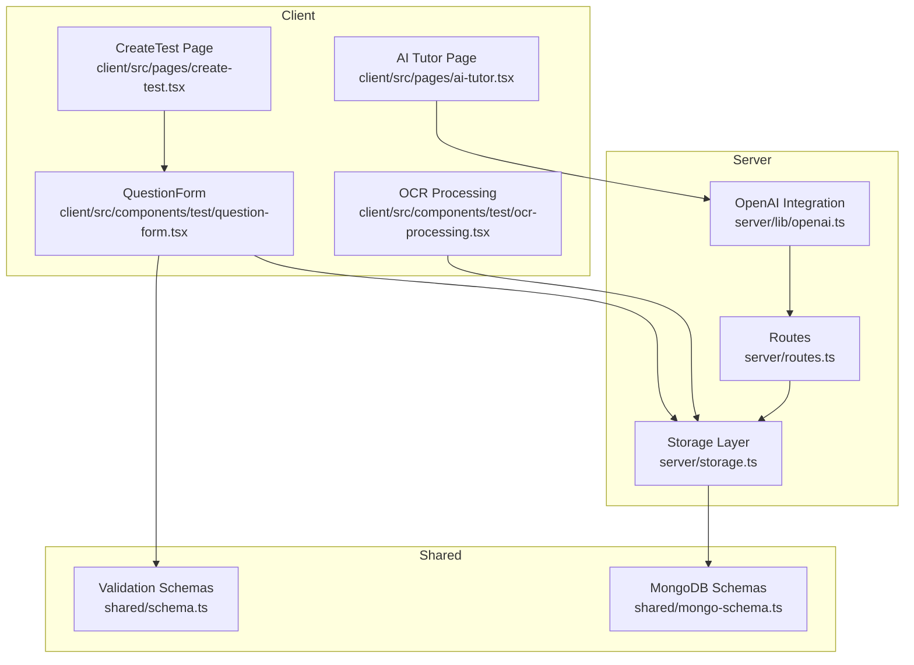
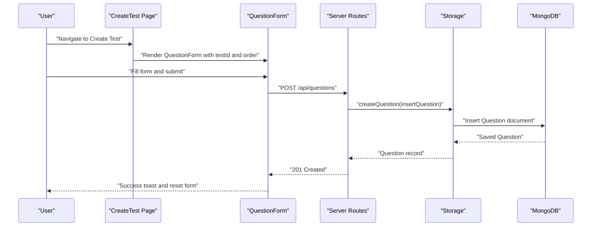
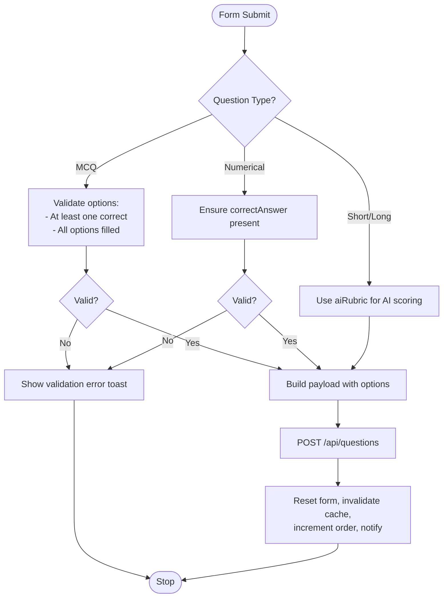
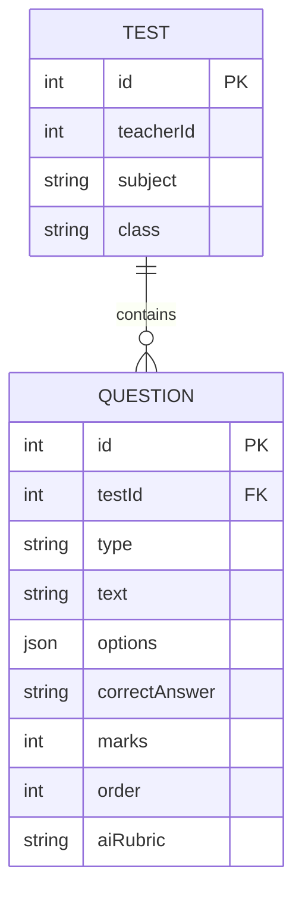
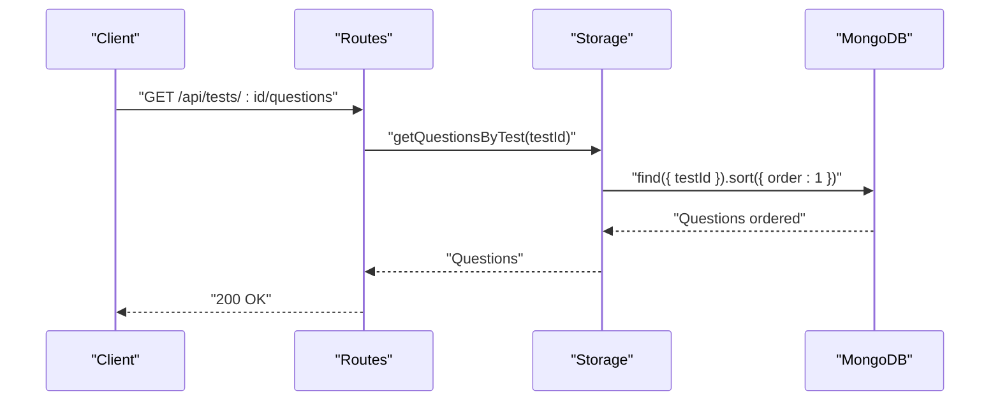
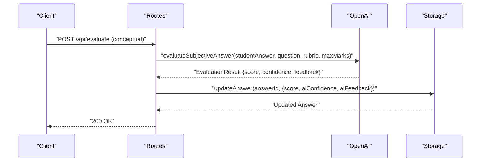
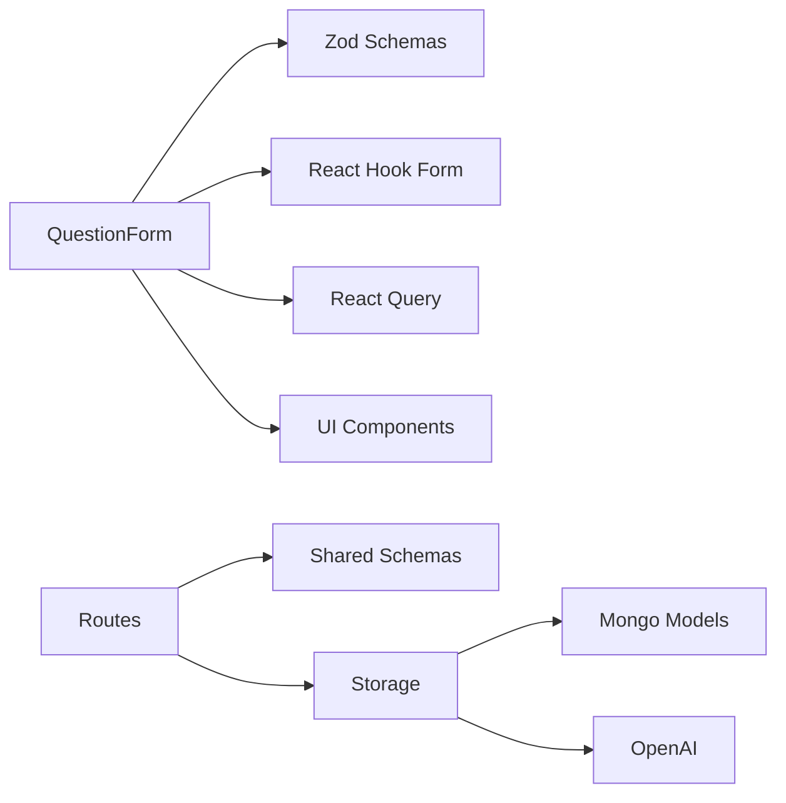

# Question Management System

<cite>
**Referenced Files in This Document**
- [question-form.tsx](file://client/src/components/test/question-form.tsx)
- [schema.ts](file://shared/schema.ts)
- [mongo-schema.ts](file://shared/mongo-schema.ts)
- [storage.ts](file://server/storage.ts)
- [routes.ts](file://server/routes.ts)
- [openai.ts](file://server/lib/openai.ts)
- [create-test.tsx](file://client/src/pages/create-test.tsx)
- [ocr-processing.tsx](file://client/src/components/test/ocr-processing.tsx)
- [ai-tutor.tsx](file://client/src/pages/ai-tutor.tsx)
</cite>

## Table of Contents
1. [Introduction](#introduction)
2. [Project Structure](#project-structure)
3. [Core Components](#core-components)
4. [Architecture Overview](#architecture-overview)
5. [Detailed Component Analysis](#detailed-component-analysis)
6. [Dependency Analysis](#dependency-analysis)
7. [Performance Considerations](#performance-considerations)
8. [Troubleshooting Guide](#troubleshooting-guide)
9. [Conclusion](#conclusion)

## Introduction
This document describes the Question Management System within PersonalLearningPro, focusing on the QuestionForm component architecture, question data model, validation and formatting rules, AI integration for question generation and evaluation, question ordering and CRUD operations, relationships with parent tests, preview and scoring mechanisms, and strategies for question bank organization and reuse.

## Project Structure
The question management system spans client-side React components, shared validation schemas, MongoDB persistence, and server-side routes and AI services:
- Client-side QuestionForm handles creation and validation of questions
- Shared schemas define the canonical data model and validation rules
- MongoDB schemas persist questions with typed fields and indexes
- Storage layer abstracts database operations
- Routes expose REST endpoints for CRUD operations
- AI services integrate OpenAI for evaluation and tutoring

**Diagram sources**
- [question-form.tsx](file://client/src/components/test/question-form.tsx#L1-L390)
- [schema.ts](file://shared/schema.ts#L28-L37)
- [mongo-schema.ts](file://shared/mongo-schema.ts#L40-L50)
- [storage.ts](file://server/storage.ts#L110-L211)
- [routes.ts](file://server/routes.ts#L1-L200)
- [openai.ts](file://server/lib/openai.ts#L1-L105)
- [create-test.tsx](file://client/src/pages/create-test.tsx#L1-L121)
- [ocr-processing.tsx](file://client/src/components/test/ocr-processing.tsx#L1-L84)
- [ai-tutor.tsx](file://client/src/pages/ai-tutor.tsx#L135-L176)

**Section sources**
- [question-form.tsx](file://client/src/components/test/question-form.tsx#L1-L390)
- [schema.ts](file://shared/schema.ts#L28-L37)
- [mongo-schema.ts](file://shared/mongo-schema.ts#L40-L50)
- [storage.ts](file://server/storage.ts#L110-L211)
- [routes.ts](file://server/routes.ts#L1-L200)
- [openai.ts](file://server/lib/openai.ts#L1-L105)
- [create-test.tsx](file://client/src/pages/create-test.tsx#L1-L121)
- [ocr-processing.tsx](file://client/src/components/test/ocr-processing.tsx#L1-L84)
- [ai-tutor.tsx](file://client/src/pages/ai-tutor.tsx#L135-L176)

## Core Components
- QuestionForm: A React component that renders a dynamic form for creating questions of different types (MCQ, short answer, long answer, numerical). It validates inputs, manages options for MCQs, and submits data to the backend via a mutation hook.
- Validation Schemas: Zod schemas define the canonical shape and constraints for questions, ensuring consistent validation on both client and server.
- MongoDB Schemas: Mongoose schemas define persisted fields, types, enums, and indexes for questions.
- Storage Layer: Implements CRUD operations for questions, including retrieval sorted by order.
- Routes: Expose endpoints for question creation and updates.
- AI Integration: Provides evaluation of subjective answers and rubrics for AI scoring.

**Section sources**
- [question-form.tsx](file://client/src/components/test/question-form.tsx#L36-L45)
- [schema.ts](file://shared/schema.ts#L28-L37)
- [mongo-schema.ts](file://shared/mongo-schema.ts#L40-L50)
- [storage.ts](file://server/storage.ts#L191-L211)
- [routes.ts](file://server/routes.ts#L548-L582)
- [openai.ts](file://server/lib/openai.ts#L50-L105)

## Architecture Overview
The system follows a layered architecture:
- Presentation: QuestionForm and CreateTest orchestrate user interactions
- Validation: Zod schemas enforce field constraints
- Persistence: MongoDB stores questions with typed fields and auto-incremented IDs
- Services: Storage layer abstracts database operations
- API: Routes expose endpoints for question management
- AI: OpenAI evaluates answers and generates rubrics

**Diagram sources**
- [create-test.tsx](file://client/src/pages/create-test.tsx#L15-L27)
- [question-form.tsx](file://client/src/components/test/question-form.tsx#L77-L126)
- [routes.ts](file://server/routes.ts#L1-L200)
- [storage.ts](file://server/storage.ts#L192-L196)
- [mongo-schema.ts](file://shared/mongo-schema.ts#L40-L50)

## Detailed Component Analysis

### QuestionForm Component
The QuestionForm component encapsulates:
- Dynamic question type selection (MCQ, short, long, numerical)
- MCQ-specific controls for options, correctness marking, and option management
- Numerical answer input
- AI rubric input for short/long answers
- Zod-based validation and submission via react-hook-form and react-query
- Mutation handling for creation, success callbacks, and cache invalidation

Key behaviors:
- For MCQ: Validates that at least one option is marked correct and all options have text; constructs correctAnswer from the selected option index
- For numerical: Requires a correctAnswer value
- For short/long: Provides an aiRubric field for AI scoring
- On success: Resets form defaults, increments order, invalidates queries for the parent test’s questions, and triggers a success callback

**Diagram sources**
- [question-form.tsx](file://client/src/components/test/question-form.tsx#L162-L204)
- [question-form.tsx](file://client/src/components/test/question-form.tsx#L77-L126)

**Section sources**
- [question-form.tsx](file://client/src/components/test/question-form.tsx#L36-L45)
- [question-form.tsx](file://client/src/components/test/question-form.tsx#L55-L126)
- [question-form.tsx](file://client/src/components/test/question-form.tsx#L162-L204)

### Question Data Model and Validation
The canonical question model is defined by:
- Fields: testId, type (enum), text, options (array for MCQ), correctAnswer, marks, order, aiRubric
- Constraints: minimum length for text, marks must be at least 1, order is required, type enum restricts values

**Diagram sources**
- [schema.ts](file://shared/schema.ts#L28-L37)
- [mongo-schema.ts](file://shared/mongo-schema.ts#L40-L50)
- [storage.ts](file://server/storage.ts#L191-L211)

**Section sources**
- [schema.ts](file://shared/schema.ts#L28-L37)
- [mongo-schema.ts](file://shared/mongo-schema.ts#L40-L50)

### Question Ordering and CRUD Operations
- Ordering: Questions are stored with an order field and retrieved sorted ascending by order for a given test
- Creation: Uses auto-incremented IDs and inserts into MongoDB
- Retrieval: Queries by testId and sorts by order
- Updates: Supports partial updates to question attributes

**Diagram sources**
- [storage.ts](file://server/storage.ts#L204-L206)
- [routes.ts](file://server/routes.ts#L1-L200)

**Section sources**
- [storage.ts](file://server/storage.ts#L191-L211)
- [storage.ts](file://server/storage.ts#L204-L206)

### Relationship with Parent Tests
- Foreign key: Each question references a parent test via testId
- Cascading: No explicit cascading is shown in the provided code; deletions are not handled automatically
- Access control: Routes validate permissions and access to tests

**Section sources**
- [mongo-schema.ts](file://shared/mongo-schema.ts#L42-L43)
- [routes.ts](file://server/routes.ts#L175-L200)

### Preview Functionality and Answer Key Management
- Preview: The CreateTest page orchestrates adding questions and incrementing order; preview is conceptual in the current implementation
- Answer keys:
  - MCQ: correctAnswer stores the index of the correct option
  - Numerical: correctAnswer stores the numeric answer
  - Short/Long: aiRubric defines evaluation criteria for AI scoring

**Section sources**
- [question-form.tsx](file://client/src/components/test/question-form.tsx#L79-L85)
- [question-form.tsx](file://client/src/components/test/question-form.tsx#L335-L372)
- [schema.ts](file://shared/schema.ts#L33-L34)

### Scoring Algorithms and AI Integration
- AI evaluation: The server exposes an endpoint to update answers with AI-generated scores, confidence, and feedback
- Evaluation function: Uses OpenAI to evaluate subjective answers against a rubric and maximum marks, returning a structured result
- AI chat: Separate endpoint supports conversational AI tutoring

**Diagram sources**
- [routes.ts](file://server/routes.ts#L548-L559)
- [openai.ts](file://server/lib/openai.ts#L50-L105)

**Section sources**
- [routes.ts](file://server/routes.ts#L548-L559)
- [openai.ts](file://server/lib/openai.ts#L50-L105)

### Question Bank Organization and Reuse Strategies
- Current state: The codebase does not implement explicit question bank or reuse mechanisms
- Recommended strategies (conceptual):
  - Centralize reusable questions with metadata (subject, grade level, tags)
  - Allow copying questions into tests while preserving original references
  - Provide bulk operations for importing/exporting question sets
  - Support templates for frequently used question patterns

[No sources needed since this section provides conceptual guidance]

### Bulk Operations
- Current state: No dedicated bulk operation endpoints are present in the provided code
- Conceptual approach:
  - Batch creation endpoint for arrays of questions
  - Bulk deletion by testId or questionIds
  - Bulk update for marks or order across multiple questions

[No sources needed since this section provides conceptual guidance]

## Dependency Analysis
The QuestionForm depends on:
- Zod schemas for validation
- React Hook Form for form state and submission
- React Query for optimistic updates and caching
- UI primitives for rendering

The server depends on:
- Shared schemas for validation
- MongoDB models for persistence
- OpenAI integration for evaluation

**Diagram sources**
- [question-form.tsx](file://client/src/components/test/question-form.tsx#L1-L30)
- [schema.ts](file://shared/schema.ts#L28-L37)
- [storage.ts](file://server/storage.ts#L110-L124)
- [openai.ts](file://server/lib/openai.ts#L1-L105)

**Section sources**
- [question-form.tsx](file://client/src/components/test/question-form.tsx#L1-L30)
- [schema.ts](file://shared/schema.ts#L28-L37)
- [storage.ts](file://server/storage.ts#L110-L124)
- [openai.ts](file://server/lib/openai.ts#L1-L105)

## Performance Considerations
- Sorting by order: Retrieving questions by testId and sorting by order is efficient with an index on testId and order
- Auto-increment IDs: Using a counter collection ensures unique IDs without primary key conflicts
- Caching: React Query invalidates queries after question creation, keeping UI state consistent
- AI latency: Offload AI evaluations asynchronously and display loading states

[No sources needed since this section provides general guidance]

## Troubleshooting Guide
Common issues and resolutions:
- Validation failures: Ensure all required fields are provided and meet minimum length requirements
- MCQ validation errors: Verify at least one option is marked correct and all options have text
- Numerical validation errors: Provide a correctAnswer for numerical questions
- API errors: Confirm authentication and permissions; check network connectivity and server logs
- Cache inconsistencies: Trigger manual cache invalidation after batch operations

**Section sources**
- [question-form.tsx](file://client/src/components/test/question-form.tsx#L170-L188)
- [question-form.tsx](file://client/src/components/test/question-form.tsx#L192-L200)
- [routes.ts](file://server/routes.ts#L110-L132)

## Conclusion
The Question Management System integrates a robust client-side form with server-side validation and persistence, enabling creation of diverse question types with proper ordering and scoring readiness. While AI evaluation and question bank reuse are not yet implemented, the architecture supports straightforward extensions for AI-powered question generation, rubric-driven scoring, and bulk operations.