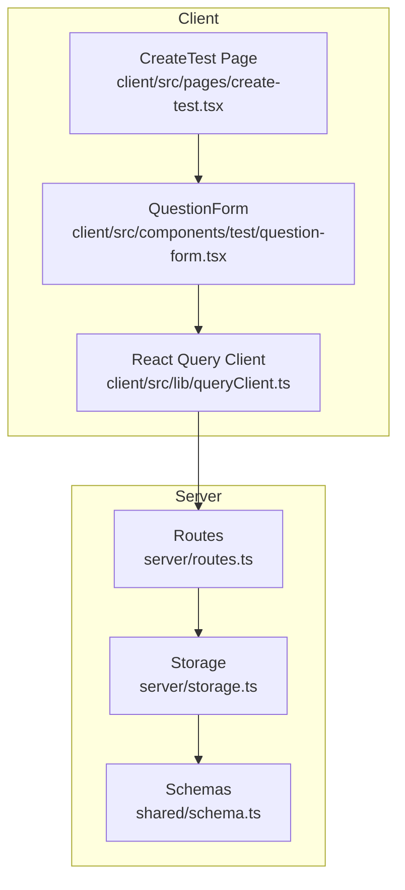
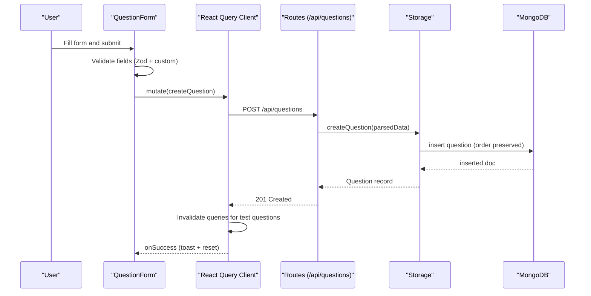
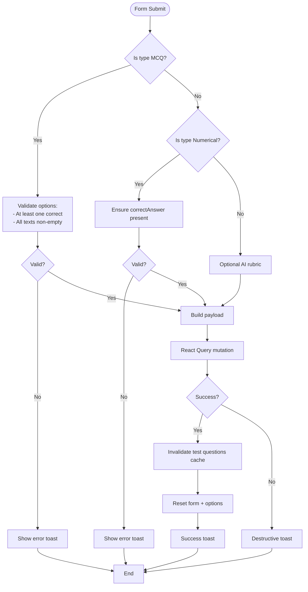
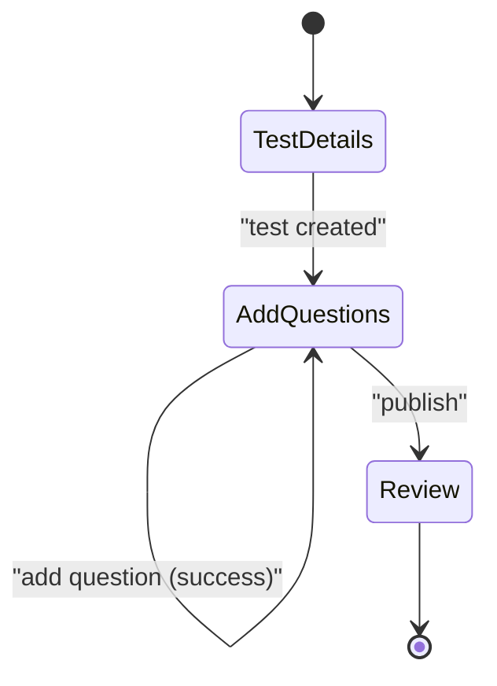
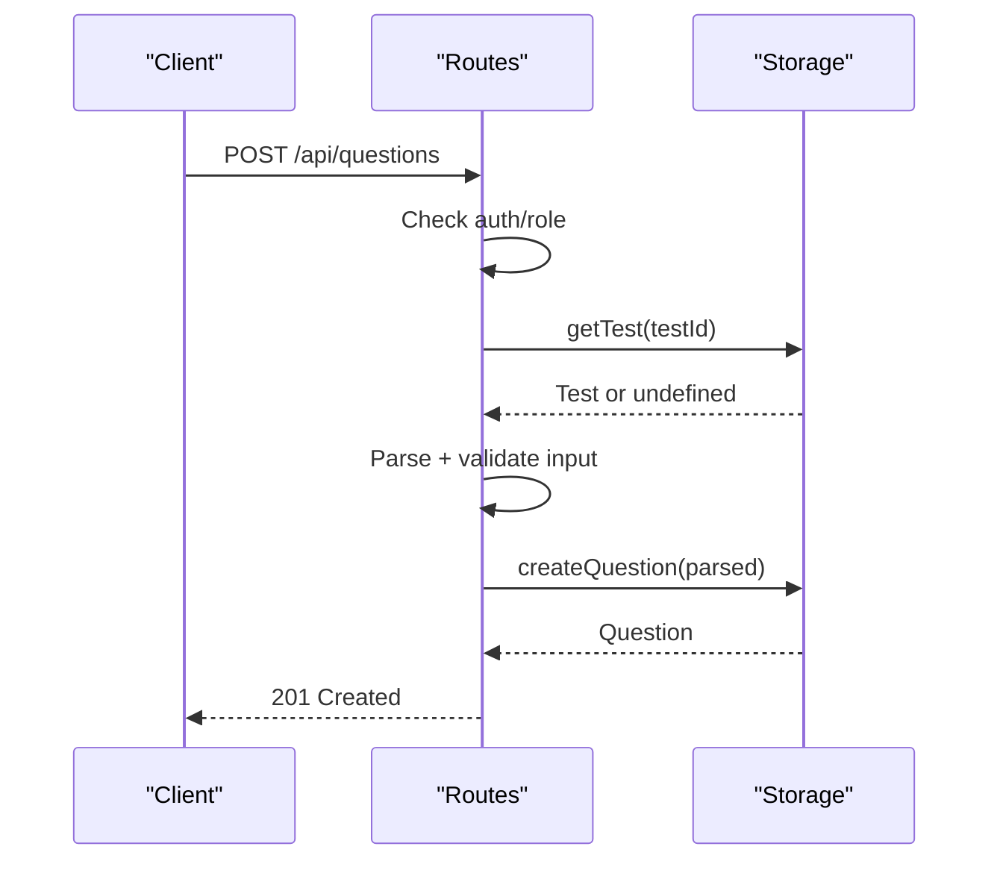
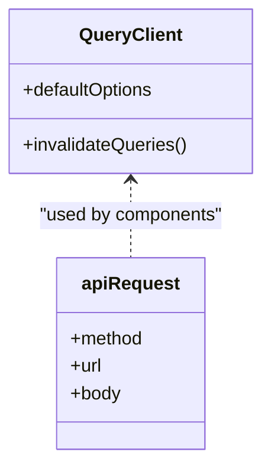
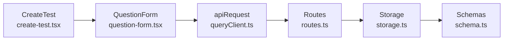

# Question Operations & Management

<cite>
**Referenced Files in This Document**
- [question-form.tsx](file://client/src/components/test/question-form.tsx)
- [create-test.tsx](file://client/src/pages/create-test.tsx)
- [queryClient.ts](file://client/src/lib/queryClient.ts)
- [routes.ts](file://server/routes.ts)
- [storage.ts](file://server/storage.ts)
- [schema.ts](file://shared/schema.ts)
</cite>

## Table of Contents
1. [Introduction](#introduction)
2. [Project Structure](#project-structure)
3. [Core Components](#core-components)
4. [Architecture Overview](#architecture-overview)
5. [Detailed Component Analysis](#detailed-component-analysis)
6. [Dependency Analysis](#dependency-analysis)
7. [Performance Considerations](#performance-considerations)
8. [Troubleshooting Guide](#troubleshooting-guide)
9. [Conclusion](#conclusion)

## Introduction
This document explains question operations and management within the PersonalLearningPro system. It covers the complete lifecycle of questions: creation, reading, updating, and deletion. It documents the QuestionForm component architecture, including form validation, state management, and submission handling. It details integration with React Query for optimistic updates and cache invalidation, mutation handling for adding questions with error management and user feedback, the question ordering system with sequential numbering and position management, and the relationship between questions and their parent test entities. Bulk operations and question preview functionality are noted as areas for future development.

## Project Structure
The question feature spans client-side React components and server-side routes and persistence:
- Client-side:
  - QuestionForm component manages question creation and validation.
  - CreateTest page orchestrates test creation and question sequencing.
  - React Query client wraps API requests and caching.
- Server-side:
  - Routes define endpoints for question creation and retrieval.
  - Storage layer persists and retrieves questions, sorting by order.
  - Shared schema validates question data.

**Diagram sources**
- [question-form.tsx](file://client/src/components/test/question-form.tsx#L1-L390)
- [create-test.tsx](file://client/src/pages/create-test.tsx#L1-L121)
- [queryClient.ts](file://client/src/lib/queryClient.ts#L1-L62)
- [routes.ts](file://server/routes.ts#L250-L316)
- [storage.ts](file://server/storage.ts#L191-L211)
- [schema.ts](file://shared/schema.ts#L28-L37)

**Section sources**
- [question-form.tsx](file://client/src/components/test/question-form.tsx#L1-L390)
- [create-test.tsx](file://client/src/pages/create-test.tsx#L1-L121)
- [queryClient.ts](file://client/src/lib/queryClient.ts#L1-L62)
- [routes.ts](file://server/routes.ts#L250-L316)
- [storage.ts](file://server/storage.ts#L191-L211)
- [schema.ts](file://shared/schema.ts#L28-L37)

## Core Components
- QuestionForm: A controlled form that validates question data, manages local state for MCQ options, and submits via React Query mutation to the backend.
- CreateTest: Orchestrates test creation and maintains the incremental order for newly added questions.
- React Query Client: Provides a typed API wrapper and global caching configuration.
- Server Routes: Expose endpoints for creating and retrieving questions, enforcing authorization and ownership checks.
- Storage Layer: Persists questions and returns them sorted by order.
- Shared Schema: Defines validation rules for question creation and updates.

**Section sources**
- [question-form.tsx](file://client/src/components/test/question-form.tsx#L47-L126)
- [create-test.tsx](file://client/src/pages/create-test.tsx#L15-L27)
- [queryClient.ts](file://client/src/lib/queryClient.ts#L10-L28)
- [routes.ts](file://server/routes.ts#L250-L316)
- [storage.ts](file://server/storage.ts#L191-L211)
- [schema.ts](file://shared/schema.ts#L28-L37)

## Architecture Overview
The question lifecycle follows a predictable flow:
- Frontend: QuestionForm collects input, validates locally, and triggers a mutation.
- Backend: Routes validate session and ownership, parse input with shared schemas, and delegate to storage.
- Persistence: Storage saves the question and returns it sorted by order.
- Caching: React Query caches question lists keyed by testId and invalidates them upon successful creation.

**Diagram sources**
- [question-form.tsx](file://client/src/components/test/question-form.tsx#L77-L126)
- [routes.ts](file://server/routes.ts#L250-L278)
- [storage.ts](file://server/storage.ts#L192-L197)
- [queryClient.ts](file://client/src/lib/queryClient.ts#L48-L61)

## Detailed Component Analysis

### QuestionForm Component
- Purpose: Encapsulates question creation with dynamic MCQ options, type-specific fields, and robust validation.
- Validation:
  - Zod schema enforces required fields and types.
  - Custom validation ensures MCQ has at least one correct option and all options have text; numerical requires a correct answer.
- State Management:
  - Tracks question type, marks, text, order, and optional AI rubric.
  - Maintains an array of options for MCQ with local state for correctness and text.
- Submission Handling:
  - Mutation posts to /api/questions.
  - On success: resets form defaults (including incremented order), clears options, shows a success toast, and invalidates the test’s question cache.
  - On error: displays a destructive toast with the error message.

**Diagram sources**
- [question-form.tsx](file://client/src/components/test/question-form.tsx#L162-L204)
- [question-form.tsx](file://client/src/components/test/question-form.tsx#L77-L126)

**Section sources**
- [question-form.tsx](file://client/src/components/test/question-form.tsx#L31-L47)
- [question-form.tsx](file://client/src/components/test/question-form.tsx#L55-L126)
- [question-form.tsx](file://client/src/components/test/question-form.tsx#L162-L204)

### CreateTest Page and Question Ordering
- Responsibilities:
  - Manages active tab state and test creation flow.
  - Maintains a monotonically increasing order for questions.
- Behavior:
  - After a test is created, switches to the “Add Questions” tab.
  - After each successful question addition, increments the order for the next question.

**Diagram sources**
- [create-test.tsx](file://client/src/pages/create-test.tsx#L15-L27)

**Section sources**
- [create-test.tsx](file://client/src/pages/create-test.tsx#L15-L27)

### Server-Side Question Creation and Retrieval
- Endpoints:
  - POST /api/questions: Creates a question after validating session, role, and ownership of the parent test.
  - GET /api/tests/:testId/questions: Retrieves questions for a test, sorted by order.
- Authorization and Ownership:
  - Requires teacher role and verifies the test belongs to the requesting teacher.
- Validation:
  - Uses shared schema to parse and validate incoming question data.

**Diagram sources**
- [routes.ts](file://server/routes.ts#L250-L278)
- [storage.ts](file://server/storage.ts#L192-L197)

**Section sources**
- [routes.ts](file://server/routes.ts#L250-L316)
- [storage.ts](file://server/storage.ts#L191-L211)
- [schema.ts](file://shared/schema.ts#L28-L37)

### React Query Integration and Cache Invalidation
- API Wrapper:
  - apiRequest centralizes HTTP behavior, including credentials and JSON serialization.
- Global Defaults:
  - Queries configured to avoid window focus refetch and to treat data as stale indefinitely unless invalidated.
  - Mutations disable retries by default.
- Invalidation:
  - After successful question creation, the client invalidates the query key for the test’s questions, ensuring subsequent reads reflect the new data.

**Diagram sources**
- [queryClient.ts](file://client/src/lib/queryClient.ts#L10-L28)
- [queryClient.ts](file://client/src/lib/queryClient.ts#L48-L61)

**Section sources**
- [queryClient.ts](file://client/src/lib/queryClient.ts#L1-L62)

### CRUD Operations Summary
- Create
  - Client: QuestionForm mutation to POST /api/questions.
  - Server: Route validates and delegates to storage; storage persists and returns the new question.
  - Cache: Invalidates the test questions cache.
- Read
  - Client: Query for GET /api/tests/:testId/questions; data is sorted by order.
  - Server: Storage returns questions ordered by order ascending.
- Update
  - Client: No dedicated update UI shown in the referenced files; update capability would require a separate form and mutation.
  - Server: Storage exposes updateQuestion; routes would need an endpoint similar to POST /api/questions.
- Delete
  - Client: No dedicated delete UI shown in the referenced files; delete capability would require a mutation and endpoint.
  - Server: Storage exposes updateQuestion; routes would need a DELETE endpoint.

Note: The referenced files demonstrate create and read flows. Update and delete are not implemented in the provided sources.

**Section sources**
- [routes.ts](file://server/routes.ts#L250-L316)
- [storage.ts](file://server/storage.ts#L191-L211)
- [question-form.tsx](file://client/src/components/test/question-form.tsx#L77-L126)

### Question Ordering System and Position Management
- Sequential Numbering:
  - The form passes an order prop to QuestionForm; CreateTest increments this value after each successful submission.
- Persistence and Sorting:
  - Storage returns questions sorted by order ascending, ensuring consistent presentation.
- Implications:
  - Order is managed client-side during creation and enforced server-side during retrieval.

**Section sources**
- [create-test.tsx](file://client/src/pages/create-test.tsx#L17-L27)
- [question-form.tsx](file://client/src/components/test/question-form.tsx#L50-L75)
- [storage.ts](file://server/storage.ts#L204-L207)

### Relationship Between Questions and Parent Tests
- Foreign Key:
  - Questions include testId, linking each question to its parent test.
- Access Control:
  - Routes verify that the requesting teacher owns the test before allowing question creation.
- Retrieval:
  - GET /api/tests/:testId/questions returns all questions for a given test, sorted by order.

**Section sources**
- [schema.ts](file://shared/schema.ts#L28-L37)
- [routes.ts](file://server/routes.ts#L258-L267)
- [storage.ts](file://server/storage.ts#L204-L207)

### Bulk Operations and Preview Functionality
- Bulk Operations:
  - Not implemented in the referenced files; future enhancements could include batch creation endpoints and UI controls.
- Preview:
  - Not implemented in the referenced files; future enhancements could include a preview tab or modal to review questions before publishing.

[No sources needed since this section does not analyze specific files]

## Dependency Analysis
The following diagram highlights key dependencies among components involved in question operations.

**Diagram sources**
- [question-form.tsx](file://client/src/components/test/question-form.tsx#L7-L7)
- [queryClient.ts](file://client/src/lib/queryClient.ts#L10-L28)
- [routes.ts](file://server/routes.ts#L250-L278)
- [storage.ts](file://server/storage.ts#L191-L197)
- [schema.ts](file://shared/schema.ts#L28-L37)

**Section sources**
- [question-form.tsx](file://client/src/components/test/question-form.tsx#L1-L30)
- [queryClient.ts](file://client/src/lib/queryClient.ts#L1-L62)
- [routes.ts](file://server/routes.ts#L250-L316)
- [storage.ts](file://server/storage.ts#L191-L211)
- [schema.ts](file://shared/schema.ts#L28-L37)

## Performance Considerations
- Caching Strategy:
  - Queries are configured with infinite staleTime and no automatic refetch, reducing unnecessary network calls.
  - Cache invalidation occurs explicitly after question creation to keep views synchronized.
- Network Efficiency:
  - apiRequest serializes only when needed and includes credentials for session-based auth.
- Sorting:
  - Server sorts questions by order, minimizing client-side work.

[No sources needed since this section provides general guidance]

## Troubleshooting Guide
- Unauthorized or Forbidden:
  - Ensure the user is authenticated as a teacher and owns the test before creating questions.
- Validation Errors:
  - Zod parsing errors return structured messages; fix missing or invalid fields (e.g., question text, marks, options).
- Local Validation Failures:
  - MCQ must have at least one correct option and all options must have text.
  - Numerical questions must include a correct answer.
- Cache Staleness:
  - If the UI does not reflect new questions, confirm that cache invalidation runs after mutation success.

**Section sources**
- [routes.ts](file://server/routes.ts#L252-L267)
- [question-form.tsx](file://client/src/components/test/question-form.tsx#L170-L201)
- [queryClient.ts](file://client/src/lib/queryClient.ts#L48-L61)

## Conclusion
The PersonalLearningPro system implements a robust question creation workflow with strong validation, clear ownership enforcement, and efficient caching. The QuestionForm component encapsulates validation and submission, while React Query ensures cache consistency. Questions are linked to tests via testId and retrieved in order. Update and delete operations are not present in the referenced files and would require additional UI and server endpoints. Bulk operations and preview functionality are identified as future enhancements.