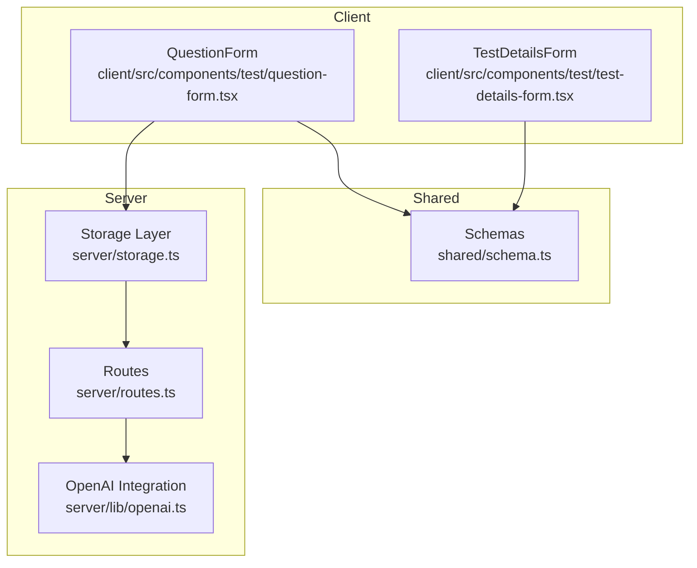
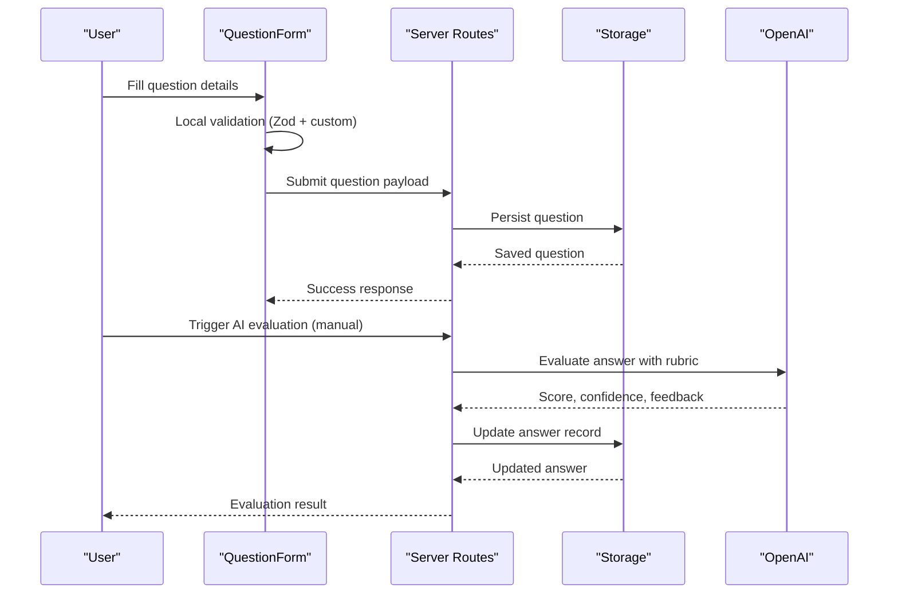
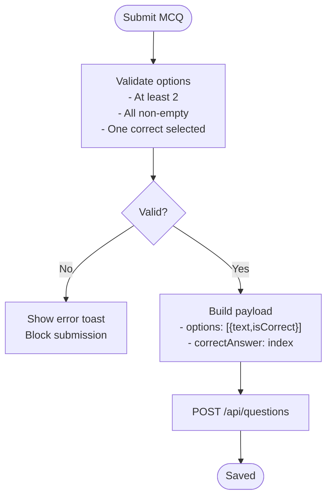
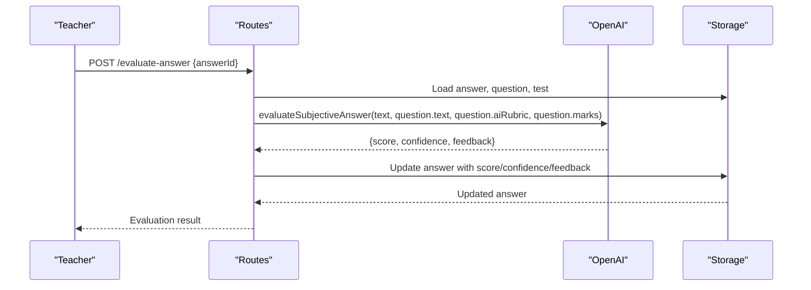
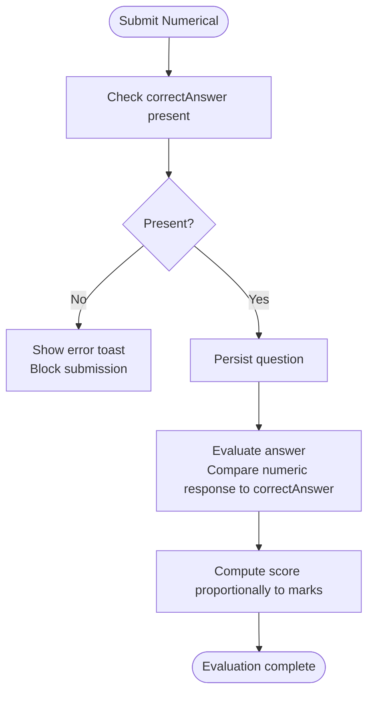
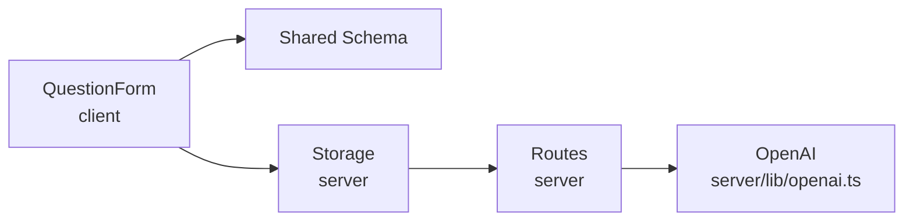

# Question Types & Formats

<cite>
**Referenced Files in This Document**
- [question-form.tsx](file://client/src/components/test/question-form.tsx)
- [schema.ts](file://shared/schema.ts)
- [storage.ts](file://server/storage.ts)
- [routes.ts](file://server/routes.ts)
- [openai.ts](file://server/lib/openai.ts)
- [test-details-form.tsx](file://client/src/components/test/test-details-form.tsx)
</cite>

## Table of Contents
1. [Introduction](#introduction)
2. [Project Structure](#project-structure)
3. [Core Components](#core-components)
4. [Architecture Overview](#architecture-overview)
5. [Detailed Component Analysis](#detailed-component-analysis)
6. [Dependency Analysis](#dependency-analysis)
7. [Performance Considerations](#performance-considerations)
8. [Troubleshooting Guide](#troubleshooting-guide)
9. [Conclusion](#conclusion)

## Introduction
This document explains the question types and formats supported by the PersonalLearningPro question management system. It covers:
- Multiple Choice Questions (MCQ)
- Short Answer
- Long Answer
- Numerical questions

For each type, it documents the data models, validation rules, UI components, and scoring mechanisms. Special attention is given to:
- MCQ option management, correct answer selection, and minimum option requirements
- Short and long answer questions with AI rubric creation for automated evaluation
- Numerical questions with correct answer handling
- Field validation requirements, UI differences, and scoring mechanisms

## Project Structure
The question management system spans client-side forms and validation, shared schemas, server-side persistence, and AI-powered evaluation.

**Diagram sources**
- [question-form.tsx](file://client/src/components/test/question-form.tsx#L1-L390)
- [test-details-form.tsx](file://client/src/components/test/test-details-form.tsx#L1-L325)
- [schema.ts](file://shared/schema.ts#L28-L37)
- [storage.ts](file://server/storage.ts#L191-L211)
- [routes.ts](file://server/routes.ts#L490-L559)
- [openai.ts](file://server/lib/openai.ts#L50-L105)

**Section sources**
- [question-form.tsx](file://client/src/components/test/question-form.tsx#L1-L390)
- [schema.ts](file://shared/schema.ts#L28-L37)
- [storage.ts](file://server/storage.ts#L191-L211)
- [routes.ts](file://server/routes.ts#L490-L559)
- [openai.ts](file://server/lib/openai.ts#L50-L105)
- [test-details-form.tsx](file://client/src/components/test/test-details-form.tsx#L1-L325)

## Core Components
- QuestionForm: Client-side form for creating questions with dynamic UI per type, local validation, and submission to the backend.
- Shared schemas: Define the canonical data model for questions and related entities.
- Storage layer: Persists questions and exposes CRUD operations.
- Routes: Provide endpoints for question management and AI evaluation.
- OpenAI integration: Powers AI scoring for subjective answers using rubrics.

Key validations and behaviors:
- MCQ: Requires at least two options, enforces non-empty option text, and selects a single correct option.
- Numerical: Requires a correct answer value.
- Short/Long: Supports an AI rubric for automated evaluation.
- Marks: Must be at least 1 for all question types.

**Section sources**
- [question-form.tsx](file://client/src/components/test/question-form.tsx#L31-L45)
- [question-form.tsx](file://client/src/components/test/question-form.tsx#L162-L204)
- [schema.ts](file://shared/schema.ts#L28-L37)
- [storage.ts](file://server/storage.ts#L191-L211)

## Architecture Overview
The system follows a layered architecture:
- Client renders forms and validates locally using Zod.
- Shared schemas define the contract for data exchange.
- Server persists questions and exposes endpoints.
- AI evaluation is invoked during manual teacher review to enrich scoring.

**Diagram sources**
- [question-form.tsx](file://client/src/components/test/question-form.tsx#L77-L126)
- [routes.ts](file://server/routes.ts#L490-L559)
- [openai.ts](file://server/lib/openai.ts#L50-L105)
- [storage.ts](file://server/storage.ts#L191-L211)

## Detailed Component Analysis

### Multiple Choice Questions (MCQ)
- Data model
  - Fields: testId, type ("mcq"), text, options (array of objects with text and isCorrect), correctAnswer (index stored as string), marks, order, aiRubric (nullable).
  - Backend schema enforces type enum and optional fields.
- UI and validation
  - Dynamic options list with radio buttons to select the correct option.
  - Minimum two options enforced; removing below two is blocked with a toast.
  - All options must have non-empty text.
  - On submit, correctAnswer is derived from the selected option index and sent to the backend.
- Scoring mechanism
  - During evaluation, the selectedOption from the answer record is compared against the stored correctAnswer index to compute score proportionally to marks.

**Diagram sources**
- [question-form.tsx](file://client/src/components/test/question-form.tsx#L162-L204)
- [question-form.tsx](file://client/src/components/test/question-form.tsx#L145-L161)
- [schema.ts](file://shared/schema.ts#L28-L37)

**Section sources**
- [question-form.tsx](file://client/src/components/test/question-form.tsx#L55-L111)
- [question-form.tsx](file://client/src/components/test/question-form.tsx#L162-L204)
- [schema.ts](file://shared/schema.ts#L28-L37)
- [storage.ts](file://server/storage.ts#L191-L211)

### Short Answer
- Data model
  - Fields: testId, type ("short"), text, correctAnswer (nullable), marks, order, aiRubric (guidelines for AI).
  - Backend schema supports optional correctAnswer and aiRubric.
- UI and validation
  - Presents a text area for entering an AI rubric used to evaluate student answers.
  - No strict validation on rubric content; teacher-defined rubric drives AI evaluation.
- Scoring mechanism
  - AI evaluates the student’s written answer against the rubric and returns score, confidence, and feedback.
  - The teacher can trigger evaluation via a dedicated endpoint.

**Diagram sources**
- [routes.ts](file://server/routes.ts#L490-L559)
- [openai.ts](file://server/lib/openai.ts#L50-L105)
- [storage.ts](file://server/storage.ts#L241-L262)

**Section sources**
- [question-form.tsx](file://client/src/components/test/question-form.tsx#L354-L372)
- [schema.ts](file://shared/schema.ts#L28-L37)
- [routes.ts](file://server/routes.ts#L490-L559)
- [openai.ts](file://server/lib/openai.ts#L50-L105)

### Long Answer
- Data model and UI
  - Identical to Short Answer except the rubric is intended for extended written responses.
- Scoring mechanism
  - Same AI evaluation pipeline applies, producing score, confidence, and feedback for manual teacher review.

**Section sources**
- [question-form.tsx](file://client/src/components/test/question-form.tsx#L354-L372)
- [routes.ts](file://server/routes.ts#L490-L559)
- [openai.ts](file://server/lib/openai.ts#L50-L105)

### Numerical Questions
- Data model
  - Fields: testId, type ("numerical"), text, correctAnswer (string representation of the answer), marks, order, aiRubric (nullable).
  - Backend schema supports optional correctAnswer and aiRubric.
- UI and validation
  - Presents an input for the correct numerical answer.
  - Submission requires a non-empty correctAnswer.
- Scoring mechanism
  - During evaluation, the student’s numeric response is compared against the correctAnswer.
  - The system computes a proportional score based on marks.

**Diagram sources**
- [question-form.tsx](file://client/src/components/test/question-form.tsx#L191-L201)
- [schema.ts](file://shared/schema.ts#L28-L37)

**Section sources**
- [question-form.tsx](file://client/src/components/test/question-form.tsx#L335-L352)
- [question-form.tsx](file://client/src/components/test/question-form.tsx#L191-L201)
- [schema.ts](file://shared/schema.ts#L28-L37)

## Dependency Analysis
- Client-side QuestionForm depends on:
  - Zod schemas for validation
  - React Hook Form for form state
  - UI primitives for inputs and selects
- Shared schema defines the canonical shape for questions and answers
- Server routes depend on:
  - Storage layer for persistence
  - OpenAI integration for evaluation
- OpenAI integration encapsulates evaluation logic and response parsing

**Diagram sources**
- [question-form.tsx](file://client/src/components/test/question-form.tsx#L1-L30)
- [schema.ts](file://shared/schema.ts#L28-L37)
- [storage.ts](file://server/storage.ts#L191-L211)
- [routes.ts](file://server/routes.ts#L490-L559)
- [openai.ts](file://server/lib/openai.ts#L50-L105)

**Section sources**
- [question-form.tsx](file://client/src/components/test/question-form.tsx#L1-L30)
- [schema.ts](file://shared/schema.ts#L28-L37)
- [storage.ts](file://server/storage.ts#L191-L211)
- [routes.ts](file://server/routes.ts#L490-L559)
- [openai.ts](file://server/lib/openai.ts#L50-L105)

## Performance Considerations
- Client-side validation reduces unnecessary network requests and improves UX.
- AI evaluation responses are parsed and clamped to expected ranges to avoid invalid scores.
- Storing correctAnswer as a string index for MCQ simplifies comparison and avoids floating-point mismatches.

## Troubleshooting Guide
Common issues and resolutions:
- MCQ validation failures
  - Ensure at least two options and that all options have text.
  - Mark exactly one option as correct.
- Numerical question missing correct answer
  - Provide a correct answer value before submitting.
- Short/Long answer evaluation
  - Ensure a rubric is provided; otherwise, AI evaluation defaults to a generic instruction.
- AI evaluation errors
  - If OpenAI API is unavailable, the system returns fallback values; retry after ensuring API key configuration.

**Section sources**
- [question-form.tsx](file://client/src/components/test/question-form.tsx#L151-L158)
- [question-form.tsx](file://client/src/components/test/question-form.tsx#L170-L188)
- [question-form.tsx](file://client/src/components/test/question-form.tsx#L192-L200)
- [openai.ts](file://server/lib/openai.ts#L96-L105)

## Conclusion
The PersonalLearningPro question management system provides a robust foundation for creating and evaluating diverse question types. MCQs emphasize structured option management and clear correct answer selection. Short and long answers leverage AI rubrics for scalable evaluation. Numerical questions support precise correct answers with proportional scoring. Together, these components enable efficient test authoring and automated evaluation workflows.