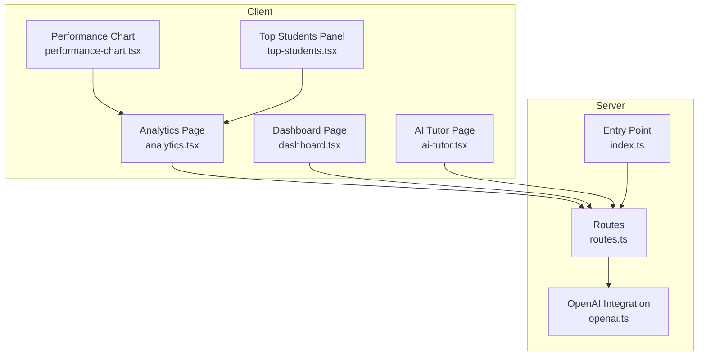
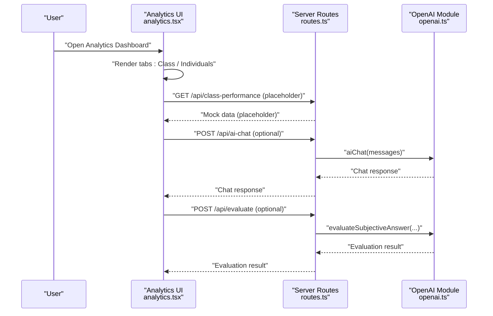
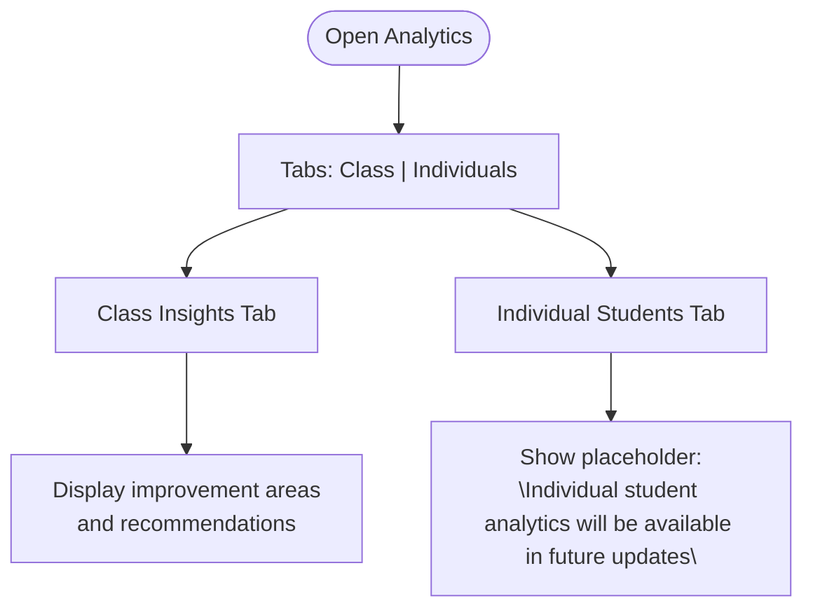
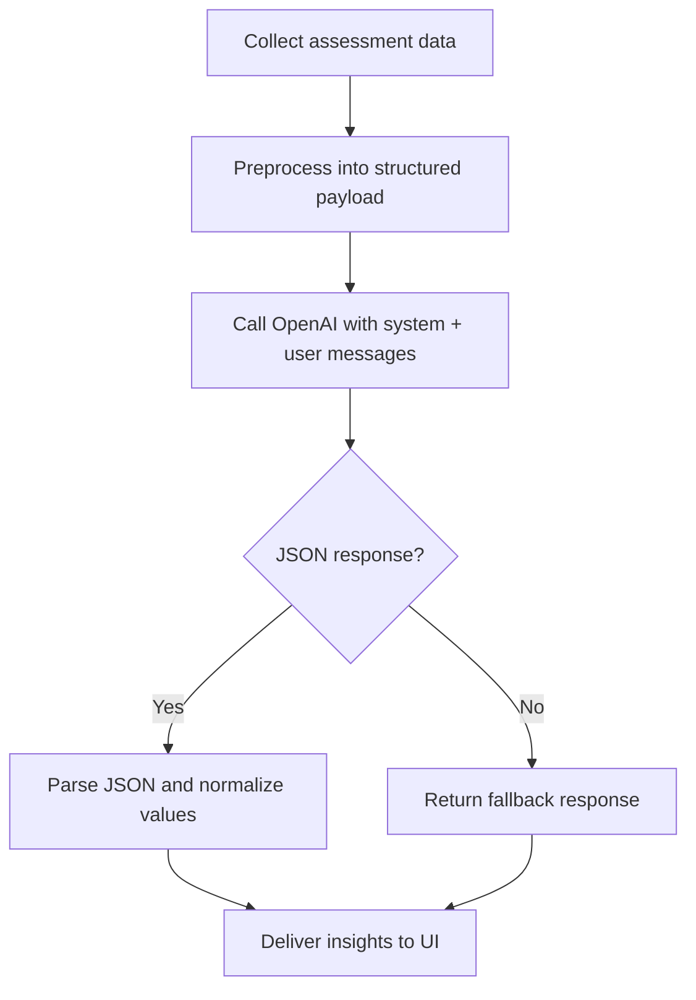
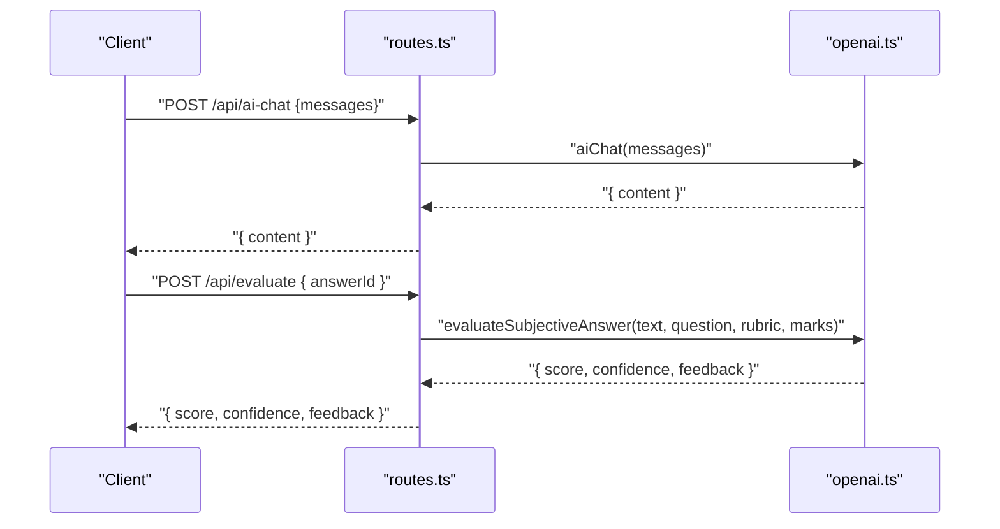
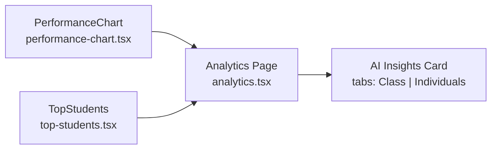
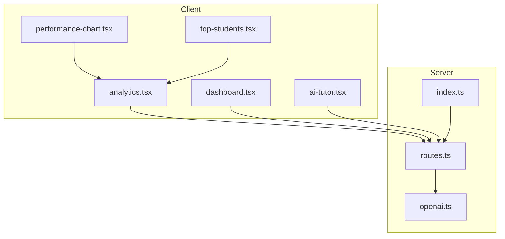

# AI Learning Insights

<cite>
**Referenced Files in This Document**
- [analytics.tsx](file://client/src/pages/analytics.tsx)
- [dashboard.tsx](file://client/src/pages/dashboard.tsx)
- [performance-chart.tsx](file://client/src/components/dashboard/performance-chart.tsx)
- [top-students.tsx](file://client/src/components/dashboard/top-students.tsx)
- [openai.ts](file://server/lib/openai.ts)
- [routes.ts](file://server/routes.ts)
- [index.ts](file://server/index.ts)
- [ai-tutor.tsx](file://client/src/pages/ai-tutor.tsx)
- [README.md](file://README.md)
</cite>

## Table of Contents
1. [Introduction](#introduction)
2. [Project Structure](#project-structure)
3. [Core Components](#core-components)
4. [Architecture Overview](#architecture-overview)
5. [Detailed Component Analysis](#detailed-component-analysis)
6. [Dependency Analysis](#dependency-analysis)
7. [Performance Considerations](#performance-considerations)
8. [Troubleshooting Guide](#troubleshooting-guide)
9. [Privacy and Ethics](#privacy-and-ethics)
10. [Roadmap and Future Enhancements](#roadmap-and-future-enhancements)
11. [Conclusion](#conclusion)

## Introduction
This document describes the AI-generated learning insights system, focusing on how the platform integrates OpenAI to produce performance analysis and teaching recommendations. It explains the prompt engineering strategies used to extract meaningful insights from assessment data, the content generation pipeline (data preprocessing, model selection, and response formatting), and the tabbed interface implementation for comparing class versus individual insights. It also documents current limitations around individual student analytics and outlines a roadmap for future enhancements. Finally, it covers privacy considerations and ethical guidelines for AI-generated recommendations.

## Project Structure
The AI learning insights system spans the client and server layers:
- Client-side dashboards render analytics and insights, including a tabbed interface for class and individual comparisons.
- Server-side routes expose endpoints for AI-powered features and integrate with OpenAI for content generation and evaluation.
- The analytics dashboard composes multiple visualizations and an AI insights card with tabs.

**Diagram sources**
- [analytics.tsx](file://client/src/pages/analytics.tsx#L1-L177)
- [dashboard.tsx](file://client/src/pages/dashboard.tsx#L197-L260)
- [performance-chart.tsx](file://client/src/components/dashboard/performance-chart.tsx#L1-L98)
- [top-students.tsx](file://client/src/components/dashboard/top-students.tsx#L1-L74)
- [ai-tutor.tsx](file://client/src/pages/ai-tutor.tsx#L1-L604)
- [routes.ts](file://server/routes.ts#L1-L800)
- [openai.ts](file://server/lib/openai.ts#L1-L217)
- [index.ts](file://server/index.ts#L1-L114)

**Section sources**
- [README.md](file://README.md#L1-L148)
- [analytics.tsx](file://client/src/pages/analytics.tsx#L1-L177)
- [dashboard.tsx](file://client/src/pages/dashboard.tsx#L197-L260)
- [routes.ts](file://server/routes.ts#L1-L800)
- [openai.ts](file://server/lib/openai.ts#L1-L217)
- [index.ts](file://server/index.ts#L1-L114)

## Core Components
- AI insights card with tabs for “Class Insights” and “Individual Students” in the analytics dashboard.
- OpenAI integration module providing:
  - AI chat for tutoring
  - Subjective answer evaluation with rubric-aligned scoring and confidence
  - Study plan generation
  - Test performance analysis returning average score, hardest questions, and recommendations
- Backend routes exposing:
  - AI chat endpoint
  - AI evaluation endpoint for teacher-reviewed subjective answers
  - Placeholder endpoints for class performance and top students (currently mocked)

**Section sources**
- [analytics.tsx](file://client/src/pages/analytics.tsx#L135-L174)
- [openai.ts](file://server/lib/openai.ts#L20-L216)
- [routes.ts](file://server/routes.ts#L487-L580)

## Architecture Overview
The AI insights pipeline connects client dashboards to server endpoints, which delegate to OpenAI for content generation and return structured results to the UI.

**Diagram sources**
- [analytics.tsx](file://client/src/pages/analytics.tsx#L1-L177)
- [routes.ts](file://server/routes.ts#L487-L580)
- [openai.ts](file://server/lib/openai.ts#L20-L105)

## Detailed Component Analysis

### Tabbed Interface: Class vs Individual Insights
- The analytics page includes a tabbed card for AI-generated insights:
  - Class Insights tab displays improvement areas and teaching recommendations.
  - Individual Students tab currently shows a placeholder indicating future availability.
- The dashboard page includes a separate “AI Teaching Insights” card with mock suggestions for quick action.

**Diagram sources**
- [analytics.tsx](file://client/src/pages/analytics.tsx#L141-L171)
- [dashboard.tsx](file://client/src/pages/dashboard.tsx#L221-L247)

**Section sources**
- [analytics.tsx](file://client/src/pages/analytics.tsx#L135-L174)
- [dashboard.tsx](file://client/src/pages/dashboard.tsx#L105-L126)

### Prompt Engineering Strategies for Assessment Insights
The OpenAI integration defines explicit prompts to guide the model toward structured, actionable outputs:
- Test performance analysis prompt instructs the model to return:
  - averageScore
  - hardestQuestions (top 3)
  - recommendations
- Subjective answer evaluation prompt requires:
  - score within max marks
  - confidence percentage
  - constructive feedback
- Study plan generation prompt requests:
  - structured study plan with bullet points and time estimates
  - resource list with title, type, and optional URL
- AI chat prompt establishes a system persona for high school-level explanations.

These prompts leverage response_format with JSON to improve parsing reliability and reduce ambiguity.

**Section sources**
- [openai.ts](file://server/lib/openai.ts#L50-L105)
- [openai.ts](file://server/lib/openai.ts#L107-L163)
- [openai.ts](file://server/lib/openai.ts#L165-L216)
- [openai.ts](file://server/lib/openai.ts#L20-L42)

### Content Generation Pipeline
- Data preprocessing:
  - Test performance data is aggregated and passed as a structured payload to the analysis function.
  - Subjective answers are paired with question text and rubric for evaluation.
- Model selection:
  - The integration targets a modern model optimized for reasoning and JSON output.
- Response formatting:
  - JSON response_format ensures consistent schema parsing.
  - Fallback logic normalizes values and returns graceful defaults on errors.

**Diagram sources**
- [openai.ts](file://server/lib/openai.ts#L165-L216)
- [openai.ts](file://server/lib/openai.ts#L50-L105)
- [openai.ts](file://server/lib/openai.ts#L107-L163)

**Section sources**
- [openai.ts](file://server/lib/openai.ts#L165-L216)
- [openai.ts](file://server/lib/openai.ts#L50-L105)
- [openai.ts](file://server/lib/openai.ts#L107-L163)

### API Endpoints and Integration
- AI Chat endpoint:
  - Accepts an array of messages and returns a textual response.
- AI Evaluation endpoint:
  - Evaluates subjective answers using question text, rubric, and max marks, returning score, confidence, and feedback.
- Test Performance Analysis:
  - Computes average score, identifies hardest questions, and generates recommendations.

**Diagram sources**
- [routes.ts](file://server/routes.ts#L561-L580)
- [routes.ts](file://server/routes.ts#L487-L559)
- [openai.ts](file://server/lib/openai.ts#L20-L105)

**Section sources**
- [routes.ts](file://server/routes.ts#L561-L580)
- [routes.ts](file://server/routes.ts#L487-L559)
- [openai.ts](file://server/lib/openai.ts#L20-L105)

### UI Components for Analytics and Insights
- Performance chart:
  - Renders class vs school averages with tooltips and legends.
  - Currently uses mock data; a query hook is present for future backend integration.
- Top students panel:
  - Displays top performers with avatars and scores.
  - Also uses mock data with a query hook ready for backend integration.
- Analytics dashboard:
  - Composes performance visuals, completion rates, subject distribution, and the AI insights card with tabs.

**Diagram sources**
- [performance-chart.tsx](file://client/src/components/dashboard/performance-chart.tsx#L1-L98)
- [top-students.tsx](file://client/src/components/dashboard/top-students.tsx#L1-L74)
- [analytics.tsx](file://client/src/pages/analytics.tsx#L1-L177)

**Section sources**
- [performance-chart.tsx](file://client/src/components/dashboard/performance-chart.tsx#L1-L98)
- [top-students.tsx](file://client/src/components/dashboard/top-students.tsx#L1-L74)
- [analytics.tsx](file://client/src/pages/analytics.tsx#L1-L177)

## Dependency Analysis
- Client depends on:
  - UI components for charts and lists
  - Local storage for AI chat history persistence
  - API client utilities for server communication
- Server depends on:
  - OpenAI SDK for content generation
  - Route handlers for AI endpoints
  - Session middleware for authentication context

**Diagram sources**
- [analytics.tsx](file://client/src/pages/analytics.tsx#L1-L177)
- [dashboard.tsx](file://client/src/pages/dashboard.tsx#L197-L260)
- [performance-chart.tsx](file://client/src/components/dashboard/performance-chart.tsx#L1-L98)
- [top-students.tsx](file://client/src/components/dashboard/top-students.tsx#L1-L74)
- [ai-tutor.tsx](file://client/src/pages/ai-tutor.tsx#L1-L604)
- [routes.ts](file://server/routes.ts#L1-L800)
- [openai.ts](file://server/lib/openai.ts#L1-L217)
- [index.ts](file://server/index.ts#L1-L114)

**Section sources**
- [routes.ts](file://server/routes.ts#L1-L800)
- [openai.ts](file://server/lib/openai.ts#L1-L217)
- [index.ts](file://server/index.ts#L1-L114)

## Performance Considerations
- Token efficiency: Keep prompts concise while preserving schema requirements for JSON responses.
- Caching: Cache repeated evaluations and chat histories where appropriate to reduce latency.
- Streaming: Consider streaming responses for long-form explanations to improve perceived performance.
- Error resilience: Robust fallbacks prevent UI stalls when AI services are unavailable.

[No sources needed since this section provides general guidance]

## Troubleshooting Guide
Common issues and remedies:
- Missing OpenAI API key:
  - Symptom: Warnings and disabled AI features.
  - Resolution: Set OPENAI_API_KEY in environment variables.
- JSON parsing failures:
  - Symptom: Fallback responses with empty recommendations or empty hardest questions.
  - Resolution: Validate prompt formatting and ensure response_format is respected.
- Endpoint errors:
  - Symptom: 500 responses from AI endpoints.
  - Resolution: Inspect server logs and verify OpenAI service availability.

**Section sources**
- [openai.ts](file://server/lib/openai.ts#L165-L216)
- [openai.ts](file://server/lib/openai.ts#L50-L105)
- [openai.ts](file://server/lib/openai.ts#L20-L42)
- [README.md](file://README.md#L53-L68)

## Privacy and Ethics
- Data minimization:
  - Only send assessment and answer data necessary for the specific insight request.
- Consent and transparency:
  - Inform users when AI is being used to generate insights and evaluations.
- Bias mitigation:
  - Use balanced prompts and monitor outputs for fairness across diverse learners.
- Human oversight:
  - Treat AI recommendations as suggestions requiring teacher review and approval.
- Secure handling:
  - Avoid logging sensitive student identifiers; sanitize payloads before transmission.

[No sources needed since this section provides general guidance]

## Roadmap and Future Enhancements
- Individual student analytics:
  - Replace placeholder with dynamic insights for individual learners, including personalized study plans and targeted resource recommendations.
- Enhanced data sources:
  - Integrate longitudinal performance trends, assignment quality, and engagement metrics.
- Structured evaluation workflows:
  - Provide rubric templates and batch evaluation capabilities for teachers.
- Interpretability:
  - Offer explanations for why certain recommendations were generated.
- Accessibility:
  - Ensure visualizations and insights are accessible to learners with disabilities.

[No sources needed since this section provides general guidance]

## Conclusion
The AI learning insights system leverages OpenAI to deliver actionable performance analysis and teaching recommendations. The tabbed interface enables educators to compare class-wide trends with individual student needs, while robust prompt engineering and structured JSON responses improve reliability. Current limitations center on individual analytics and backend integrations, with a clear roadmap for expansion. Privacy and ethics remain central to design decisions, ensuring responsible use of AI in educational contexts.

[No sources needed since this section summarizes without analyzing specific files]