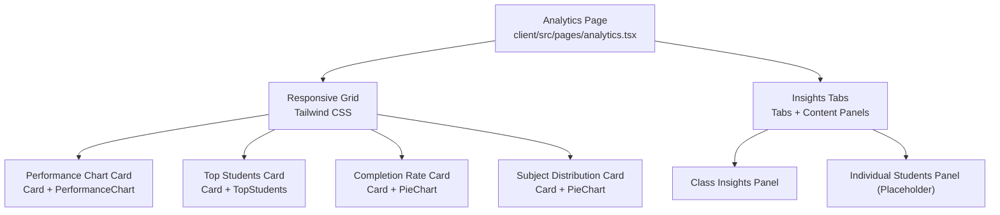
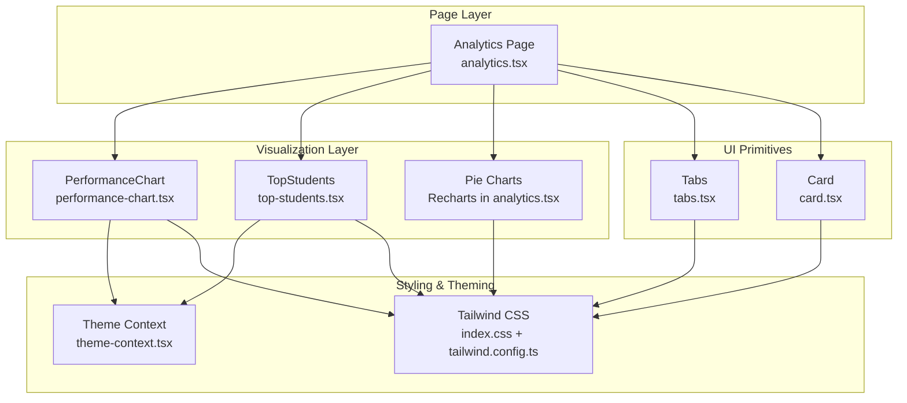
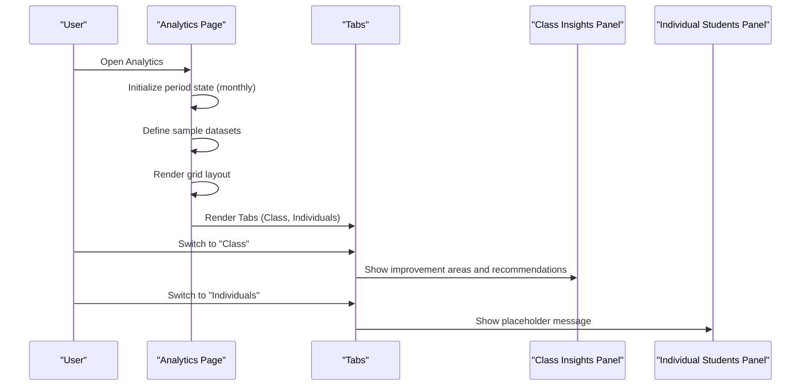
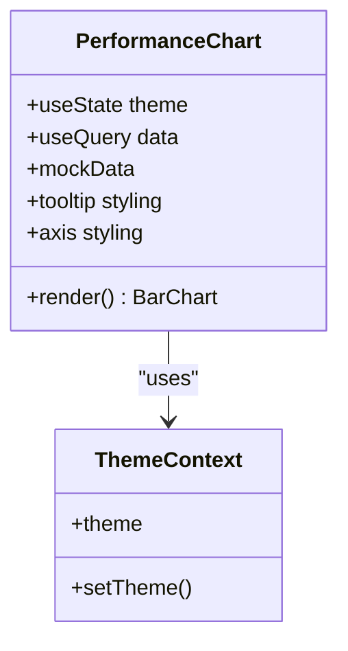
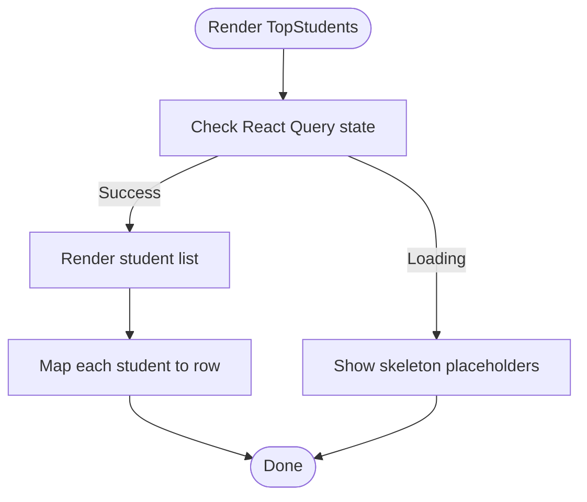
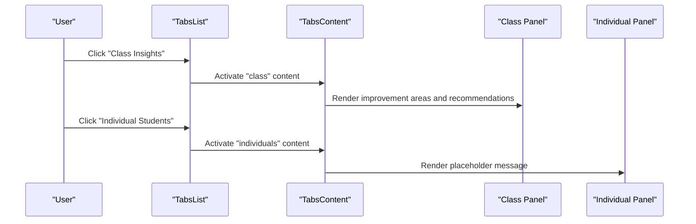
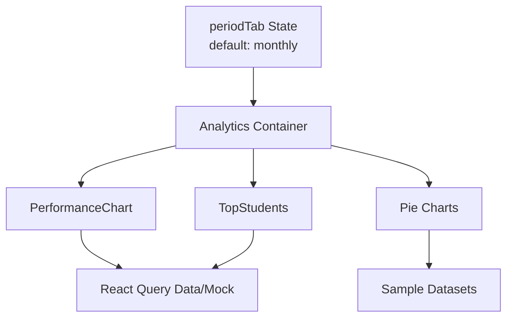
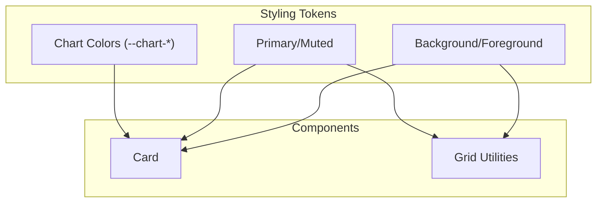
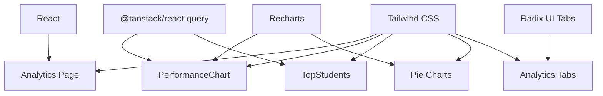

# Performance Analytics Dashboard

<cite>
**Referenced Files in This Document**
- [analytics.tsx](file://client/src/pages/analytics.tsx)
- [performance-chart.tsx](file://client/src/components/dashboard/performance-chart.tsx)
- [top-students.tsx](file://client/src/components/dashboard/top-students.tsx)
- [tabs.tsx](file://client/src/components/ui/tabs.tsx)
- [card.tsx](file://client/src/components/ui/card.tsx)
- [theme-context.tsx](file://client/src/contexts/theme-context.tsx)
- [utils.ts](file://client/src/lib/utils.ts)
- [index.css](file://client/src/index.css)
- [tailwind.config.ts](file://tailwind.config.ts)
- [App.tsx](file://client/src/App.tsx)
</cite>

## Table of Contents
1. [Introduction](#introduction)
2. [Project Structure](#project-structure)
3. [Core Components](#core-components)
4. [Architecture Overview](#architecture-overview)
5. [Detailed Component Analysis](#detailed-component-analysis)
6. [Dependency Analysis](#dependency-analysis)
7. [Performance Considerations](#performance-considerations)
8. [Troubleshooting Guide](#troubleshooting-guide)
9. [Conclusion](#conclusion)

## Introduction
This document provides a comprehensive guide to the Performance Analytics Dashboard component. It explains the dashboard layout architecture using a responsive grid system, the integration of visualization components (PerformanceChart, TopStudents panel, and pie charts), the tabbed interface for switching between class and individual insights, data binding patterns, state management for period selection, styling with Tailwind CSS and the card-based layout system, and placeholder implementations with future enhancement opportunities for individual student analytics.

## Project Structure
The Performance Analytics Dashboard is implemented as a page component that composes reusable UI elements and visualization libraries. The page orchestrates:
- A responsive grid layout using Tailwind CSS utilities
- Card-based containers for each visualization
- Recharts for bar and pie chart visualizations
- Radix UI Tabs for toggling between class and individual insights
- Placeholder content for individual student analytics

**Diagram sources**
- [analytics.tsx](file://client/src/pages/analytics.tsx#L40-L177)
- [performance-chart.tsx](file://client/src/components/dashboard/performance-chart.tsx#L21-L98)
- [top-students.tsx](file://client/src/components/dashboard/top-students.tsx#L14-L74)
- [tabs.tsx](file://client/src/components/ui/tabs.tsx#L6-L54)
- [card.tsx](file://client/src/components/ui/card.tsx#L5-L80)

**Section sources**
- [analytics.tsx](file://client/src/pages/analytics.tsx#L1-L177)

## Core Components
This section documents the key building blocks of the dashboard and their roles.

- Analytics Page: Orchestrates the layout, manages the period state, defines sample datasets for visualizations, and renders the tabbed insights panel.
- PerformanceChart: A bar chart component that displays class vs school averages per subject with responsive sizing and theme-aware styling.
- TopStudents: A ranked list of top-performing students with avatars and scores, featuring skeleton loading placeholders.
- Tabs: A Radix UI-based tab system enabling switching between class and individual insights.
- Card: A reusable card container providing consistent spacing, typography, and styling for dashboard sections.

**Section sources**
- [analytics.tsx](file://client/src/pages/analytics.tsx#L22-L177)
- [performance-chart.tsx](file://client/src/components/dashboard/performance-chart.tsx#L21-L98)
- [top-students.tsx](file://client/src/components/dashboard/top-students.tsx#L14-L74)
- [tabs.tsx](file://client/src/components/ui/tabs.tsx#L6-L54)
- [card.tsx](file://client/src/components/ui/card.tsx#L5-L80)

## Architecture Overview
The dashboard follows a component-driven architecture:
- The Analytics page serves as the container, managing state and assembling child components.
- Visualization components encapsulate chart rendering and data handling.
- UI primitives (Card, Tabs) provide consistent presentation and interaction patterns.
- Styling leverages Tailwind CSS with theme-aware color tokens and responsive utilities.

**Diagram sources**
- [analytics.tsx](file://client/src/pages/analytics.tsx#L22-L177)
- [performance-chart.tsx](file://client/src/components/dashboard/performance-chart.tsx#L21-L98)
- [top-students.tsx](file://client/src/components/dashboard/top-students.tsx#L14-L74)
- [tabs.tsx](file://client/src/components/ui/tabs.tsx#L6-L54)
- [card.tsx](file://client/src/components/ui/card.tsx#L5-L80)
- [index.css](file://client/src/index.css#L1-L344)
- [tailwind.config.ts](file://tailwind.config.ts#L5-L164)
- [theme-context.tsx](file://client/src/contexts/theme-context.tsx#L23-L72)

## Detailed Component Analysis

### Analytics Page Layout and State Management
The Analytics page:
- Manages a period state for insights filtering (default monthly).
- Defines sample datasets for test completion and subject distribution.
- Uses a responsive grid system to arrange cards:
  - Two-column layout on medium screens and above.
  - Single-column layout on smaller screens.
- Renders two pie charts (completion rate and subject distribution) using Recharts with ResponsiveContainer for adaptive sizing.
- Implements a tabbed interface for class and individual insights.

**Diagram sources**
- [analytics.tsx](file://client/src/pages/analytics.tsx#L22-L177)
- [tabs.tsx](file://client/src/components/ui/tabs.tsx#L6-L54)

**Section sources**
- [analytics.tsx](file://client/src/pages/analytics.tsx#L22-L177)

### PerformanceChart Component
The PerformanceChart component:
- Uses React Query to fetch class performance data (currently disabled with a mock dataset).
- Applies theme-aware styling via the ThemeContext, adjusting grid lines, axes, and tooltips for light/dark modes.
- Renders a responsive bar chart with class average and school average comparisons per subject.
- Includes a skeleton loader during data fetching.

**Diagram sources**
- [performance-chart.tsx](file://client/src/components/dashboard/performance-chart.tsx#L21-L98)
- [theme-context.tsx](file://client/src/contexts/theme-context.tsx#L65-L72)

**Section sources**
- [performance-chart.tsx](file://client/src/components/dashboard/performance-chart.tsx#L21-L98)
- [theme-context.tsx](file://client/src/contexts/theme-context.tsx#L23-L72)

### TopStudents Component
The TopStudents component:
- Fetches top student data via React Query (currently disabled with a mock dataset).
- Displays a ranked list with avatars, names, classes, and scores.
- Provides skeleton loaders for improved perceived performance.

**Diagram sources**
- [top-students.tsx](file://client/src/components/dashboard/top-students.tsx#L14-L74)

**Section sources**
- [top-students.tsx](file://client/src/components/dashboard/top-students.tsx#L14-L74)

### Tabbed Interface Implementation
The tabbed interface uses Radix UI Tabs:
- A grid-based TabsList provides equal-width triggers for "Class Insights" and "Individual Students".
- TabsContent panels render distinct content for each tab.
- The individual insights panel currently shows a placeholder message indicating future availability.

**Diagram sources**
- [tabs.tsx](file://client/src/components/ui/tabs.tsx#L6-L54)
- [analytics.tsx](file://client/src/pages/analytics.tsx#L141-L174)

**Section sources**
- [tabs.tsx](file://client/src/components/ui/tabs.tsx#L6-L54)
- [analytics.tsx](file://client/src/pages/analytics.tsx#L141-L174)

### Data Binding Patterns and State Management
- Period selection state: Managed at the Analytics page level with a default value suitable for initial rendering.
- Visualization data: Provided as inline sample data for immediate UI feedback; components are structured to accept dynamic data from React Query.
- Chart interactivity: Tooltips and legends are configured to improve readability and accessibility.

**Diagram sources**
- [analytics.tsx](file://client/src/pages/analytics.tsx#L23-L38)
- [performance-chart.tsx](file://client/src/components/dashboard/performance-chart.tsx#L25-L43)
- [top-students.tsx](file://client/src/components/dashboard/top-students.tsx#L15-L31)

**Section sources**
- [analytics.tsx](file://client/src/pages/analytics.tsx#L23-L38)
- [performance-chart.tsx](file://client/src/components/dashboard/performance-chart.tsx#L25-L43)
- [top-students.tsx](file://client/src/components/dashboard/top-students.tsx#L15-L31)

### Styling Approach and Card-Based Layout
- Tailwind CSS provides utility-first styling with theme-aware tokens:
  - Color tokens for backgrounds, borders, and chart colors adapt to light/dark themes.
  - Responsive utilities define grid layouts and spacing.
- The Card component standardizes container appearance with consistent padding, typography, and shadows.
- The dashboard uses a two-tier grid:
  - First row: Performance chart (spanning two columns on medium screens) and Top Students panel.
  - Second row: Completion rate and Subject distribution pie charts.

**Diagram sources**
- [index.css](file://client/src/index.css#L5-L171)
- [tailwind.config.ts](file://tailwind.config.ts#L29-L120)
- [card.tsx](file://client/src/components/ui/card.tsx#L5-L80)
- [analytics.tsx](file://client/src/pages/analytics.tsx#L49-L133)

**Section sources**
- [index.css](file://client/src/index.css#L5-L171)
- [tailwind.config.ts](file://tailwind.config.ts#L29-L120)
- [card.tsx](file://client/src/components/ui/card.tsx#L5-L80)
- [analytics.tsx](file://client/src/pages/analytics.tsx#L49-L133)

### Placeholder Implementations and Future Enhancements
- Individual Students panel currently displays a placeholder message indicating future availability.
- Enhancement opportunities include:
  - Integrating individual student analytics data via React Query.
  - Adding drill-down capabilities from class insights to specific student profiles.
  - Implementing interactive filters for subjects, periods, and student groups.
  - Incorporating personalized learning recommendations based on individual performance trends.

**Section sources**
- [analytics.tsx](file://client/src/pages/analytics.tsx#L165-L171)

## Dependency Analysis
The dashboard components depend on:
- React and React DOM for rendering.
- Recharts for visualization.
- Radix UI for accessible tabs.
- TanStack React Query for data fetching patterns.
- Tailwind CSS for styling and theme tokens.

**Diagram sources**
- [analytics.tsx](file://client/src/pages/analytics.tsx#L1-L13)
- [performance-chart.tsx](file://client/src/components/dashboard/performance-chart.tsx#L1-L11)
- [top-students.tsx](file://client/src/components/dashboard/top-students.tsx#L1-L4)
- [tabs.tsx](file://client/src/components/ui/tabs.tsx#L1-L4)
- [index.css](file://client/src/index.css#L1-L3)

**Section sources**
- [analytics.tsx](file://client/src/pages/analytics.tsx#L1-L13)
- [performance-chart.tsx](file://client/src/components/dashboard/performance-chart.tsx#L1-L11)
- [top-students.tsx](file://client/src/components/dashboard/top-students.tsx#L1-L4)
- [tabs.tsx](file://client/src/components/ui/tabs.tsx#L1-L4)
- [index.css](file://client/src/index.css#L1-L3)

## Performance Considerations
- Skeleton loaders: Both PerformanceChart and TopStudents provide skeleton placeholders to maintain perceived performance during data loading.
- Responsive charts: Recharts with ResponsiveContainer ensures charts adapt efficiently to screen sizes without manual breakpoints.
- Theme-aware rendering: Dynamic styling reduces unnecessary re-renders by computing styles once per theme change.
- Data fetching: React Query is configured to disable automatic fetching initially, preventing unneeded network requests until endpoints are implemented.

[No sources needed since this section provides general guidance]

## Troubleshooting Guide
- Charts not rendering:
  - Verify Recharts imports and ResponsiveContainer usage.
  - Ensure data arrays are non-empty; fall back to mock data when needed.
- Dark/light mode inconsistencies:
  - Confirm ThemeContext is properly wrapped around the app.
  - Check Tailwind CSS color tokens for chart and background variants.
- Tab content not switching:
  - Ensure TabsList and TabsContent values match exactly ("class", "individuals").
  - Verify Radix UI components are imported correctly.
- Layout breaks on small screens:
  - Confirm grid column classes and responsive modifiers are applied consistently.

**Section sources**
- [performance-chart.tsx](file://client/src/components/dashboard/performance-chart.tsx#L21-L98)
- [top-students.tsx](file://client/src/components/dashboard/top-students.tsx#L14-L74)
- [tabs.tsx](file://client/src/components/ui/tabs.tsx#L6-L54)
- [theme-context.tsx](file://client/src/contexts/theme-context.tsx#L23-L72)
- [index.css](file://client/src/index.css#L5-L171)

## Conclusion
The Performance Analytics Dashboard demonstrates a clean, modular architecture combining responsive layout, reusable UI primitives, and data visualization. Its current implementation provides immediate value through sample datasets and placeholder content, with clear pathways for integrating real-time data and expanding individual student analytics. The styling system and theme-aware components ensure consistent, accessible experiences across devices and user preferences.