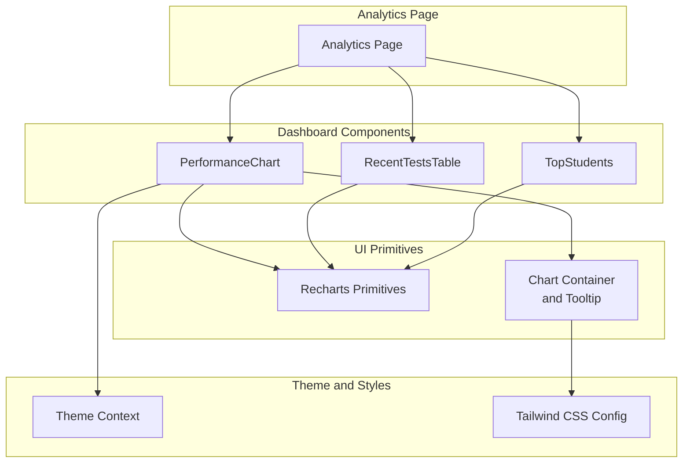
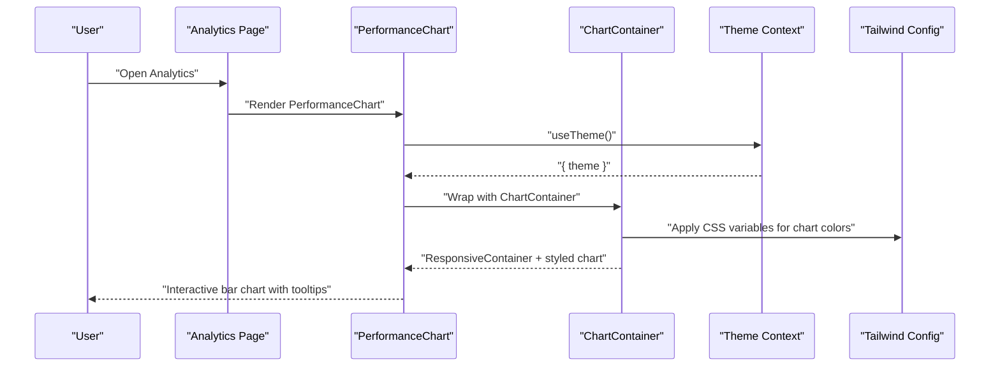
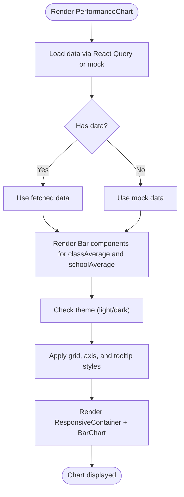
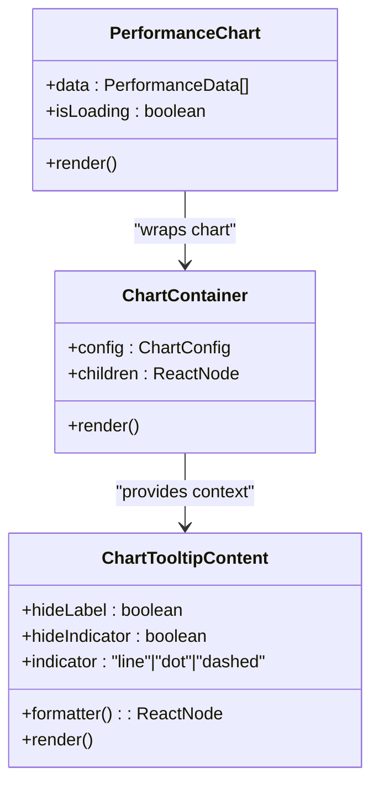
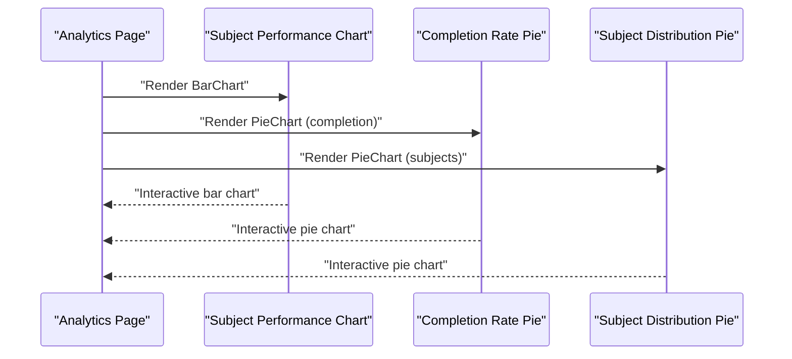
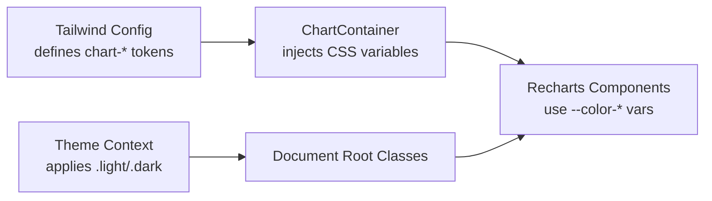
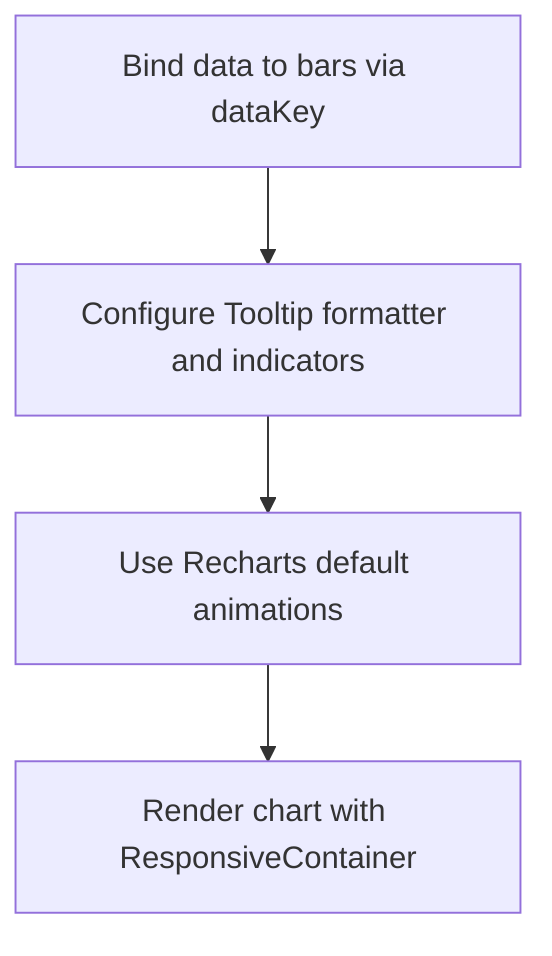
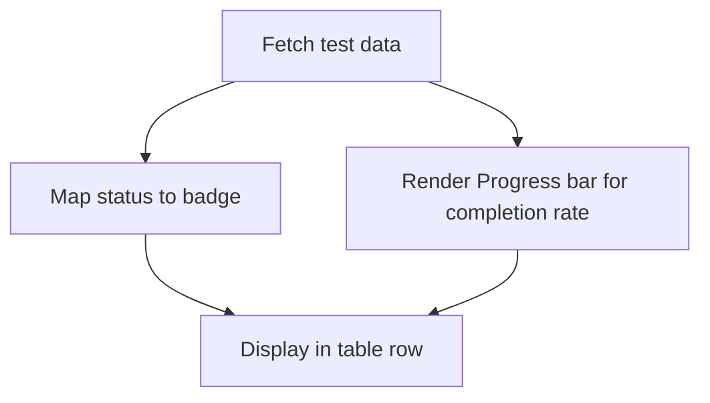
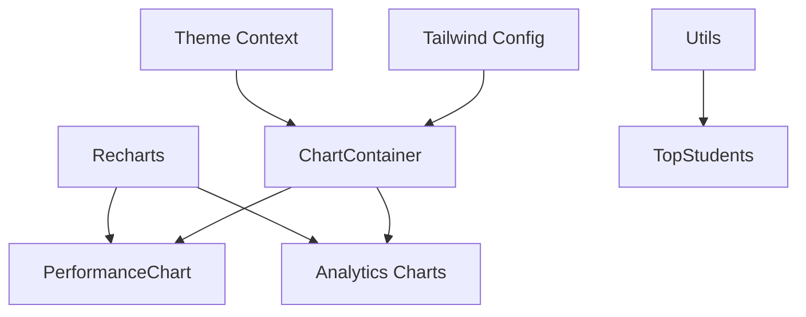

# Visualization Components

<cite>
**Referenced Files in This Document**
- [performance-chart.tsx](file://client/src/components/dashboard/performance-chart.tsx)
- [chart.tsx](file://client/src/components/ui/chart.tsx)
- [analytics.tsx](file://client/src/pages/analytics.tsx)
- [theme-context.tsx](file://client/src/contexts/theme-context.tsx)
- [tailwind.config.ts](file://tailwind.config.ts)
- [recent-tests-table.tsx](file://client/src/components/dashboard/recent-tests-table.tsx)
- [top-students.tsx](file://client/src/components/dashboard/top-students.tsx)
- [utils.ts](file://client/src/lib/utils.ts)
</cite>

## Table of Contents
1. [Introduction](#introduction)
2. [Project Structure](#project-structure)
3. [Core Components](#core-components)
4. [Architecture Overview](#architecture-overview)
5. [Detailed Component Analysis](#detailed-component-analysis)
6. [Dependency Analysis](#dependency-analysis)
7. [Performance Considerations](#performance-considerations)
8. [Troubleshooting Guide](#troubleshooting-guide)
9. [Conclusion](#conclusion)
10. [Appendices](#appendices)

## Introduction
This document focuses on the visualization components used in result analysis, with a deep dive into the PerformanceChart component and related chart implementations. It explains data formatting, chart rendering, interactive features, Recharts integration patterns, responsive configurations, color schemes and themes, accessibility considerations, data binding patterns, animations, tooltips, customization options, and export capabilities for sharing visual reports.

## Project Structure
The visualization components are primarily located under the client/src/components directory, with supporting UI primitives and theme/context providers. The analytics page composes multiple visualizations, including bar charts, pie charts, and data tables.

**Diagram sources**
- [analytics.tsx](file://client/src/pages/analytics.tsx#L1-L177)
- [performance-chart.tsx](file://client/src/components/dashboard/performance-chart.tsx#L1-L98)
- [chart.tsx](file://client/src/components/ui/chart.tsx#L1-L363)
- [theme-context.tsx](file://client/src/contexts/theme-context.tsx#L1-L72)
- [tailwind.config.ts](file://tailwind.config.ts#L1-L164)
- [recent-tests-table.tsx](file://client/src/components/dashboard/recent-tests-table.tsx#L1-L234)
- [top-students.tsx](file://client/src/components/dashboard/top-students.tsx#L1-L74)

**Section sources**
- [analytics.tsx](file://client/src/pages/analytics.tsx#L1-L177)
- [performance-chart.tsx](file://client/src/components/dashboard/performance-chart.tsx#L1-L98)
- [chart.tsx](file://client/src/components/ui/chart.tsx#L1-L363)
- [theme-context.tsx](file://client/src/contexts/theme-context.tsx#L1-L72)
- [tailwind.config.ts](file://tailwind.config.ts#L1-L164)
- [recent-tests-table.tsx](file://client/src/components/dashboard/recent-tests-table.tsx#L1-L234)
- [top-students.tsx](file://client/src/components/dashboard/top-students.tsx#L1-L74)

## Core Components
- PerformanceChart: A bar chart displaying class average versus school average per subject, with responsive container, tooltips, legends, and theme-aware styling.
- Chart Container and Tooltip: A reusable wrapper and tooltip implementation that integrates with Recharts and Tailwind CSS variables for consistent theming.
- Analytics Page: Composes PerformanceChart, TopStudents, and pie charts for completion rates and subject distribution.
- RecentTestsTable: Uses a progress bar to visualize completion rates alongside status badges.
- Theme Context: Provides theme switching and system preference detection for dark/light modes.

**Section sources**
- [performance-chart.tsx](file://client/src/components/dashboard/performance-chart.tsx#L1-L98)
- [chart.tsx](file://client/src/components/ui/chart.tsx#L1-L363)
- [analytics.tsx](file://client/src/pages/analytics.tsx#L1-L177)
- [recent-tests-table.tsx](file://client/src/components/dashboard/recent-tests-table.tsx#L1-L234)
- [theme-context.tsx](file://client/src/contexts/theme-context.tsx#L1-L72)

## Architecture Overview
The visualization architecture leverages Recharts for rendering, a custom ChartContainer for theming and responsive behavior, and a ThemeProvider for dynamic color schemes. The analytics page orchestrates multiple visualizations and data tables.

**Diagram sources**
- [analytics.tsx](file://client/src/pages/analytics.tsx#L22-L57)
- [performance-chart.tsx](file://client/src/components/dashboard/performance-chart.tsx#L21-L90)
- [chart.tsx](file://client/src/components/ui/chart.tsx#L35-L66)
- [theme-context.tsx](file://client/src/contexts/theme-context.tsx#L23-L72)
- [tailwind.config.ts](file://tailwind.config.ts#L29-L69)

## Detailed Component Analysis

### PerformanceChart Component
- Purpose: Visualize class performance versus school averages across subjects.
- Data model: Array of objects with subject, classAverage, and schoolAverage.
- Rendering: BarChart with two bars per subject, responsive container, grid, axes, legend, and tooltip.
- Theming: Uses theme context to adjust grid, axis colors, and tooltip styles.
- Interactivity: Hover tooltips show detailed values; legend labels identify series.
- Accessibility: Uses semantic Recharts components; relies on Tailwind contrast for dark mode readability.

**Diagram sources**
- [performance-chart.tsx](file://client/src/components/dashboard/performance-chart.tsx#L21-L90)
- [theme-context.tsx](file://client/src/contexts/theme-context.tsx#L65-L72)

**Section sources**
- [performance-chart.tsx](file://client/src/components/dashboard/performance-chart.tsx#L1-L98)
- [theme-context.tsx](file://client/src/contexts/theme-context.tsx#L1-L72)

### Recharts Integration Patterns and Responsive Configuration
- ResponsiveContainer: Ensures charts adapt to container size.
- ChartContainer: Wraps charts with theming and CSS variable injection for consistent colors across light/dark modes.
- Tooltip customization: Inline styles for background, borders, and text colors based on theme.
- Axis customization: Font sizes, tick removal, and axis line colors for clean visuals.

**Diagram sources**
- [chart.tsx](file://client/src/components/ui/chart.tsx#L35-L66)
- [chart.tsx](file://client/src/components/ui/chart.tsx#L103-L255)
- [performance-chart.tsx](file://client/src/components/dashboard/performance-chart.tsx#L45-L89)

**Section sources**
- [chart.tsx](file://client/src/components/ui/chart.tsx#L1-L363)
- [performance-chart.tsx](file://client/src/components/dashboard/performance-chart.tsx#L45-L89)

### Custom Chart Components for Subject Performance and Completion Rates
- Subject Performance Visualization: Bar chart comparing class vs school averages.
- Completion Rate Visualization: Pie chart showing percentages for completed, in-progress, and not-started tests.
- Subject Distribution Visualization: Pie chart showing subject-wise distribution.

**Diagram sources**
- [analytics.tsx](file://client/src/pages/analytics.tsx#L50-L133)

**Section sources**
- [analytics.tsx](file://client/src/pages/analytics.tsx#L25-L133)

### Color Schemes, Themes, and Accessibility Considerations
- Tailwind CSS Variables: Defines chart and subject color tokens for consistent theming.
- Theme Provider: Applies light/dark classes to the document root and persists user preference.
- Chart Theming: ChartContainer injects CSS variables scoped to chart containers for theme-aware colors.
- Accessibility: Dark mode adjusts grid, axis, and tooltip colors for readability; semantic Recharts elements support screen readers.

**Diagram sources**
- [tailwind.config.ts](file://tailwind.config.ts#L29-L69)
- [chart.tsx](file://client/src/components/ui/chart.tsx#L68-L99)
- [theme-context.tsx](file://client/src/contexts/theme-context.tsx#L33-L48)

**Section sources**
- [tailwind.config.ts](file://tailwind.config.ts#L1-L164)
- [chart.tsx](file://client/src/components/ui/chart.tsx#L1-L363)
- [theme-context.tsx](file://client/src/contexts/theme-context.tsx#L1-L72)

### Data Binding Patterns, Animation Configurations, and Tooltips
- Data Binding: Bars bind to dataKey values; legends and tooltips consume payload data.
- Animations: Tailwind keyframes and animations are available for UI transitions; chart animations are controlled by Recharts defaults.
- Tooltips: Custom tooltip content supports label formatting, indicators, and value formatting.

**Diagram sources**
- [performance-chart.tsx](file://client/src/components/dashboard/performance-chart.tsx#L74-L85)
- [chart.tsx](file://client/src/components/ui/chart.tsx#L103-L255)
- [tailwind.config.ts](file://tailwind.config.ts#L121-L159)

**Section sources**
- [performance-chart.tsx](file://client/src/components/dashboard/performance-chart.tsx#L65-L85)
- [chart.tsx](file://client/src/components/ui/chart.tsx#L103-L255)
- [tailwind.config.ts](file://tailwind.config.ts#L121-L159)

### Completion Rate Displays
- RecentTestsTable: Progress bars visualize completion rates; status badges reflect test lifecycle stages.
- Completion Rate Pie: Pie chart shows distribution of test statuses.

**Diagram sources**
- [recent-tests-table.tsx](file://client/src/components/dashboard/recent-tests-table.tsx#L33-L149)

**Section sources**
- [recent-tests-table.tsx](file://client/src/components/dashboard/recent-tests-table.tsx#L1-L234)
- [analytics.tsx](file://client/src/pages/analytics.tsx#L71-L133)

### Export Capabilities
- Current Implementation: No explicit export-to-image or PDF functionality is present in the visualization components.
- Recommended Approach: Integrate a library such as html2canvas or react-pdf to capture chart canvases and generate downloadable reports. This would involve adding a toolbar action to trigger export and persisting chart images or PDFs.

[No sources needed since this section provides general guidance]

## Dependency Analysis
The visualization stack depends on Recharts for rendering, a custom ChartContainer for theming, and Tailwind CSS for color tokens. The ThemeProvider influences document-level classes that ChartContainer consumes to apply CSS variables.

**Diagram sources**
- [performance-chart.tsx](file://client/src/components/dashboard/performance-chart.tsx#L1-L11)
- [chart.tsx](file://client/src/components/ui/chart.tsx#L1-L5)
- [analytics.tsx](file://client/src/pages/analytics.tsx#L1-L13)
- [theme-context.tsx](file://client/src/contexts/theme-context.tsx#L1-L72)
- [tailwind.config.ts](file://tailwind.config.ts#L1-L164)
- [utils.ts](file://client/src/lib/utils.ts#L1-L21)

**Section sources**
- [performance-chart.tsx](file://client/src/components/dashboard/performance-chart.tsx#L1-L11)
- [chart.tsx](file://client/src/components/ui/chart.tsx#L1-L5)
- [analytics.tsx](file://client/src/pages/analytics.tsx#L1-L13)
- [theme-context.tsx](file://client/src/contexts/theme-context.tsx#L1-L72)
- [tailwind.config.ts](file://tailwind.config.ts#L1-L164)
- [utils.ts](file://client/src/lib/utils.ts#L1-L21)

## Performance Considerations
- Prefer ResponsiveContainer for adaptive sizing to avoid layout thrashing.
- Use skeleton loaders during data fetches to maintain perceived performance.
- Minimize re-renders by memoizing tooltip/formatter functions and avoiding unnecessary prop churn.
- Defer heavy computations off the main thread if datasets grow large.

[No sources needed since this section provides general guidance]

## Troubleshooting Guide
- Chart not visible: Verify ResponsiveContainer dimensions and ensure parent container has explicit height.
- Incorrect colors in dark mode: Confirm ThemeProvider applies dark class and ChartContainer injects CSS variables.
- Tooltip alignment issues: Adjust tooltip formatter and indicator props; ensure payload exists before rendering.
- Missing theme-awareness: Ensure ChartContainer wraps the chart and Tailwind chart tokens are defined.

**Section sources**
- [performance-chart.tsx](file://client/src/components/dashboard/performance-chart.tsx#L45-L89)
- [chart.tsx](file://client/src/components/ui/chart.tsx#L35-L66)
- [theme-context.tsx](file://client/src/contexts/theme-context.tsx#L33-L48)
- [tailwind.config.ts](file://tailwind.config.ts#L29-L69)

## Conclusion
The visualization components combine Recharts with a custom ChartContainer and ThemeProvider to deliver responsive, theme-aware charts. The PerformanceChart demonstrates robust data binding, interactivity, and accessibility, while the analytics page showcases complementary visualizations. Extending export capabilities and optimizing data fetching will further enhance the reporting experience.

[No sources needed since this section summarizes without analyzing specific files]

## Appendices
- Additional UI Utilities: Utility functions for initials and class merging support avatar rendering and layout consistency.

**Section sources**
- [utils.ts](file://client/src/lib/utils.ts#L1-L21)