# Test Assignment & Distribution

<cite>
**Referenced Files in This Document**
- [schema.ts](file://shared/schema.ts)
- [mongo-schema.ts](file://shared/mongo-schema.ts)
- [storage.ts](file://server/storage.ts)
- [routes.ts](file://server/routes.ts)
- [test-details-form.tsx](file://client/src/components/test/test-details-form.tsx)
- [create-test.tsx](file://client/src/pages/create-test.tsx)
- [recent-tests-table.tsx](file://client/src/components/dashboard/recent-tests-table.tsx)
- [student-dashboard.tsx](file://client/src/pages/student-dashboard.tsx)
- [analytics.tsx](file://client/src/pages/analytics.tsx)
- [mockData.ts](file://client/src/data/mockData.ts)
- [config.ts](file://client/src/config.ts)
</cite>

## Table of Contents
1. [Introduction](#introduction)
2. [Project Structure](#project-structure)
3. [Core Components](#core-components)
4. [Architecture Overview](#architecture-overview)
5. [Detailed Component Analysis](#detailed-component-analysis)
6. [Dependency Analysis](#dependency-analysis)
7. [Performance Considerations](#performance-considerations)
8. [Troubleshooting Guide](#troubleshooting-guide)
9. [Conclusion](#conclusion)

## Introduction
This document describes the test assignment and distribution system in PersonalLearningPro. It covers how tests are created, scheduled, and distributed to students; how assignments are tracked and updated; how notifications and reminders are handled; and how administrators and teachers manage assignments at scale. It also documents analytics and reporting capabilities, role-based access control, and operational controls for bulk actions and conflict resolution.

## Project Structure
The system spans three layers:
- Shared domain models define typed schemas for tests, questions, attempts, answers, analytics, and assignments.
- Server-side persistence and routing implement CRUD operations, access control, and assignment lifecycle management.
- Client-side dashboards and forms provide user interfaces for creating tests, viewing assignments, and monitoring analytics.

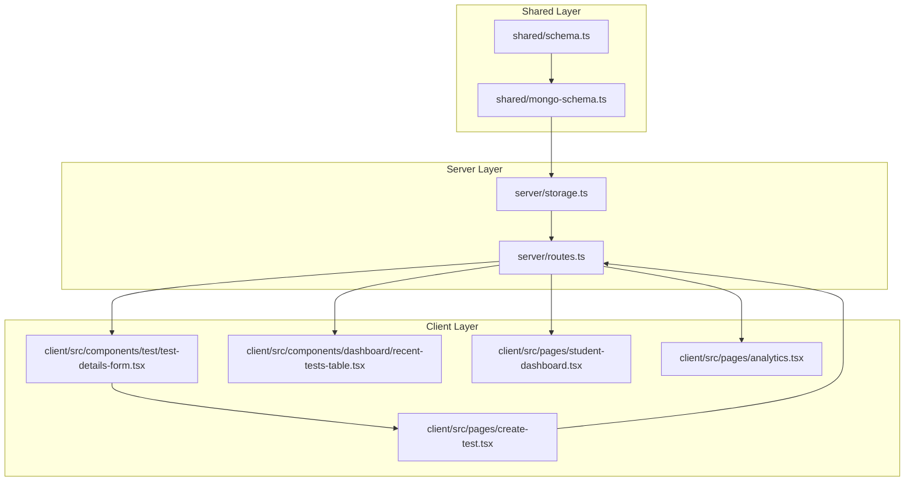

**Diagram sources**
- [schema.ts](file://shared/schema.ts#L15-L103)
- [mongo-schema.ts](file://shared/mongo-schema.ts#L25-L87)
- [storage.ts](file://server/storage.ts#L33-L106)
- [routes.ts](file://server/routes.ts#L110-L173)
- [test-details-form.tsx](file://client/src/components/test/test-details-form.tsx#L44-L108)
- [create-test.tsx](file://client/src/pages/create-test.tsx#L15-L27)
- [recent-tests-table.tsx](file://client/src/components/dashboard/recent-tests-table.tsx#L33-L73)
- [student-dashboard.tsx](file://client/src/pages/student-dashboard.tsx#L183-L208)
- [analytics.tsx](file://client/src/pages/analytics.tsx#L22-L101)

**Section sources**
- [schema.ts](file://shared/schema.ts#L15-L103)
- [mongo-schema.ts](file://shared/mongo-schema.ts#L25-L87)
- [storage.ts](file://server/storage.ts#L33-L106)
- [routes.ts](file://server/routes.ts#L110-L173)
- [test-details-form.tsx](file://client/src/components/test/test-details-form.tsx#L44-L108)
- [create-test.tsx](file://client/src/pages/create-test.tsx#L15-L27)
- [recent-tests-table.tsx](file://client/src/components/dashboard/recent-tests-table.tsx#L33-L73)
- [student-dashboard.tsx](file://client/src/pages/student-dashboard.tsx#L183-L208)
- [analytics.tsx](file://client/src/pages/analytics.tsx#L22-L101)

## Core Components
- Test model: Defines test metadata, scheduling, and status.
- Question model: Defines question variants and scoring.
- TestAttempt model: Tracks student attempts, timing, and status.
- Answer model: Stores student responses and AI-assisted evaluation.
- Analytics model: Aggregates learning insights per user/test.
- TestAssignment model: Central entity for distributing tests to students, including due dates, status, and notification flags.

These models are validated by Zod schemas and persisted via Mongoose with auto-incremented numeric IDs and supporting indexes.

**Section sources**
- [schema.ts](file://shared/schema.ts#L15-L88)
- [mongo-schema.ts](file://shared/mongo-schema.ts#L25-L87)

## Architecture Overview
The system enforces role-based access control at the route level and uses a storage abstraction to persist and query entities. The client interacts with server endpoints to create and manage tests, assign them to students, track attempts and answers, and view analytics.

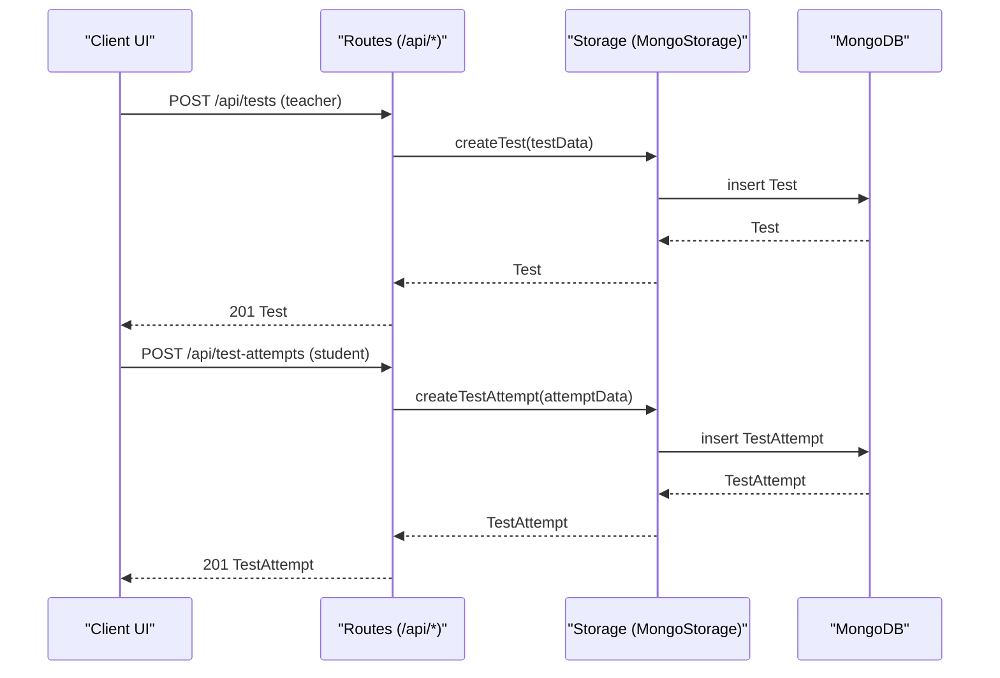

**Diagram sources**
- [routes.ts](file://server/routes.ts#L110-L132)
- [storage.ts](file://server/storage.ts#L160-L166)
- [routes.ts](file://server/routes.ts#L319-L370)
- [storage.ts](file://server/storage.ts#L213-L219)

**Section sources**
- [routes.ts](file://server/routes.ts#L110-L132)
- [storage.ts](file://server/storage.ts#L160-L166)
- [routes.ts](file://server/routes.ts#L319-L370)
- [storage.ts](file://server/storage.ts#L213-L219)

## Detailed Component Analysis

### Test Creation and Scheduling
- Teachers create tests with title, subject, class, date, duration, total marks, and question types. The system validates inputs and persists the test with a draft/published status.
- Students see tests filtered by their class and status, enabling discovery of upcoming assessments.

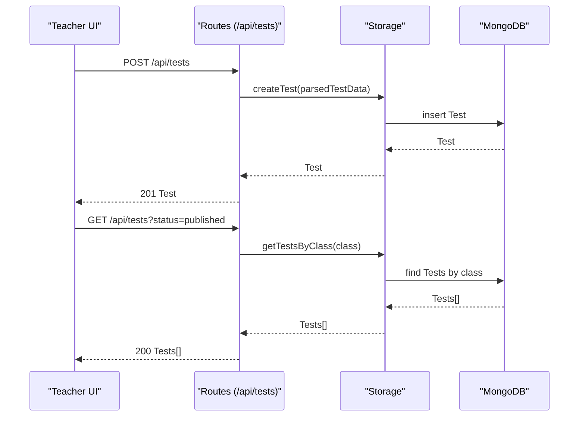

**Diagram sources**
- [test-details-form.tsx](file://client/src/components/test/test-details-form.tsx#L64-L97)
- [routes.ts](file://server/routes.ts#L134-L173)
- [storage.ts](file://server/storage.ts#L181-L184)

**Section sources**
- [test-details-form.tsx](file://client/src/components/test/test-details-form.tsx#L44-L108)
- [routes.ts](file://server/routes.ts#L134-L173)
- [storage.ts](file://server/storage.ts#L181-L184)

### Assignment Distribution Mechanisms
- Assignments link a test to a specific student, recording who assigned it, when it was assigned, due date, initial status, and a flag indicating whether a notification was sent.
- The system supports retrieving assignments by student, by test, and by combined filters. Updates allow changing status and other fields.

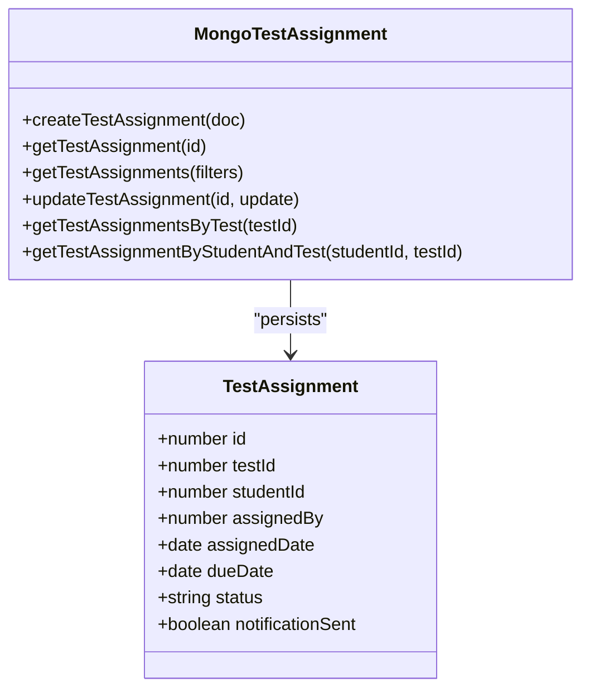

**Diagram sources**
- [schema.ts](file://shared/schema.ts#L92-L103)
- [mongo-schema.ts](file://shared/mongo-schema.ts#L78-L87)
- [storage.ts](file://server/storage.ts#L282-L317)

**Section sources**
- [schema.ts](file://shared/schema.ts#L92-L103)
- [mongo-schema.ts](file://shared/mongo-schema.ts#L78-L87)
- [storage.ts](file://server/storage.ts#L282-L317)

### Scheduling System: Availability, Deadlines, and Time Limits
- Tests carry a scheduled date and duration. Attempts record start/end times and status, enabling time-bound delivery and completion tracking.
- Status transitions support pending → started → completed, with overdue handling for late submissions.

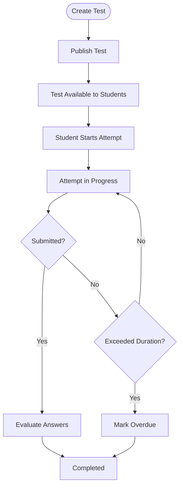

**Diagram sources**
- [schema.ts](file://shared/schema.ts#L15-L26)
- [schema.ts](file://shared/schema.ts#L39-L46)
- [schema.ts](file://shared/schema.ts#L92-L103)

**Section sources**
- [schema.ts](file://shared/schema.ts#L15-L26)
- [schema.ts](file://shared/schema.ts#L39-L46)
- [schema.ts](file://shared/schema.ts#L92-L103)

### Assignment Tracking, Completion Monitoring, and Rescheduling
- Assignment status is tracked per student/test combination. The system supports querying by status and updating statuses (e.g., overdue).
- Students can view upcoming tests and recent results on their dashboards, while analytics surfaces completion rates and performance metrics.

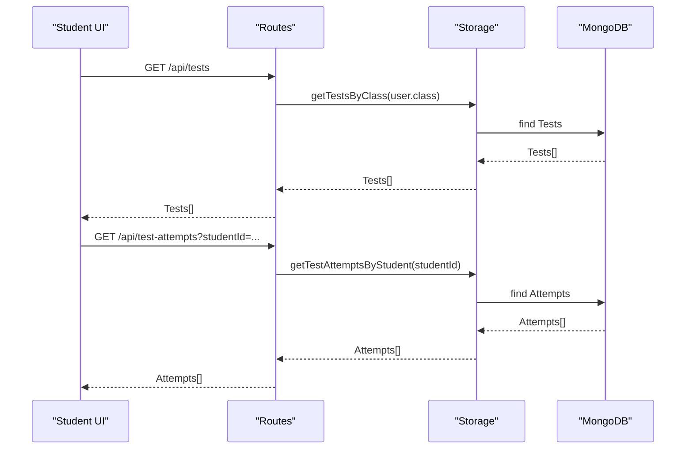

**Diagram sources**
- [routes.ts](file://server/routes.ts#L134-L173)
- [storage.ts](file://server/storage.ts#L226-L234)
- [student-dashboard.tsx](file://client/src/pages/student-dashboard.tsx#L183-L208)

**Section sources**
- [routes.ts](file://server/routes.ts#L134-L173)
- [storage.ts](file://server/storage.ts#L226-L234)
- [student-dashboard.tsx](file://client/src/pages/student-dashboard.tsx#L183-L208)

### Notification Systems and Reminders
- The assignment schema includes a notificationSent flag. While the backend does not implement a dedicated notification worker in the provided files, the presence of the flag indicates an extensibility point for integrating reminders or messaging systems.

**Section sources**
- [schema.ts](file://shared/schema.ts#L98-L99)
- [mongo-schema.ts](file://shared/mongo-schema.ts#L85-L86)

### Role-Based Access Control and Visibility
- Route handlers enforce role-based permissions:
  - Teachers can create/update tests and manage questions for their own tests.
  - Students can only access tests assigned to their class and can attempt published tests.
  - Access checks compare session roles and ownership/class membership against stored entities.

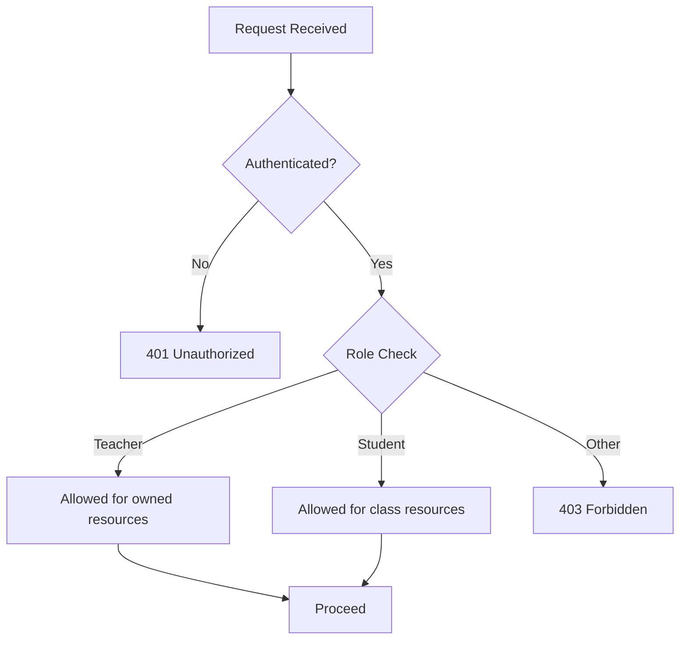

**Diagram sources**
- [routes.ts](file://server/routes.ts#L110-L132)
- [routes.ts](file://server/routes.ts#L175-L209)
- [routes.ts](file://server/routes.ts#L319-L370)

**Section sources**
- [routes.ts](file://server/routes.ts#L110-L132)
- [routes.ts](file://server/routes.ts#L175-L209)
- [routes.ts](file://server/routes.ts#L319-L370)

### Assignment Analytics, Participation Rates, and Completion Statistics
- Analytics records per-user/per-test insights, enabling dashboards to compute completion rates and performance summaries.
- The analytics page renders pie charts and summary cards for test completion and performance.

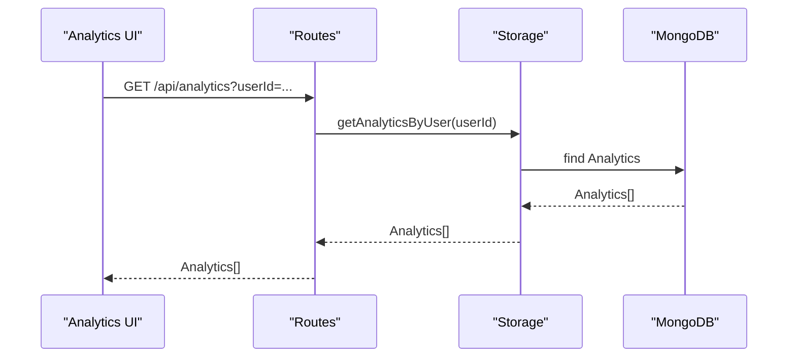

**Diagram sources**
- [routes.ts](file://server/routes.ts#L264-L280)
- [storage.ts](file://server/storage.ts#L264-L280)
- [analytics.tsx](file://client/src/pages/analytics.tsx#L22-L101)

**Section sources**
- [routes.ts](file://server/routes.ts#L264-L280)
- [storage.ts](file://server/storage.ts#L264-L280)
- [analytics.tsx](file://client/src/pages/analytics.tsx#L22-L101)

### Bulk Assignment Operations and Administrative Controls
- The storage interface exposes methods to fetch assignments by test or student, enabling bulk operations such as rescheduling or mass notifications.
- Administrative dashboards can leverage these APIs to manage large-scale distributions and monitor outcomes.

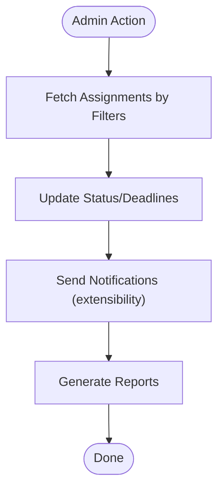

**Diagram sources**
- [storage.ts](file://server/storage.ts#L295-L302)
- [storage.ts](file://server/storage.ts#L304-L307)
- [storage.ts](file://server/storage.ts#L309-L317)

**Section sources**
- [storage.ts](file://server/storage.ts#L295-L302)
- [storage.ts](file://server/storage.ts#L304-L307)
- [storage.ts](file://server/storage.ts#L309-L317)

### Assignment Conflicts and Rescheduling Options
- Conflict prevention: Students cannot start multiple in-progress attempts for the same test. The attempt creation endpoint rejects duplicates.
- Rescheduling: Administrators and teachers can update test dates and deadlines via test update endpoints. Assignment due dates can be adjusted through assignment updates.

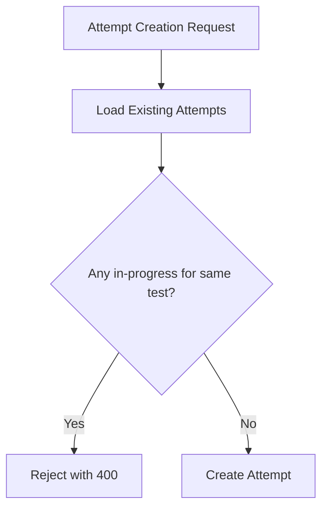

**Diagram sources**
- [routes.ts](file://server/routes.ts#L350-L359)
- [storage.ts](file://server/storage.ts#L213-L219)

**Section sources**
- [routes.ts](file://server/routes.ts#L350-L359)
- [storage.ts](file://server/storage.ts#L213-L219)

## Dependency Analysis
The following diagram maps core dependencies among shared models, storage, and routes.

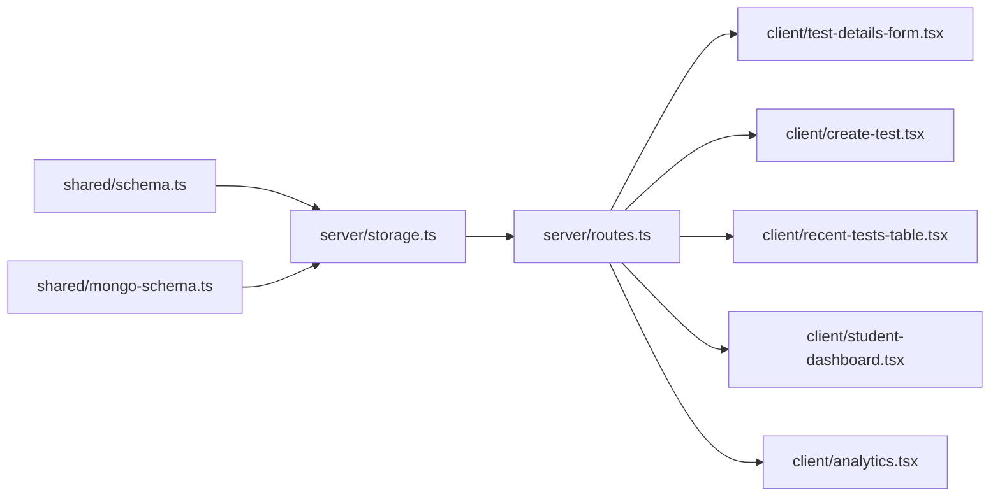

**Diagram sources**
- [schema.ts](file://shared/schema.ts#L15-L103)
- [mongo-schema.ts](file://shared/mongo-schema.ts#L25-L87)
- [storage.ts](file://server/storage.ts#L33-L106)
- [routes.ts](file://server/routes.ts#L110-L173)
- [test-details-form.tsx](file://client/src/components/test/test-details-form.tsx#L44-L108)
- [create-test.tsx](file://client/src/pages/create-test.tsx#L15-L27)
- [recent-tests-table.tsx](file://client/src/components/dashboard/recent-tests-table.tsx#L33-L73)
- [student-dashboard.tsx](file://client/src/pages/student-dashboard.tsx#L183-L208)
- [analytics.tsx](file://client/src/pages/analytics.tsx#L22-L101)

**Section sources**
- [schema.ts](file://shared/schema.ts#L15-L103)
- [mongo-schema.ts](file://shared/mongo-schema.ts#L25-L87)
- [storage.ts](file://server/storage.ts#L33-L106)
- [routes.ts](file://server/routes.ts#L110-L173)
- [test-details-form.tsx](file://client/src/components/test/test-details-form.tsx#L44-L108)
- [create-test.tsx](file://client/src/pages/create-test.tsx#L15-L27)
- [recent-tests-table.tsx](file://client/src/components/dashboard/recent-tests-table.tsx#L33-L73)
- [student-dashboard.tsx](file://client/src/pages/student-dashboard.tsx#L183-L208)
- [analytics.tsx](file://client/src/pages/analytics.tsx#L22-L101)

## Performance Considerations
- Indexes on assignment queries (studentId/status, testId, dueDate/status) improve filtering and reporting performance.
- Using auto-increment counters ensures stable numeric IDs and simplifies joins.
- Client-side caching via React Query can reduce redundant network requests for test lists and analytics.

[No sources needed since this section provides general guidance]

## Troubleshooting Guide
- Authentication failures: Ensure the session includes a valid userId and role; otherwise routes return 401/403.
- Authorization failures: Teachers cannot modify others’ tests; students cannot access tests outside their class.
- Attempt conflicts: If a student tries to start a second in-progress attempt for the same test, the request is rejected.
- Validation errors: Zod-based validation returns structured 400 responses with error details.

**Section sources**
- [routes.ts](file://server/routes.ts#L110-L132)
- [routes.ts](file://server/routes.ts#L175-L209)
- [routes.ts](file://server/routes.ts#L350-L359)

## Conclusion
PersonalLearningPro’s test assignment and distribution system combines robust role-based access control, clear scheduling semantics, and flexible assignment tracking. The shared models and storage abstractions enable scalable bulk operations and analytics, while the client dashboards provide actionable insights for students and educators. Extending notification and reminder workflows is straightforward given the existing assignment schema and storage interfaces.