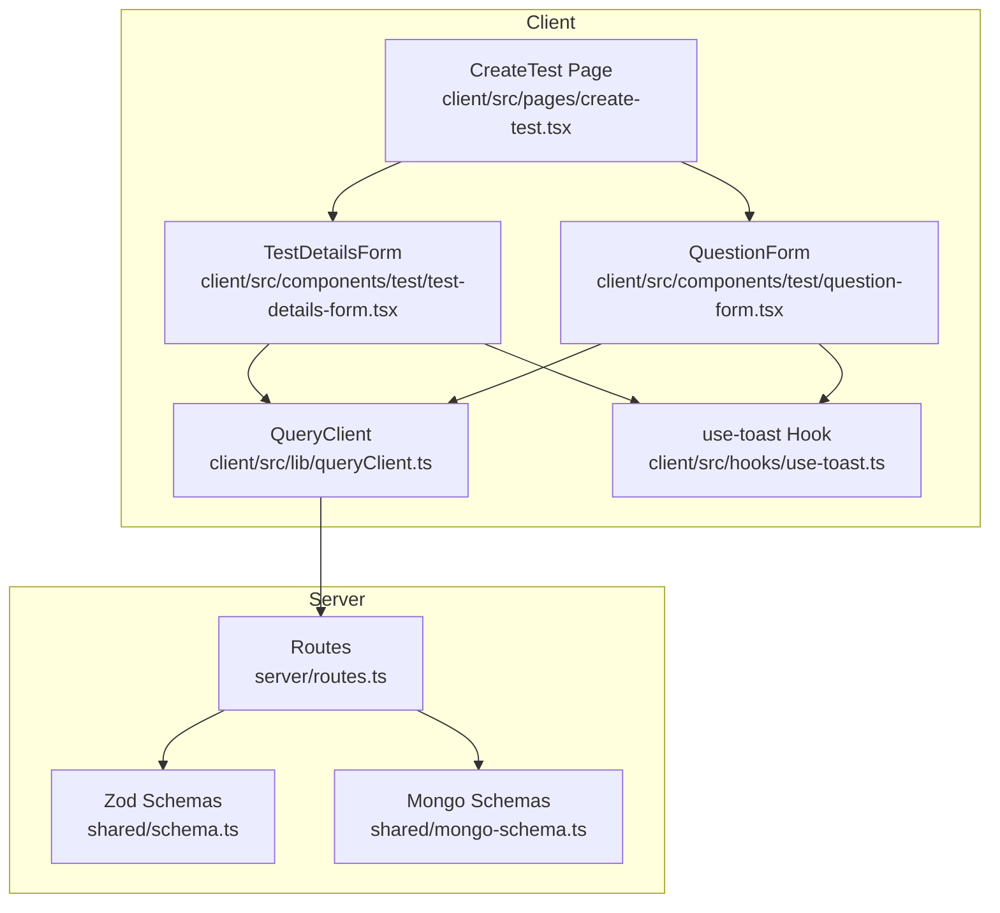
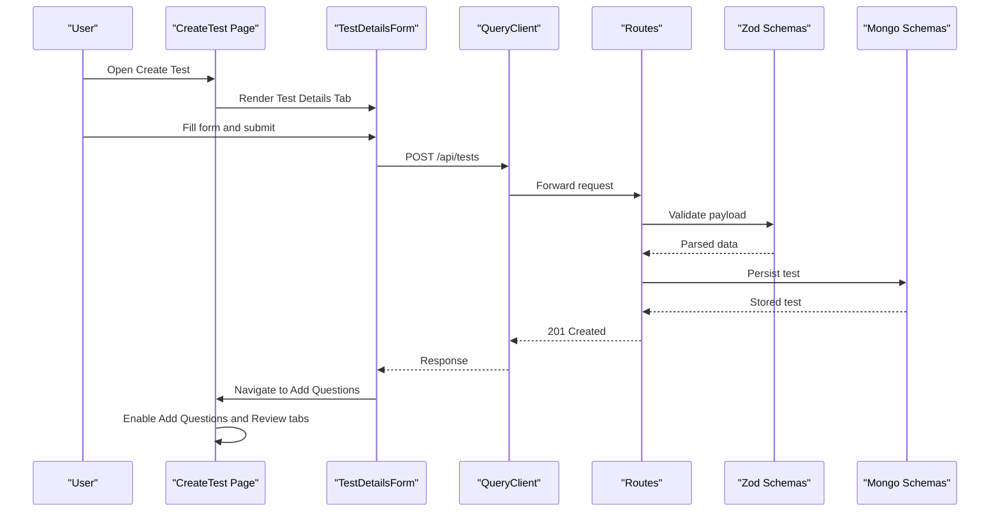
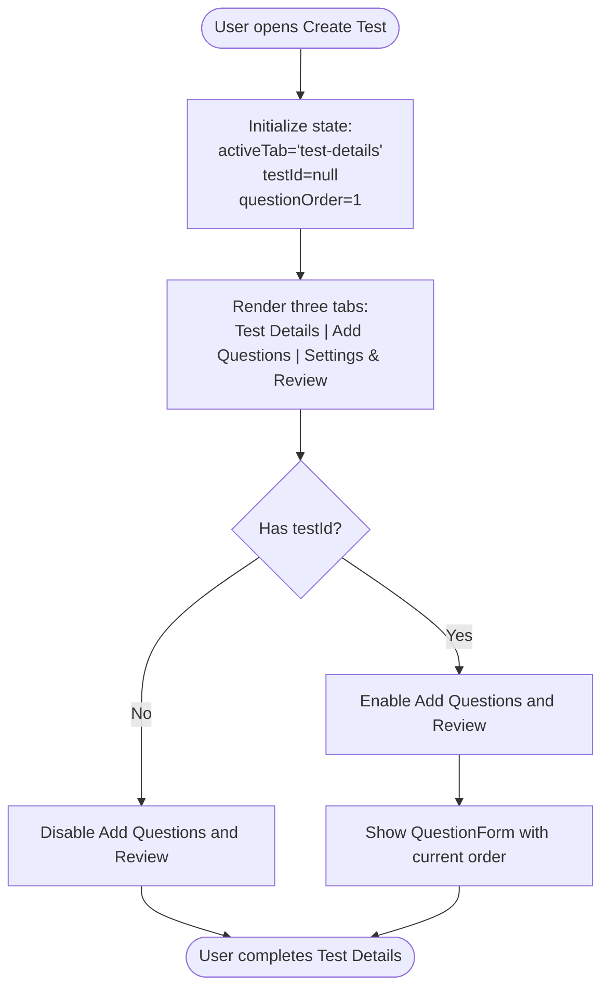
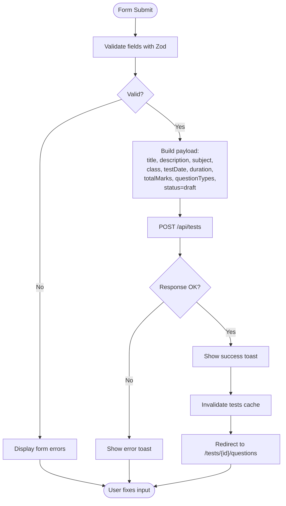
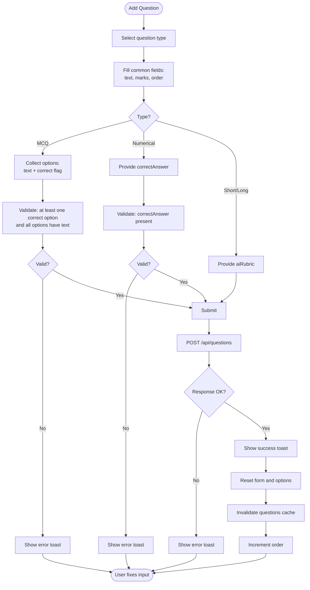
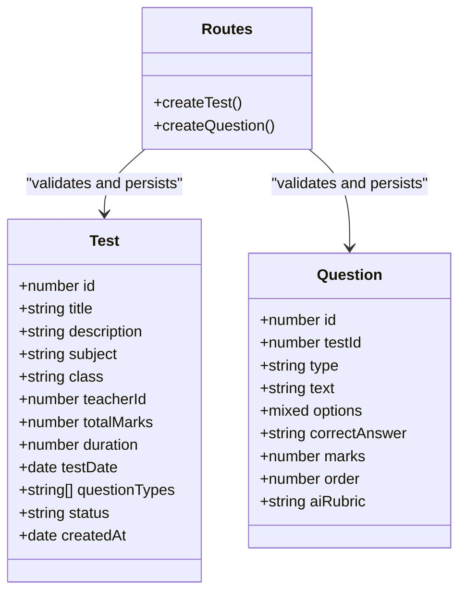
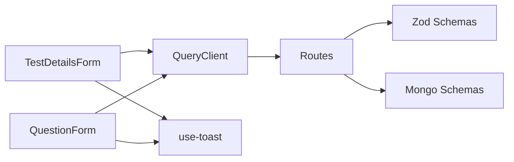

# Test Creation Workflow

<cite>
**Referenced Files in This Document**
- [create-test.tsx](file://client/src/pages/create-test.tsx)
- [test-details-form.tsx](file://client/src/components/test/test-details-form.tsx)
- [question-form.tsx](file://client/src/components/test/question-form.tsx)
- [routes.ts](file://server/routes.ts)
- [schema.ts](file://shared/schema.ts)
- [mongo-schema.ts](file://shared/mongo-schema.ts)
- [queryClient.ts](file://client/src/lib/queryClient.ts)
- [use-toast.ts](file://client/src/hooks/use-toast.ts)
</cite>

## Table of Contents
1. [Introduction](#introduction)
2. [Project Structure](#project-structure)
3. [Core Components](#core-components)
4. [Architecture Overview](#architecture-overview)
5. [Detailed Component Analysis](#detailed-component-analysis)
6. [Dependency Analysis](#dependency-analysis)
7. [Performance Considerations](#performance-considerations)
8. [Troubleshooting Guide](#troubleshooting-guide)
9. [Conclusion](#conclusion)
10. [Appendices](#appendices)

## Introduction
This document explains the complete test creation workflow in PersonalLearningPro, from initiating a new assessment to publishing it. It covers the multi-step process across three tabs: Test Details, Add Questions, and Settings & Review. It documents the TestDetailsForm component for capturing test metadata, duration, and grading criteria, along with state management for test ID generation, question ordering, and tab navigation. It also details the integration between frontend components and backend routes for test persistence, validation rules, error handling, and user experience flow for creating assessments. Finally, it provides examples of test creation scenarios and best practices for effective assessment design.

## Project Structure
The test creation feature spans the client-side UI and server-side APIs:

- Frontend:
  - CreateTest page orchestrates the three-tab interface and manages state transitions.
  - TestDetailsForm captures test metadata and persists it via a mutation.
  - QuestionForm handles question creation with type-specific validation and ordering.
  - Shared utilities include queryClient for API requests and use-toast for notifications.

- Backend:
  - Routes define REST endpoints for creating tests and questions, enforcing authentication and authorization.
  - Shared schemas validate incoming data using Zod.
  - MongoDB schemas define the persisted data model.

**Diagram sources**
- [create-test.tsx](file://client/src/pages/create-test.tsx#L15-L121)
- [test-details-form.tsx](file://client/src/components/test/test-details-form.tsx#L44-L324)
- [question-form.tsx](file://client/src/components/test/question-form.tsx#L55-L389)
- [routes.ts](file://server/routes.ts#L110-L316)
- [schema.ts](file://shared/schema.ts#L15-L37)
- [mongo-schema.ts](file://shared/mongo-schema.ts#L25-L50)
- [queryClient.ts](file://client/src/lib/queryClient.ts#L10-L28)
- [use-toast.ts](file://client/src/hooks/use-toast.ts#L142-L192)

**Section sources**
- [create-test.tsx](file://client/src/pages/create-test.tsx#L1-L122)
- [routes.ts](file://server/routes.ts#L110-L316)

## Core Components
- CreateTest page: Manages active tab, test ID state, and question order. Enables/disables tabs based on test creation status.
- TestDetailsForm: Validates and submits test metadata to the backend, then navigates to the Add Questions tab.
- QuestionForm: Handles question creation with type-specific validation (MCQ correctness, numerical answers, rubrics), maintains order, and resets form state upon success.
- Backend routes: Enforce role-based access (teacher only), validate payloads with Zod, persist data to MongoDB, and return standardized responses.
- Shared schemas: Define strict validation rules for tests and questions.
- QueryClient: Centralized API request handler with error normalization.
- Toast hook: Provides user feedback for success and error states.

**Section sources**
- [create-test.tsx](file://client/src/pages/create-test.tsx#L15-L121)
- [test-details-form.tsx](file://client/src/components/test/test-details-form.tsx#L44-L324)
- [question-form.tsx](file://client/src/components/test/question-form.tsx#L55-L389)
- [routes.ts](file://server/routes.ts#L110-L316)
- [schema.ts](file://shared/schema.ts#L15-L37)
- [queryClient.ts](file://client/src/lib/queryClient.ts#L10-L28)
- [use-toast.ts](file://client/src/hooks/use-toast.ts#L142-L192)

## Architecture Overview
The workflow follows a clear separation of concerns:
- Frontend collects user input, validates locally, and sends requests to backend endpoints.
- Backend validates payloads, enforces authorization, persists data, and returns structured responses.
- Frontend updates UI state, invalidates caches, and guides users through the next steps.

**Diagram sources**
- [create-test.tsx](file://client/src/pages/create-test.tsx#L15-L121)
- [test-details-form.tsx](file://client/src/components/test/test-details-form.tsx#L64-L97)
- [routes.ts](file://server/routes.ts#L110-L132)
- [schema.ts](file://shared/schema.ts#L15-L26)
- [mongo-schema.ts](file://shared/mongo-schema.ts#L25-L38)
- [queryClient.ts](file://client/src/lib/queryClient.ts#L10-L28)

## Detailed Component Analysis

### CreateTest Page
- Responsibilities:
  - Manages active tab state.
  - Stores the newly created test ID and enables subsequent tabs.
  - Tracks question order for sequential placement.
  - Provides navigation callbacks to advance the workflow.
- State management:
  - activeTab: Controls which tab is visible.
  - testId: Enables Add Questions and Review tabs after creation.
  - questionOrder: Ensures questions are appended in order.
- UX behavior:
  - Disables Add Questions and Review tabs until a test ID is available.
  - Navigates to Add Questions tab after successful test creation.

**Diagram sources**
- [create-test.tsx](file://client/src/pages/create-test.tsx#L15-L121)

**Section sources**
- [create-test.tsx](file://client/src/pages/create-test.tsx#L15-L121)

### TestDetailsForm Component
- Purpose: Capture test metadata and initiate test creation.
- Validation rules:
  - Title: Minimum length constraint.
  - Subject and Class: Required fields.
  - Test Date: Required date string.
  - Duration: Minimum 5 minutes.
  - Total Marks: Minimum 1.
  - Question Types: At least one selection required.
  - Status: Defaults to draft.
- Submission flow:
  - Converts date string to ISO format.
  - Adds teacherId from authentication context.
  - Sends POST /api/tests with validation.
  - On success: shows success toast, invalidates cache, redirects to questions page.
  - On error: shows destructive toast with error message.
- Draft saving:
  - Submits with status set to draft without redirect.

**Diagram sources**
- [test-details-form.tsx](file://client/src/components/test/test-details-form.tsx#L30-L42)
- [test-details-form.tsx](file://client/src/components/test/test-details-form.tsx#L64-L97)
- [routes.ts](file://server/routes.ts#L110-L132)
- [schema.ts](file://shared/schema.ts#L15-L26)

**Section sources**
- [test-details-form.tsx](file://client/src/components/test/test-details-form.tsx#L30-L42)
- [test-details-form.tsx](file://client/src/components/test/test-details-form.tsx#L64-L97)
- [routes.ts](file://server/routes.ts#L110-L132)
- [schema.ts](file://shared/schema.ts#L15-L26)

### QuestionForm Component
- Purpose: Add questions to an existing test with type-specific validation.
- Validation rules:
  - Common: testId, type, text (minimum length), marks (minimum 1), order, optional aiRubric.
  - MCQ: Requires at least one correct option; all options must have text.
  - Numerical: Requires a correctAnswer.
- State management:
  - Tracks question type and options for MCQ.
  - Maintains order for sequential question placement.
  - Resets form and options after successful submission.
- Submission flow:
  - For MCQ, derives correctAnswer from selected option.
  - Sends POST /api/questions with validation.
  - On success: shows success toast, resets form, invalidates cache, increments order, calls success callback.
  - On error: shows destructive toast with error message.

**Diagram sources**
- [question-form.tsx](file://client/src/components/test/question-form.tsx#L36-L45)
- [question-form.tsx](file://client/src/components/test/question-form.tsx#L77-L126)
- [question-form.tsx](file://client/src/components/test/question-form.tsx#L162-L204)
- [routes.ts](file://server/routes.ts#L250-L278)
- [schema.ts](file://shared/schema.ts#L28-L37)

**Section sources**
- [question-form.tsx](file://client/src/components/test/question-form.tsx#L36-L45)
- [question-form.tsx](file://client/src/components/test/question-form.tsx#L77-L126)
- [question-form.tsx](file://client/src/components/test/question-form.tsx#L162-L204)
- [routes.ts](file://server/routes.ts#L250-L278)
- [schema.ts](file://shared/schema.ts#L28-L37)

### Backend Integration and Persistence
- Test creation endpoint:
  - Requires teacher role and session.
  - Validates payload with Zod schema.
  - Ensures teacherId matches session.
  - Persists to MongoDB using auto-incremented ID.
  - Returns created test.
- Question creation endpoint:
  - Requires teacher role and session.
  - Validates payload with Zod schema.
  - Verifies ownership of the test.
  - Persists to MongoDB using auto-incremented ID.
  - Returns created question.
- Data models:
  - Test schema includes title, description, subject, class, teacherId, totalMarks, duration, testDate, questionTypes, status, and timestamps.
  - Question schema includes testId, type, text, options, correctAnswer, marks, order, and aiRubric.

**Diagram sources**
- [routes.ts](file://server/routes.ts#L110-L132)
- [routes.ts](file://server/routes.ts#L250-L278)
- [schema.ts](file://shared/schema.ts#L15-L26)
- [schema.ts](file://shared/schema.ts#L28-L37)
- [mongo-schema.ts](file://shared/mongo-schema.ts#L25-L38)
- [mongo-schema.ts](file://shared/mongo-schema.ts#L40-L50)

**Section sources**
- [routes.ts](file://server/routes.ts#L110-L132)
- [routes.ts](file://server/routes.ts#L250-L278)
- [schema.ts](file://shared/schema.ts#L15-L26)
- [schema.ts](file://shared/schema.ts#L28-L37)
- [mongo-schema.ts](file://shared/mongo-schema.ts#L25-L38)
- [mongo-schema.ts](file://shared/mongo-schema.ts#L40-L50)

## Dependency Analysis
- Frontend-to-backend dependencies:
  - TestDetailsForm depends on QueryClient for API requests and Zod schemas for validation.
  - QuestionForm depends on QueryClient and Zod schemas for validation.
  - Both forms rely on use-toast for user feedback.
- Backend dependencies:
  - Routes depend on Zod schemas for validation and MongoDB schemas for persistence.
  - Storage layer uses auto-increment counters for IDs.

**Diagram sources**
- [test-details-form.tsx](file://client/src/components/test/test-details-form.tsx#L6-L8)
- [question-form.tsx](file://client/src/components/test/question-form.tsx#L7-L8)
- [queryClient.ts](file://client/src/lib/queryClient.ts#L10-L28)
- [routes.ts](file://server/routes.ts#L110-L132)
- [schema.ts](file://shared/schema.ts#L15-L37)
- [mongo-schema.ts](file://shared/mongo-schema.ts#L94-L108)
- [use-toast.ts](file://client/src/hooks/use-toast.ts#L142-L192)

**Section sources**
- [test-details-form.tsx](file://client/src/components/test/test-details-form.tsx#L6-L8)
- [question-form.tsx](file://client/src/components/test/question-form.tsx#L7-L8)
- [queryClient.ts](file://client/src/lib/queryClient.ts#L10-L28)
- [routes.ts](file://server/routes.ts#L110-L132)
- [schema.ts](file://shared/schema.ts#L15-L37)
- [mongo-schema.ts](file://shared/mongo-schema.ts#L94-L108)
- [use-toast.ts](file://client/src/hooks/use-toast.ts#L142-L192)

## Performance Considerations
- Caching:
  - React Query invalidates relevant caches after successful mutations to keep UI in sync with backend state.
- Network efficiency:
  - Minimal payload sizes for test and question creation reduce bandwidth usage.
- Scalability:
  - MongoDB auto-increment counters ensure unique IDs without external coordination.
- UI responsiveness:
  - Pending states disable buttons to prevent duplicate submissions.

[No sources needed since this section provides general guidance]

## Troubleshooting Guide
- Common validation errors:
  - Test Details: Title too short, missing subject/class, invalid date, duration below minimum, total marks below minimum, no question types selected.
  - Question Form: MCQ requires at least one correct option and all options must have text; numerical requires a correct answer.
- Backend errors:
  - Unauthorized: Non-teacher users attempting to create tests or questions.
  - Forbidden: Attempting to create resources for another teacher or accessing unauthorized tests.
  - Invalid input: Zod validation failures return structured error messages.
- User feedback:
  - Success toasts confirm completion of actions.
  - Error toasts display actionable messages for correction.

**Section sources**
- [test-details-form.tsx](file://client/src/components/test/test-details-form.tsx#L30-L42)
- [question-form.tsx](file://client/src/components/test/question-form.tsx#L31-L45)
- [routes.ts](file://server/routes.ts#L112-L131)
- [routes.ts](file://server/routes.ts#L252-L277)
- [use-toast.ts](file://client/src/hooks/use-toast.ts#L142-L192)

## Conclusion
The test creation workflow in PersonalLearningPro is designed for clarity and robustness. The CreateTest page orchestrates a smooth progression from capturing test metadata to adding questions and reviewing the assessment. Strict validation at both frontend and backend ensures data integrity, while role-based access controls protect resource ownership. The modular components and centralized API utilities provide a scalable foundation for extending assessment features.

[No sources needed since this section summarizes without analyzing specific files]

## Appendices

### Best Practices for Effective Assessment Design
- Choose question types aligned with learning objectives (e.g., MCQ for recall, short/long for comprehension, numerical for problem-solving).
- Ensure clear rubrics for subjective questions to enable AI scoring consistency.
- Distribute marks proportionally across question types and difficulty levels.
- Use realistic durations and total marks to reflect assessment expectations.
- Validate answers rigorously (especially MCQ options and numerical solutions) before publishing.

[No sources needed since this section provides general guidance]