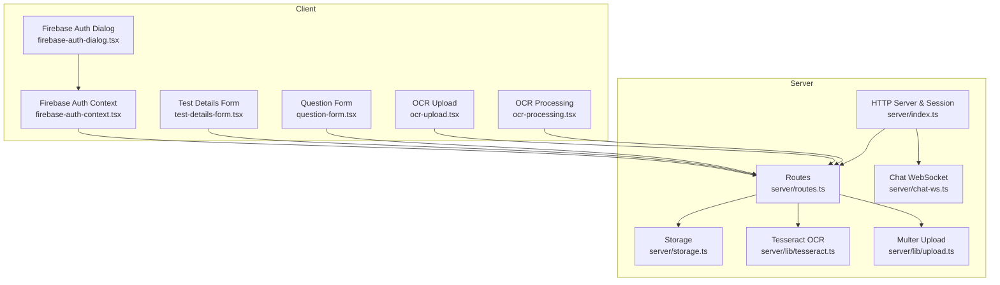
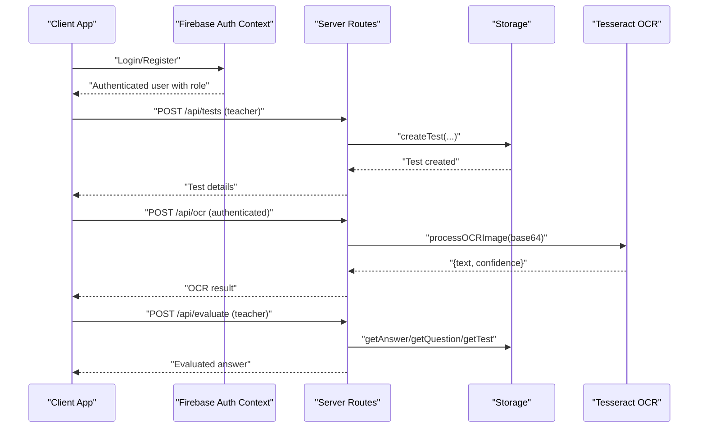
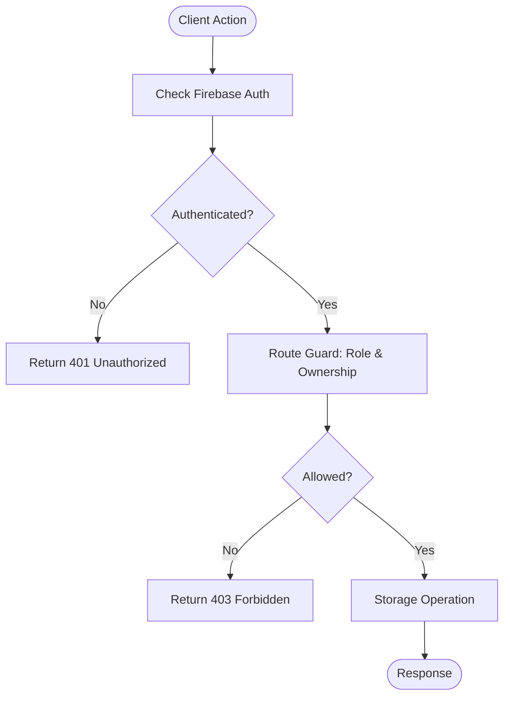
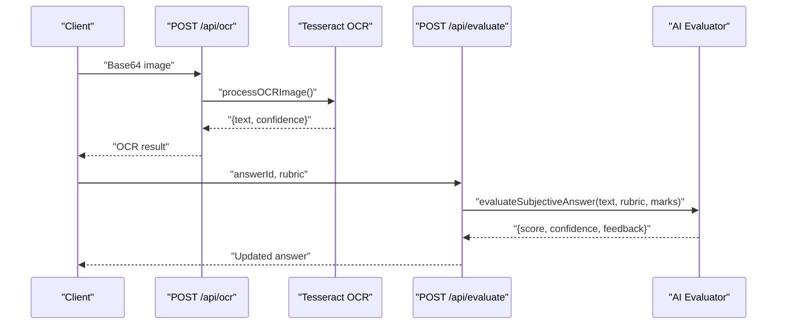
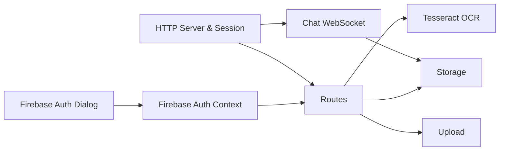

# Test Security & Anti-Cheating Measures

<cite>
**Referenced Files in This Document**
- [routes.ts](file://server/routes.ts)
- [storage.ts](file://server/storage.ts)
- [index.ts](file://server/index.ts)
- [chat-ws.ts](file://server/chat-ws.ts)
- [tesseract.ts](file://server/lib/tesseract.ts)
- [upload.ts](file://server/lib/upload.ts)
- [firebase-auth-dialog.tsx](file://client/src/components/auth/firebase-auth-dialog.tsx)
- [firebase-auth-context.tsx](file://client/src/contexts/firebase-auth-context.tsx)
- [test-details-form.tsx](file://client/src/components/test/test-details-form.tsx)
- [question-form.tsx](file://client/src/components/test/question-form.tsx)
- [ocr-upload.tsx](file://client/src/components/test/ocr-upload.tsx)
- [ocr-processing.tsx](file://client/src/components/test/ocr-processing.tsx)
</cite>

## Table of Contents
1. [Introduction](#introduction)
2. [Project Structure](#project-structure)
3. [Core Components](#core-components)
4. [Architecture Overview](#architecture-overview)
5. [Detailed Component Analysis](#detailed-component-analysis)
6. [Dependency Analysis](#dependency-analysis)
7. [Performance Considerations](#performance-considerations)
8. [Troubleshooting Guide](#troubleshooting-guide)
9. [Conclusion](#conclusion)
10. [Appendices](#appendices)

## Introduction
This document details the test security and anti-cheating measures implemented in PersonalLearningPro. It focuses on maintaining test integrity, integrating authentication for access validation, enabling OCR-based answer recognition, and establishing a foundation for session monitoring, suspicious activity detection, and audit trails. The current implementation emphasizes:
- Authentication and authorization for test lifecycle operations
- OCR processing for scanned answer sheets
- AI-assisted evaluation for subjective answers
- Session management and WebSocket authentication
- Audit logging via middleware

Areas such as randomized question ordering, dynamic answer masking, time-based restrictions, copy-paste prevention, screenshot detection, browser lockdown, and proctoring mechanisms are not present in the current codebase and are therefore not documented here.

## Project Structure
The test security and anti-cheating functionality spans both backend and frontend components:
- Backend routes define access control and orchestrate test lifecycle operations
- Storage layer persists test, attempt, and answer data
- Authentication is integrated via Firebase on the client and session-based middleware on the server
- OCR processing is handled by Tesseract.js and exposed via a dedicated route
- Middleware logs API requests for audit trail

**Diagram sources**
- [routes.ts](file://server/routes.ts#L11-L800)
- [storage.ts](file://server/storage.ts#L110-L519)
- [index.ts](file://server/index.ts#L35-L84)
- [chat-ws.ts](file://server/chat-ws.ts#L119-L284)
- [tesseract.ts](file://server/lib/tesseract.ts#L8-L32)
- [upload.ts](file://server/lib/upload.ts#L30-L84)
- [firebase-auth-dialog.tsx](file://client/src/components/auth/firebase-auth-dialog.tsx#L39-L500)
- [firebase-auth-context.tsx](file://client/src/contexts/firebase-auth-context.tsx#L38-L267)
- [test-details-form.tsx](file://client/src/components/test/test-details-form.tsx#L44-L325)
- [question-form.tsx](file://client/src/components/test/question-form.tsx#L55-L390)
- [ocr-upload.tsx](file://client/src/components/test/ocr-upload.tsx#L25-L309)
- [ocr-processing.tsx](file://client/src/components/test/ocr-processing.tsx#L23-L219)

**Section sources**
- [routes.ts](file://server/routes.ts#L11-L800)
- [storage.ts](file://server/storage.ts#L110-L519)
- [index.ts](file://server/index.ts#L35-L84)
- [chat-ws.ts](file://server/chat-ws.ts#L119-L284)
- [tesseract.ts](file://server/lib/tesseract.ts#L8-L32)
- [upload.ts](file://server/lib/upload.ts#L30-L84)
- [firebase-auth-dialog.tsx](file://client/src/components/auth/firebase-auth-dialog.tsx#L39-L500)
- [firebase-auth-context.tsx](file://client/src/contexts/firebase-auth-context.tsx#L38-L267)
- [test-details-form.tsx](file://client/src/components/test/test-details-form.tsx#L44-L325)
- [question-form.tsx](file://client/src/components/test/question-form.tsx#L55-L390)
- [ocr-upload.tsx](file://client/src/components/test/ocr-upload.tsx#L25-L309)
- [ocr-processing.tsx](file://client/src/components/test/ocr-processing.tsx#L23-L219)

## Core Components
- Authentication and Authorization
  - Client-side authentication via Firebase with role-aware dialogs and context providers
  - Server-side session middleware and route guards enforcing roles and ownership
- Test Lifecycle and Access Control
  - Routes for creating, retrieving, and updating tests and questions with strict role checks
  - Attempt creation and submission guarded by class membership and published status
- OCR and AI Evaluation
  - OCR endpoint using Tesseract.js for scanned answer sheets
  - AI evaluation endpoint for subjective answers with rubrics
- Session Monitoring and Audit Trail
  - Session store and WebSocket authentication
  - Global middleware logs API requests for audit trail

**Section sources**
- [firebase-auth-dialog.tsx](file://client/src/components/auth/firebase-auth-dialog.tsx#L39-L500)
- [firebase-auth-context.tsx](file://client/src/contexts/firebase-auth-context.tsx#L38-L267)
- [routes.ts](file://server/routes.ts#L110-L463)
- [storage.ts](file://server/storage.ts#L110-L519)
- [tesseract.ts](file://server/lib/tesseract.ts#L8-L32)
- [index.ts](file://server/index.ts#L46-L74)
- [chat-ws.ts](file://server/chat-ws.ts#L119-L146)

## Architecture Overview
The system enforces security through layered controls:
- Client authentication via Firebase ensures identity and role
- Server routes validate session, roles, and resource ownership
- Storage encapsulates persistence and supports analytics and messaging
- Middleware provides audit logging for API traffic
- WebSocket authentication protects real-time chat

**Diagram sources**
- [firebase-auth-context.tsx](file://client/src/contexts/firebase-auth-context.tsx#L73-L166)
- [routes.ts](file://server/routes.ts#L110-L132)
- [routes.ts](file://server/routes.ts#L466-L485)
- [routes.ts](file://server/routes.ts#L488-L559)
- [storage.ts](file://server/storage.ts#L160-L189)
- [tesseract.ts](file://server/lib/tesseract.ts#L8-L32)

## Detailed Component Analysis

### Authentication and Access Validation
- Client-side
  - The Firebase authentication dialog supports email/password and Google sign-in, including a flow for new Google users to select a role
  - The Firebase auth context manages loading states, user profiles, and exposes login/register/google flows
- Server-side
  - Session middleware sets secure cookies and stores sessions in memory
  - Route guards enforce:
    - Role checks (teacher vs student)
    - Ownership checks (e.g., only the owning teacher can update a test)
    - Class membership for students attempting tests
    - Published status for test availability

**Diagram sources**
- [firebase-auth-dialog.tsx](file://client/src/components/auth/firebase-auth-dialog.tsx#L98-L185)
- [firebase-auth-context.tsx](file://client/src/contexts/firebase-auth-context.tsx#L73-L166)
- [index.ts](file://server/index.ts#L35-L44)
- [routes.ts](file://server/routes.ts#L110-L132)
- [routes.ts](file://server/routes.ts#L319-L370)
- [routes.ts](file://server/routes.ts#L417-L463)

**Section sources**
- [firebase-auth-dialog.tsx](file://client/src/components/auth/firebase-auth-dialog.tsx#L39-L500)
- [firebase-auth-context.tsx](file://client/src/contexts/firebase-auth-context.tsx#L38-L267)
- [index.ts](file://server/index.ts#L35-L44)
- [routes.ts](file://server/routes.ts#L110-L132)
- [routes.ts](file://server/routes.ts#L319-L370)
- [routes.ts](file://server/routes.ts#L417-L463)

### Test Integrity Controls
- Test creation and retrieval
  - Teachers can create tests; ownership is enforced
  - Retrieval checks class membership for students
- Question management
  - Questions are ordered by insertion order; retrieval sorts by order
- Attempt and submission
  - Students can only attempt published tests assigned to their class
  - Attempts are unique per student per test while in-progress
  - Answers are validated against question type and attempt status

Note: Randomized question ordering, dynamic answer masking, and time-based restrictions are not implemented in the current codebase.

**Section sources**
- [routes.ts](file://server/routes.ts#L110-L173)
- [routes.ts](file://server/routes.ts#L250-L316)
- [routes.ts](file://server/routes.ts#L319-L414)
- [storage.ts](file://server/storage.ts#L204-L207)

### OCR Processing and AI Evaluation
- OCR pipeline
  - Client uploads images/PDFs with drag-and-drop support and validation
  - Base64-encoded image is sent to the server’s OCR endpoint
  - Tesseract.js performs recognition and returns text and confidence
- AI evaluation
  - Teachers can evaluate subjective answers using AI with rubrics
  - Evaluation updates answer score, confidence, and feedback

**Diagram sources**
- [ocr-upload.tsx](file://client/src/components/test/ocr-upload.tsx#L32-L91)
- [routes.ts](file://server/routes.ts#L466-L485)
- [tesseract.ts](file://server/lib/tesseract.ts#L8-L32)
- [routes.ts](file://server/routes.ts#L488-L559)

**Section sources**
- [ocr-upload.tsx](file://client/src/components/test/ocr-upload.tsx#L25-L309)
- [ocr-processing.tsx](file://client/src/components/test/ocr-processing.tsx#L23-L219)
- [routes.ts](file://server/routes.ts#L466-L485)
- [tesseract.ts](file://server/lib/tesseract.ts#L8-L32)
- [routes.ts](file://server/routes.ts#L488-L559)

### Session Monitoring and Suspicious Activity Detection
- Session management
  - Sessions are stored in memory with a 24-hour max age and secure cookies in production
- WebSocket authentication
  - Chat WebSocket validates sessions and registers clients by user ID
  - Rate limiting prevents message flooding
- Suspicious activity
  - Current code does not implement behavioral analytics or anomaly detection
  - No copy-paste prevention, screenshot detection, or browser lockdown features

**Section sources**
- [index.ts](file://server/index.ts#L35-L44)
- [chat-ws.ts](file://server/chat-ws.ts#L119-L146)
- [chat-ws.ts](file://server/chat-ws.ts#L257-L284)

### Audit Trail Functionality
- API request logging
  - Middleware intercepts JSON responses and logs method, path, status, duration, and response payload
- Data persistence
  - Storage layer persists tests, attempts, answers, and analytics
- Security incident tracking
  - Current code does not implement a dedicated security incident log table or event stream

**Section sources**
- [index.ts](file://server/index.ts#L46-L74)
- [storage.ts](file://server/storage.ts#L264-L280)

### Policy Enforcement, Violation Handling, and Appeals
- Policy enforcement
  - Role-based access control and ownership checks are enforced in routes
- Violation handling
  - No explicit violation scoring or sanctions are implemented
- Appeals
  - No appeals workflow is present in the current codebase

**Section sources**
- [routes.ts](file://server/routes.ts#L110-L132)
- [routes.ts](file://server/routes.ts#L319-L370)
- [routes.ts](file://server/routes.ts#L417-L463)

### Accessibility Considerations
- Authentication UI supports keyboard navigation and screen readers via standard form components
- File upload components provide visual feedback and progress indicators
- No specific accessibility features for OCR or evaluation are implemented beyond standard UI patterns

**Section sources**
- [firebase-auth-dialog.tsx](file://client/src/components/auth/firebase-auth-dialog.tsx#L235-L500)
- [ocr-upload.tsx](file://client/src/components/test/ocr-upload.tsx#L244-L309)

## Dependency Analysis
The following diagram shows key dependencies among components involved in test security and anti-cheating:

**Diagram sources**
- [firebase-auth-context.tsx](file://client/src/contexts/firebase-auth-context.tsx#L38-L267)
- [firebase-auth-dialog.tsx](file://client/src/components/auth/firebase-auth-dialog.tsx#L39-L500)
- [routes.ts](file://server/routes.ts#L11-L800)
- [storage.ts](file://server/storage.ts#L110-L519)
- [tesseract.ts](file://server/lib/tesseract.ts#L8-L32)
- [upload.ts](file://server/lib/upload.ts#L30-L84)
- [index.ts](file://server/index.ts#L35-L84)
- [chat-ws.ts](file://server/chat-ws.ts#L119-L284)

**Section sources**
- [routes.ts](file://server/routes.ts#L11-L800)
- [storage.ts](file://server/storage.ts#L110-L519)
- [index.ts](file://server/index.ts#L35-L84)
- [chat-ws.ts](file://server/chat-ws.ts#L119-L284)
- [tesseract.ts](file://server/lib/tesseract.ts#L8-L32)
- [upload.ts](file://server/lib/upload.ts#L30-L84)
- [firebase-auth-dialog.tsx](file://client/src/components/auth/firebase-auth-dialog.tsx#L39-L500)
- [firebase-auth-context.tsx](file://client/src/contexts/firebase-auth-context.tsx#L38-L267)

## Performance Considerations
- OCR processing
  - Tesseract.js runs synchronously; consider offloading to a worker or queue for scalability
- Rate limiting
  - WebSocket rate limiting prevents spam; tune tokens and refill intervals as needed
- Logging overhead
  - Middleware logs all API responses; consider sampling or structured logging in production

[No sources needed since this section provides general guidance]

## Troubleshooting Guide
- Authentication failures
  - Verify Firebase configuration and user profile retrieval timeouts
  - Confirm session cookie settings and store initialization
- Route access errors
  - Ensure the user role matches the route requirement (teacher vs student)
  - Confirm ownership and class membership for test and attempt operations
- OCR processing errors
  - Validate base64 image format and supported MIME types
  - Check Tesseract worker availability and network connectivity
- WebSocket authentication
  - Ensure session IDs are present and valid; confirm session store configuration

**Section sources**
- [firebase-auth-context.tsx](file://client/src/contexts/firebase-auth-context.tsx#L43-L71)
- [firebase-auth-context.tsx](file://client/src/contexts/firebase-auth-context.tsx#L73-L166)
- [index.ts](file://server/index.ts#L35-L44)
- [routes.ts](file://server/routes.ts#L110-L132)
- [routes.ts](file://server/routes.ts#L319-L370)
- [routes.ts](file://server/routes.ts#L417-L463)
- [tesseract.ts](file://server/lib/tesseract.ts#L8-L32)
- [chat-ws.ts](file://server/chat-ws.ts#L119-L146)

## Conclusion
PersonalLearningPro implements robust authentication and authorization controls for test lifecycle operations, integrates OCR for scanned answer processing, and leverages AI for subjective evaluation. Session management and WebSocket authentication provide foundational monitoring capabilities, while middleware-based logging establishes an audit trail. Areas such as randomized question ordering, dynamic answer masking, time-based restrictions, copy-paste prevention, screenshot detection, browser lockdown, and comprehensive proctoring are not present in the current codebase and would require additional development to achieve full anti-cheating coverage.

[No sources needed since this section summarizes without analyzing specific files]

## Appendices
- Test creation and question management UI components
  - Test details form and question form enable teachers to build assessments with validation and defaults
- OCR upload and processing UI components
  - Drag-and-drop upload with progress and confidence display; editable recognized text for manual review

**Section sources**
- [test-details-form.tsx](file://client/src/components/test/test-details-form.tsx#L44-L325)
- [question-form.tsx](file://client/src/components/test/question-form.tsx#L55-L390)
- [ocr-upload.tsx](file://client/src/components/test/ocr-upload.tsx#L25-L309)
- [ocr-processing.tsx](file://client/src/components/test/ocr-processing.tsx#L23-L219)