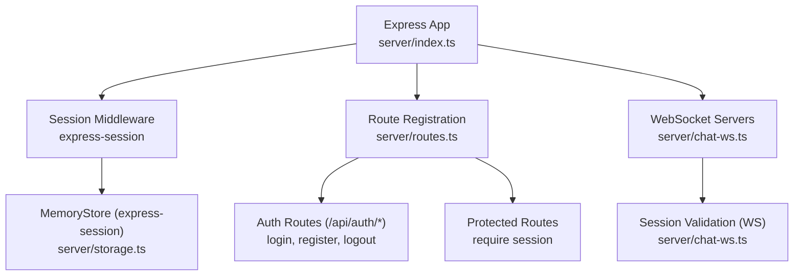
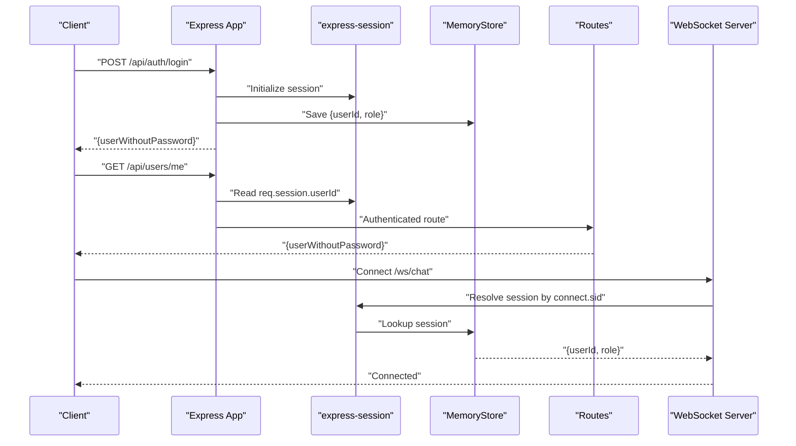
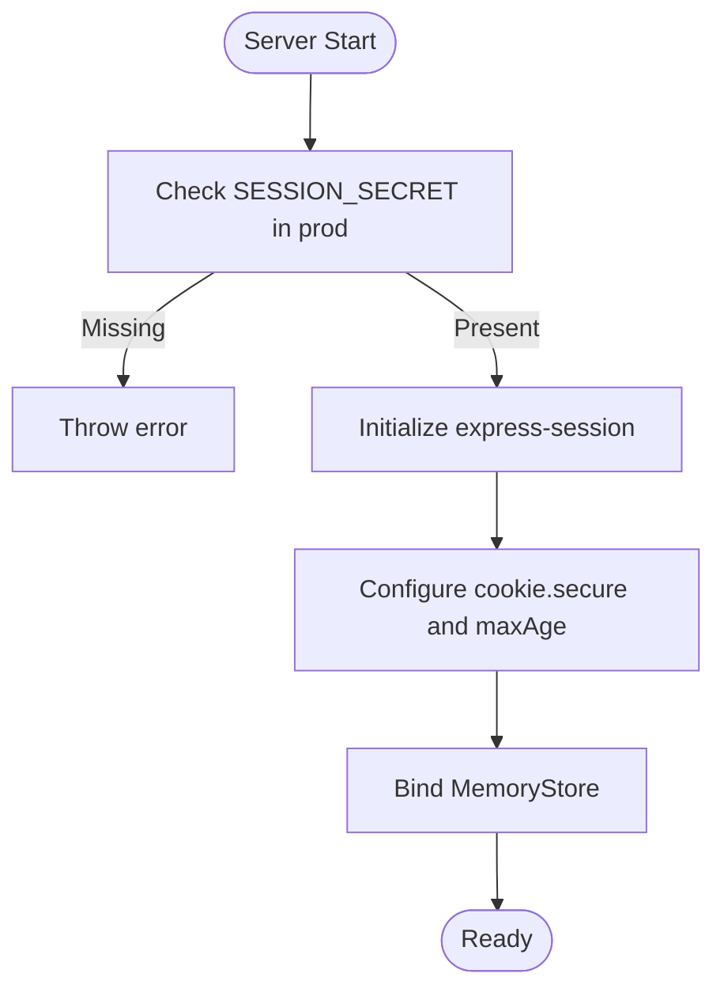
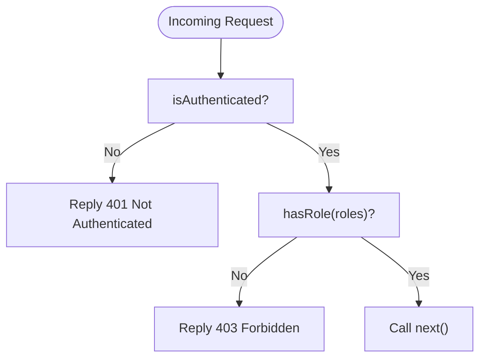
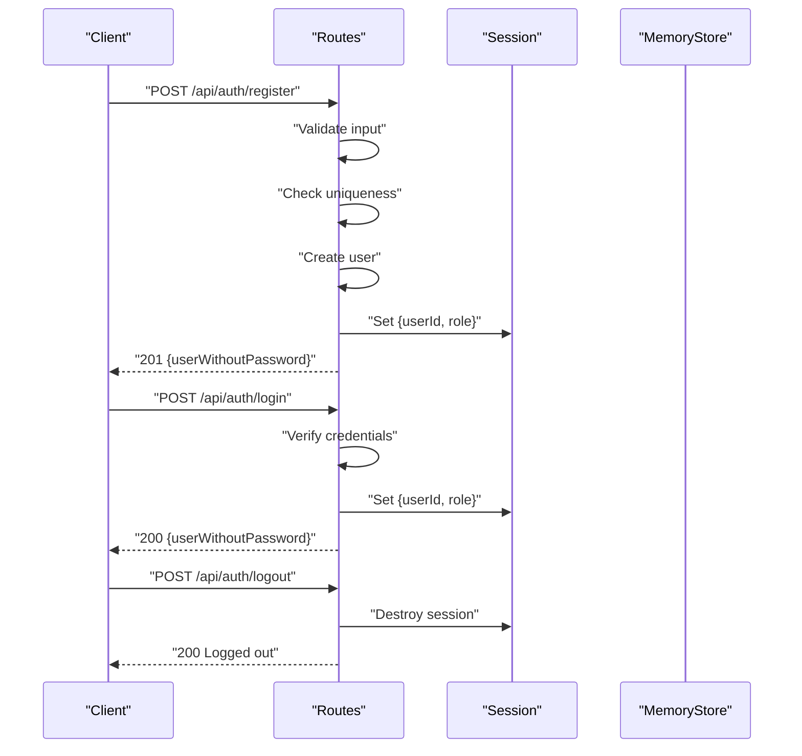
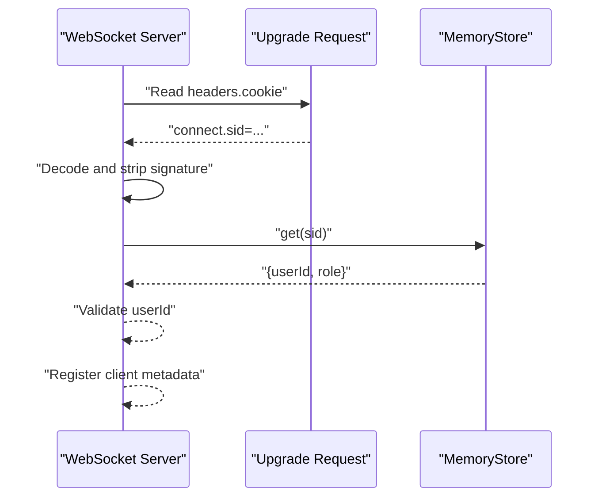
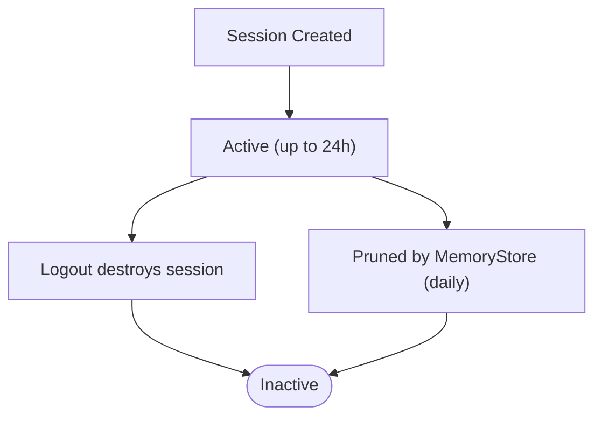
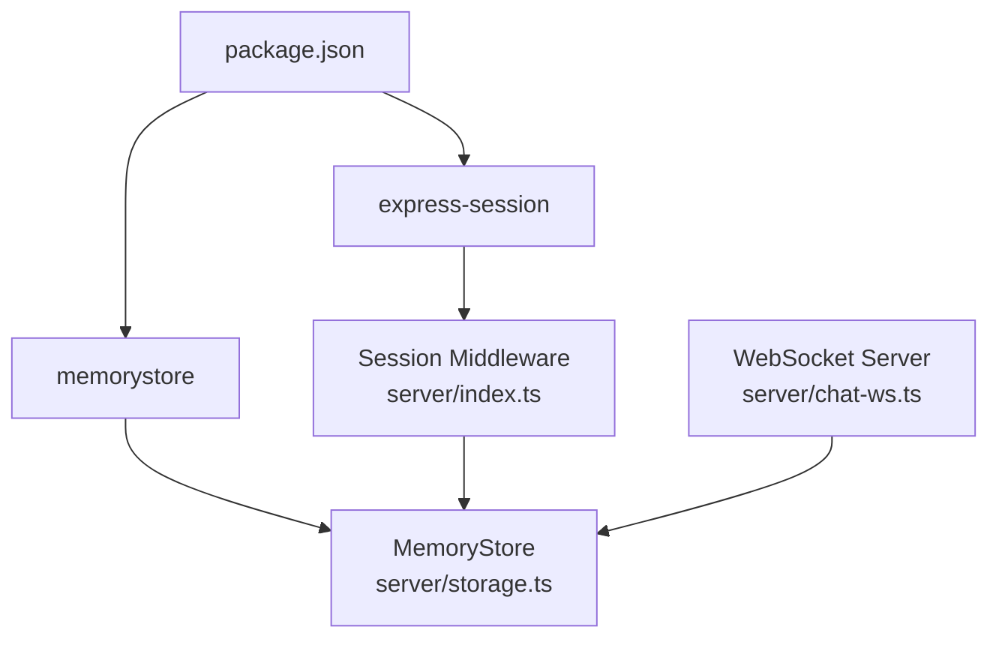

# Session Management & Security Middleware

<cite>
**Referenced Files in This Document**
- [server/index.ts](file://server/index.ts)
- [server/middleware.ts](file://server/middleware.ts)
- [server/routes.ts](file://server/routes.ts)
- [server/storage.ts](file://server/storage.ts)
- [server/chat-ws.ts](file://server/chat-ws.ts)
- [server/types/express-session.d.ts](file://server/types/express-session.d.ts)
- [server/vite.ts](file://server/vite.ts)
- [.env](file://.env)
- [package.json](file://package.json)
</cite>

## Table of Contents
1. [Introduction](#introduction)
2. [Project Structure](#project-structure)
3. [Core Components](#core-components)
4. [Architecture Overview](#architecture-overview)
5. [Detailed Component Analysis](#detailed-component-analysis)
6. [Dependency Analysis](#dependency-analysis)
7. [Performance Considerations](#performance-considerations)
8. [Troubleshooting Guide](#troubleshooting-guide)
9. [Conclusion](#conclusion)

## Introduction
This document explains session management and security middleware in PersonalLearningPro. It focuses on how authentication middleware enforces session-based access, how sessions are validated across HTTP and WebSocket connections, and how secure cookie settings are applied. It also covers session lifecycle management, automatic cleanup, CORS policy configuration, CSRF protection, and secure logout procedures. Guidance is provided for middleware chain implementation, session persistence strategies, security headers configuration, session hijacking prevention, brute force attack mitigation, and secure logout.

## Project Structure
The server initializes Express, registers routes, attaches WebSocket servers, and configures session storage. Authentication and authorization checks are performed via middleware and route handlers. Sessions are persisted in-memory and cleaned periodically.

**Diagram sources**
- [server/index.ts](file://server/index.ts#L35-L44)
- [server/routes.ts](file://server/routes.ts#L13-L85)
- [server/storage.ts](file://server/storage.ts#L110-L118)
- [server/chat-ws.ts](file://server/chat-ws.ts#L119-L130)

**Section sources**
- [server/index.ts](file://server/index.ts#L35-L44)
- [server/routes.ts](file://server/routes.ts#L13-L85)
- [server/storage.ts](file://server/storage.ts#L110-L118)
- [server/chat-ws.ts](file://server/chat-ws.ts#L119-L130)

## Core Components
- Session configuration and cookie policy
  - Secret, resave/saveUninitialized, secure flag, and maxAge are set during session initialization.
  - Production requires SESSION_SECRET to be defined.
- Authentication middleware
  - isAuthenticated checks req.session.userId presence.
  - hasRole validates req.session.userRole against allowed roles.
- Route-level session usage
  - Login and registration set req.session.userId and role.
  - Logout destroys the session.
- WebSocket session validation
  - Extracts connect.sid, decodes it, and resolves userId from session store.
- Session store
  - MemoryStore with periodic pruning (every 24 hours).

**Section sources**
- [server/index.ts](file://server/index.ts#L31-L44)
- [server/middleware.ts](file://server/middleware.ts#L3-L17)
- [server/routes.ts](file://server/routes.ts#L34-L75)
- [server/routes.ts](file://server/routes.ts#L78-L85)
- [server/chat-ws.ts](file://server/chat-ws.ts#L94-L115)
- [server/storage.ts](file://server/storage.ts#L110-L118)

## Architecture Overview
The system uses express-session with a MemoryStore for session persistence. Authentication is enforced at both HTTP and WebSocket layers. The session cookie is secure in production and lasts 24 hours.

**Diagram sources**
- [server/index.ts](file://server/index.ts#L35-L44)
- [server/routes.ts](file://server/routes.ts#L34-L75)
- [server/routes.ts](file://server/routes.ts#L88-L107)
- [server/chat-ws.ts](file://server/chat-ws.ts#L119-L130)
- [server/storage.ts](file://server/storage.ts#L110-L118)

## Detailed Component Analysis

### Session Initialization and Cookie Policy
- Secret: Uses SESSION_SECRET if available; otherwise falls back to a default in development.
- Secure cookie: Enabled in production.
- Max age: 24 hours.
- Store: MemoryStore instance.
- Environment requirement: SESSION_SECRET is mandatory in production.

**Diagram sources**
- [server/index.ts](file://server/index.ts#L31-L44)

**Section sources**
- [server/index.ts](file://server/index.ts#L31-L44)

### Authentication Middleware
- isAuthenticated: Blocks requests without req.session.userId.
- hasRole: Higher-order function returning middleware that checks req.session.userRole against allowed roles.

**Diagram sources**
- [server/middleware.ts](file://server/middleware.ts#L3-L17)

**Section sources**
- [server/middleware.ts](file://server/middleware.ts#L3-L17)

### Route-Level Session Management
- POST /api/auth/register
  - Validates input, checks uniqueness, creates user, sets req.session.userId and role, returns sanitized user.
- POST /api/auth/login
  - Validates credentials, sets req.session.userId and role, returns sanitized user.
- POST /api/auth/logout
  - Destroys session and replies success.
- GET /api/users/me
  - Requires session; fetches user and returns sanitized data.

**Diagram sources**
- [server/routes.ts](file://server/routes.ts#L13-L76)
- [server/routes.ts](file://server/routes.ts#L78-L85)

**Section sources**
- [server/routes.ts](file://server/routes.ts#L13-L76)
- [server/routes.ts](file://server/routes.ts#L78-L85)

### Session Validation in WebSockets
- Extracts connect.sid from the cookie header.
- Decodes the session ID and strips the signature prefix.
- Resolves session via sessionStore.get and validates presence of userId.
- On success, registers client metadata and enables rate limiting.

**Diagram sources**
- [server/chat-ws.ts](file://server/chat-ws.ts#L94-L115)

**Section sources**
- [server/chat-ws.ts](file://server/chat-ws.ts#L94-L115)

### Session Lifecycle and Automatic Cleanup
- MemoryStore prunes expired entries every 24 hours.
- Sessions persist for 24 hours (maxAge).
- Logout destroys the session immediately.

**Diagram sources**
- [server/storage.ts](file://server/storage.ts#L110-L118)
- [server/index.ts](file://server/index.ts#L39-L42)
- [server/routes.ts](file://server/routes.ts#L78-L85)

**Section sources**
- [server/storage.ts](file://server/storage.ts#L110-L118)
- [server/index.ts](file://server/index.ts#L39-L42)
- [server/routes.ts](file://server/routes.ts#L78-L85)

### Security Headers and Cookie Settings
- Secure cookie: Enabled in production via NODE_ENV.
- SameSite: Implicitly managed by express-session defaults.
- Domain/Path: Not explicitly configured; defaults apply.
- Recommendation: Explicitly set cookie.sameSite and cookie.domain/path for stricter controls.

**Section sources**
- [server/index.ts](file://server/index.ts#L39-L42)

### CORS Policy Configuration
- No explicit CORS middleware is configured in the server initialization.
- If cross-origin requests are needed, configure a CORS library (e.g., cors) early in the middleware chain.

**Section sources**
- [server/index.ts](file://server/index.ts#L20-L21)

### CSRF Protection
- No CSRF middleware is currently configured.
- Recommendation: Integrate a CSRF protection library (e.g., csurf) and ensure tokens are embedded in forms and validated on the server.

**Section sources**
- [server/index.ts](file://server/index.ts#L35-L44)

### Token Verification Processes
- The server does not implement JWT verification; authentication relies on express-session.
- If token-based auth is desired, integrate a JWT library and add middleware to validate tokens.

**Section sources**
- [server/index.ts](file://server/index.ts#L35-L44)

### Middleware Chain Implementation Examples
- Order of middleware matters:
  1) Body parsing (express.json, express.urlencoded)
  2) Session middleware (express-session)
  3) Logging middleware
  4) Route registration
  5) Vite/Static serving (development/production)
- Authentication middleware can be mounted globally or per-route.

**Section sources**
- [server/index.ts](file://server/index.ts#L20-L21)
- [server/index.ts](file://server/index.ts#L35-L44)
- [server/index.ts](file://server/index.ts#L46-L74)

### Session Persistence Strategies
- Current: MemoryStore for in-memory sessions with daily pruning.
- Alternative strategies:
  - Redis/MongoDB-backed stores for distributed deployments.
  - Configure store option in session({}) with appropriate adapter.

**Section sources**
- [server/storage.ts](file://server/storage.ts#L110-L118)
- [server/index.ts](file://server/index.ts#L43-L44)

### Secure Logout Procedures
- Logout endpoint calls req.session.destroy and returns success.
- Recommendation: Invalidate refresh tokens (if applicable), clear client-side tokens, and invalidate any device-specific session identifiers.

**Section sources**
- [server/routes.ts](file://server/routes.ts#L78-L85)

### Session Hijacking Prevention
- Use secure cookies in production.
- Regenerate session IDs after login to prevent fixation.
- Enforce strict SameSite policies and consider adding CSRF protection.

**Section sources**
- [server/index.ts](file://server/index.ts#L39-L42)
- [server/index.ts](file://server/index.ts#L35-L44)

### Brute Force Attack Mitigation
- Implement rate limiting at the HTTP layer for login endpoints.
- Consider account lockout or CAPTCHA after repeated failures.
- Monitor and log suspicious activity.

**Section sources**
- [server/routes.ts](file://server/routes.ts#L49-L76)

## Dependency Analysis
- express-session provides session management and integrates with MemoryStore.
- MemoryStore is initialized in storage.ts and bound to the session middleware.
- WebSocket servers depend on the shared session store to validate connections.

**Diagram sources**
- [package.json](file://package.json#L54-L61)
- [server/index.ts](file://server/index.ts#L35-L44)
- [server/storage.ts](file://server/storage.ts#L110-L118)
- [server/chat-ws.ts](file://server/chat-ws.ts#L119-L130)

**Section sources**
- [package.json](file://package.json#L54-L61)
- [server/index.ts](file://server/index.ts#L35-L44)
- [server/storage.ts](file://server/storage.ts#L110-L118)
- [server/chat-ws.ts](file://server/chat-ws.ts#L119-L130)

## Performance Considerations
- MemoryStore is suitable for development and small-scale deployments; consider Redis/MongoDB stores for production scalability.
- Periodic pruning reduces memory footprint but does not replace proper session invalidation.
- WebSocket rate limiting prevents flooding; consider adding IP-based limits and message size caps.

[No sources needed since this section provides general guidance]

## Troubleshooting Guide
- 401 Not Authenticated on protected routes
  - Ensure login succeeded and req.session.userId is set.
  - Verify the session cookie is being sent with the request.
- 403 Forbidden on role-restricted routes
  - Confirm req.session.userRole matches allowed roles.
- WebSocket connection rejected
  - Check that connect.sid is present and valid.
  - Ensure session store contains the session and userId is present.
- Production error about SESSION_SECRET
  - Set SESSION_SECRET in environment variables.

**Section sources**
- [server/middleware.ts](file://server/middleware.ts#L3-L17)
- [server/routes.ts](file://server/routes.ts#L88-L107)
- [server/chat-ws.ts](file://server/chat-ws.ts#L122-L130)
- [server/index.ts](file://server/index.ts#L31-L33)

## Conclusion
PersonalLearningPro uses express-session for authentication and session persistence with MemoryStore. Authentication is enforced via middleware and route handlers, while WebSocket connections validate sessions using the same store. Secure cookie settings are enabled in production, and sessions are pruned periodically. To harden the system, add CORS, CSRF protection, and consider migrating to a scalable session store. Implement rate limiting for login endpoints and enforce secure logout practices.