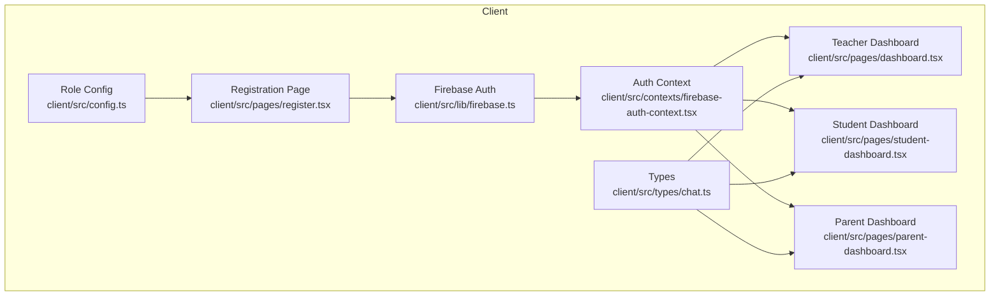
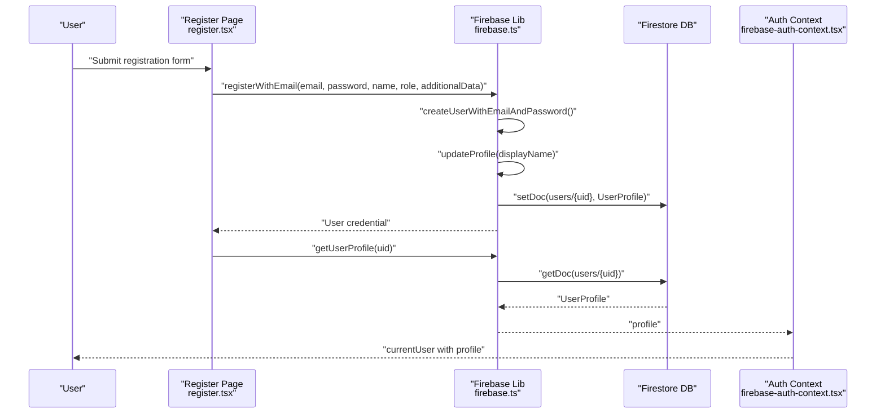
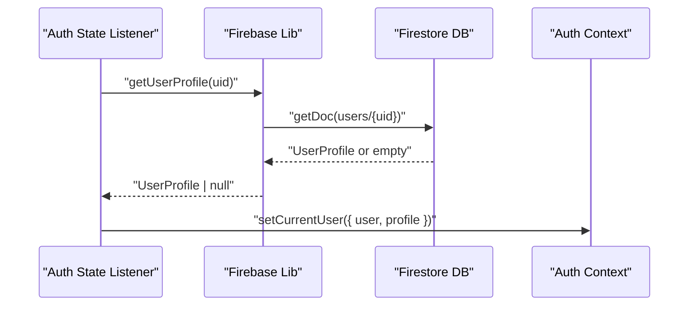
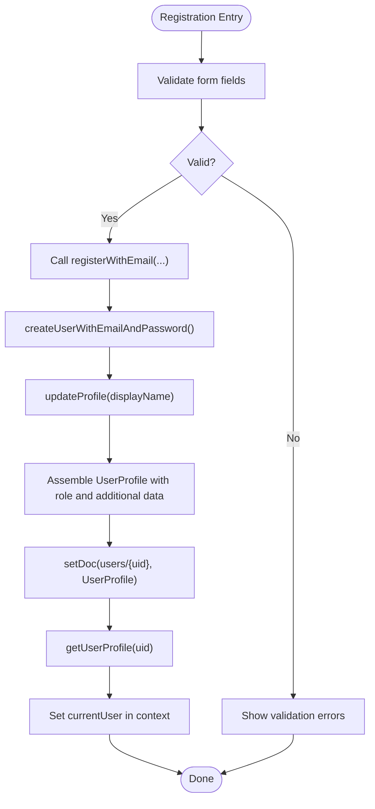
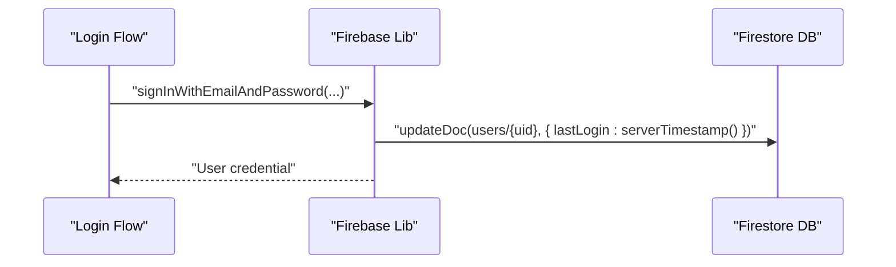
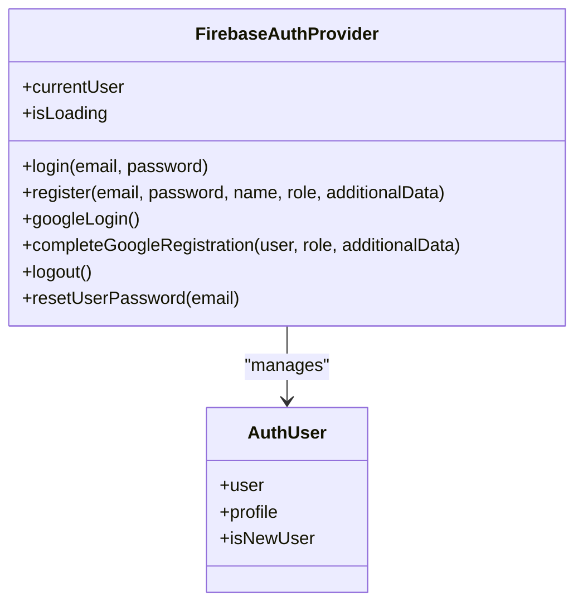
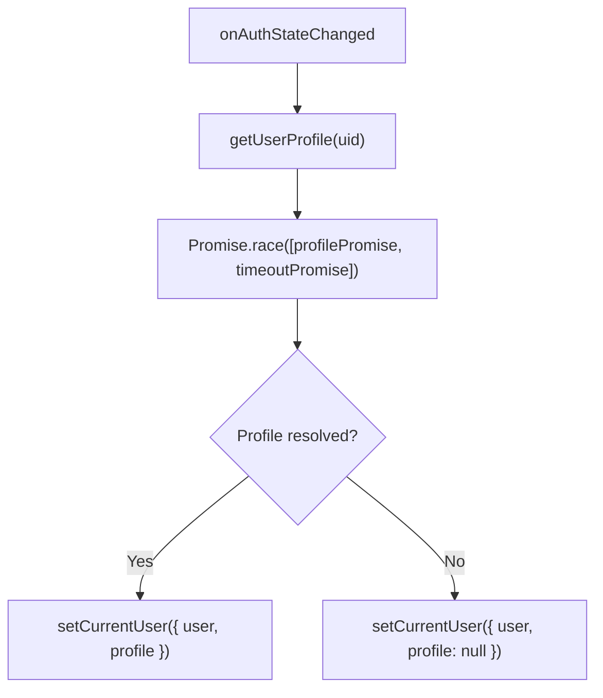
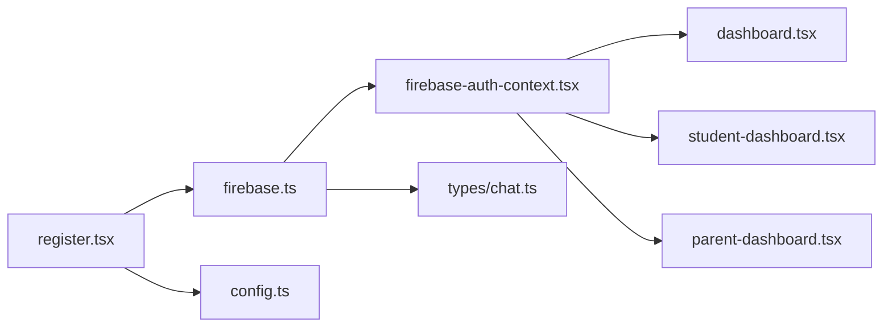

# User Profile Management

<cite>
**Referenced Files in This Document**
- [firebase.ts](file://client/src/lib/firebase.ts)
- [firebase-auth-context.tsx](file://client/src/contexts/firebase-auth-context.tsx)
- [register.tsx](file://client/src/pages/register.tsx)
- [chat.ts](file://client/src/types/chat.ts)
- [config.ts](file://client/src/config.ts)
- [dashboard.tsx](file://client/src/pages/dashboard.tsx)
- [student-dashboard.tsx](file://client/src/pages/student-dashboard.tsx)
- [parent-dashboard.tsx](file://client/src/pages/parent-dashboard.tsx)
</cite>

## Table of Contents
1. [Introduction](#introduction)
2. [Project Structure](#project-structure)
3. [Core Components](#core-components)
4. [Architecture Overview](#architecture-overview)
5. [Detailed Component Analysis](#detailed-component-analysis)
6. [Dependency Analysis](#dependency-analysis)
7. [Performance Considerations](#performance-considerations)
8. [Troubleshooting Guide](#troubleshooting-guide)
9. [Conclusion](#conclusion)
10. [Appendices](#appendices)

## Introduction
This document describes the user profile management system in PersonalLearningPro. It covers the UserProfile interface, profile data model, profile retrieval mechanisms, creation during registration, updates, synchronization with Firebase Authentication, context integration, caching strategies, offline handling, validation rules, privacy and data protection measures, and data consistency across sessions.

## Project Structure
The user profile system spans three primary areas:
- Firebase integration and profile persistence in Firestore
- Authentication state management and profile hydration
- UI dashboards that consume the profile for rendering



**Diagram sources**
- [firebase.ts](file://client/src/lib/firebase.ts#L1-L212)
- [firebase-auth-context.tsx](file://client/src/contexts/firebase-auth-context.tsx#L1-L267)
- [register.tsx](file://client/src/pages/register.tsx#L1-L338)
- [dashboard.tsx](file://client/src/pages/dashboard.tsx#L1-L338)
- [student-dashboard.tsx](file://client/src/pages/student-dashboard.tsx#L1-L1001)
- [parent-dashboard.tsx](file://client/src/pages/parent-dashboard.tsx#L1-L279)
- [chat.ts](file://client/src/types/chat.ts#L1-L83)
- [config.ts](file://client/src/config.ts#L1-L7)

**Section sources**
- [firebase.ts](file://client/src/lib/firebase.ts#L1-L212)
- [firebase-auth-context.tsx](file://client/src/contexts/firebase-auth-context.tsx#L1-L267)
- [register.tsx](file://client/src/pages/register.tsx#L1-L338)
- [dashboard.tsx](file://client/src/pages/dashboard.tsx#L1-L338)
- [student-dashboard.tsx](file://client/src/pages/student-dashboard.tsx#L1-L1001)
- [parent-dashboard.tsx](file://client/src/pages/parent-dashboard.tsx#L1-L279)
- [chat.ts](file://client/src/types/chat.ts#L1-L83)
- [config.ts](file://client/src/config.ts#L1-L7)

## Core Components
- UserProfile interface: Defines the shape of user data stored in Firestore, including identifiers, contact info, roles, and metadata.
- Authentication and profile persistence: Firebase Auth handles identity; Firestore stores and synchronizes profile documents.
- Auth context: Hydrates the current user and profile, manages loading states, and exposes login/register/logout flows.
- Registration page: Collects user inputs, validates them, and triggers profile creation.
- Dashboards: Consume the profile for rendering personalized content.

**Section sources**
- [firebase.ts](file://client/src/lib/firebase.ts#L50-L63)
- [firebase-auth-context.tsx](file://client/src/contexts/firebase-auth-context.tsx#L18-L34)
- [register.tsx](file://client/src/pages/register.tsx#L36-L46)

## Architecture Overview
The profile lifecycle integrates Firebase Authentication with Firestore:



**Diagram sources**
- [register.tsx](file://client/src/pages/register.tsx#L70-L86)
- [firebase.ts](file://client/src/lib/firebase.ts#L80-L115)
- [firebase-auth-context.tsx](file://client/src/contexts/firebase-auth-context.tsx#L97-L125)

## Detailed Component Analysis

### UserProfile Interface and Data Model
UserProfile defines the canonical user record persisted in Firestore. It includes:
- Identity: uid, email, displayName
- Role and affiliation: role, institutionId, classId, studentId
- Specialized fields: subjects for teachers
- Timestamps: createdAt, lastLogin
- Optional avatar: photoURL

```mermaid
classDiagram
class UserProfile {
+string uid
+string email
+string displayName
+UserRole role
+string photoURL
+string institutionId
+string classId
+string studentId
+string[] subjects
+any createdAt
+any lastLogin
}
class UserRole {
<<enumeration>>
"principal"
"admin"
"teacher"
"student"
"parent"
}
UserProfile --> UserRole : "uses"
```

**Diagram sources**
- [firebase.ts](file://client/src/lib/firebase.ts#L48-L63)

**Section sources**
- [firebase.ts](file://client/src/lib/firebase.ts#L48-L63)

### Profile Retrieval Mechanisms
- getUserProfile(uid): Reads the user document from Firestore and returns a typed UserProfile or null.
- onAuthStateChanged listener hydrates the profile upon auth state changes with a timeout to avoid hanging when offline.



**Diagram sources**
- [firebase-auth-context.tsx](file://client/src/contexts/firebase-auth-context.tsx#L50-L71)
- [firebase.ts](file://client/src/lib/firebase.ts#L199-L212)

**Section sources**
- [firebase-auth-context.tsx](file://client/src/contexts/firebase-auth-context.tsx#L43-L71)
- [firebase.ts](file://client/src/lib/firebase.ts#L199-L212)

### Profile Creation During Registration
- Email/password registration:
  - Creates the Firebase user
  - Updates the user's display name
  - Writes a UserProfile document to Firestore with timestamps and additional data
- Google registration:
  - Signs in via popup
  - If the Firestore user does not exist, signals an "isNewUser" state for onboarding
  - On completion, writes the profile document



**Diagram sources**
- [register.tsx](file://client/src/pages/register.tsx#L70-L86)
- [firebase.ts](file://client/src/lib/firebase.ts#L80-L115)
- [firebase-auth-context.tsx](file://client/src/contexts/firebase-auth-context.tsx#L97-L125)

**Section sources**
- [register.tsx](file://client/src/pages/register.tsx#L36-L46)
- [firebase.ts](file://client/src/lib/firebase.ts#L80-L115)
- [firebase-auth-context.tsx](file://client/src/contexts/firebase-auth-context.tsx#L97-L125)

### Profile Updates and Synchronization
- Login with email updates lastLogin timestamp in Firestore.
- Google login updates lastLogin if the user exists.
- Profile updates from Firebase Auth (e.g., displayName/photoURL) are reflected in Firestore via the profile document.



**Diagram sources**
- [firebase.ts](file://client/src/lib/firebase.ts#L66-L78)
- [firebase.ts](file://client/src/lib/firebase.ts#L135-L139)

**Section sources**
- [firebase.ts](file://client/src/lib/firebase.ts#L66-L78)
- [firebase.ts](file://client/src/lib/firebase.ts#L135-L139)

### User Profile Context Integration
- FirebaseAuthProvider:
  - Tracks currentUser (user + profile) and isLoading
  - Provides login, register, googleLogin, completeGoogleRegistration, logout, resetPassword
  - Hydrates profile on auth state change with a 5-second timeout to handle offline scenarios
- Consumers (dashboards) access the profile via useFirebaseAuth() and render personalized content.



**Diagram sources**
- [firebase-auth-context.tsx](file://client/src/contexts/firebase-auth-context.tsx#L25-L34)
- [firebase-auth-context.tsx](file://client/src/contexts/firebase-auth-context.tsx#L18-L23)

**Section sources**
- [firebase-auth-context.tsx](file://client/src/contexts/firebase-auth-context.tsx#L18-L34)
- [firebase-auth-context.tsx](file://client/src/contexts/firebase-auth-context.tsx#L38-L71)

### Profile Caching Strategies and Offline Handling
- Timeout-based hydration: A race between profile fetch and a 5-second timeout prevents indefinite hanging when Firestore is offline.
- Graceful degradation: When Firebase is not configured, auth features are disabled and loading completes immediately.



**Diagram sources**
- [firebase-auth-context.tsx](file://client/src/contexts/firebase-auth-context.tsx#L50-L71)

**Section sources**
- [firebase-auth-context.tsx](file://client/src/contexts/firebase-auth-context.tsx#L43-L71)

### Offline Profile Handling
- If Firestore is unreachable, the context sets profile to null after the timeout, allowing the UI to render with partial data (e.g., basic auth info).
- Subsequent online state transitions will rehydrate the profile automatically.

**Section sources**
- [firebase-auth-context.tsx](file://client/src/contexts/firebase-auth-context.tsx#L50-L71)

### Examples of Profile Data Models
- UserProfile: uid, email, displayName, role, optional photoURL, institution/class/student identifiers, subjects array, timestamps.
- Role-specific data: Additional fields like classId, subjects, institutionId, studentId are populated based on role and registration inputs.

**Section sources**
- [firebase.ts](file://client/src/lib/firebase.ts#L50-L63)
- [config.ts](file://client/src/config.ts#L1-L7)

### Profile Update Workflows
- Registration: Assembles UserProfile from form inputs and additionalData, persists to Firestore, then hydrates the context.
- Login: Retrieves profile and updates lastLogin timestamp.
- Google Sign-In: Detects new/existing users and either defers profile creation until completion or updates lastLogin.

**Section sources**
- [register.tsx](file://client/src/pages/register.tsx#L70-L86)
- [firebase.ts](file://client/src/lib/firebase.ts#L80-L115)
- [firebase.ts](file://client/src/lib/firebase.ts#L117-L150)
- [firebase-auth-context.tsx](file://client/src/contexts/firebase-auth-context.tsx#L73-L125)

### Profile Validation Rules
- Registration form enforces:
  - Username length
  - Password length
  - Email format
  - Role selection
  - Conditional fields for student class and teacher subject
- UI validation feedback is shown via form errors.

**Section sources**
- [register.tsx](file://client/src/pages/register.tsx#L36-L46)

### Profile Privacy Settings and Data Protection
- Firebase configuration is guarded; if credentials are missing, auth features are disabled and a warning is logged.
- Profile fields include optional avatar and role-specific identifiers; sensitive fields are not exposed beyond the UI needs.
- Password reset leverages Firebase Auth’s built-in mechanism.

**Section sources**
- [firebase.ts](file://client/src/lib/firebase.ts#L27-L45)
- [firebase.ts](file://client/src/lib/firebase.ts#L189-L197)

### Profile Data Consistency Across Sessions
- lastLogin is updated on each login to track session activity.
- onAuthStateChanged ensures the profile is hydrated on app load and device wake-ups.
- Role-specific fields are populated during registration and can be extended via additionalData.

**Section sources**
- [firebase.ts](file://client/src/lib/firebase.ts#L66-L78)
- [firebase.ts](file://client/src/lib/firebase.ts#L135-L139)
- [firebase-auth-context.tsx](file://client/src/contexts/firebase-auth-context.tsx#L43-L71)

## Dependency Analysis
- Registration depends on:
  - Form validation (register.tsx)
  - Firebase registration and profile write (firebase.ts)
  - Context hydration (firebase-auth-context.tsx)
- Dashboards depend on:
  - Auth context for currentUser.profile
  - Types for role and user shapes (types/chat.ts)
  - Role-specific configuration (config.ts)



**Diagram sources**
- [register.tsx](file://client/src/pages/register.tsx#L1-L338)
- [firebase.ts](file://client/src/lib/firebase.ts#L1-L212)
- [firebase-auth-context.tsx](file://client/src/contexts/firebase-auth-context.tsx#L1-L267)
- [dashboard.tsx](file://client/src/pages/dashboard.tsx#L1-L338)
- [student-dashboard.tsx](file://client/src/pages/student-dashboard.tsx#L1-L1001)
- [parent-dashboard.tsx](file://client/src/pages/parent-dashboard.tsx#L1-L279)
- [chat.ts](file://client/src/types/chat.ts#L1-L83)
- [config.ts](file://client/src/config.ts#L1-L7)

**Section sources**
- [register.tsx](file://client/src/pages/register.tsx#L1-L338)
- [firebase.ts](file://client/src/lib/firebase.ts#L1-L212)
- [firebase-auth-context.tsx](file://client/src/contexts/firebase-auth-context.tsx#L1-L267)
- [dashboard.tsx](file://client/src/pages/dashboard.tsx#L1-L338)
- [student-dashboard.tsx](file://client/src/pages/student-dashboard.tsx#L1-L1001)
- [parent-dashboard.tsx](file://client/src/pages/parent-dashboard.tsx#L1-L279)
- [chat.ts](file://client/src/types/chat.ts#L1-L83)
- [config.ts](file://client/src/config.ts#L1-L7)

## Performance Considerations
- Profile hydration uses a timeout to avoid blocking UI on network failures.
- Firestore writes occur once per registration/login; consider batching or debouncing if extending update flows.
- Keep profile reads minimal; fetch only required fields if adding frequent updates.

[No sources needed since this section provides general guidance]

## Troubleshooting Guide
Common issues and resolutions:
- Firebase not configured:
  - Symptoms: Auth features disabled, immediate loading completion.
  - Resolution: Provide Firebase credentials and reload.
- Profile fetch timeout:
  - Symptoms: Profile appears null briefly on slow networks.
  - Resolution: UI gracefully renders with basic auth info; profile hydrates when online.
- Registration errors:
  - Symptoms: Validation errors or backend failures.
  - Resolution: UI displays form errors; ensure role and conditional fields match validation rules.

**Section sources**
- [firebase.ts](file://client/src/lib/firebase.ts#L27-L45)
- [firebase-auth-context.tsx](file://client/src/contexts/firebase-auth-context.tsx#L50-L71)
- [register.tsx](file://client/src/pages/register.tsx#L70-L86)

## Conclusion
PersonalLearningPro’s profile management integrates Firebase Authentication with Firestore to provide a robust, role-aware user model. The system supports secure registration, reliable profile hydration, offline resilience, and role-specific personalization across dashboards. Extending update flows should preserve consistency by updating lastLogin and ensuring profile reads remain fast and resilient.

[No sources needed since this section summarizes without analyzing specific files]

## Appendices

### Appendix A: Role-Specific Fields
- Student: classId
- Teacher: subjects
- Principal/Admin: institutionId
- Parent: studentId

**Section sources**
- [config.ts](file://client/src/config.ts#L1-L7)
- [firebase.ts](file://client/src/lib/firebase.ts#L50-L63)