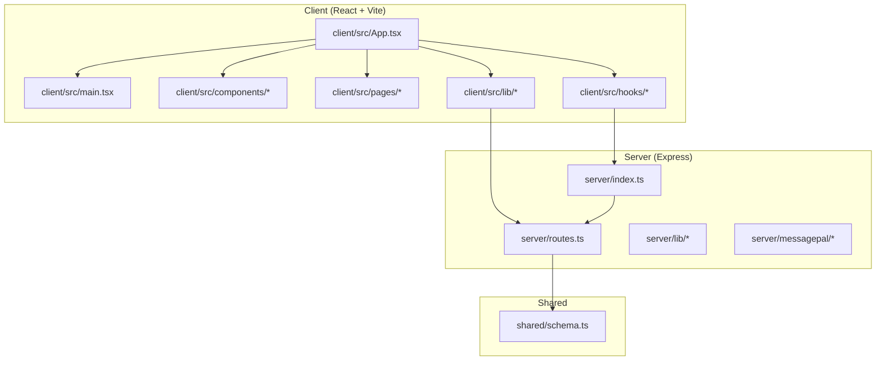
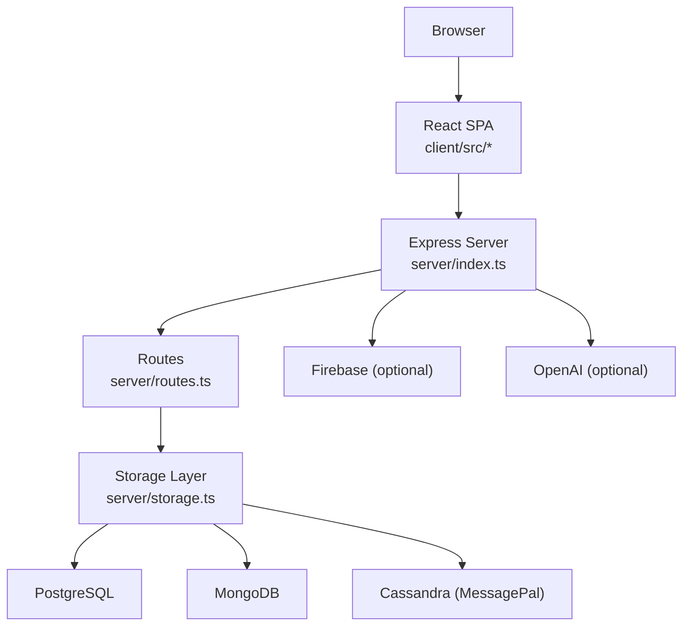
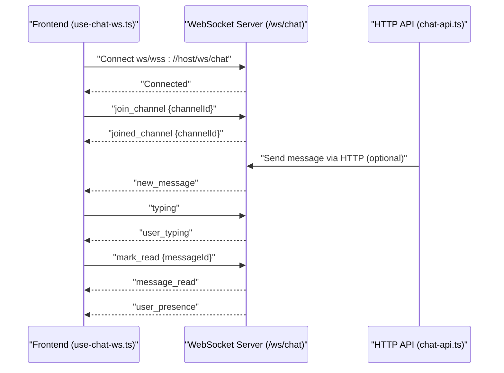
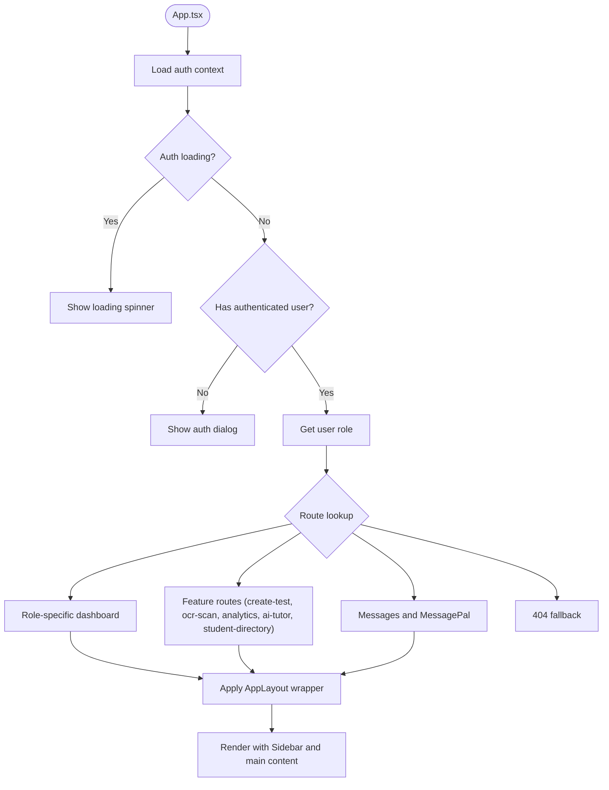
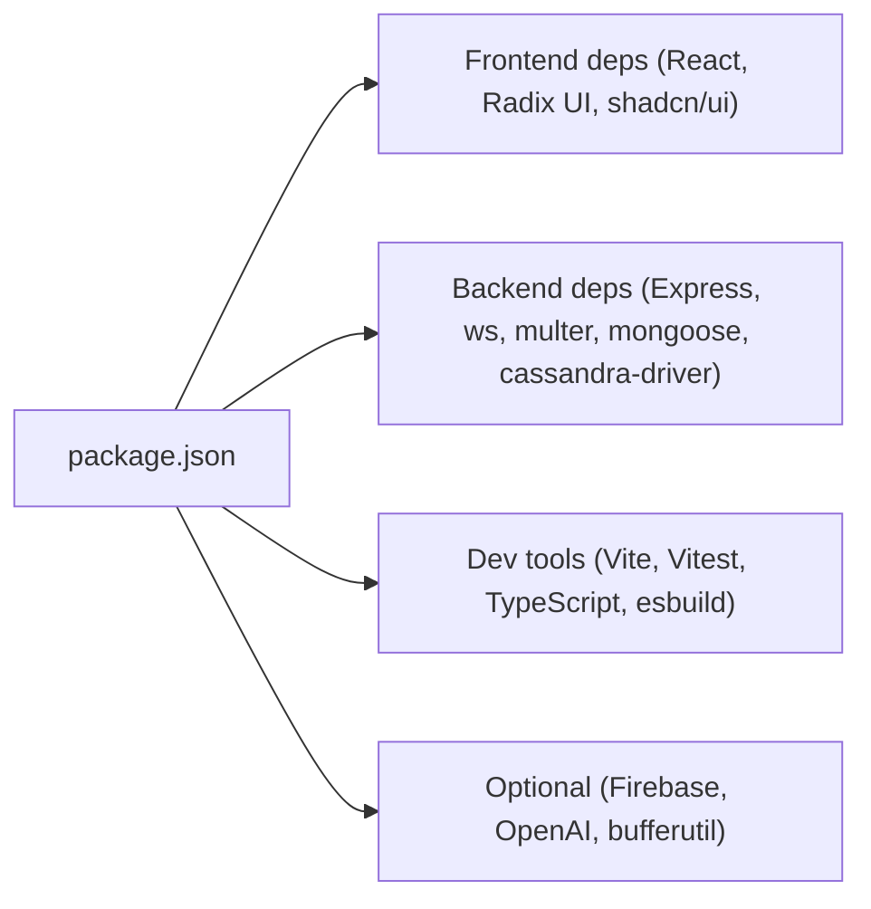

# Contributing Guidelines

<cite>
**Referenced Files in This Document**
- [CONTRIBUTING.md](file://CONTRIBUTING.md)
- [CLA.md](file://CLA.md)
- [.github/workflows/cla.yml](file://.github/workflows/cla.yml)
- [CODE_OF_CONDUCT.md](file://CODE_OF_CONDUCT.md)
- [README.md](file://README.md)
- [LOCAL_SETUP.md](file://LOCAL_SETUP.md)
- [CHANGELOG.md](file://CHANGELOG.md)
- [.github/pull_request_template.md](file://.github/pull_request_template.md)
- [package.json](file://package.json)
- [server/index.ts](file://server/index.ts)
- [server/routes.ts](file://server/routes.ts)
- [client/src/App.tsx](file://client/src/App.tsx)
- [client/src/main.tsx](file://client/src/main.tsx)
- [client/src/tests/LoginPage.test.tsx](file://client/src/tests/LoginPage.test.tsx)
- [client/src/hooks/use-chat-ws.ts](file://client/src/hooks/use-chat-ws.ts)
- [client/src/lib/chat-api.ts](file://client/src/lib/chat-api.ts)
</cite>

## Table of Contents
1. [Introduction](#introduction)
2. [Project Structure](#project-structure)
3. [Core Components](#core-components)
4. [Architecture Overview](#architecture-overview)
5. [Detailed Component Analysis](#detailed-component-analysis)
6. [Dependency Analysis](#dependency-analysis)
7. [Performance Considerations](#performance-considerations)
8. [Troubleshooting Guide](#troubleshooting-guide)
9. [Conclusion](#conclusion)
10. [Appendices](#appendices)

## Introduction
This document provides comprehensive contributing guidelines for PersonalLearningPro. It covers the development workflow (fork and clone, branching, commits), code review and pull request process, testing expectations, project structure, coding standards, architectural principles, CLA requirements, contributor onboarding, community guidelines, issue and feature request processes, documentation contributions, and release/versioning/maintenance responsibilities.

## Project Structure
PersonalLearningPro is a full-stack monorepo-like application with a single Express server serving both the API and a Vite-built React frontend on port 5001. The repository is organized into client, server, shared, and supporting configuration files.

**Diagram sources**
- [client/src/App.tsx](file://client/src/App.tsx#L1-L165)
- [client/src/main.tsx](file://client/src/main.tsx#L1-L8)
- [server/index.ts](file://server/index.ts#L1-L114)
- [server/routes.ts](file://server/routes.ts#L1-L800)
- [shared/schema.ts](file://shared/schema.ts#L1-L200)

**Section sources**
- [README.md](file://README.md#L70-L102)
- [client/src/App.tsx](file://client/src/App.tsx#L1-L165)
- [client/src/main.tsx](file://client/src/main.tsx#L1-L8)
- [server/index.ts](file://server/index.ts#L103-L114)
- [server/routes.ts](file://server/routes.ts#L1-L1104)

## Core Components
- Frontend entry and routing: The React application initializes in main.tsx and renders App.tsx, which defines role-aware routing and layout wrappers.
- Backend entry and middleware: The Express server initializes sessions, logging, static serving, and routes, and serves both API and client on port 5001.
- API surface: Routes.ts defines authentication, user, test, question, attempt, answer, OCR, AI evaluation, and chat/workspace/message endpoints.
- Shared schema: shared/schema.ts defines Zod-based validation schemas used across client and server.

Key implementation references:
- Frontend entry and routing: [client/src/main.tsx](file://client/src/main.tsx#L1-L8), [client/src/App.tsx](file://client/src/App.tsx#L1-L165)
- Server initialization and port: [server/index.ts](file://server/index.ts#L103-L114)
- API routes registration: [server/routes.ts](file://server/routes.ts#L11-L1104)
- Shared schema: [shared/schema.ts](file://shared/schema.ts#L1-L200)

**Section sources**
- [client/src/main.tsx](file://client/src/main.tsx#L1-L8)
- [client/src/App.tsx](file://client/src/App.tsx#L1-L165)
- [server/index.ts](file://server/index.ts#L103-L114)
- [server/routes.ts](file://server/routes.ts#L1-L1104)
- [shared/schema.ts](file://shared/schema.ts#L1-L200)

## Architecture Overview
The system follows a monolithic Express server architecture that:
- Serves the React SPA built by Vite.
- Provides REST APIs for all features (authentication, tests, OCR, AI, chat).
- Integrates optional third-party services (Firebase, OpenAI) and hybrid storage (PostgreSQL and MongoDB).
- Supports real-time features via WebSockets for chat and MessagePal.

**Diagram sources**
- [server/index.ts](file://server/index.ts#L1-L114)
- [server/routes.ts](file://server/routes.ts#L1-L1104)
- [README.md](file://README.md#L114-L122)

**Section sources**
- [server/index.ts](file://server/index.ts#L1-L114)
- [README.md](file://README.md#L114-L122)

## Detailed Component Analysis

### Development Workflow
- Fork and clone the repository.
- Choose setup option:
  - Docker (recommended): Build and run with docker compose; hot reload is supported.
  - Manual setup: Install dependencies, configure environment variables, run dev server.
- Create feature branches using the convention: feature/your-feature-name.
- Run TypeScript checks before committing.
- Push and open a pull request targeting the main branch.

References:
- Fork/clone and setup: [CONTRIBUTING.md](file://CONTRIBUTING.md#L39-L88)
- Branch naming and workflow: [CONTRIBUTING.md](file://CONTRIBUTING.md#L101-L115)
- TypeScript checks: [CONTRIBUTING.md](file://CONTRIBUTING.md#L106-L109), [package.json](file://package.json#L10-L10)

**Section sources**
- [CONTRIBUTING.md](file://CONTRIBUTING.md#L39-L115)
- [package.json](file://package.json#L6-L11)

### Code Review and Pull Request Process
- Use the provided pull request template checklist to ensure completeness.
- Ensure no duplicate PRs, self-review, documentation updates, absence of new warnings, tests included, local passing, and dependent changes merged.
- CLA signing is required before merging; the CLA Assistant bot will guide contributors.

References:
- PR template checklist: [.github/pull_request_template.md](file://.github/pull_request_template.md#L16-L26)
- CLA workflow: [.github/workflows/cla.yml](file://.github/workflows/cla.yml#L1-L38)
- CLA instructions: [CLA.md](file://CLA.md#L38-L44)

**Section sources**
- [.github/pull_request_template.md](file://.github/pull_request_template.md#L1-L26)
- [.github/workflows/cla.yml](file://.github/workflows/cla.yml#L1-L38)
- [CLA.md](file://CLA.md#L38-L44)

### Testing Requirements
- Unit tests are written with Vitest and Testing Library for React.
- Example test coverage includes form input updates, validation errors, and submission behavior.
- Run tests locally using the project’s test script.

References:
- Test example: [client/src/tests/LoginPage.test.tsx](file://client/src/tests/LoginPage.test.tsx#L1-L80)
- Test script: [package.json](file://package.json#L114-L114)

**Section sources**
- [client/src/tests/LoginPage.test.tsx](file://client/src/tests/LoginPage.test.tsx#L1-L80)
- [package.json](file://package.json#L114-L114)

### Coding Standards
- The project does not enforce a code formatter or linter; follow the existing code style in the files being edited.
- Maintain consistency with surrounding code and adhere to TypeScript strictness enforced by the project’s type-checking script.

References:
- Coding style note: [CONTRIBUTING.md](file://CONTRIBUTING.md#L124-L127)
- Type-check script: [package.json](file://package.json#L10-L10)

**Section sources**
- [CONTRIBUTING.md](file://CONTRIBUTING.md#L124-L127)
- [package.json](file://package.json#L10-L10)

### Issue Reporting and Feature Requests
- Report bugs with a clear title, reproduction steps, and relevant error messages or screenshots.
- Suggest enhancements with a clear title and description of the problem solved by the enhancement.

References:
- Bug report guidance: [CONTRIBUTING.md](file://CONTRIBUTING.md#L128-L135)
- Enhancement suggestion guidance: [CONTRIBUTING.md](file://CONTRIBUTING.md#L136-L142)

**Section sources**
- [CONTRIBUTING.md](file://CONTRIBUTING.md#L128-L142)

### Documentation Contributions
- Contribute improvements to existing documentation files (CONTRIBUTING.md, README.md, LOCAL_SETUP.md, etc.) following the same workflow and PR process.

References:
- Contribution workflow: [CONTRIBUTING.md](file://CONTRIBUTING.md#L99-L115)

**Section sources**
- [CONTRIBUTING.md](file://CONTRIBUTING.md#L99-L115)

### Release Process, Versioning, and Maintenance
- Versioning follows semantic versioning as indicated by the changelog.
- Releases are tracked in the changelog with “Added,” “Changed,” and “Fixed” categories.
- Maintenance responsibilities include keeping dependencies updated and ensuring backward compatibility where applicable.

References:
- Changelog and semantic versioning: [CHANGELOG.md](file://CHANGELOG.md#L1-L6)

**Section sources**
- [CHANGELOG.md](file://CHANGELOG.md#L1-L6)

### Contributor Onboarding and Community Guidelines
- Join the community Discord for discussions and support.
- Follow the Code of Conduct in all interactions.
- Top contributor recognition and rewards are available for sustained high-quality contributions.

References:
- Community and reward info: [CONTRIBUTING.md](file://CONTRIBUTING.md#L5-L30)
- Code of Conduct: [CODE_OF_CONDUCT.md](file://CODE_OF_CONDUCT.md#L1-L121)

**Section sources**
- [CONTRIBUTING.md](file://CONTRIBUTING.md#L5-L30)
- [CODE_OF_CONDUCT.md](file://CODE_OF_CONDUCT.md#L1-L121)

### API Workflow Example: Chat WebSocket Integration
This sequence illustrates how the frontend establishes a WebSocket connection, joins a channel, and receives events.

**Diagram sources**
- [client/src/hooks/use-chat-ws.ts](file://client/src/hooks/use-chat-ws.ts#L95-L178)
- [client/src/lib/chat-api.ts](file://client/src/lib/chat-api.ts#L75-L83)

**Section sources**
- [client/src/hooks/use-chat-ws.ts](file://client/src/hooks/use-chat-ws.ts#L1-L218)
- [client/src/lib/chat-api.ts](file://client/src/lib/chat-api.ts#L1-L112)

### Frontend Routing and Layout
The frontend uses a central App.tsx with role-aware routing and a layout wrapper that controls margins and full-width rendering for specific pages.

**Diagram sources**
- [client/src/App.tsx](file://client/src/App.tsx#L93-L150)

**Section sources**
- [client/src/App.tsx](file://client/src/App.tsx#L1-L165)

## Dependency Analysis
The project uses a mix of client-side and server-side dependencies, including UI components, state management, HTTP clients, and optional integrations.

**Diagram sources**
- [package.json](file://package.json#L12-L118)

**Section sources**
- [package.json](file://package.json#L12-L118)

## Performance Considerations
- Hot reload is supported via bind-mounted source directories in Docker; avoid unnecessary rebuilds by editing files directly.
- Keep API responses concise; the server logs API calls with response bodies for debugging.
- Prefer paginated queries for chat/message history to reduce payload sizes.

References:
- Hot reload note: [README.md](file://README.md#L124-L124)
- Logging middleware: [server/index.ts](file://server/index.ts#L46-L74)

**Section sources**
- [README.md](file://README.md#L124-L124)
- [server/index.ts](file://server/index.ts#L46-L74)

## Troubleshooting Guide
Common setup and runtime issues:
- Port conflicts: Change the port in the server entry if 5001 is in use.
- Firebase authentication: Ensure Google authentication is enabled and all VITE_FIREBASE_* variables are set.
- Environment variables: Confirm .env is at the project root and restart the dev server after changes.
- npm install failures: Perform a clean install by removing node_modules and package-lock.json.
- Database connectivity: Verify PostgreSQL and MongoDB are running and connection strings are correct.

References:
- Port and troubleshooting notes: [LOCAL_SETUP.md](file://LOCAL_SETUP.md#L114-L136)

**Section sources**
- [LOCAL_SETUP.md](file://LOCAL_SETUP.md#L114-L136)

## Conclusion
By following these guidelines—using the recommended development workflow, adhering to the code style, fulfilling testing and PR requirements, and complying with the CLA and Code of Conduct—you contribute effectively to PersonalLearningPro. Engage with the community, keep documentation and tests up to date, and help maintain a high-quality, accessible platform.

## Appendices

### Appendix A: Quick Setup References
- Docker setup: [README.md](file://README.md#L23-L35)
- Manual setup: [LOCAL_SETUP.md](file://LOCAL_SETUP.md#L72-L82)

**Section sources**
- [README.md](file://README.md#L23-L35)
- [LOCAL_SETUP.md](file://LOCAL_SETUP.md#L72-L82)