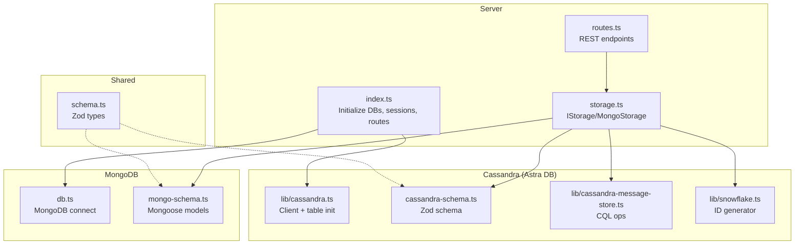
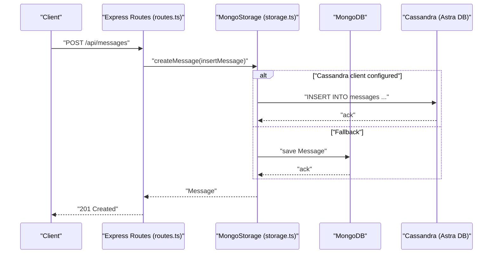
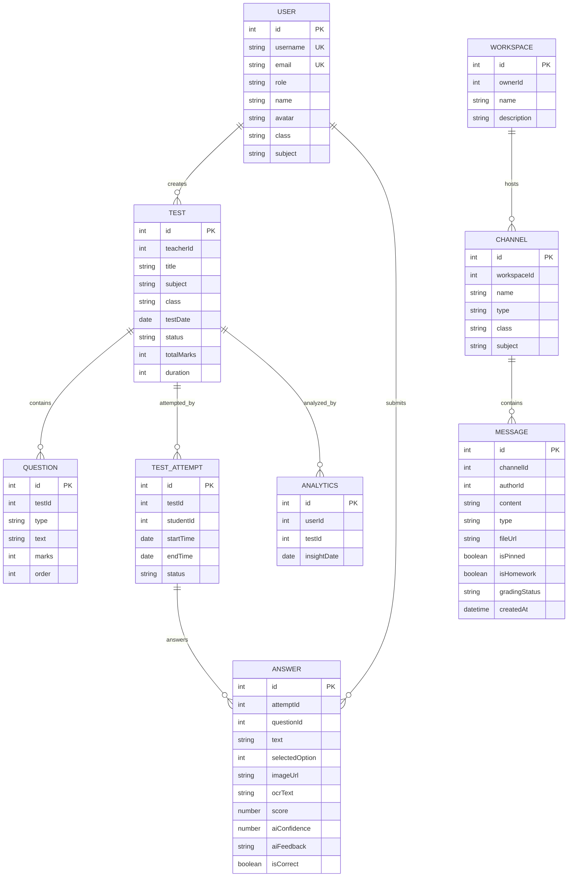
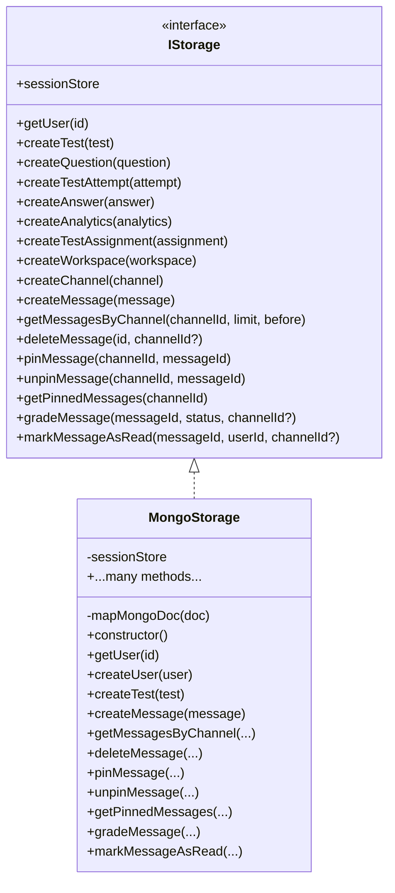
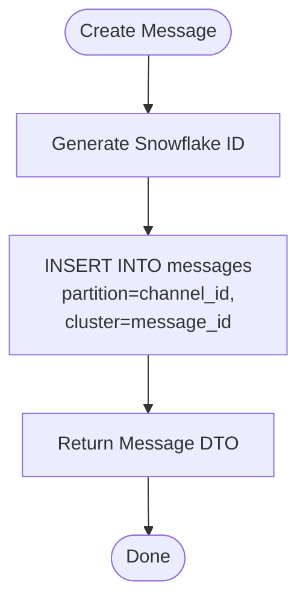
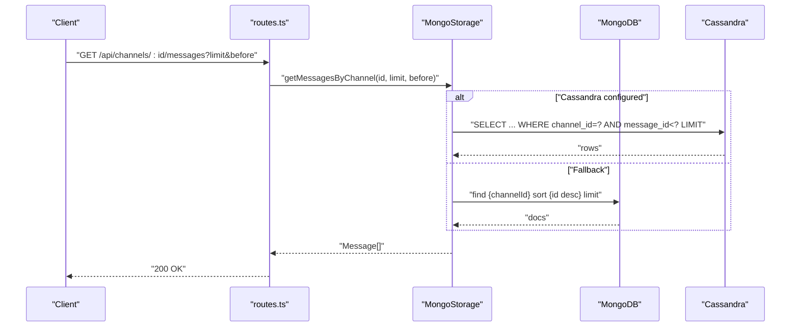
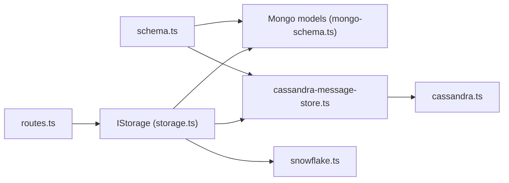

# Data Management

<cite>
**Referenced Files in This Document**
- [server/index.ts](file://server/index.ts)
- [server/db.ts](file://server/db.ts)
- [server/lib/cassandra.ts](file://server/lib/cassandra.ts)
- [server/lib/cassandra-message-store.ts](file://server/lib/cassandra-message-store.ts)
- [server/lib/snowflake.ts](file://server/lib/snowflake.ts)
- [server/storage.ts](file://server/storage.ts)
- [shared/mongo-schema.ts](file://shared/mongo-schema.ts)
- [shared/cassandra-schema.ts](file://shared/cassandra-schema.ts)
- [shared/schema.ts](file://shared/schema.ts)
- [server/routes.ts](file://server/routes.ts)
- [scripts/test-db.ts](file://scripts/test-db.ts)
- [.env.example](file://.env.example)
</cite>

## Table of Contents
1. [Introduction](#introduction)
2. [Project Structure](#project-structure)
3. [Core Components](#core-components)
4. [Architecture Overview](#architecture-overview)
5. [Detailed Component Analysis](#detailed-component-analysis)
6. [Dependency Analysis](#dependency-analysis)
7. [Performance Considerations](#performance-considerations)
8. [Troubleshooting Guide](#troubleshooting-guide)
9. [Conclusion](#conclusion)
10. [Appendices](#appendices)

## Introduction
This document describes the multi-database data management architecture of PersonalLearningPro. The system integrates MongoDB for core domain data (users, tests, questions, attempts, answers, analytics, workspaces, channels, and messages) and Apache Cassandra (via DataStax Astra DB) for high-throughput, time-ordered messaging. It documents schema design, storage abstractions, repository pattern implementation, data access patterns, caching and session strategies, performance optimizations, connection management, and operational procedures such as testing and environment configuration.

## Project Structure
The data layer spans shared schemas, MongoDB models, a Cassandra client and message store, and a unified storage abstraction that delegates to either MongoDB or Cassandra depending on configuration.

**Diagram sources**
- [server/index.ts](file://server/index.ts#L1-L114)
- [server/db.ts](file://server/db.ts#L1-L21)
- [server/lib/cassandra.ts](file://server/lib/cassandra.ts#L1-L73)
- [server/lib/cassandra-message-store.ts](file://server/lib/cassandra-message-store.ts#L1-L166)
- [server/lib/snowflake.ts](file://server/lib/snowflake.ts#L1-L74)
- [server/storage.ts](file://server/storage.ts#L1-L519)
- [shared/mongo-schema.ts](file://shared/mongo-schema.ts#L1-L159)
- [shared/cassandra-schema.ts](file://shared/cassandra-schema.ts#L1-L10)
- [shared/schema.ts](file://shared/schema.ts#L1-L142)

**Section sources**
- [server/index.ts](file://server/index.ts#L1-L114)
- [server/db.ts](file://server/db.ts#L1-L21)
- [server/lib/cassandra.ts](file://server/lib/cassandra.ts#L1-L73)
- [server/storage.ts](file://server/storage.ts#L1-L519)
- [shared/mongo-schema.ts](file://shared/mongo-schema.ts#L1-L159)
- [shared/cassandra-schema.ts](file://shared/cassandra-schema.ts#L1-L10)
- [shared/schema.ts](file://shared/schema.ts#L1-L142)

## Core Components
- MongoDB connection and models:
  - Connection initialization and error handling.
  - Domain models for users, tests, questions, attempts, answers, analytics, and chat entities.
  - Auto-increment counters for numeric IDs.
- Cassandra/Astra DB integration:
  - Client initialization with secure bundle, token, and keyspace.
  - Creation of the messages table with partition and clustering keys optimized for channel-scoped, time-ordered reads.
  - Secondary index on pinned flag for efficient filtering.
- Unified storage abstraction:
  - IStorage interface defines CRUD and query methods for all domain entities.
  - MongoStorage implements IStorage, mapping Mongoose documents to shared types and delegating message persistence to Cassandra when available.
- Shared schemas:
  - Zod schemas define validation and TypeScript types for inserts and persisted entities.
  - Cassandra message schema extends the shared insert schema with Cassandra-specific fields.

Key responsibilities:
- Data modeling: clear primary keys, embedded arrays for membership and read receipts, and numeric IDs mapped from auto-increment sequences.
- Storage delegation: message operations prefer Cassandra when configured; otherwise fall back to MongoDB.
- Session store: in-memory session store backed by MemoryStore for development.

**Section sources**
- [server/db.ts](file://server/db.ts#L1-L21)
- [shared/mongo-schema.ts](file://shared/mongo-schema.ts#L1-L159)
- [server/lib/cassandra.ts](file://server/lib/cassandra.ts#L1-L73)
- [server/lib/cassandra-message-store.ts](file://server/lib/cassandra-message-store.ts#L1-L166)
- [server/storage.ts](file://server/storage.ts#L33-L106)
- [shared/schema.ts](file://shared/schema.ts#L1-L142)
- [shared/cassandra-schema.ts](file://shared/cassandra-schema.ts#L1-L10)

## Architecture Overview
The system initializes both MongoDB and Cassandra at startup. Routes validate payloads with Zod, enforce authorization, and delegate data operations to the storage layer. For messages, the storage layer chooses Cassandra if configured; otherwise it falls back to MongoDB. Sessions are stored in memory.

**Diagram sources**
- [server/routes.ts](file://server/routes.ts#L779-L804)
- [server/storage.ts](file://server/storage.ts#L413-L422)
- [server/lib/cassandra-message-store.ts](file://server/lib/cassandra-message-store.ts#L36-L75)
- [server/lib/cassandra.ts](file://server/lib/cassandra.ts#L42-L60)

**Section sources**
- [server/index.ts](file://server/index.ts#L26-L28)
- [server/routes.ts](file://server/routes.ts#L779-L804)
- [server/storage.ts](file://server/storage.ts#L413-L422)
- [server/lib/cassandra.ts](file://server/lib/cassandra.ts#L1-L73)

## Detailed Component Analysis

### Data Modeling and Schemas
- Users, Tests, Questions, Attempts, Answers, Analytics:
  - Defined with Mongoose schemas and compiled into models.
  - Numeric IDs are managed via an auto-increment counter collection and mapped to the id field.
  - Indexes are declared for frequently filtered fields (e.g., TestAssignment indices).
- Workspaces, Channels, Messages:
  - Workspaces and channels support membership and metadata.
  - Messages include author, content, type, flags (pinned, homework, grading), read receipts, and timestamps.
- Shared validation and types:
  - Zod schemas validate incoming requests and infer TypeScript types for inserts and persisted entities.
  - Cassandra message schema extends the shared insert schema with Cassandra-specific fields.

**Diagram sources**
- [shared/mongo-schema.ts](file://shared/mongo-schema.ts#L13-L156)
- [shared/schema.ts](file://shared/schema.ts#L72-L141)

**Section sources**
- [shared/mongo-schema.ts](file://shared/mongo-schema.ts#L1-L159)
- [shared/schema.ts](file://shared/schema.ts#L1-L142)

### Storage Abstraction and Repository Pattern
- IStorage defines a comprehensive contract for all domain operations.
- MongoStorage implements IStorage:
  - Maps Mongoose documents to shared types by stripping internal fields.
  - Uses auto-increment counters for numeric IDs.
  - Delegates message persistence to Cassandra when available; otherwise persists to MongoDB.
  - Maintains a session store in memory for development.

**Diagram sources**
- [server/storage.ts](file://server/storage.ts#L33-L106)
- [server/storage.ts](file://server/storage.ts#L110-L514)

**Section sources**
- [server/storage.ts](file://server/storage.ts#L33-L106)
- [server/storage.ts](file://server/storage.ts#L110-L514)

### Cassandra Message Store and Snowflake IDs
- Cassandra client initialization:
  - Reads secure bundle path, token, and keyspace from environment variables.
  - Creates the messages table with partition key channel_id and clustering key message_id (stored as text).
  - Adds a secondary index on is_pinned to support filtered queries.
- Message operations:
  - Create: inserts a new message with a time-ordered Snowflake ID.
  - Read: supports paginated retrieval with optional before cursor and reverse ordering.
  - Update: toggles pinned, updates grading status, and appends read user IDs.
  - Delete: removes a message by composite key.
- Snowflake ID generator:
  - Produces 64-bit sortable IDs combining timestamp, worker/process IDs, and sequence.

**Diagram sources**
- [server/lib/cassandra.ts](file://server/lib/cassandra.ts#L42-L60)
- [server/lib/cassandra-message-store.ts](file://server/lib/cassandra-message-store.ts#L36-L75)
- [server/lib/snowflake.ts](file://server/lib/snowflake.ts#L38-L62)

**Section sources**
- [server/lib/cassandra.ts](file://server/lib/cassandra.ts#L1-L73)
- [server/lib/cassandra-message-store.ts](file://server/lib/cassandra-message-store.ts#L1-L166)
- [server/lib/snowflake.ts](file://server/lib/snowflake.ts#L1-L74)

### Data Access Patterns and Routing
- Routes validate payloads with Zod, enforce roles and ownership, and call storage methods.
- Message endpoints:
  - Create message via HTTP.
  - Retrieve paginated message history with limit and before cursor.
  - Delete message with ownership checks.
  - Pin/unpin, grade, and mark as read with teacher or author permissions.
- Channel and workspace endpoints:
  - Create, list, and manage workspaces and channels with membership checks.

**Diagram sources**
- [server/routes.ts](file://server/routes.ts#L722-L745)
- [server/storage.ts](file://server/storage.ts#L424-L437)
- [server/lib/cassandra-message-store.ts](file://server/lib/cassandra-message-store.ts#L79-L102)

**Section sources**
- [server/routes.ts](file://server/routes.ts#L722-L745)
- [server/storage.ts](file://server/storage.ts#L424-L437)

### Session Store and Caching Strategies
- Session store:
  - Memory-backed session store via MemoryStore with periodic cleanup.
  - Configured via express-session with secure cookie settings in production.
- Caching:
  - No explicit cache layer is present in the current implementation.
  - Recommendations include Redis for session and hot-path caching, with invalidation on write.

**Section sources**
- [server/index.ts](file://server/index.ts#L30-L44)
- [server/storage.ts](file://server/storage.ts#L110-L118)

## Dependency Analysis
- External dependencies:
  - MongoDB via Mongoose.
  - Cassandra via cassandra-driver with Astra DB secure bundle.
  - Zod for runtime validation.
  - express-session and MemoryStore for session management.
- Internal dependencies:
  - Routes depend on IStorage.
  - MongoStorage depends on Mongoose models, Cassandra store, and Snowflake ID generator.
  - Shared schemas underpin both MongoDB and Cassandra message handling.

**Diagram sources**
- [server/routes.ts](file://server/routes.ts#L1-L11)
- [server/storage.ts](file://server/storage.ts#L1-L32)
- [shared/schema.ts](file://shared/schema.ts#L1-L142)
- [shared/mongo-schema.ts](file://shared/mongo-schema.ts#L1-L159)
- [server/lib/cassandra-message-store.ts](file://server/lib/cassandra-message-store.ts#L1-L166)
- [server/lib/cassandra.ts](file://server/lib/cassandra.ts#L1-L73)
- [server/lib/snowflake.ts](file://server/lib/snowflake.ts#L1-L74)

**Section sources**
- [server/routes.ts](file://server/routes.ts#L1-L11)
- [server/storage.ts](file://server/storage.ts#L1-L32)
- [shared/schema.ts](file://shared/schema.ts#L1-L142)

## Performance Considerations
- Cassandra message table design:
  - Partition by channel_id and cluster by message_id (Snowflake) ensures efficient range scans and time-ordered retrieval.
  - Secondary index on is_pinned enables filtered queries without ALLOW FILTERING on full partitions.
- Pagination:
  - Use before cursor with limit to avoid OFFSET and maintain O(1) per-page cost.
- Indexing:
  - Mongoose indexes on TestAssignment improve assignment queries.
- ID generation:
  - Snowflake IDs are globally unique and time-ordered, reducing contention and enabling efficient clustering.
- Session store:
  - MemoryStore suitable for development; consider Redis for production scalability.

[No sources needed since this section provides general guidance]

## Troubleshooting Guide
- MongoDB connectivity:
  - Ensure MONGODB_URL is set; connection is attempted at startup and errors are logged without crashing the server.
- Cassandra/Astra DB:
  - Verify ASTRA_DB_SECURE_BUNDLE_PATH, ASTRA_DB_APPLICATION_TOKEN, and ASTRA_DB_KEYSPACE are set.
  - Confirm the messages table exists and indexes are created.
- Testing Cassandra integration:
  - Use the provided script to initialize Cassandra and perform a round-trip create+read test.
- Session configuration:
  - SESSION_SECRET must be set in production; otherwise startup will fail.

**Section sources**
- [server/db.ts](file://server/db.ts#L4-L19)
- [server/lib/cassandra.ts](file://server/lib/cassandra.ts#L9-L30)
- [server/lib/cassandra.ts](file://server/lib/cassandra.ts#L32-L72)
- [scripts/test-db.ts](file://scripts/test-db.ts#L1-L41)
- [server/index.ts](file://server/index.ts#L31-L33)
- [.env.example](file://.env.example#L21-L36)

## Conclusion
PersonalLearningPro employs a hybrid data architecture: MongoDB for relational domain entities and Cassandra for scalable, time-ordered messaging. The IStorage abstraction cleanly separates concerns, enabling seamless fallback and future migration. Strong typing via Zod, numeric ID mapping, and careful indexing support performance and correctness. Operational readiness is ensured by environment-driven configuration and a dedicated integration test.

[No sources needed since this section summarizes without analyzing specific files]

## Appendices

### Environment Variables
- Required:
  - MONGODB_URL for MongoDB connection.
- Optional but recommended:
  - ASTRA_DB_SECURE_BUNDLE_PATH, ASTRA_DB_APPLICATION_TOKEN, ASTRA_DB_KEYSPACE for Cassandra message store.
  - SESSION_SECRET for production sessions.

**Section sources**
- [.env.example](file://.env.example#L21-L36)

### Data Consistency and Transactions
- Current state:
  - MongoDB operations are atomic per-document; cross-collection consistency relies on application-level checks.
  - Cassandra writes are atomic per partition; cross-partition transactions are not supported.
- Recommendations:
  - Use eventual consistency patterns with compensating actions for cross-entity updates.
  - Consider Saga orchestration for long-running workflows requiring strict consistency.

[No sources needed since this section provides general guidance]

### Backup and Disaster Recovery
- MongoDB:
  - Use regular logical backups (mongodump) and point-in-time recovery with oplogs enabled.
- Cassandra:
  - Use built-in snapshots and SSTable-level backups; restore via nodetool.
- Operational checklist:
  - Regularly test restore procedures.
  - Maintain offsite copies of secure bundles and tokens.
  - Automate health checks and alerting for both databases.

[No sources needed since this section provides general guidance]