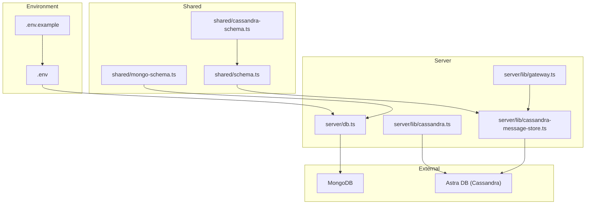
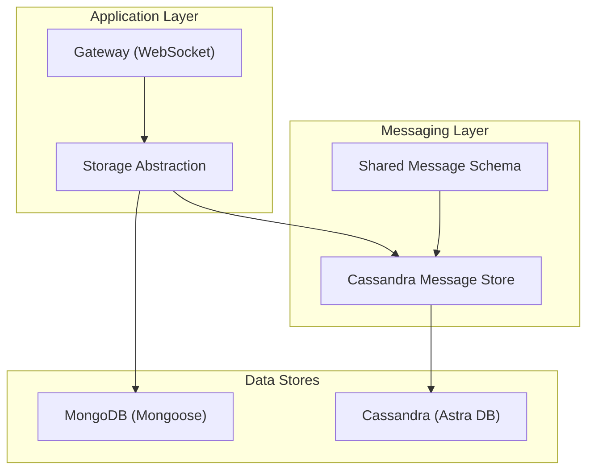
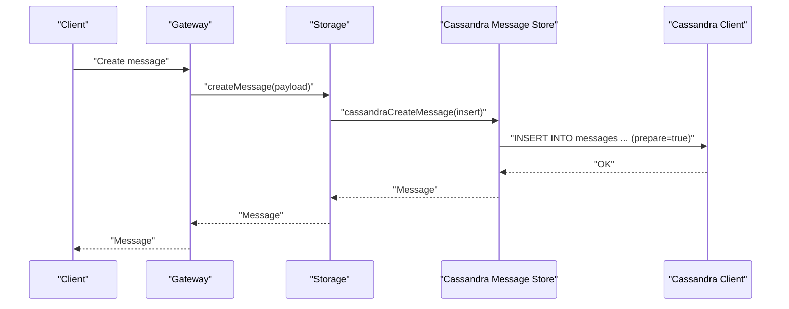
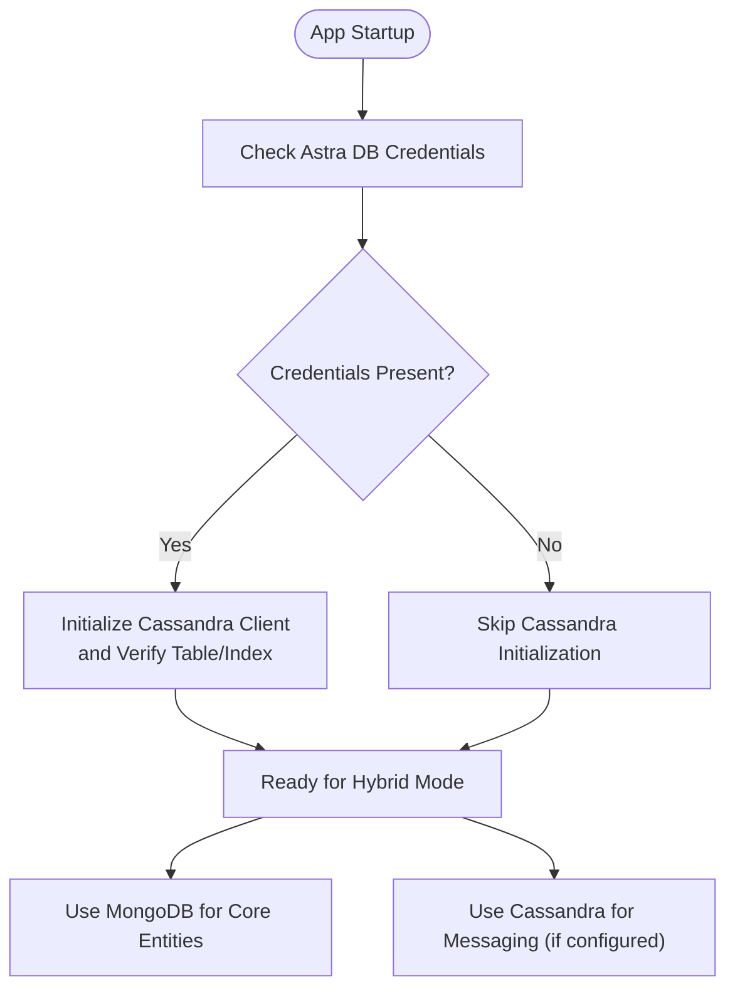
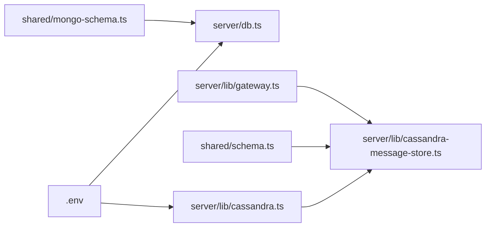

# Database Architecture

<cite>
**Referenced Files in This Document**
- [db.ts](file://server/db.ts)
- [cassandra.ts](file://server/lib/cassandra.ts)
- [cassandra-message-store.ts](file://server/lib/cassandra-message-store.ts)
- [.env](file://.env)
- [.env.example](file://.env.example)
- [mongo-schema.ts](file://shared/mongo-schema.ts)
- [cassandra-schema.ts](file://shared/cassandra-schema.ts)
- [schema.ts](file://shared/schema.ts)
- [test-db.ts](file://scripts/test-db.ts)
- [gateway.ts](file://server/lib/gateway.ts)
</cite>

## Table of Contents
1. [Introduction](#introduction)
2. [Project Structure](#project-structure)
3. [Core Components](#core-components)
4. [Architecture Overview](#architecture-overview)
5. [Detailed Component Analysis](#detailed-component-analysis)
6. [Dependency Analysis](#dependency-analysis)
7. [Performance Considerations](#performance-considerations)
8. [Troubleshooting Guide](#troubleshooting-guide)
9. [Conclusion](#conclusion)

## Introduction
This document describes the database architecture of PersonalLearningPro’s multi-database system with a hybrid approach integrating MongoDB (primary) and Cassandra via DataStax Astra DB. It explains the rationale for this combination, operational selection criteria, connection management, and fallback behavior. It also documents configuration, schema design, and performance strategies, along with eventual consistency patterns and failover mechanisms.

## Project Structure
The database-related implementation is organized around:
- MongoDB connection and schema definitions for core domain entities (users, tests, channels, messages, etc.)
- Cassandra/Astra DB integration for high-throughput, time-ordered messaging with partitioning and clustering
- Shared validation schemas for cross-database compatibility
- Scripts and environment configuration for local testing and deployment

**Diagram sources**
- [db.ts](file://server/db.ts#L1-L21)
- [cassandra.ts](file://server/lib/cassandra.ts#L1-L73)
- [cassandra-message-store.ts](file://server/lib/cassandra-message-store.ts#L1-L166)
- [.env](file://.env#L1-L12)
- [.env.example](file://.env.example#L1-L36)
- [schema.ts](file://shared/schema.ts#L1-L142)
- [mongo-schema.ts](file://shared/mongo-schema.ts#L1-L159)
- [cassandra-schema.ts](file://shared/cassandra-schema.ts#L1-L10)
- [gateway.ts](file://server/lib/gateway.ts#L1-L83)

**Section sources**
- [db.ts](file://server/db.ts#L1-L21)
- [cassandra.ts](file://server/lib/cassandra.ts#L1-L73)
- [cassandra-message-store.ts](file://server/lib/cassandra-message-store.ts#L1-L166)
- [.env](file://.env#L1-L12)
- [.env.example](file://.env.example#L1-L36)
- [schema.ts](file://shared/schema.ts#L1-L142)
- [mongo-schema.ts](file://shared/mongo-schema.ts#L1-L159)
- [cassandra-schema.ts](file://shared/cassandra-schema.ts#L1-L10)
- [gateway.ts](file://server/lib/gateway.ts#L1-L83)

## Core Components
- MongoDB primary data store:
  - Managed via Mongoose connection with TLS enabled
  - Schema definitions for Users, Tests, Questions, TestAttempts, Answers, Analytics, Workspaces, Channels, and Messages
  - Auto-increment ID pattern using a Counter collection
- Cassandra/Astra DB secondary store for messaging:
  - Single-node client initialization with secure bundle and application token
  - Keyspace-scoped session with prepared statements
  - Table creation and indexing for messages with partition and clustering keys optimized for channel-centric reads and time-ordered writes
- Shared schemas:
  - Validation schemas for insert/update operations
  - Message shape compatible across MongoDB and Cassandra layers
- Gateway and storage integration:
  - WebSocket gateway interacts with storage to broadcast events and fetch workspaces/users
  - Storage abstraction delegates to Cassandra-backed message store when configured

**Section sources**
- [db.ts](file://server/db.ts#L1-L21)
- [mongo-schema.ts](file://shared/mongo-schema.ts#L1-L159)
- [cassandra.ts](file://server/lib/cassandra.ts#L1-L73)
- [cassandra-message-store.ts](file://server/lib/cassandra-message-store.ts#L1-L166)
- [schema.ts](file://shared/schema.ts#L1-L142)
- [cassandra-schema.ts](file://shared/cassandra-schema.ts#L1-L10)
- [gateway.ts](file://server/lib/gateway.ts#L1-L83)

## Architecture Overview
The system employs a hybrid database strategy:
- MongoDB is the primary database for structured entities requiring rich queries, relationships, and ACID-like semantics for core domain data.
- Cassandra/Astra DB is used for high-volume, time-ordered messaging with partitioned storage by channel and clustering by Snowflake IDs to maintain insertion order and efficient range scans.

**Diagram sources**
- [gateway.ts](file://server/lib/gateway.ts#L1-L83)
- [cassandra-message-store.ts](file://server/lib/cassandra-message-store.ts#L1-L166)
- [cassandra.ts](file://server/lib/cassandra.ts#L1-L73)
- [mongo-schema.ts](file://shared/mongo-schema.ts#L1-L159)
- [schema.ts](file://shared/schema.ts#L1-L142)

## Detailed Component Analysis

### MongoDB Connection and Schema Management
- Connection:
  - Requires MONGODB_URL environment variable
  - TLS enabled; invalid certificates allowed in development
  - Non-fatal failure: server continues operating even if MongoDB is unreachable
- Schemas:
  - Rich entity modeling for Users, Tests, Questions, TestAttempts, Answers, Analytics, Workspaces, Channels, and Messages
  - Indexes on frequently queried fields (e.g., TestAssignment indices)
  - Auto-increment ID via a Counter collection to emulate sequences

Operational implications:
- ACID transactions preferred for core domain operations
- Strong referential integrity via embedded arrays and references
- Fallback resilience: application remains functional without MongoDB connectivity

**Section sources**
- [db.ts](file://server/db.ts#L1-L21)
- [mongo-schema.ts](file://shared/mongo-schema.ts#L1-L159)

### Cassandra/Astra DB Client and Messaging Table
- Client initialization:
  - Secure bundle path, application token, and keyspace are required
  - Returns null if credentials are missing (fallback behavior)
- Keyspace and table:
  - Creates a messages table with:
    - Partition key: channel_id
    - Clustering key: message_id (Snowflake ID)
    - Additional indexed column is_pinned for filtering pinned messages
  - Clustering order by message_id DESC to support newest-first retrieval
- Prepared statements:
  - All DML operations use prepared statements for performance and safety

Operational implications:
- Partition-per-channel design optimizes reads by channel
- Time-ordered writes via Snowflake IDs
- Eventual consistency model typical of Cassandra

**Section sources**
- [cassandra.ts](file://server/lib/cassandra.ts#L1-L73)

### Cassandra Message Store Implementation
- Mapping:
  - Converts Cassandra rows to shared Message type for cross-layer compatibility
- Create:
  - Generates a Snowflake ID for message_id
  - Inserts message with defaults for is_pinned, read_by, attachments, and timestamps
- Read:
  - Retrieves channel messages with optional paging using message_id bounds
  - Returns results ordered oldest-to-newest after reversing Cassandra’s DESC ordering
  - Pinned messages filtered by is_pinned flag
- Update:
  - Pins/unpins messages
  - Sets grading status
  - Adds user IDs to read_by set atomically
- Delete:
  - Removes a specific message by composite key

**Diagram sources**
- [gateway.ts](file://server/lib/gateway.ts#L1-L83)
- [cassandra-message-store.ts](file://server/lib/cassandra-message-store.ts#L1-L166)
- [cassandra.ts](file://server/lib/cassandra.ts#L1-L73)

**Section sources**
- [cassandra-message-store.ts](file://server/lib/cassandra-message-store.ts#L1-L166)

### Shared Schemas and Cross-Database Compatibility
- Shared validation schemas define insert/update contracts for Users, Tests, Questions, TestAttempts, Answers, Analytics, Workspaces, Channels, and Messages
- Cassandra message schema extends the shared insert schema with id and optional attachments for compatibility with the unified message type

Benefits:
- Consistent validation across databases
- Easier migration and fallback scenarios

**Section sources**
- [schema.ts](file://shared/schema.ts#L1-L142)
- [cassandra-schema.ts](file://shared/cassandra-schema.ts#L1-L10)

### Database Selection Strategy and Fallback Mechanisms
- Selection criteria:
  - Core domain entities (users, tests, analytics, etc.) are stored in MongoDB
  - Messaging data is stored in Cassandra/Astra DB when credentials are present
- Fallback behavior:
  - If Astra DB credentials are missing, the Cassandra client is not initialized and remains null
  - Application continues to operate without messaging persistence to Cassandra
  - Environment configuration supports toggling between Cassandra-only and MongoDB-only modes

**Diagram sources**
- [cassandra.ts](file://server/lib/cassandra.ts#L1-L73)
- [.env](file://.env#L1-L12)
- [.env.example](file://.env.example#L1-L36)

**Section sources**
- [cassandra.ts](file://server/lib/cassandra.ts#L1-L73)
- [.env](file://.env#L1-L12)
- [.env.example](file://.env.example#L1-L36)

### Connection Management and Pooling
- MongoDB:
  - Uses Mongoose default connection behavior; TLS enabled
  - No explicit pool configuration observed in the repository
- Cassandra:
  - Single-client pattern with lazy initialization
  - Prepared statements used across all operations
  - Keyspace-scoped session established at connect time

Recommendations:
- For production, configure connection pools and timeouts for both drivers
- Monitor Cassandra session health and reinitialize if needed

**Section sources**
- [db.ts](file://server/db.ts#L1-L21)
- [cassandra.ts](file://server/lib/cassandra.ts#L1-L73)

### Data Consistency and Eventual Consistency Patterns
- MongoDB:
  - ACID transactions for core domain operations
  - Embedded arrays and references for related data
- Cassandra:
  - Eventual consistency model
  - Atomic updates for read_by and conditional updates for pins and grading
  - Partitioned reads minimize contention per channel

Implications:
- Use Cassandra for high-write, time-ordered messaging
- Use MongoDB for strongly consistent domain data and complex queries

**Section sources**
- [cassandra.ts](file://server/lib/cassandra.ts#L1-L73)
- [cassandra-message-store.ts](file://server/lib/cassandra-message-store.ts#L1-L166)
- [mongo-schema.ts](file://shared/mongo-schema.ts#L1-L159)

### Testing and Validation
- Dedicated script initializes Cassandra and validates create/read operations against the storage layer
- Demonstrates end-to-end Cassandra-only operation and verifies content retrieval

**Section sources**
- [test-db.ts](file://scripts/test-db.ts#L1-L41)

## Dependency Analysis
Key dependencies and relationships:
- Environment variables drive database availability and configuration
- Cassandra client depends on secure bundle, token, and keyspace
- Message store depends on shared schemas and Snowflake IDs
- Gateway interacts with storage to broadcast events and fetch user/workspace data

**Diagram sources**
- [.env](file://.env#L1-L12)
- [db.ts](file://server/db.ts#L1-L21)
- [cassandra.ts](file://server/lib/cassandra.ts#L1-L73)
- [cassandra-message-store.ts](file://server/lib/cassandra-message-store.ts#L1-L166)
- [schema.ts](file://shared/schema.ts#L1-L142)
- [mongo-schema.ts](file://shared/mongo-schema.ts#L1-L159)
- [gateway.ts](file://server/lib/gateway.ts#L1-L83)

**Section sources**
- [.env](file://.env#L1-L12)
- [db.ts](file://server/db.ts#L1-L21)
- [cassandra.ts](file://server/lib/cassandra.ts#L1-L73)
- [cassandra-message-store.ts](file://server/lib/cassandra-message-store.ts#L1-L166)
- [schema.ts](file://shared/schema.ts#L1-L142)
- [mongo-schema.ts](file://shared/mongo-schema.ts#L1-L159)
- [gateway.ts](file://server/lib/gateway.ts#L1-L83)

## Performance Considerations
- Cassandra:
  - Partition by channel_id to localize reads/writes
  - Clustering by Snowflake message_id for time-ordered writes and efficient paging
  - Prepared statements reduce parsing overhead
  - Secondary index on is_pinned enables filtered reads without ALLOW FILTERING on entire partitions
- MongoDB:
  - Indexes on frequently queried fields (e.g., TestAssignment)
  - Auto-increment counter for predictable ID allocation
- Operational tips:
  - Batch reads/writes where appropriate
  - Monitor latency and throughput for both stores
  - Use environment-specific tuning for production deployments

[No sources needed since this section provides general guidance]

## Troubleshooting Guide
Common issues and remedies:
- Missing Astra DB credentials:
  - Symptoms: Cassandra client remains uninitialized; messaging falls back to MongoDB
  - Resolution: Set secure bundle path, application token, and keyspace in environment
- Cassandra connectivity failures:
  - Symptoms: Errors during connect or table creation
  - Resolution: Validate secure bundle integrity, token correctness, and network access
- MongoDB unavailability:
  - Symptoms: MongoDB connection errors logged; server continues running
  - Resolution: Ensure MONGODB_URL is correct and reachable; consider local MongoDB for development
- Message ordering and pagination:
  - Ensure channel_id is correctly set and message_id is a Snowflake string for comparisons
  - Use before parameter for pagination to avoid scanning entire partitions

**Section sources**
- [cassandra.ts](file://server/lib/cassandra.ts#L1-L73)
- [db.ts](file://server/db.ts#L1-L21)
- [cassandra-message-store.ts](file://server/lib/cassandra-message-store.ts#L1-L166)
- [.env](file://.env#L1-L12)
- [.env.example](file://.env.example#L1-L36)

## Conclusion
PersonalLearningPro’s hybrid database architecture leverages MongoDB for robust, ACID-like core domain data and Cassandra/Astra DB for scalable, time-ordered messaging. The design provides clear separation of concerns, graceful fallback when Cassandra is unavailable, and optimized schemas for high-throughput operations. Proper environment configuration, prepared statements, and awareness of eventual consistency enable reliable and performant operations across both systems.