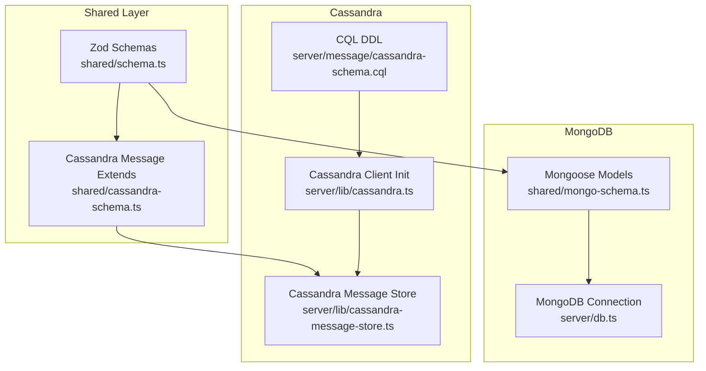
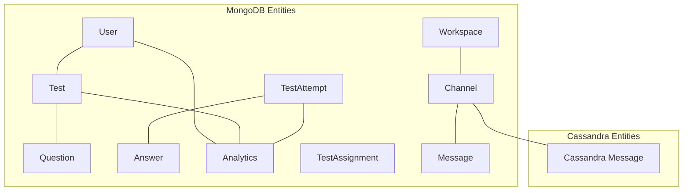
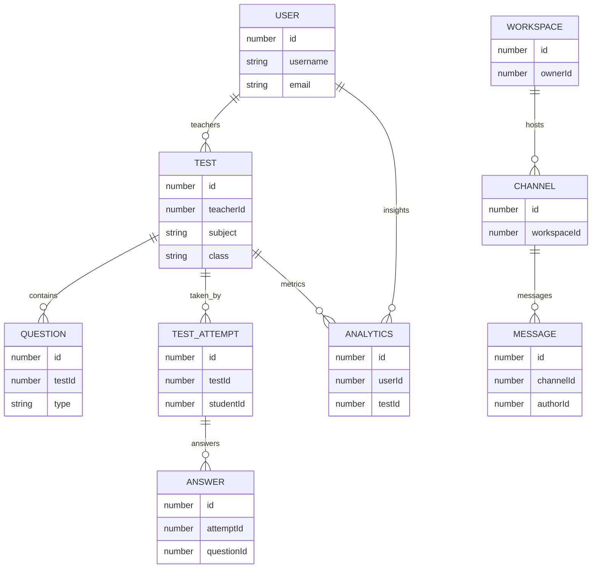
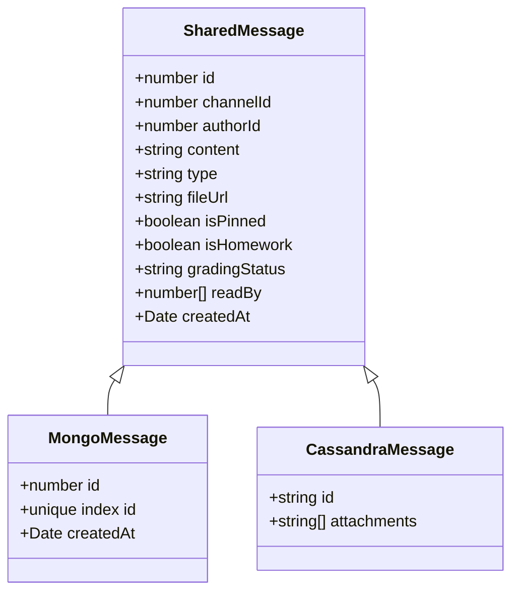
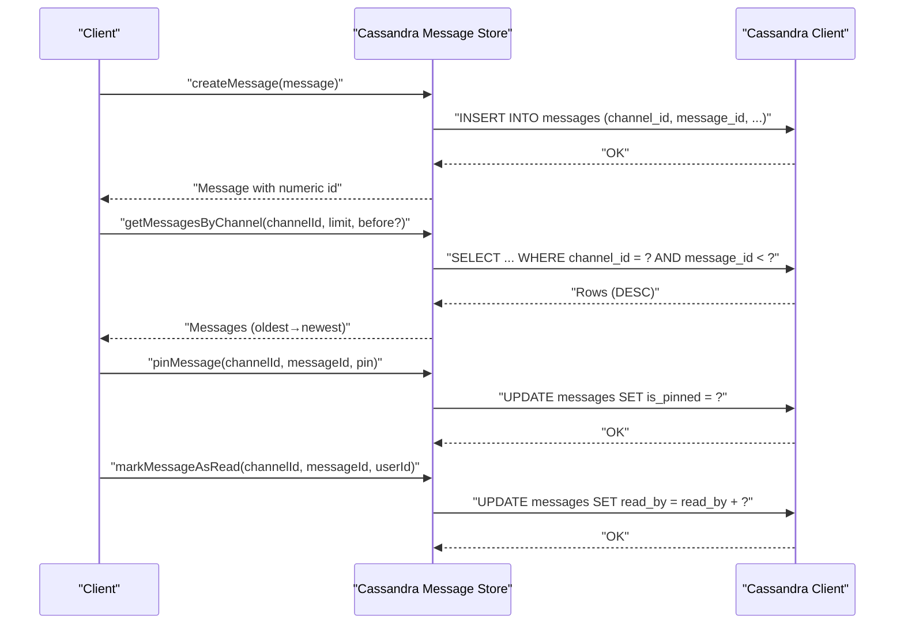
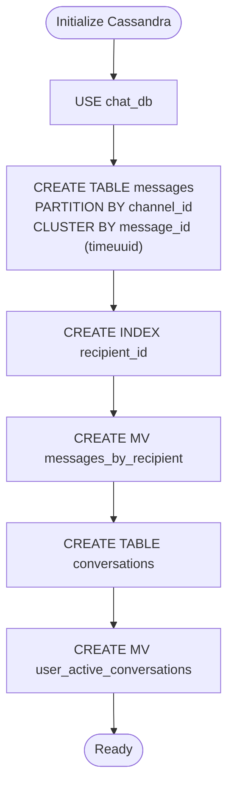
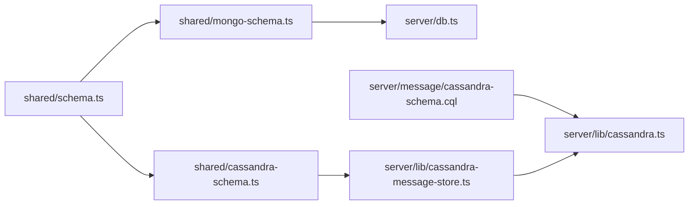

# Schema Design

<cite>
**Referenced Files in This Document**
- [shared/schema.ts](file://shared/schema.ts)
- [shared/mongo-schema.ts](file://shared/mongo-schema.ts)
- [shared/cassandra-schema.ts](file://shared/cassandra-schema.ts)
- [server/db.ts](file://server/db.ts)
- [server/lib/cassandra.ts](file://server/lib/cassandra.ts)
- [server/lib/cassandra-message-store.ts](file://server/lib/cassandra-message-store.ts)
- [server/message/cassandra-schema.cql](file://server/message/cassandra-schema.cql)
- [server/message/message-store.ts](file://server/message/message-store.ts)
</cite>

## Table of Contents
1. [Introduction](#introduction)
2. [Project Structure](#project-structure)
3. [Core Components](#core-components)
4. [Architecture Overview](#architecture-overview)
5. [Detailed Component Analysis](#detailed-component-analysis)
6. [Dependency Analysis](#dependency-analysis)
7. [Performance Considerations](#performance-considerations)
8. [Troubleshooting Guide](#troubleshooting-guide)
9. [Conclusion](#conclusion)
10. [Appendices](#appendices)

## Introduction
This document describes the schema design for PersonalLearningPro’s core data models across MongoDB and Cassandra. It defines entity schemas, field types, validation rules, business constraints, relationships, and foreign key references. It also documents schema evolution, versioning, migrations, validation patterns, indexing strategies, and query optimization considerations. Finally, it explains shared interfaces and schema inheritance patterns used to support both MongoDB and Cassandra implementations.

## Project Structure
The schema design spans three primary areas:
- Shared TypeScript Zod schemas define canonical validation and types for all entities.
- MongoDB Mongoose schemas implement persistent storage for core entities and include indexes and auto-increment helpers.
- Cassandra schemas define both CQL DDL and a data-access layer for the messaging feature, with a shared interface compatible with MongoDB models.

**Diagram sources**
- [shared/schema.ts](file://shared/schema.ts#L1-L142)
- [shared/mongo-schema.ts](file://shared/mongo-schema.ts#L1-L159)
- [shared/cassandra-schema.ts](file://shared/cassandra-schema.ts#L1-L10)
- [server/db.ts](file://server/db.ts#L1-L21)
- [server/message/cassandra-schema.cql](file://server/message/cassandra-schema.cql#L1-L89)
- [server/lib/cassandra.ts](file://server/lib/cassandra.ts#L1-L73)
- [server/lib/cassandra-message-store.ts](file://server/lib/cassandra-message-store.ts#L1-L166)

**Section sources**
- [shared/schema.ts](file://shared/schema.ts#L1-L142)
- [shared/mongo-schema.ts](file://shared/mongo-schema.ts#L1-L159)
- [shared/cassandra-schema.ts](file://shared/cassandra-schema.ts#L1-L10)
- [server/db.ts](file://server/db.ts#L1-L21)
- [server/message/cassandra-schema.cql](file://server/message/cassandra-schema.cql#L1-L89)
- [server/lib/cassandra.ts](file://server/lib/cassandra.ts#L1-L73)
- [server/lib/cassandra-message-store.ts](file://server/lib/cassandra-message-store.ts#L1-L166)

## Core Components
This section defines each entity schema, including fields, types, validation rules, and constraints. All definitions derive from the shared Zod schemas and are mapped to MongoDB and Cassandra implementations as applicable.

- User
  - Fields: id (number), username (string), password (string), name (string), email (string), role ("student" | "teacher"), avatar (string|null), class (string|null), subject (string|null)
  - Validation: Non-empty strings for username, password, name, email; role defaults to "student"; optional fields may be null
  - Business constraints: Unique id, unique username, unique email
  - MongoDB mapping: Unique indexes on id, username, email
  - Cassandra mapping: Not used for User in Cassandra

- Test
  - Fields: id (number), title (string), description (string|null), subject (string), class (string), teacherId (number), totalMarks (number default 100), duration (number default 60), testDate (date|string), questionTypes (string[]), status ("draft"|"published"|"completed" default "draft"), createdAt (Date)
  - Validation: Non-empty strings for title, subject, class; numeric marks/duration; date conversion supported
  - Business constraints: teacherId references a valid User; status transitions governed by lifecycle
  - MongoDB mapping: Unique index on id; createdAt default
  - Cassandra mapping: Not used for Test in Cassandra

- Question
  - Fields: id (number), testId (number), type ("mcq"|"short"|"long"|"numerical"), text (string), options (any|null), correctAnswer (string|null), marks (number default 1), order (number), aiRubric (string|null)
  - Validation: type enum; marks default 1; order required
  - Business constraints: belongs to a Test via testId
  - MongoDB mapping: Mixed options; unique index on id
  - Cassandra mapping: Not used for Question in Cassandra

- TestAttempt
  - Fields: id (number), testId (number), studentId (number), startTime (date|string|null), endTime (date|string|null), score (number|null), status ("in_progress"|"completed"|"evaluated" default "in_progress")
  - Validation: status enum; nullable timestamps and score
  - Business constraints: links a Student to a Test; lifecycle status progression
  - MongoDB mapping: Unique index on id
  - Cassandra mapping: Not used for TestAttempt in Cassandra

- Answer
  - Fields: id (number), attemptId (number), questionId (number), text (string|null), selectedOption (number|null), imageUrl (string|null), ocrText (string|null), score (number|null), aiConfidence (number|null), aiFeedback (string|null), isCorrect (boolean|null)
  - Validation: nullable fields; numeric score/confidence
  - Business constraints: links Attempt and Question; optional AI-assisted evaluation
  - MongoDB mapping: Unique index on id
  - Cassandra mapping: Not used for Answer in Cassandra

- Analytics
  - Fields: id (number), userId (number), testId (number), weakTopics (string[]), strongTopics (string[]), recommendedResources (string[]), insightDate (date|string|null)
  - Validation: arrays of strings; optional insight date
  - Business constraints: links a User and a Test; insights aggregation
  - MongoDB mapping: Unique index on id
  - Cassandra mapping: Not used for Analytics in Cassandra

- TestAssignment
  - Fields: id (number), testId (number), studentId (number), assignedBy (number), assignedDate (date|string|null), dueDate (date|string), status ("pending"|"started"|"completed"|"overdue" default "pending"), notificationSent (boolean default false)
  - Validation: status enum; dueDate required; default pending
  - Business constraints: assignment lifecycle; teacher-to-student relationship
  - MongoDB mapping: Composite indexes on (studentId, status), (testId), (dueDate, status)
  - Cassandra mapping: Not used for TestAssignment in Cassandra

- Workspace
  - Fields: id (number), name (string), description (string|null), ownerId (number), members (number[] default []), createdAt (Date)
  - Validation: Non-empty name; members array of numbers
  - Business constraints: Ownership and membership model
  - MongoDB mapping: Unique index on id; createdAt default
  - Cassandra mapping: Not used for Workspace in Cassandra

- Channel
  - Fields: id (number), workspaceId (number|null), name (string), type ("text"|"announcement"|"dm" default "text"), class (string|null), subject (string|null), pinnedMessages (number[]), createdAt (Date)
  - Validation: type enum; pinnedMessages array
  - Business constraints: Optional workspace association; pinned messages list
  - MongoDB mapping: Unique index on id; createdAt default
  - Cassandra mapping: Not used for Channel in Cassandra

- Message
  - Fields: id (number|string), channelId (number), authorId (number), content (string), type ("text"|"file"|"image" default "text"), fileUrl (string|null), isPinned (boolean default false), isHomework (boolean default false), gradingStatus ("pending"|"graded"|null), readBy (number[] default []), createdAt (Date)
  - Validation: type enum; nullable fileUrl; readBy array
  - Business constraints: Links Channel and Author; grading and read tracking
  - MongoDB mapping: Unique index on id; createdAt default; isPinned flag
  - Cassandra mapping: Extended schema with string id and optional attachments; partitioned by channel_id, clustered by message_id (Snowflake)

**Section sources**
- [shared/schema.ts](file://shared/schema.ts#L1-L142)
- [shared/mongo-schema.ts](file://shared/mongo-schema.ts#L1-L159)
- [shared/cassandra-schema.ts](file://shared/cassandra-schema.ts#L1-L10)

## Architecture Overview
The system supports dual persistence backends:
- MongoDB: Core assessment and chat entities persisted via Mongoose models with indexes and auto-increment counters.
- Cassandra: Messaging feature optimized for time-series writes and reads, using partitioned tables and secondary indexes.

**Diagram sources**
- [shared/mongo-schema.ts](file://shared/mongo-schema.ts#L1-L159)
- [shared/schema.ts](file://shared/schema.ts#L1-L142)
- [shared/cassandra-schema.ts](file://shared/cassandra-schema.ts#L1-L10)

## Detailed Component Analysis

### Entity Relationships and Foreign Keys
- User → Test (teacherId)
- Test → Question (testId)
- TestAttempt (studentId, testId)
- Answer (attemptId, questionId)
- Analytics (userId, testId)
- Workspace → Channel (workspaceId)
- Channel → Message (channelId)

**Diagram sources**
- [shared/mongo-schema.ts](file://shared/mongo-schema.ts#L1-L159)
- [shared/schema.ts](file://shared/schema.ts#L1-L142)

**Section sources**
- [shared/mongo-schema.ts](file://shared/mongo-schema.ts#L1-L159)
- [shared/schema.ts](file://shared/schema.ts#L1-L142)

### Message Model: MongoDB vs Cassandra
- MongoDB Message: Uses numeric id with unique index and createdAt default.
- Cassandra Message: Extends shared schema with string id and optional attachments; stored in a partitioned table keyed by channel_id and clustered by message_id (Snowflake).

**Diagram sources**
- [shared/schema.ts](file://shared/schema.ts#L122-L131)
- [shared/mongo-schema.ts](file://shared/mongo-schema.ts#L132-L144)
- [shared/cassandra-schema.ts](file://shared/cassandra-schema.ts#L4-L7)

**Section sources**
- [shared/schema.ts](file://shared/schema.ts#L122-L131)
- [shared/mongo-schema.ts](file://shared/mongo-schema.ts#L132-L144)
- [shared/cassandra-schema.ts](file://shared/cassandra-schema.ts#L1-L10)

### Cassandra Message Store Operations
The Cassandra-backed message store mirrors a shared interface and uses Snowflake ids for clustering, enabling global uniqueness and time ordering.

**Diagram sources**
- [server/lib/cassandra-message-store.ts](file://server/lib/cassandra-message-store.ts#L36-L165)
- [server/lib/cassandra.ts](file://server/lib/cassandra.ts#L44-L66)

**Section sources**
- [server/lib/cassandra-message-store.ts](file://server/lib/cassandra-message-store.ts#L1-L166)
- [server/lib/cassandra.ts](file://server/lib/cassandra.ts#L1-L73)

### MessagePal Cassandra Schema (DDL)
The DDL defines partitioned tables and materialized views for efficient querying by recipients and conversation lists.

**Diagram sources**
- [server/message/cassandra-schema.cql](file://server/message/cassandra-schema.cql#L8-L71)

**Section sources**
- [server/message/cassandra-schema.cql](file://server/message/cassandra-schema.cql#L1-L89)

## Dependency Analysis
- Shared Zod schemas underpin both MongoDB and Cassandra implementations, ensuring consistent validation and types.
- MongoDB models depend on Mongoose and an auto-increment counter service.
- Cassandra relies on Astra DB driver initialization and a message store that translates rows to shared types.

**Diagram sources**
- [shared/schema.ts](file://shared/schema.ts#L1-L142)
- [shared/mongo-schema.ts](file://shared/mongo-schema.ts#L1-L159)
- [shared/cassandra-schema.ts](file://shared/cassandra-schema.ts#L1-L10)
- [server/db.ts](file://server/db.ts#L1-L21)
- [server/lib/cassandra-message-store.ts](file://server/lib/cassandra-message-store.ts#L1-L166)
- [server/message/cassandra-schema.cql](file://server/message/cassandra-schema.cql#L1-L89)
- [server/lib/cassandra.ts](file://server/lib/cassandra.ts#L1-L73)

**Section sources**
- [shared/schema.ts](file://shared/schema.ts#L1-L142)
- [shared/mongo-schema.ts](file://shared/mongo-schema.ts#L1-L159)
- [shared/cassandra-schema.ts](file://shared/cassandra-schema.ts#L1-L10)
- [server/db.ts](file://server/db.ts#L1-L21)
- [server/lib/cassandra-message-store.ts](file://server/lib/cassandra-message-store.ts#L1-L166)
- [server/message/cassandra-schema.cql](file://server/message/cassandra-schema.cql#L1-L89)
- [server/lib/cassandra.ts](file://server/lib/cassandra.ts#L1-L73)

## Performance Considerations
- MongoDB
  - Unique indexes on id for all entities to enforce primary keys and speed lookups.
  - Composite indexes on TestAssignment for frequent queries by studentId/status, testId, and dueDate/status.
  - Auto-increment counter pattern ensures predictable numeric ids while maintaining uniqueness.
- Cassandra
  - Partitioned by channel_id with clustering by message_id (Snowflake) to optimize write throughput and time-ordered reads.
  - Secondary index on is_pinned to avoid filtering on full partitions for pinned messages.
  - Materialized views accelerate recipient-centric queries and conversation listings.
- General
  - Prefer numeric ids internally with Snowflake conversions for Cassandra to maintain global uniqueness and time sorting.
  - Normalize shared validation via Zod to reduce duplication and improve consistency across backends.

[No sources needed since this section provides general guidance]

## Troubleshooting Guide
- MongoDB connection failures
  - Symptom: Application continues running despite MongoDB connection errors.
  - Action: Verify MONGODB_URL environment variable; check TLS settings and network connectivity.
- Cassandra initialization
  - Symptom: Messages table not created or missing index.
  - Action: Confirm ASTRA_DB_SECURE_BUNDLE_PATH, ASTRA_DB_APPLICATION_TOKEN, and ASTRA_DB_KEYSPACE are set; ensure keyspace exists.
- Message operations
  - Symptom: Read receipts not updating or messages not appearing in order.
  - Action: Ensure message_id is a Snowflake string when querying with bounds; verify clustering order and LIMIT clauses.

**Section sources**
- [server/db.ts](file://server/db.ts#L1-L21)
- [server/lib/cassandra.ts](file://server/lib/cassandra.ts#L32-L72)
- [server/lib/cassandra-message-store.ts](file://server/lib/cassandra-message-store.ts#L79-L102)

## Conclusion
PersonalLearningPro’s schema design leverages shared validation and types to unify data contracts across MongoDB and Cassandra. MongoDB focuses on structured assessment and chat entities with targeted indexes and auto-increment counters. Cassandra optimizes messaging with partitioned writes, time-clustered reads, and materialized views. Together, these approaches enable scalable, consistent, and maintainable data persistence.

[No sources needed since this section summarizes without analyzing specific files]

## Appendices

### Schema Evolution Strategy
- Versioning approach
  - Use semantic versioning for schema changes; increment major version on breaking changes.
  - Maintain backward compatibility by adding optional fields and default values.
- Migration procedures
  - MongoDB: Use Mongoose post-migration scripts to add indexes, populate computed fields, and normalize data.
  - Cassandra: Add new columns with defaults; rebuild materialized views after schema updates; avoid DROP operations on production tables.
- Validation patterns
  - Centralize validation in Zod schemas; apply strict parsing on ingestion and relaxed parsing on reads to handle legacy data.

[No sources needed since this section provides general guidance]