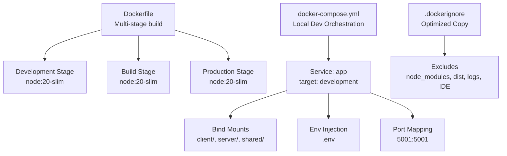
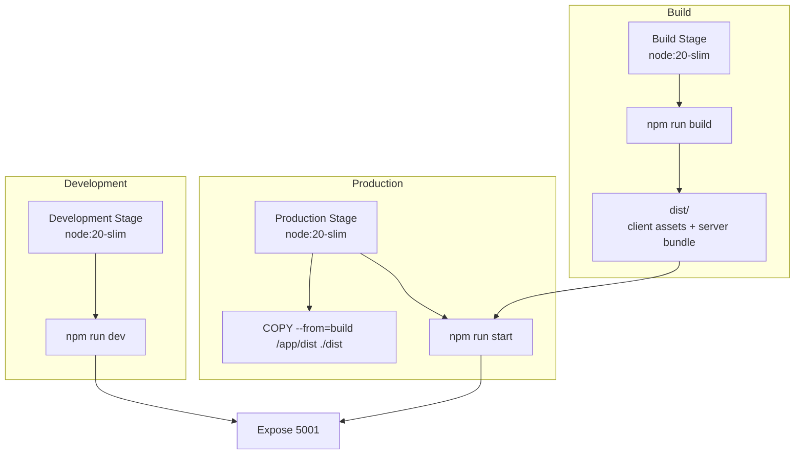
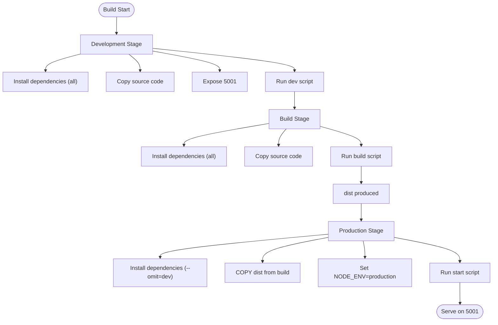
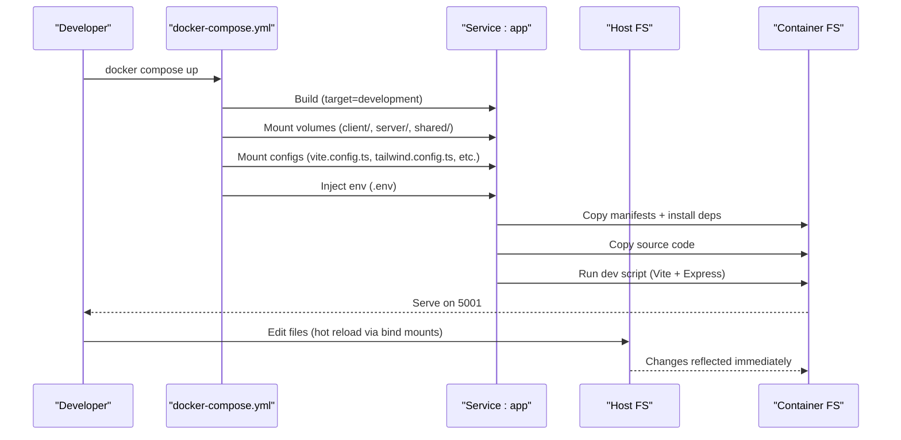
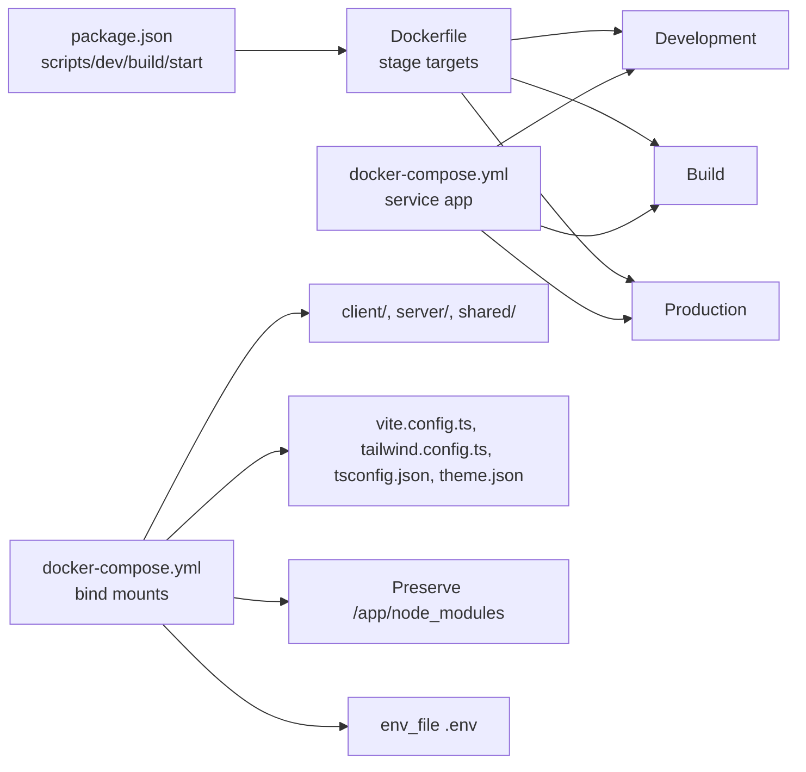

# Containerization & Docker

<cite>
**Referenced Files in This Document**
- [Dockerfile](file://Dockerfile)
- [docker-compose.yml](file://docker-compose.yml)
- [.dockerignore](file://.dockerignore)
- [package.json](file://package.json)
- [server/index.ts](file://server/index.ts)
- [vite.config.ts](file://vite.config.ts)
- [tsconfig.json](file://tsconfig.json)
- [README.md](file://README.md)
- [.env.example](file://.env.example)
- [.github/workflows/cla.yml](file://.github/workflows/cla.yml)
</cite>

## Table of Contents
1. [Introduction](#introduction)
2. [Project Structure](#project-structure)
3. [Core Components](#core-components)
4. [Architecture Overview](#architecture-overview)
5. [Detailed Component Analysis](#detailed-component-analysis)
6. [Dependency Analysis](#dependency-analysis)
7. [Performance Considerations](#performance-considerations)
8. [Security Best Practices](#security-best-practices)
9. [Health Checks and Monitoring](#health-checks-and-monitoring)
10. [Troubleshooting Guide](#troubleshooting-guide)
11. [Image Optimization Techniques](#image-optimization-techniques)
12. [Multi-Platform Build Considerations](#multi-platform-build-considerations)
13. [Container Registry Integration](#container-registry-integration)
14. [Automated Image Building Processes](#automated-image-building-processes)
15. [Conclusion](#conclusion)

## Introduction
This document provides comprehensive containerization guidance for PersonalLearningPro, focusing on the multi-stage Docker build process, development and production workflows, docker-compose orchestration for local development, and operational best practices. It explains how the current Dockerfile and docker-compose.yml enable efficient development with hot reloading, layered dependency management, and clean separation between development, build, and production stages.

## Project Structure
The containerization setup centers on three primary files:
- Dockerfile: Defines the multi-stage build pipeline for development, build, and production.
- docker-compose.yml: Orchestrates the development environment with bind mounts for hot reload and environment injection.
- .dockerignore: Ensures only necessary files are copied into containers, optimizing build cache and reducing image size.

**Diagram sources**
- [Dockerfile](file://Dockerfile#L1-L58)
- [docker-compose.yml](file://docker-compose.yml#L1-L24)
- [.dockerignore](file://.dockerignore#L1-L31)

**Section sources**
- [Dockerfile](file://Dockerfile#L1-L58)
- [docker-compose.yml](file://docker-compose.yml#L1-L24)
- [.dockerignore](file://.dockerignore#L1-L31)

## Core Components
- Multi-stage Docker build:
  - Development stage installs all dependencies and starts the app in development mode with hot reload capabilities.
  - Build stage compiles the client and server bundles into dist artifacts.
  - Production stage installs only production dependencies, copies dist, sets environment to production, and starts the server.
- docker-compose development service:
  - Uses the development build target.
  - Maps host source directories to container paths for live editing.
  - Injects environment variables from .env.
  - Preserves node_modules inside the container to avoid host interference.
- Layer caching and dependency management:
  - Dependencies are copied before source code to maximize cache hits when package manifests change.
  - npm ci ensures deterministic installs and faster builds.
- Environment-specific configuration:
  - Port 5001 is exposed and bound for both API and Vite client.
  - Vite configuration resolves aliases and outputs static assets to dist/public for production serving.

**Section sources**
- [Dockerfile](file://Dockerfile#L1-L58)
- [docker-compose.yml](file://docker-compose.yml#L1-L24)
- [package.json](file://package.json#L6-L11)
- [vite.config.ts](file://vite.config.ts#L1-L35)
- [tsconfig.json](file://tsconfig.json#L1-L24)

## Architecture Overview
The containerization architecture separates concerns across stages and services:
- Development: Full source code plus all dev dependencies; Vite dev server handles hot reload.
- Build: Produces optimized client and server bundles in dist.
- Production: Minimal runtime image with only production dependencies and built artifacts.

**Diagram sources**
- [Dockerfile](file://Dockerfile#L1-L58)
- [package.json](file://package.json#L6-L11)

## Detailed Component Analysis

### Multi-Stage Docker Build
The Dockerfile defines three stages:
- Development: Copies dependency manifests, installs dependencies, copies source, exposes port 5001, and runs the development script.
- Build: Copies manifests, installs dependencies, copies source, runs the build script, and produces dist.
- Production: Copies manifests, installs only production dependencies, copies dist from the build stage, sets NODE_ENV=production, and starts the server.

**Diagram sources**
- [Dockerfile](file://Dockerfile#L1-L58)
- [package.json](file://package.json#L6-L11)

**Section sources**
- [Dockerfile](file://Dockerfile#L1-L58)
- [package.json](file://package.json#L6-L11)

### docker-compose Orchestration for Local Development
The docker-compose.yml defines a single service that:
- Builds using the development target.
- Maps client, server, and shared directories for hot reload.
- Mounts configuration files (Vite, Tailwind, PostCSS, TS config, theme JSON) into the container.
- Preserves node_modules inside the container to avoid host-side dependency conflicts.
- Injects environment variables from .env.
- Exposes port 5001 for the web UI and API.

**Diagram sources**
- [docker-compose.yml](file://docker-compose.yml#L1-L24)
- [Dockerfile](file://Dockerfile#L1-L58)

**Section sources**
- [docker-compose.yml](file://docker-compose.yml#L1-L24)
- [README.md](file://README.md#L23-L35)

### Layer Caching Strategies and Dependency Management
- Dependency-first copy pattern: package.json and package-lock.json are copied before source code to leverage Docker layer caching effectively.
- npm ci is used in all stages to ensure deterministic installs and faster rebuilds.
- Development stage includes devDependencies for tooling; production stage omits devDependencies to reduce attack surface and image size.

**Section sources**
- [Dockerfile](file://Dockerfile#L11-L18)
- [Dockerfile](file://Dockerfile#L33-L37)
- [Dockerfile](file://Dockerfile#L46-L48)
- [package.json](file://package.json#L89-L114)

### Environment-Specific Configurations
- Port exposure and binding: The server listens on port 5001 and serves both API routes and the Vite-built client.
- Vite configuration: Aliases and output directory are configured for client asset resolution and production bundling.
- TypeScript configuration: Path aliases and module resolution are aligned with Vite and client/server code locations.

**Section sources**
- [server/index.ts](file://server/index.ts#L103-L113)
- [vite.config.ts](file://vite.config.ts#L13-L34)
- [tsconfig.json](file://tsconfig.json#L17-L21)

## Dependency Analysis
The containerization stack depends on:
- Node.js base image for all stages.
- npm scripts defined in package.json for dev/build/start.
- docker-compose for orchestrating the development service and mounting volumes.
- .dockerignore to prevent unnecessary files from being copied into images.

**Diagram sources**
- [package.json](file://package.json#L6-L11)
- [Dockerfile](file://Dockerfile#L1-L58)
- [docker-compose.yml](file://docker-compose.yml#L1-L24)

**Section sources**
- [package.json](file://package.json#L6-L11)
- [Dockerfile](file://Dockerfile#L1-L58)
- [docker-compose.yml](file://docker-compose.yml#L1-L24)

## Performance Considerations
- Optimize build cache:
  - Keep package.json and package-lock.json unchanged when only source code changes to reuse dependency layers.
  - Use npm ci to avoid resolving floating versions and speed up installs.
- Minimize image size:
  - Omit devDependencies in production.
  - Exclude build artifacts and logs from the image via .dockerignore.
- Reduce startup time:
  - Use npm ci in build and production stages.
  - Ensure dist is built once and reused in production.

[No sources needed since this section provides general guidance]

## Security Best Practices
- Environment variables:
  - Use .env for local development; ensure sensitive variables are not committed.
  - SESSION_SECRET must be set in production to secure session cookies.
- Least privilege:
  - Run as non-root user if extending the image (recommended).
- Secrets management:
  - Avoid embedding secrets in Dockerfiles or images.
- Network exposure:
  - Only expose port 5001 internally for development; restrict external access in production environments.

**Section sources**
- [.env.example](file://.env.example#L25-L28)
- [server/index.ts](file://server/index.ts#L31-L44)

## Health Checks and Monitoring
Current configuration does not define explicit health checks. Recommended additions:
- HTTP health endpoint: Expose a lightweight GET endpoint returning 200 OK when dependencies are ready.
- Readiness probe: Wait for database connections and message store initialization before marking the service ready.
- Liveness probe: Periodic check to restart unhealthy containers automatically.

[No sources needed since this section provides general guidance]

## Troubleshooting Guide
Common issues and resolutions:
- Port conflicts on 5001:
  - Change host port mapping in docker-compose.yml or stop the conflicting service.
- Hot reload not working:
  - Verify bind mounts for client/, server/, and shared/ directories are present.
  - Ensure node_modules is preserved inside the container (volume mount for /app/node_modules).
- Dependency mismatch:
  - Clear node_modules in the container and rebuild to ensure npm ci installs correct versions.
- Environment variables not applied:
  - Confirm .env is present and properly formatted; verify env_file path in docker-compose.yml.
- Build failures:
  - Rebuild without cache after changing package manifests.
  - Ensure dist is not ignored by .dockerignore during development.

**Section sources**
- [docker-compose.yml](file://docker-compose.yml#L10-L22)
- [.dockerignore](file://.dockerignore#L1-L31)
- [README.md](file://README.md#L124-L125)

## Image Optimization Techniques
- Multi-stage builds:
  - Separate development, build, and production stages to minimize final image size.
- Layer ordering:
  - Copy dependency manifests before source code to improve cache reuse.
- Dependency pruning:
  - Use --omit=dev in production to exclude development-only packages.
- Ignore unnecessary files:
  - Leverage .dockerignore to exclude logs, IDE folders, and build artifacts.

**Section sources**
- [Dockerfile](file://Dockerfile#L11-L18)
- [Dockerfile](file://Dockerfile#L46-L48)
- [.dockerignore](file://.dockerignore#L1-L31)

## Multi-Platform Build Considerations
- Current base image:
  - node:20-slim is architecture-specific; ensure consistent platform across hosts.
- Cross-platform builds:
  - Use buildx to build for different architectures (e.g., linux/amd64, linux/arm64).
  - Pin Node.js version and ensure all dependencies support the target platform.
- Testing:
  - Validate builds on target platforms and test hot reload and production start.

[No sources needed since this section provides general guidance]

## Container Registry Integration
- Tagging strategy:
  - Use semantic versioning tags (e.g., v1.2.3) and latest for automated deployments.
- Push commands:
  - docker tag <image-id> <registry>/<repo>:<tag>
  - docker push <registry>/<repo>:<tag>
- Access control:
  - Configure credentials securely (e.g., CI secrets) and limit push permissions.

[No sources needed since this section provides general guidance]

## Automated Image Building Processes
- CI/CD pipeline:
  - Trigger builds on pushes to main or release branches.
  - Run tests and linting before building images.
  - Publish images to a container registry with versioned tags.
- GitHub Actions:
  - Extend the existing CLA workflow to include build and publish jobs.
  - Cache dependencies to speed up builds.

**Section sources**
- [.github/workflows/cla.yml](file://.github/workflows/cla.yml#L1-L38)

## Conclusion
PersonalLearningPro’s containerization leverages a clean multi-stage Docker build and a practical docker-compose setup for efficient local development. By following the layer caching strategies, environment-specific configurations, and the recommended security and optimization practices, teams can maintain fast iteration cycles while ensuring robust production deployments.