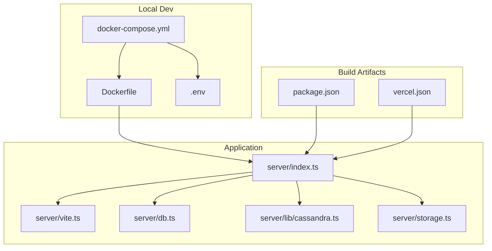
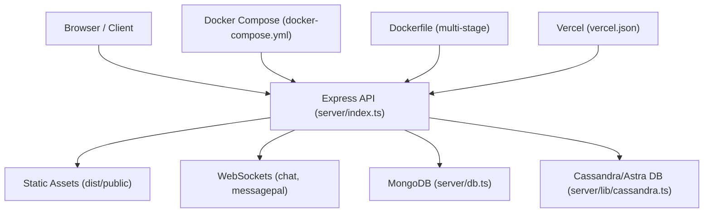
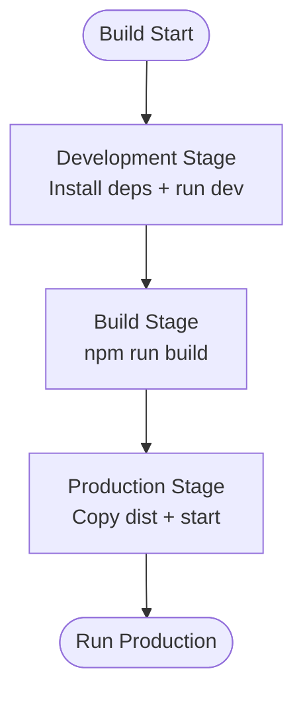
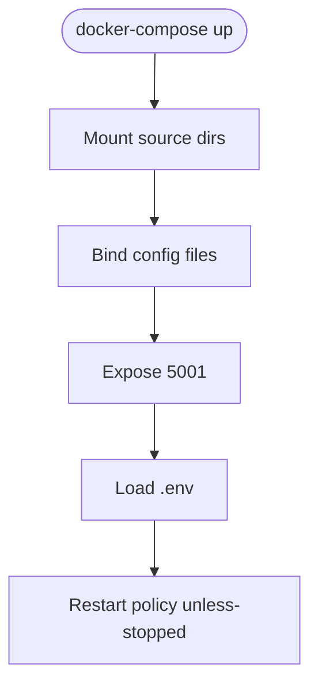
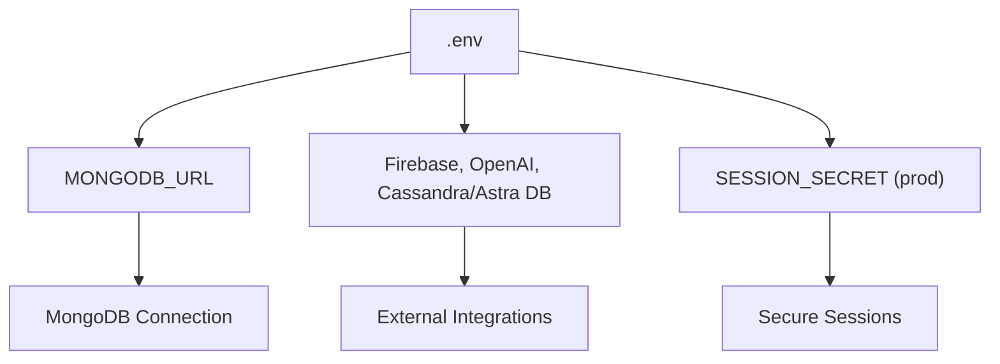
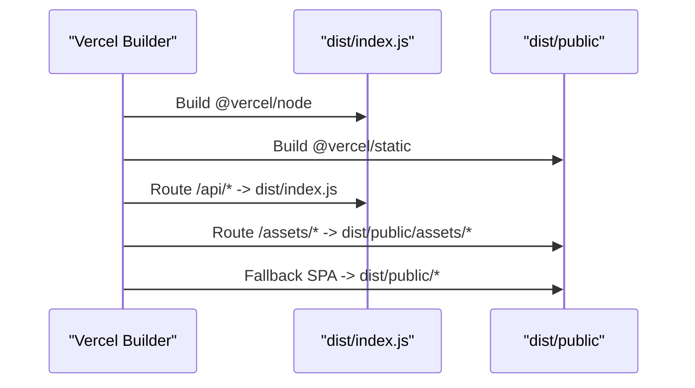
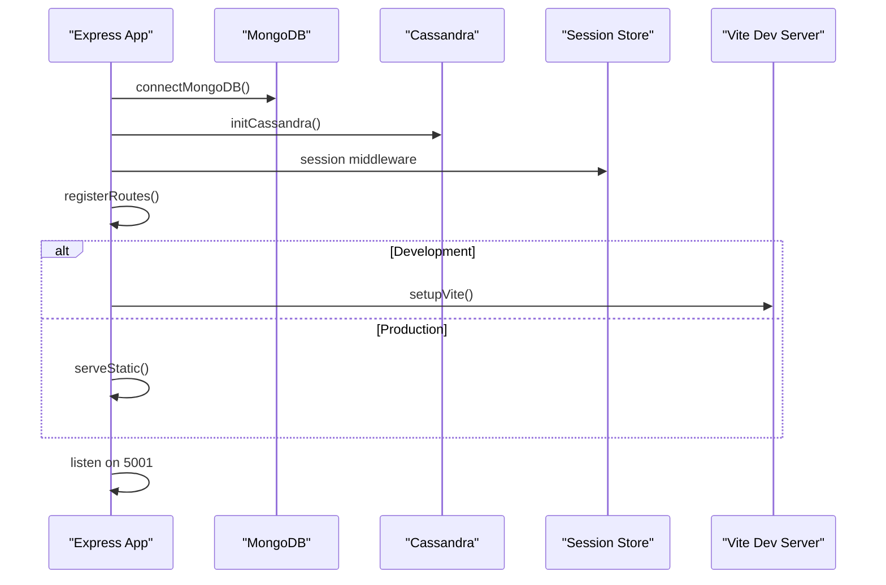
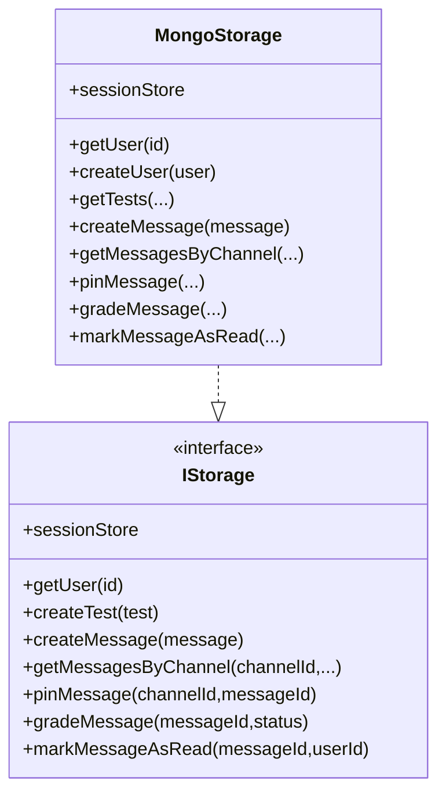
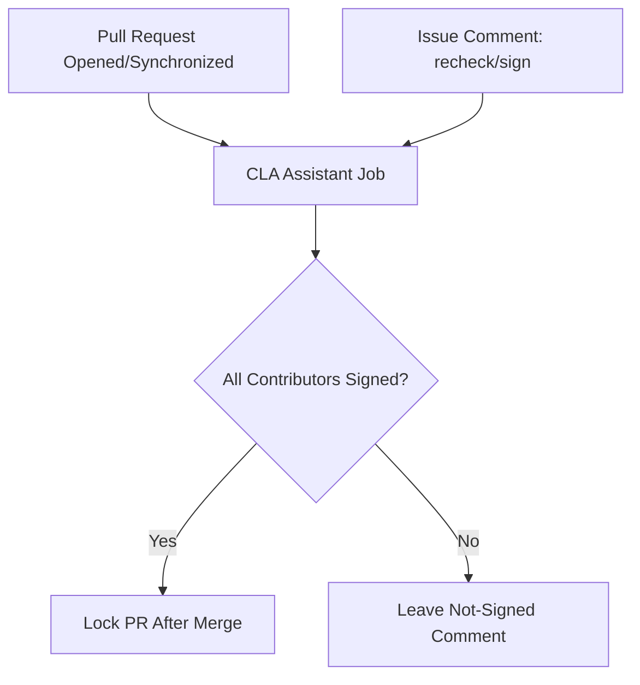
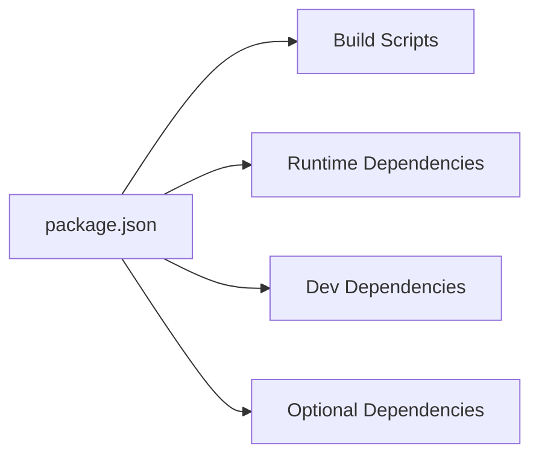

# Deployment & DevOps

<cite>
**Referenced Files in This Document**
- [Dockerfile](file://Dockerfile)
- [docker-compose.yml](file://docker-compose.yml)
- [package.json](file://package.json)
- [.env.example](file://.env.example)
- [.env](file://.env)
- [vercel.json](file://vercel.json)
- [server/index.ts](file://server/index.ts)
- [server/vite.ts](file://server/vite.ts)
- [server/db.ts](file://server/db.ts)
- [server/storage.ts](file://server/storage.ts)
- [server/lib/cassandra.ts](file://server/lib/cassandra.ts)
- [.github/workflows/cla.yml](file://.github/workflows/cla.yml)
</cite>

## Table of Contents
1. [Introduction](#introduction)
2. [Project Structure](#project-structure)
3. [Core Components](#core-components)
4. [Architecture Overview](#architecture-overview)
5. [Detailed Component Analysis](#detailed-component-analysis)
6. [Dependency Analysis](#dependency-analysis)
7. [Performance Considerations](#performance-considerations)
8. [Troubleshooting Guide](#troubleshooting-guide)
9. [Conclusion](#conclusion)
10. [Appendices](#appendices)

## Introduction
This document provides comprehensive deployment and DevOps guidance for PersonalLearningPro. It covers containerization with Docker multi-stage builds, local orchestration via docker-compose, environment configuration across development, staging, and production, CI/CD considerations, infrastructure requirements, scaling, monitoring, security hardening, SSL/TLS, backups, Vercel deployment options, environment variable management, rollback procedures, troubleshooting, and performance optimization.

## Project Structure
The repository combines a TypeScript/React frontend and an Express-based backend with optional MongoDB and Cassandra/Astra DB integrations. Containerization is supported through a multi-stage Dockerfile and docker-compose for local development. Vercel deployment is configured via vercel.json to serve the built backend and static assets.

**Diagram sources**
- [docker-compose.yml](file://docker-compose.yml#L1-L24)
- [Dockerfile](file://Dockerfile#L1-L58)
- [server/index.ts](file://server/index.ts#L1-L114)
- [server/vite.ts](file://server/vite.ts#L1-L89)
- [server/db.ts](file://server/db.ts#L1-L21)
- [server/lib/cassandra.ts](file://server/lib/cassandra.ts#L1-L73)
- [server/storage.ts](file://server/storage.ts#L1-L519)
- [package.json](file://package.json#L1-L120)
- [vercel.json](file://vercel.json#L1-L28)

**Section sources**
- [Dockerfile](file://Dockerfile#L1-L58)
- [docker-compose.yml](file://docker-compose.yml#L1-L24)
- [server/index.ts](file://server/index.ts#L1-L114)
- [server/vite.ts](file://server/vite.ts#L1-L89)
- [server/db.ts](file://server/db.ts#L1-L21)
- [server/lib/cassandra.ts](file://server/lib/cassandra.ts#L1-L73)
- [server/storage.ts](file://server/storage.ts#L1-L519)
- [package.json](file://package.json#L1-L120)
- [vercel.json](file://vercel.json#L1-L28)

## Core Components
- Docker multi-stage build: separates development, build, and production stages for efficient layer caching and smaller production images.
- docker-compose: mounts source directories for hot reload, binds configuration files, and exposes port 5001.
- Environment variables: centralized via .env and .env.example; includes optional Firebase, OpenAI, MongoDB, session secret, and Cassandra/Astra DB.
- Vercel deployment: routes API and static assets to the built server and public directory.
- Application server: Express app with session middleware, logging, WebSocket support, and conditional Vite SSR in development.

**Section sources**
- [Dockerfile](file://Dockerfile#L1-L58)
- [docker-compose.yml](file://docker-compose.yml#L1-L24)
- [.env.example](file://.env.example#L1-L36)
- [.env](file://.env#L1-L12)
- [vercel.json](file://vercel.json#L1-L28)
- [server/index.ts](file://server/index.ts#L1-L114)

## Architecture Overview
The system consists of:
- Frontend: React SPA served either via Vite HMR in development or statically in production.
- Backend: Express server exposing REST APIs and serving the SPA.
- Optional databases: MongoDB for primary data and Cassandra/Astra DB for scalable message storage.
- Orchestration: docker-compose for local development; Vercel for cloud deployment.

**Diagram sources**
- [server/index.ts](file://server/index.ts#L1-L114)
- [server/db.ts](file://server/db.ts#L1-L21)
- [server/lib/cassandra.ts](file://server/lib/cassandra.ts#L1-L73)
- [docker-compose.yml](file://docker-compose.yml#L1-L24)
- [Dockerfile](file://Dockerfile#L1-L58)
- [vercel.json](file://vercel.json#L1-L28)

## Detailed Component Analysis

### Docker Multi-Stage Build
- Development stage: installs all dependencies and runs the app with hot reload.
- Build stage: compiles the server and client bundles.
- Production stage: installs only production dependencies, copies built artifacts, sets environment to production, and starts the server.

**Diagram sources**
- [Dockerfile](file://Dockerfile#L1-L58)

**Section sources**
- [Dockerfile](file://Dockerfile#L1-L58)

### Local Development with docker-compose
- Mounts client, server, and shared directories for hot reload.
- Binds configuration files to keep runtime settings in sync.
- Preserves node_modules inside the container to avoid host conflicts.
- Exposes port 5001 and loads environment variables from .env.

**Diagram sources**
- [docker-compose.yml](file://docker-compose.yml#L1-L24)

**Section sources**
- [docker-compose.yml](file://docker-compose.yml#L1-L24)

### Environment Configuration
- Required variables: MONGODB_URL.
- Recommended for production: SESSION_SECRET.
- Optional integrations: Firebase, OpenAI, Cassandra/Astra DB secure bundle, token, and keyspace.

**Diagram sources**
- [.env.example](file://.env.example#L1-L36)
- [.env](file://.env#L1-L12)

**Section sources**
- [.env.example](file://.env.example#L1-L36)
- [.env](file://.env#L1-L12)

### Vercel Deployment
- Builds the server entry and static assets.
- Routes API requests to the server and static assets to the public directory.
- Supports asset and SPA routing via route definitions.

**Diagram sources**
- [vercel.json](file://vercel.json#L1-L28)

**Section sources**
- [vercel.json](file://vercel.json#L1-L28)

### Application Startup and Routing
- Initializes MongoDB and Cassandra clients.
- Sets up session middleware with secure cookie behavior in production.
- Logs API responses and errors.
- Serves static assets in production or injects Vite in development.

**Diagram sources**
- [server/index.ts](file://server/index.ts#L1-L114)
- [server/db.ts](file://server/db.ts#L1-L21)
- [server/lib/cassandra.ts](file://server/lib/cassandra.ts#L1-L73)
- [server/storage.ts](file://server/storage.ts#L1-L519)
- [server/vite.ts](file://server/vite.ts#L1-L89)

**Section sources**
- [server/index.ts](file://server/index.ts#L1-L114)
- [server/db.ts](file://server/db.ts#L1-L21)
- [server/lib/cassandra.ts](file://server/lib/cassandra.ts#L1-L73)
- [server/storage.ts](file://server/storage.ts#L1-L519)
- [server/vite.ts](file://server/vite.ts#L1-L89)

### Database Layer and Storage Abstraction
- MongoStorage implements a unified interface for user, test, workspace, channel, and message operations.
- Falls back to MongoDB when Cassandra is not configured.
- Uses a memory-based session store for development.

**Diagram sources**
- [server/storage.ts](file://server/storage.ts#L1-L519)

**Section sources**
- [server/storage.ts](file://server/storage.ts#L1-L519)

### CI/CD and Contribution Workflow
- CLA assistant workflow validates contributor licensing via pull request events and comments.

**Diagram sources**
- [.github/workflows/cla.yml](file://.github/workflows/cla.yml#L1-L38)

**Section sources**
- [.github/workflows/cla.yml](file://.github/workflows/cla.yml#L1-L38)

## Dependency Analysis
- Build-time dependencies: Vite, esbuild, TypeScript, and related plugins.
- Runtime dependencies: Express, MongoDB/Mongoose, Cassandra driver, Firebase, OpenAI, WebSocket server, and session stores.
- Optional dependencies: bufferutil for native extensions.

**Diagram sources**
- [package.json](file://package.json#L1-L120)

**Section sources**
- [package.json](file://package.json#L1-L120)

## Performance Considerations
- Multi-stage Docker build reduces image size and improves cold-start times.
- Separate Vite SSR in development avoids unnecessary bundling overhead in production.
- Cassandra/Astra DB offloads high-volume message storage for scalability.
- Use production-grade session stores (e.g., Redis) in containerized environments for horizontal scaling.

## Troubleshooting Guide
- MongoDB connection failures: ensure MONGODB_URL is set and reachable; verify TLS settings.
- Cassandra initialization errors: confirm ASTRA_DB_SECURE_BUNDLE_PATH, token, and keyspace are present.
- Missing static assets in production: verify the build output directory exists and is mounted correctly.
- Hot reload not working: check volume mounts and bind-mounted config files in docker-compose.
- Session cookie issues in production: set SESSION_SECRET and ensure secure cookies are enabled.

**Section sources**
- [server/db.ts](file://server/db.ts#L1-L21)
- [server/lib/cassandra.ts](file://server/lib/cassandra.ts#L1-L73)
- [server/vite.ts](file://server/vite.ts#L1-L89)
- [docker-compose.yml](file://docker-compose.yml#L1-L24)
- [server/index.ts](file://server/index.ts#L1-L114)

## Conclusion
PersonalLearningPro supports flexible deployment strategies using Docker multi-stage builds, docker-compose for local development, and Vercel for cloud hosting. Robust environment management, optional external integrations, and scalable storage choices enable reliable operation across environments. Apply the recommended security and operational practices to harden deployments and maintain high availability.

## Appendices

### Environment Variable Reference
- MONGODB_URL: MongoDB connection string.
- SESSION_SECRET: Secret for signing session cookies (required in production).
- VITE_FIREBASE_*: Firebase client configuration (optional).
- OPENAI_API_KEY: OpenAI API key (optional).
- ASTRA_DB_SECURE_BUNDLE_PATH: Path to Astra DB secure bundle (optional).
- ASTRA_DB_APPLICATION_TOKEN: Astra DB application token (optional).
- ASTRA_DB_KEYSPACE: Cassandra keyspace (optional).

**Section sources**
- [.env.example](file://.env.example#L1-L36)
- [.env](file://.env#L1-L12)

### Security Hardening Checklist
- Enforce HTTPS and secure cookies in production.
- Rotate SESSION_SECRET regularly.
- Restrict network exposure to port 5001.
- Use managed databases with encrypted connections.
- Limit IAM and API tokens to least privilege.

### SSL/TLS Configuration Notes
- Enable secure cookies in production.
- Ensure reverse proxies terminate TLS and forward appropriate headers if applicable.

### Backup Strategies
- Back up MongoDB collections and Cassandra keyspaces regularly.
- Persist session store externally (e.g., Redis) for HA and backups.

### Scaling Considerations
- Stateless backend: scale horizontally behind a load balancer.
- Externalize sessions (Redis) for sticky-free scaling.
- Use managed MongoDB and Cassandra for high availability.

### Monitoring Setup
- Log API requests and response durations.
- Monitor database health and latency.
- Track WebSocket connection metrics.

### Rollback Procedures
- Tag Docker images per release.
- Use immutable tags for Vercel deployments.
- Re-deploy previous image/tag on failure.