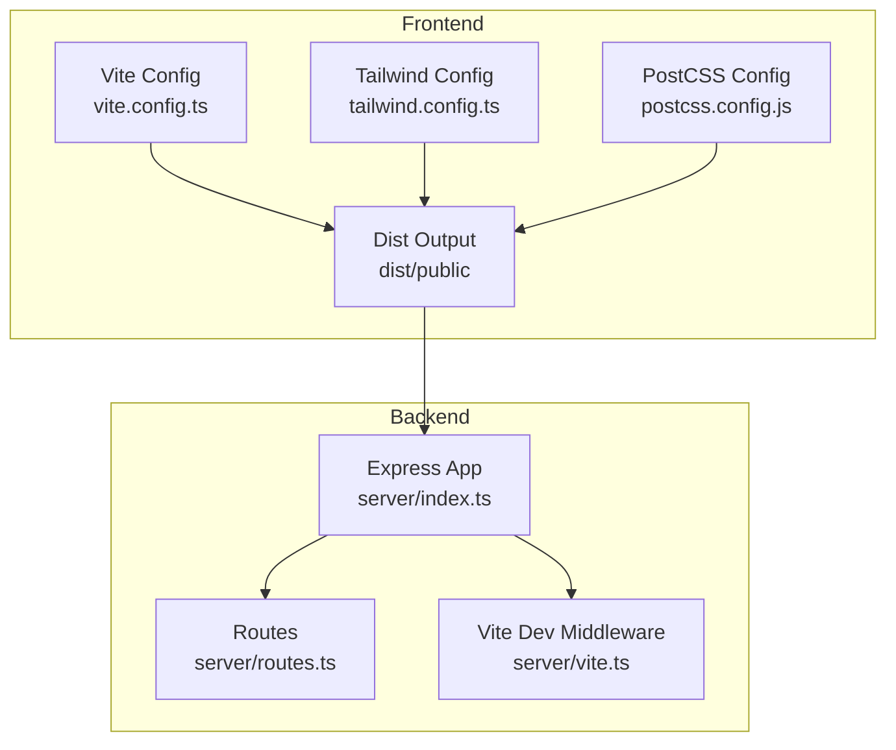
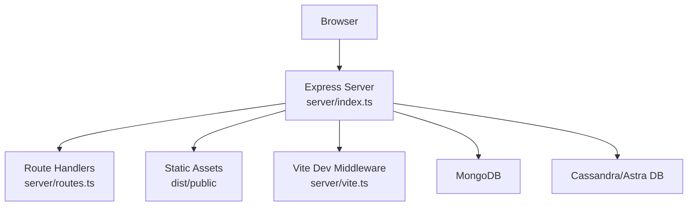
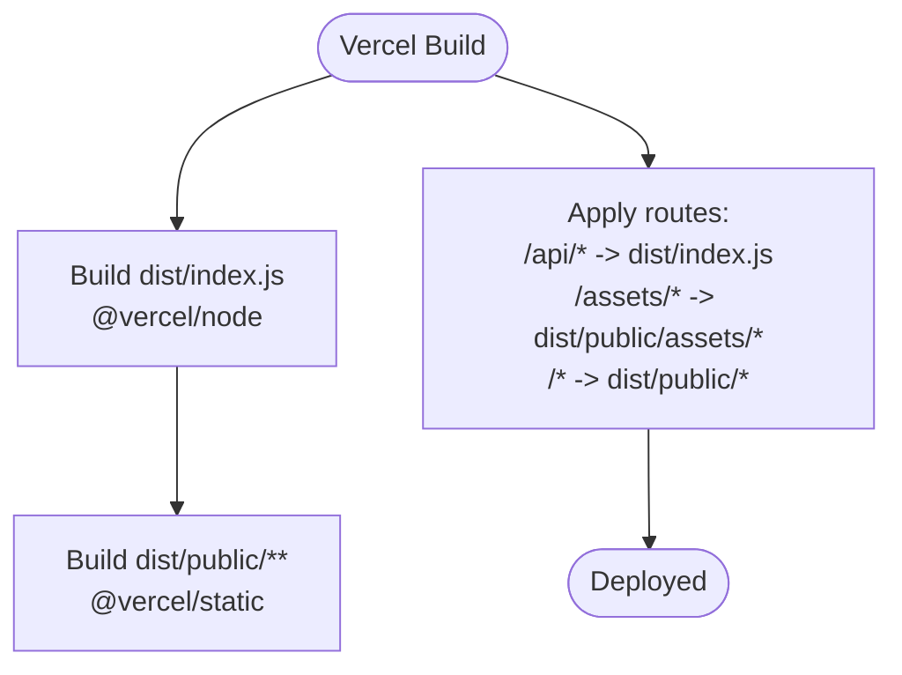
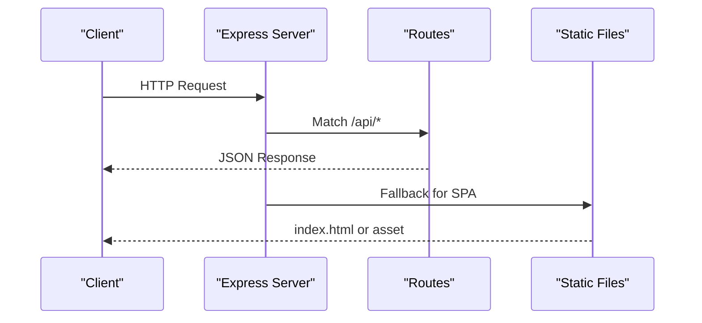
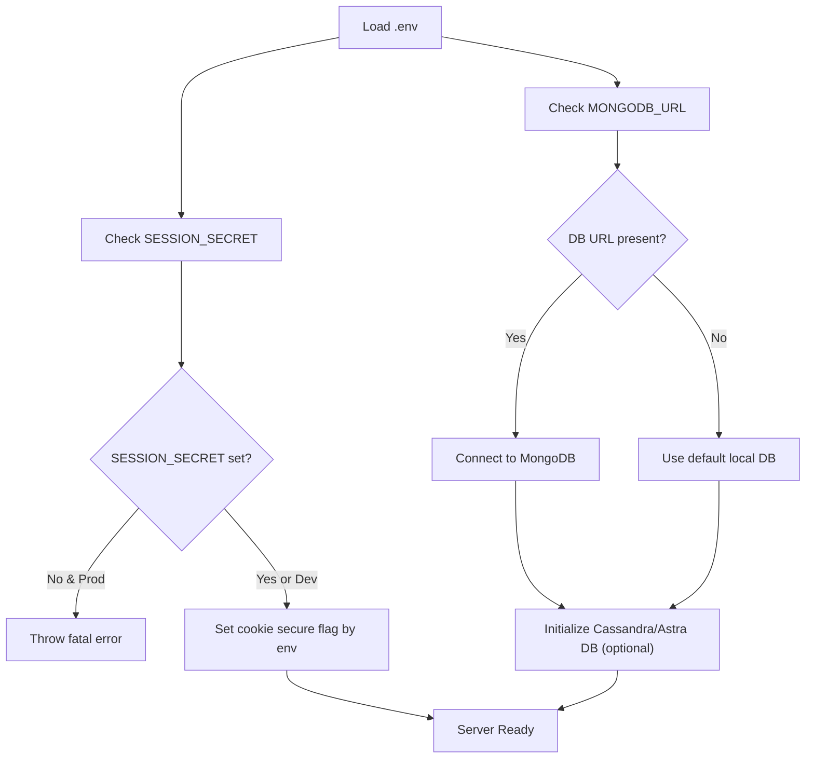
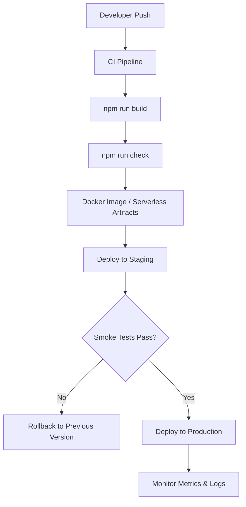
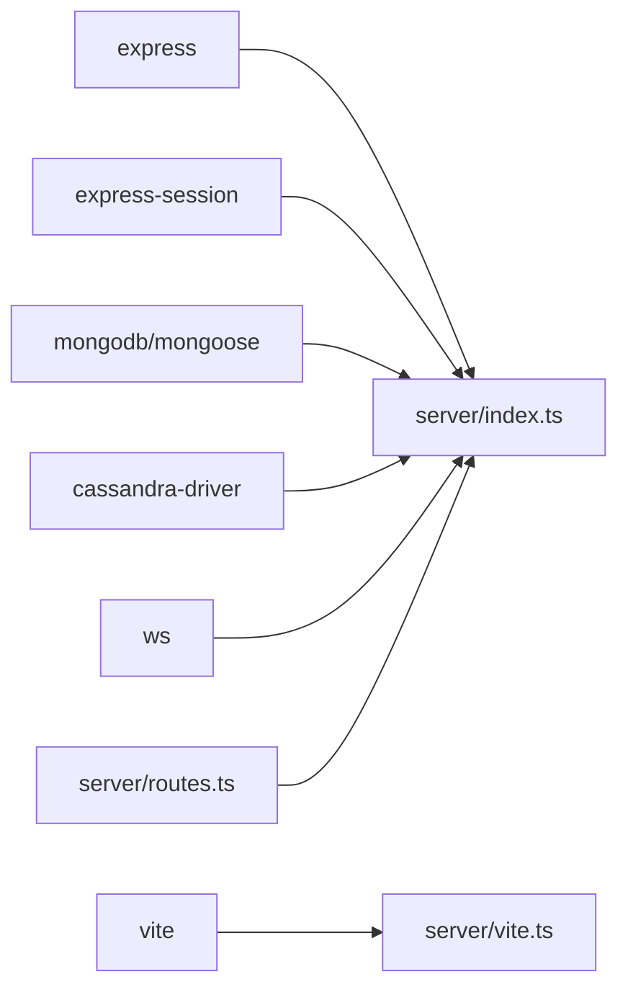

# Deployment Strategies

<cite>
**Referenced Files in This Document**
- [vercel.json](file://vercel.json)
- [Dockerfile](file://Dockerfile)
- [docker-compose.yml](file://docker-compose.yml)
- [package.json](file://package.json)
- [.env.example](file://.env.example)
- [server/index.ts](file://server/index.ts)
- [server/vite.ts](file://server/vite.ts)
- [server/routes.ts](file://server/routes.ts)
- [vite.config.ts](file://vite.config.ts)
- [tailwind.config.ts](file://tailwind.config.ts)
- [postcss.config.js](file://postcss.config.js)
- [LOCAL_SETUP.md](file://LOCAL_SETUP.md)
- [message_pal.md](file://message_pal.md)
</cite>

## Table of Contents
1. [Introduction](#introduction)
2. [Project Structure](#project-structure)
3. [Core Components](#core-components)
4. [Architecture Overview](#architecture-overview)
5. [Detailed Component Analysis](#detailed-component-analysis)
6. [Dependency Analysis](#dependency-analysis)
7. [Performance Considerations](#performance-considerations)
8. [Troubleshooting Guide](#troubleshooting-guide)
9. [Conclusion](#conclusion)
10. [Appendices](#appendices)

## Introduction
This document provides a comprehensive deployment strategy for PersonalLearningPro across development, staging, and production environments. It covers Vercel static hosting configuration, Express.js server deployment options, environment-specific configurations, infrastructure requirements, scaling and cost optimization, deployment automation, rollback procedures, and disaster recovery planning. The guidance is grounded in the repository’s configuration files and source code.

## Project Structure
PersonalLearningPro is a full-stack application composed of:
- A React-based frontend built with Vite and served either via Vite’s dev server in development or statically in production.
- An Express.js backend that serves both API endpoints and the client application.
- Optional real-time messaging capabilities via WebSocket servers and a dedicated MessagePal HTTP server.
- Optional external integrations for authentication (Firebase), AI (OpenAI), and message persistence (Cassandra/Astra DB).

Key deployment-relevant files:
- Vercel configuration for static hosting and routing.
- Dockerfile and docker-compose for containerized local and CI deployments.
- Package scripts for building and running the app.
- Environment variables for databases, sessions, and optional integrations.
- Server entrypoint and routing logic.

**Diagram sources**
- [vite.config.ts](file://vite.config.ts#L1-L35)
- [tailwind.config.ts](file://tailwind.config.ts#L1-L164)
- [postcss.config.js](file://postcss.config.js#L1-L7)
- [server/index.ts](file://server/index.ts#L1-L114)
- [server/vite.ts](file://server/vite.ts#L1-L89)
- [server/routes.ts](file://server/routes.ts#L1-L1104)

**Section sources**
- [vercel.json](file://vercel.json#L1-L28)
- [Dockerfile](file://Dockerfile#L1-L58)
- [docker-compose.yml](file://docker-compose.yml#L1-L24)
- [package.json](file://package.json#L1-L120)
- [vite.config.ts](file://vite.config.ts#L1-L35)
- [tailwind.config.ts](file://tailwind.config.ts#L1-L164)
- [postcss.config.js](file://postcss.config.js#L1-L7)
- [server/index.ts](file://server/index.ts#L1-L114)
- [server/vite.ts](file://server/vite.ts#L1-L89)
- [server/routes.ts](file://server/routes.ts#L1-L1104)

## Core Components
- Vercel configuration defines builds and routes for serverless and static assets.
- Dockerfile supports multi-stage builds for development and production.
- docker-compose enables local development with hot reload and bind-mounted configs.
- Express server initializes session storage, routes, WebSocket servers, and serves static assets in production.
- Vite configuration controls client bundling and output location.
- Environment variables define database connections, session secrets, and optional integrations.

**Section sources**
- [vercel.json](file://vercel.json#L1-L28)
- [Dockerfile](file://Dockerfile#L1-L58)
- [docker-compose.yml](file://docker-compose.yml#L1-L24)
- [server/index.ts](file://server/index.ts#L1-L114)
- [server/vite.ts](file://server/vite.ts#L1-L89)
- [vite.config.ts](file://vite.config.ts#L1-L35)
- [.env.example](file://.env.example#L1-L36)

## Architecture Overview
The application runs a single Express server on port 5001 that:
- Serves API endpoints defined in routes.
- Serves the React client in production via static files.
- Provides development-time Vite middleware for HMR and SSR-like behavior.
- Initializes session storage and integrates with MongoDB and optional Cassandra/Astra DB.
- Hosts WebSocket servers for chat and MessagePal.

**Diagram sources**
- [server/index.ts](file://server/index.ts#L1-L114)
- [server/routes.ts](file://server/routes.ts#L1-L1104)
- [server/vite.ts](file://server/vite.ts#L1-L89)

## Detailed Component Analysis

### Vercel Deployment Configuration
Vercel is configured to:
- Build the serverless Node.js function from the compiled server entry.
- Serve static assets from the client build output.
- Route API traffic to the serverless function and all other paths to the static folder.
- Apply asset-specific routing for assets.

**Diagram sources**
- [vercel.json](file://vercel.json#L1-L28)

**Section sources**
- [vercel.json](file://vercel.json#L1-L28)

### Express.js Server Deployment Options
The server is designed to run on port 5001 and can be deployed via:
- Docker multi-stage builds for production.
- Container orchestration with docker-compose for local development.
- Direct Node.js execution using npm scripts.

Key deployment characteristics:
- Port exposure and binding to 0.0.0.0.
- Conditional Vite middleware in development vs. static serving in production.
- Session configuration with cookie security depending on environment.
- Initialization of MongoDB and optional Cassandra/Astra DB.

**Diagram sources**
- [server/index.ts](file://server/index.ts#L1-L114)
- [server/routes.ts](file://server/routes.ts#L1-L1104)
- [server/vite.ts](file://server/vite.ts#L1-L89)

**Section sources**
- [Dockerfile](file://Dockerfile#L1-L58)
- [docker-compose.yml](file://docker-compose.yml#L1-L24)
- [server/index.ts](file://server/index.ts#L1-L114)
- [server/vite.ts](file://server/vite.ts#L1-L89)
- [package.json](file://package.json#L1-L120)

### Environment-Specific Configurations
Environment variables are used to configure:
- Firebase (optional) for authentication features.
- OpenAI (optional) for AI-powered features.
- MongoDB connection string.
- Session secret (required in production).
- Cassandra/Astra DB secure bundle path, token, and keyspace (optional).

Environment profiles:
- Development: defaults applied when variables are missing; Vite dev middleware enabled.
- Staging/Production: strict checks for required variables (e.g., SESSION_SECRET).

**Diagram sources**
- [server/index.ts](file://server/index.ts#L1-L114)
- [.env.example](file://.env.example#L1-L36)

**Section sources**
- [.env.example](file://.env.example#L1-L36)
- [server/index.ts](file://server/index.ts#L1-L114)

### Infrastructure Requirements
- Compute: Single container or VM running the Express server on port 5001.
- Storage: MongoDB for primary data; optional Cassandra/Astra DB for message history.
- Networking: Inbound access to port 5001; outbound access to external services (OpenAI, Firebase).
- Optional: WebSocket-compatible infrastructure for real-time chat and MessagePal.

**Section sources**
- [server/index.ts](file://server/index.ts#L1-L114)
- [message_pal.md](file://message_pal.md#L150-L279)

### Scaling Strategies
- Vertical scaling: Increase CPU/RAM resources for the container/VM.
- Horizontal scaling: Deploy multiple instances behind a load balancer; ensure shared session storage if sticky sessions are not used.
- Caching: Use CDN for static assets; cache API responses where appropriate.
- Database scaling: Scale MongoDB and Cassandra independently; consider read replicas and managed services.

[No sources needed since this section provides general guidance]

### Cost Optimization Techniques
- Use multi-stage Docker builds to minimize production image size.
- Prefer managed databases and CDNs to reduce operational overhead.
- Minimize cold starts by keeping the server warm or using provisioned concurrency where applicable.
- Optimize client bundles via Vite chunking and lazy loading.

**Section sources**
- [Dockerfile](file://Dockerfile#L1-L58)
- [vite.config.ts](file://vite.config.ts#L1-L35)

### Deployment Automation
Recommended pipeline stages:
- Build: Run client build and server bundling.
- Test: Execute type checks and unit tests.
- Package: Produce Docker images or serverless artifacts.
- Deploy: Roll out to staging, then production.
- Monitor: Observe logs, metrics, and health checks.

[No sources needed since this diagram shows conceptual workflow, not actual code structure]

### Rollback Procedures
- Version pinning: Tag releases and maintain artifact registries.
- Blue-Green: Keep two identical environments; switch traffic upon failure.
- Canary: Gradually shift traffic to the new version; revert if errors exceed threshold.
- Automated rollback: Use CI/CD gates to detect failures and trigger rollback.

[No sources needed since this section provides general guidance]

### Disaster Recovery Planning
- Backup schedules: Regular snapshots of MongoDB and Cassandra.
- Replication: Enable cross-region replication for managed databases.
- Recovery drills: Periodically restore from backups in a staging environment.
- RTO/RPO targets: Define acceptable downtime and data loss windows.

[No sources needed since this section provides general guidance]

## Dependency Analysis
The server depends on:
- Express for HTTP routing and middleware.
- express-session for session management.
- MongoDB/Mongoose for data persistence.
- Optional Cassandra driver for message storage.
- WebSocket libraries for real-time features.
- Vite for development-time SSR-like behavior and static serving in production.

**Diagram sources**
- [server/index.ts](file://server/index.ts#L1-L114)
- [server/vite.ts](file://server/vite.ts#L1-L89)
- [server/routes.ts](file://server/routes.ts#L1-L1104)

**Section sources**
- [server/index.ts](file://server/index.ts#L1-L114)
- [server/routes.ts](file://server/routes.ts#L1-L1104)
- [server/vite.ts](file://server/vite.ts#L1-L89)

## Performance Considerations
- Bundle optimization: Leverage Vite’s chunk splitting and tree-shaking.
- Static asset delivery: Serve via CDN or Vercel’s global network.
- Database indexing: Ensure proper indexes for frequent queries.
- Connection pooling: Configure MongoDB and Cassandra pools appropriately.
- Health checks: Expose readiness/liveness endpoints for orchestrators.

[No sources needed since this section provides general guidance]

## Troubleshooting Guide
Common deployment issues and remedies:
- Missing SESSION_SECRET in production: The server throws a fatal error. Set the environment variable before deploying.
- Static build missing in production: Ensure the client is built prior to starting the server; otherwise, static serving will fail.
- Database connectivity: Verify connection strings and network access; test connectivity in the deployment environment.
- CORS and cookies: Confirm cookie secure flag and SameSite settings match deployment domain and protocol.

**Section sources**
- [server/index.ts](file://server/index.ts#L1-L114)
- [server/vite.ts](file://server/vite.ts#L1-L89)

## Conclusion
PersonalLearningPro can be deployed effectively using Vercel for static hosting and Express for dynamic API and real-time features. The provided Docker and docker-compose configurations enable repeatable local and CI deployments. By adhering to environment-specific configurations, implementing robust scaling and cost optimization strategies, and establishing automated deployment and rollback procedures, teams can reliably operate the application across development, staging, and production environments.

## Appendices

### Environment Variable Reference
- Firebase (optional): Keys for web app configuration.
- OpenAI (optional): API key for AI features.
- MongoDB: Connection string for primary data store.
- Session Secret: Required in production for signing session cookies.
- Cassandra/Astra DB (optional): Secure bundle path, application token, and keyspace for message storage.

**Section sources**
- [.env.example](file://.env.example#L1-L36)

### Local Development Notes
- The project supports running without Docker; however, Docker Compose provides a fast, reproducible environment with hot reload and bind-mounted configs.

**Section sources**
- [LOCAL_SETUP.md](file://LOCAL_SETUP.md#L1-L99)