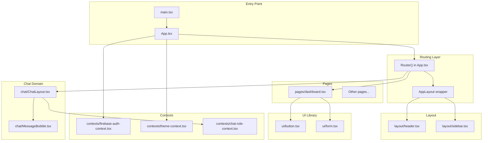
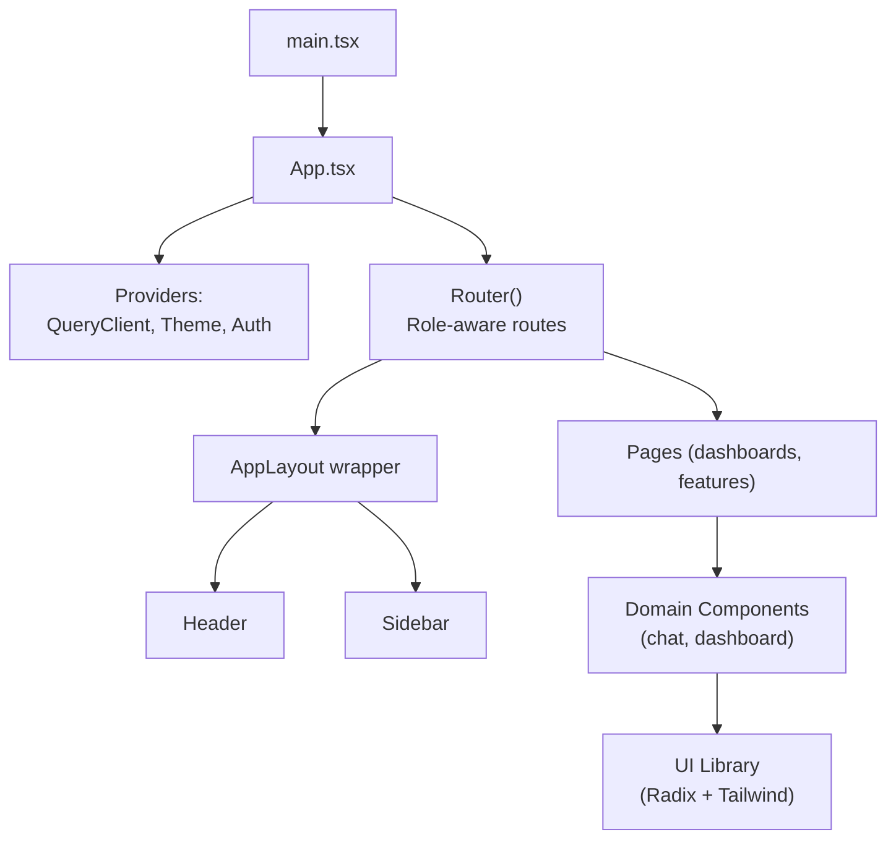
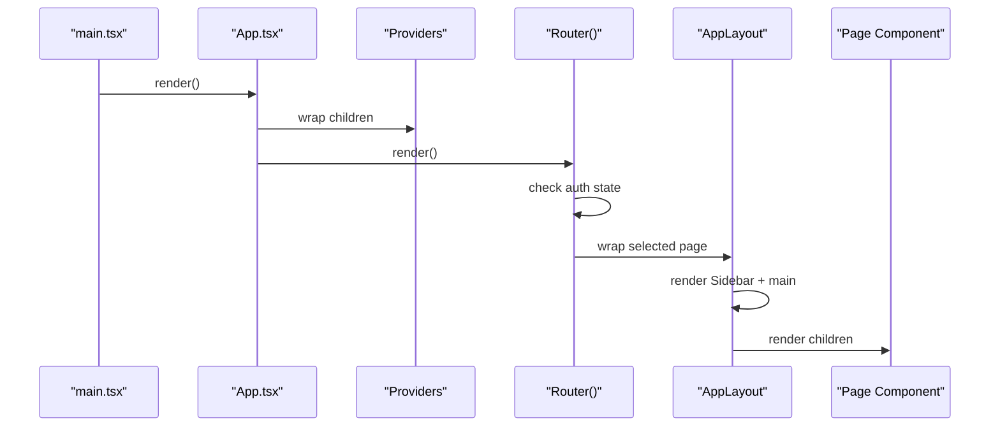
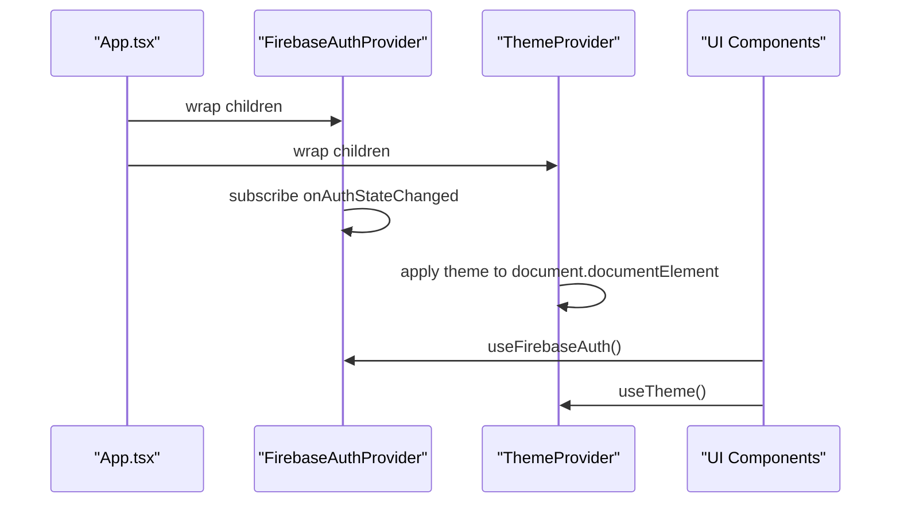
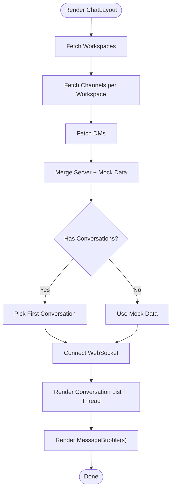
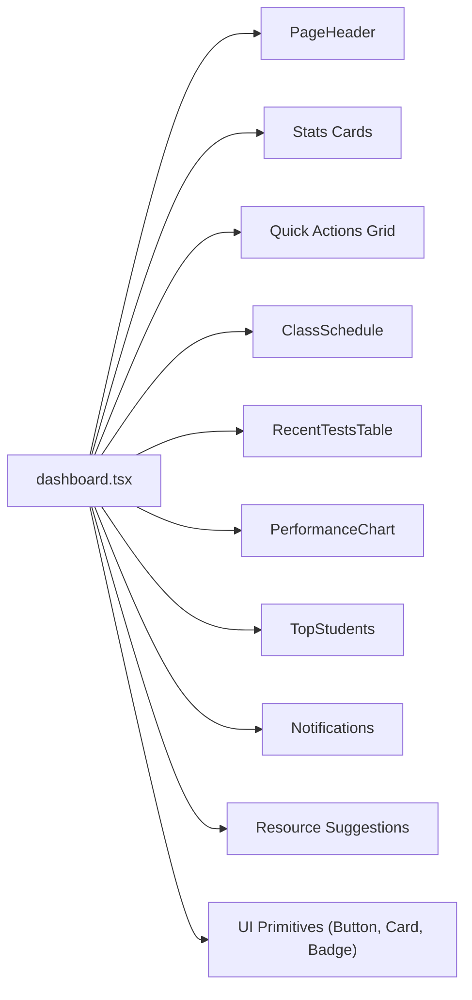
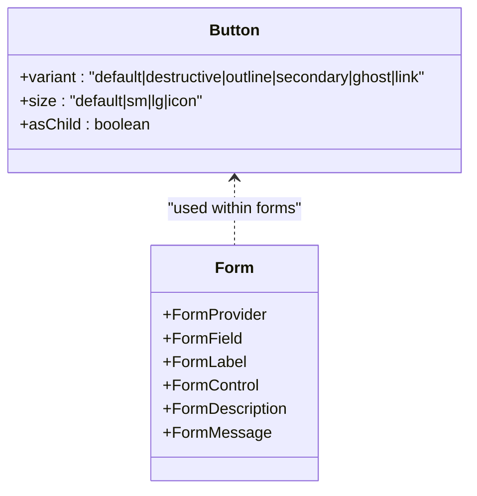
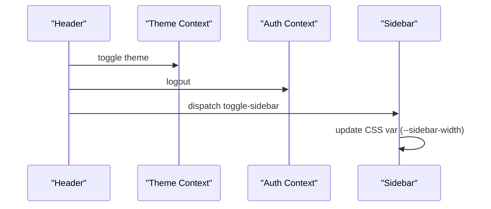
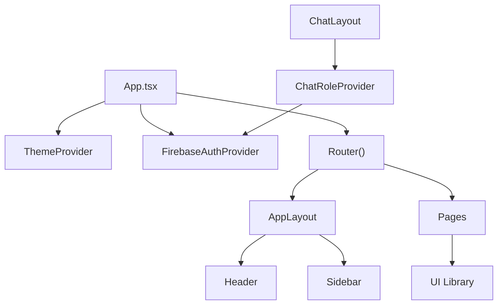

# Component Architecture

<cite>
**Referenced Files in This Document**
- [App.tsx](file://client/src/App.tsx)
- [main.tsx](file://client/src/main.tsx)
- [index.css](file://client/src/index.css)
- [config.ts](file://client/src/config.ts)
- [dashboard.tsx](file://client/src/pages/dashboard.tsx)
- [sidebar.tsx](file://client/src/components/layout/sidebar.tsx)
- [header.tsx](file://client/src/components/layout/header.tsx)
- [ChatLayout.tsx](file://client/src/components/chat/ChatLayout.tsx)
- [MessageBubble.tsx](file://client/src/components/chat/MessageBubble.tsx)
- [firebase-auth-context.tsx](file://client/src/contexts/firebase-auth-context.tsx)
- [theme-context.tsx](file://client/src/contexts/theme-context.tsx)
- [chat-role-context.tsx](file://client/src/contexts/chat-role-context.tsx)
- [button.tsx](file://client/src/components/ui/button.tsx)
- [form.tsx](file://client/src/components/ui/form.tsx)
</cite>

## Table of Contents
1. [Introduction](#introduction)
2. [Project Structure](#project-structure)
3. [Core Components](#core-components)
4. [Architecture Overview](#architecture-overview)
5. [Detailed Component Analysis](#detailed-component-analysis)
6. [Dependency Analysis](#dependency-analysis)
7. [Performance Considerations](#performance-considerations)
8. [Troubleshooting Guide](#troubleshooting-guide)
9. [Conclusion](#conclusion)
10. [Appendices](#appendices)

## Introduction
This document describes the component architecture of PersonalLearningPro’s React application. It explains the component hierarchy, reusable UI components, and page-level components. It also covers composition patterns, how prop drilling is prevented using context providers, lifecycle management, and the custom component library built with Radix UI primitives. Specialized educational components such as chat bubbles and performance charts are documented alongside naming conventions, folder organization, testing strategies, accessibility, and responsive design patterns.

## Project Structure
The client application is organized by feature and layer:
- Pages: route-level views such as dashboards and feature pages
- Components: reusable UI building blocks grouped by domain (layout, chat, dashboard, ui)
- Contexts: cross-cutting concerns (authentication, theme, chat role)
- Hooks: custom hooks for UI behavior (e.g., mobile detection, toast)
- Lib: shared utilities and API clients
- Types: TypeScript type definitions
- Assets and styles: Tailwind CSS base tokens and animations

**Diagram sources**
- [main.tsx](file://client/src/main.tsx#L1-L8)
- [App.tsx](file://client/src/App.tsx#L1-L165)
- [dashboard.tsx](file://client/src/pages/dashboard.tsx#L1-L338)
- [sidebar.tsx](file://client/src/components/layout/sidebar.tsx#L1-L332)
- [header.tsx](file://client/src/components/layout/header.tsx#L1-L133)
- [ChatLayout.tsx](file://client/src/components/chat/ChatLayout.tsx#L1-L185)
- [MessageBubble.tsx](file://client/src/components/chat/MessageBubble.tsx#L1-L157)
- [button.tsx](file://client/src/components/ui/button.tsx#L1-L57)
- [form.tsx](file://client/src/components/ui/form.tsx#L1-L177)
- [firebase-auth-context.tsx](file://client/src/contexts/firebase-auth-context.tsx#L1-L267)
- [theme-context.tsx](file://client/src/contexts/theme-context.tsx#L1-L72)
- [chat-role-context.tsx](file://client/src/contexts/chat-role-context.tsx#L1-L59)

**Section sources**
- [main.tsx](file://client/src/main.tsx#L1-L8)
- [App.tsx](file://client/src/App.tsx#L1-L165)

## Core Components
- App and Routing: The application bootstraps via main.tsx and renders App.tsx. App.tsx defines a provider stack (React Query, Theme, Firebase Auth) and a role-aware Router that conditionally renders pages and applies a layout wrapper.
- Layout Wrapper: AppLayout centralizes sidebar and main content margins, supporting full-width and constrained layouts.
- Authentication and Theme Contexts: FirebaseAuthProvider and ThemeProvider encapsulate auth state and theme persistence, exposing hooks for consumption.
- UI Library: A set of Radix UI–based components (button, form, input, etc.) with Tailwind-based variants and consistent APIs.

Key responsibilities:
- App.tsx: Routing orchestration, role-based dashboard selection, loading/auth UI, and layout wrapping
- AppLayout: Container with sidebar width control and responsive constraints
- FirebaseAuthProvider: Auth state, profile hydration, and toast-driven UX
- ThemeProvider: System-aware theme persistence and DOM class updates
- UI components: Consistent variants, slots, and accessibility attributes

**Section sources**
- [App.tsx](file://client/src/App.tsx#L1-L165)
- [main.tsx](file://client/src/main.tsx#L1-L8)
- [firebase-auth-context.tsx](file://client/src/contexts/firebase-auth-context.tsx#L1-L267)
- [theme-context.tsx](file://client/src/contexts/theme-context.tsx#L1-L72)
- [button.tsx](file://client/src/components/ui/button.tsx#L1-L57)
- [form.tsx](file://client/src/components/ui/form.tsx#L1-L177)

## Architecture Overview
The app follows a layered architecture:
- Entry point initializes React root and providers
- Routing layer decides which page to render based on role and route
- Layout layer composes header and sidebar around page content
- Domain components (chat, dashboard) encapsulate feature logic
- UI primitives (Radix + Tailwind) provide reusable, accessible building blocks

**Diagram sources**
- [main.tsx](file://client/src/main.tsx#L1-L8)
- [App.tsx](file://client/src/App.tsx#L1-L165)
- [header.tsx](file://client/src/components/layout/header.tsx#L1-L133)
- [sidebar.tsx](file://client/src/components/layout/sidebar.tsx#L1-L332)
- [dashboard.tsx](file://client/src/pages/dashboard.tsx#L1-L338)
- [ChatLayout.tsx](file://client/src/components/chat/ChatLayout.tsx#L1-L185)
- [button.tsx](file://client/src/components/ui/button.tsx#L1-L57)

## Detailed Component Analysis

### Routing and Layout Composition
- App.tsx orchestrates:
  - Provider stack: React Query, Theme, Firebase Auth
  - Router: role-aware selection of dashboard and feature routes
  - Loading and auth dialogs
  - Layout wrapper injection around pages
- AppLayout:
  - Renders Sidebar and main content area
  - Controls left margin via CSS variable for sidebar width
  - Supports full-width mode for immersive pages

**Diagram sources**
- [main.tsx](file://client/src/main.tsx#L1-L8)
- [App.tsx](file://client/src/App.tsx#L1-L165)

**Section sources**
- [App.tsx](file://client/src/App.tsx#L1-L165)

### Authentication and Theme Contexts
- FirebaseAuthProvider:
  - Subscribes to auth state, hydrates profile, and exposes login/register/logout/reset helpers
  - Toasts provide feedback; loading state prevents UI flicker
- ThemeProvider:
  - Persists theme preference and applies system fallback
  - Updates document root classes for Tailwind variants

**Diagram sources**
- [firebase-auth-context.tsx](file://client/src/contexts/firebase-auth-context.tsx#L1-L267)
- [theme-context.tsx](file://client/src/contexts/theme-context.tsx#L1-L72)

**Section sources**
- [firebase-auth-context.tsx](file://client/src/contexts/firebase-auth-context.tsx#L1-L267)
- [theme-context.tsx](file://client/src/contexts/theme-context.tsx#L1-L72)

### Chat Domain: Conversations and Message Bubbles
- ChatLayout:
  - Provides role-aware context for chat
  - Fetches workspaces, channels, and DMs; merges with mock data
  - Manages active conversation, list visibility, and WebSocket connection
- MessageBubble:
  - Renders different message types (announcement, assignment, system, text/media)
  - Applies role-based and type-based styling
  - Handles pinned, doubt, mentions, and status indicators

**Diagram sources**
- [ChatLayout.tsx](file://client/src/components/chat/ChatLayout.tsx#L1-L185)
- [MessageBubble.tsx](file://client/src/components/chat/MessageBubble.tsx#L1-L157)

**Section sources**
- [ChatLayout.tsx](file://client/src/components/chat/ChatLayout.tsx#L1-L185)
- [MessageBubble.tsx](file://client/src/components/chat/MessageBubble.tsx#L1-L157)

### Dashboard Page Composition
- dashboard.tsx composes:
  - PageHeader, stats cards, quick actions, class schedule, recent tests, performance chart, top students, notifications, and resource suggestions
  - Uses UI primitives (Button, Card, Badge) and educational components (PerformanceChart, TopStudents)
  - Integrates with React Query for notifications and links to feature routes

**Diagram sources**
- [dashboard.tsx](file://client/src/pages/dashboard.tsx#L1-L338)
- [button.tsx](file://client/src/components/ui/button.tsx#L1-L57)

**Section sources**
- [dashboard.tsx](file://client/src/pages/dashboard.tsx#L1-L338)

### UI Primitive Library: Button and Form
- Button:
  - Variants and sizes via class-variance-authority
  - Accepts asChild to render semantic elements
  - Integrates with Radix UI slot for composition
- Form:
  - React Hook Form provider and field utilities
  - Accessible labeling, descriptions, and error messaging
  - Controlled components with proper aria attributes

**Diagram sources**
- [button.tsx](file://client/src/components/ui/button.tsx#L1-L57)
- [form.tsx](file://client/src/components/ui/form.tsx#L1-L177)

**Section sources**
- [button.tsx](file://client/src/components/ui/button.tsx#L1-L57)
- [form.tsx](file://client/src/components/ui/form.tsx#L1-L177)

### Layout Components: Header and Sidebar
- Header:
  - Responsive search toggle, theme toggle, notifications, messages, and user dropdown
  - Uses theme and auth contexts; integrates with sidebar toggle via custom event dispatch
- Sidebar:
  - Role-aware navigation items, collapsible behavior, mobile overlay, and user panel
  - Synchronizes width via CSS variable and Tailwind utilities

**Diagram sources**
- [header.tsx](file://client/src/components/layout/header.tsx#L1-L133)
- [sidebar.tsx](file://client/src/components/layout/sidebar.tsx#L1-L332)
- [theme-context.tsx](file://client/src/contexts/theme-context.tsx#L1-L72)
- [firebase-auth-context.tsx](file://client/src/contexts/firebase-auth-context.tsx#L1-L267)

**Section sources**
- [header.tsx](file://client/src/components/layout/header.tsx#L1-L133)
- [sidebar.tsx](file://client/src/components/layout/sidebar.tsx#L1-L332)

## Dependency Analysis
- Provider stack: App.tsx wraps children in QueryClientProvider, ThemeProvider, FirebaseAuthProvider
- Context coupling:
  - ChatLayout depends on ChatRoleProvider (derived from auth)
  - UI components depend on Radix UI primitives and Tailwind utilities
- Routing and layout:
  - Router selects pages and applies AppLayout wrapper
  - AppLayout composes Header and Sidebar around page content

**Diagram sources**
- [App.tsx](file://client/src/App.tsx#L1-L165)
- [theme-context.tsx](file://client/src/contexts/theme-context.tsx#L1-L72)
- [firebase-auth-context.tsx](file://client/src/contexts/firebase-auth-context.tsx#L1-L267)
- [chat-role-context.tsx](file://client/src/contexts/chat-role-context.tsx#L1-L59)
- [header.tsx](file://client/src/components/layout/header.tsx#L1-L133)
- [sidebar.tsx](file://client/src/components/layout/sidebar.tsx#L1-L332)

**Section sources**
- [App.tsx](file://client/src/App.tsx#L1-L165)
- [chat-role-context.tsx](file://client/src/contexts/chat-role-context.tsx#L1-L59)

## Performance Considerations
- Memoization and stable wrappers:
  - AppLayout wrapper memoization avoids recreating components on each render
  - ChatLayout uses useMemo and useCallback to stabilize derived values and handlers
- Query caching:
  - React Query queries use staleTime and retries to balance freshness and performance
- CSS variable-driven layout:
  - Sidebar width controlled via CSS variable reduces layout thrashing
- Lightweight context reads:
  - Context consumers are scoped to small subtrees to minimize re-renders

[No sources needed since this section provides general guidance]

## Troubleshooting Guide
- Authentication flow:
  - If auth state hangs, check onAuthStateChanged subscription and profile hydration timeouts
  - Toast feedback helps diagnose login/register/logout failures
- Theme switching:
  - Verify system preference fallback and local storage persistence
- Chat connectivity:
  - Confirm WebSocket initialization and conversation selection logic
- Layout issues:
  - Ensure CSS variable for sidebar width is set and Tailwind utilities are applied

**Section sources**
- [firebase-auth-context.tsx](file://client/src/contexts/firebase-auth-context.tsx#L1-L267)
- [theme-context.tsx](file://client/src/contexts/theme-context.tsx#L1-L72)
- [ChatLayout.tsx](file://client/src/components/chat/ChatLayout.tsx#L1-L185)
- [sidebar.tsx](file://client/src/components/layout/sidebar.tsx#L1-L332)

## Conclusion
PersonalLearningPro’s component architecture emphasizes:
- Clear separation of concerns across routing, layout, domain, and UI layers
- Context-based composition to prevent prop drilling and centralize cross-cutting concerns
- A robust UI primitive library built on Radix UI and Tailwind for accessibility and consistency
- Educational domain components (chat, dashboards) integrated with reactive data fetching and responsive design

[No sources needed since this section summarizes without analyzing specific files]

## Appendices

### Naming Conventions and Folder Organization
- Feature-first grouping:
  - components/layout, components/chat, components/dashboard, components/test, components/ui
- Page-level components:
  - pages/*.tsx for route-level views
- Contexts and hooks:
  - contexts/* for providers, hooks/* for custom hooks
- Utilities and types:
  - lib/* for shared utilities/API clients, types/* for TS types
- Tokens and animations:
  - index.css defines CSS variables and Tailwind layers for themes, charts, and chat tokens

**Section sources**
- [index.css](file://client/src/index.css#L1-L344)
- [config.ts](file://client/src/config.ts#L1-L8)

### Accessibility Implementation
- Semantic markup and labels:
  - Buttons, inputs, and form controls use proper roles and labels
  - Radix UI primitives provide accessible defaults
- Keyboard navigation:
  - Focus management and keyboard interactions supported by Radix UI
- ARIA attributes:
  - Form controls expose aria-invalid and described-by IDs
- Color contrast and themes:
  - Dark/light variants and chart tokens ensure readability across modes

**Section sources**
- [button.tsx](file://client/src/components/ui/button.tsx#L1-L57)
- [form.tsx](file://client/src/components/ui/form.tsx#L1-L177)
- [index.css](file://client/src/index.css#L1-L344)

### Responsive Design Patterns
- Breakpoints and spacing:
  - Tailwind utilities for responsive grids and paddings
- Sidebar behavior:
  - Collapsible layout with CSS variable-driven width and mobile overlay
- Typography and cards:
  - Responsive typography scales and card layouts adapt to screen sizes

**Section sources**
- [sidebar.tsx](file://client/src/components/layout/sidebar.tsx#L1-L332)
- [dashboard.tsx](file://client/src/pages/dashboard.tsx#L1-L338)
- [index.css](file://client/src/index.css#L1-L344)