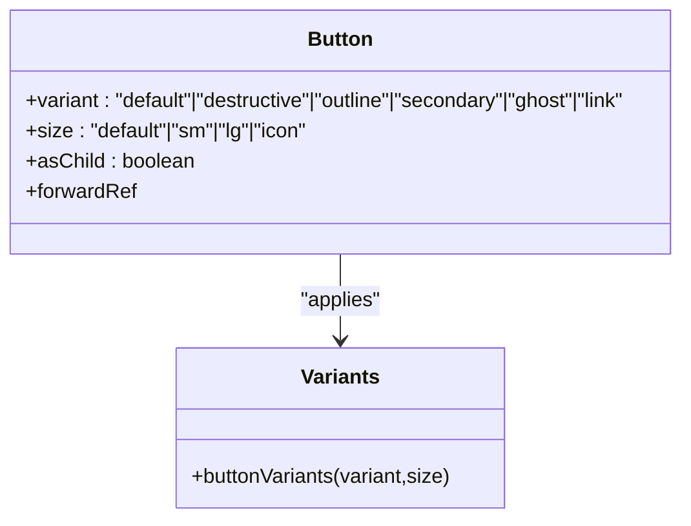
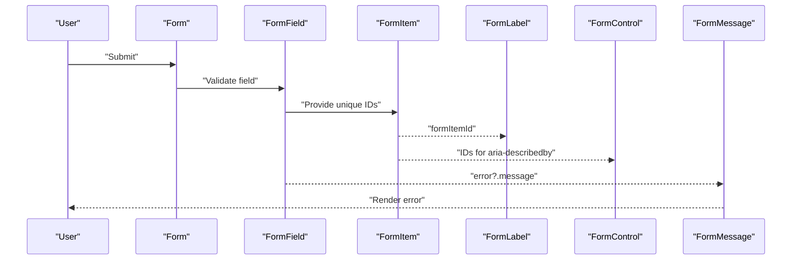
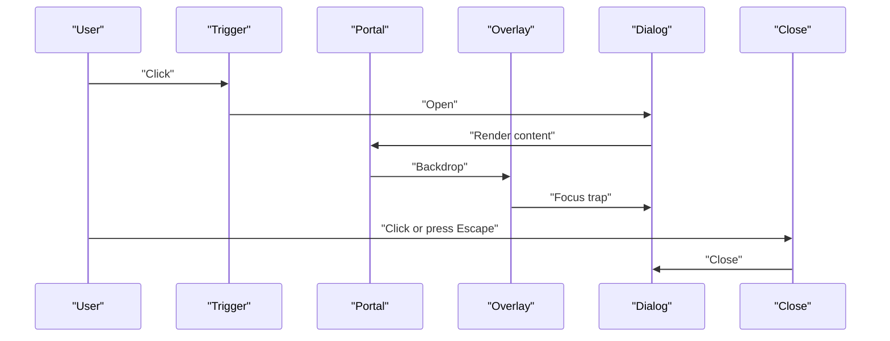
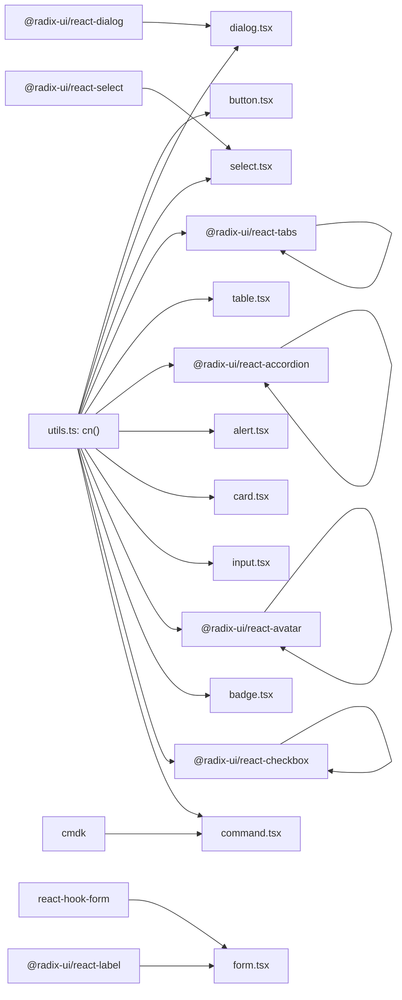

# UI Component Library

<cite>
**Referenced Files in This Document**
- [button.tsx](file://client/src/components/ui/button.tsx)
- [form.tsx](file://client/src/components/ui/form.tsx)
- [dialog.tsx](file://client/src/components/ui/dialog.tsx)
- [input.tsx](file://client/src/components/ui/input.tsx)
- [select.tsx](file://client/src/components/ui/select.tsx)
- [card.tsx](file://client/src/components/ui/card.tsx)
- [tabs.tsx](file://client/src/components/ui/tabs.tsx)
- [table.tsx](file://client/src/components/ui/table.tsx)
- [accordion.tsx](file://client/src/components/ui/accordion.tsx)
- [alert.tsx](file://client/src/components/ui/alert.tsx)
- [avatar.tsx](file://client/src/components/ui/avatar.tsx)
- [badge.tsx](file://client/src/components/ui/badge.tsx)
- [calendar.tsx](file://client/src/components/ui/calendar.tsx)
- [checkbox.tsx](file://client/src/components/ui/checkbox.tsx)
- [collapsible.tsx](file://client/src/components/ui/collapsible.tsx)
- [command.tsx](file://client/src/components/ui/command.tsx)
- [theme-toggle.tsx](file://client/src/components/ui/theme-toggle.tsx)
- [theme-context.tsx](file://client/src/contexts/theme-context.tsx)
- [index.css](file://client/src/index.css)
- [tailwind.config.ts](file://client/src/tailwind.config.ts)
- [utils.ts](file://client/src/lib/utils.ts)
</cite>

## Table of Contents
1. [Introduction](#introduction)
2. [Project Structure](#project-structure)
3. [Core Components](#core-components)
4. [Architecture Overview](#architecture-overview)
5. [Detailed Component Analysis](#detailed-component-analysis)
6. [Dependency Analysis](#dependency-analysis)
7. [Performance Considerations](#performance-considerations)
8. [Troubleshooting Guide](#troubleshooting-guide)
9. [Conclusion](#conclusion)
10. [Appendices](#appendices)

## Introduction
This document describes PersonalLearningPro’s custom UI component library built on Radix UI primitives. It covers reusable components for buttons, forms, dialogs, navigation, and educational dashboards, along with styling patterns, accessibility, and theme integration. The guide explains component composition, prop validation, customization, focus management, keyboard navigation, screen reader compatibility, responsive design, and state management. It also provides usage examples and best practices for extending components.

## Project Structure
The UI components live under client/src/components/ui and integrate with Radix UI, Tailwind CSS, and a theme context. Utility helpers centralize class merging and styling.

```mermaid
graph TB
subgraph "UI Components"
BTN["button.tsx"]
FORM["form.tsx"]
DLG["dialog.tsx"]
INPUT["input.tsx"]
SEL["select.tsx"]
CARD["card.tsx"]
TABS["tabs.tsx"]
TABLE["table.tsx"]
ACC["accordion.tsx"]
ALERT["alert.tsx"]
AVA["avatar.tsx"]
BADGE["badge.tsx"]
CALENDAR["calendar.tsx"]
CHECK["checkbox.tsx"]
CMD["command.tsx"]
COLL["collapsible.tsx"]
end
subgraph "Styling & Theme"
UTILS["utils.ts"]
THEMECTX["theme-context.tsx"]
THEME_TOGGLE["theme-toggle.tsx"]
TAILWIND["tailwind.config.ts"]
CSS["index.css"]
end
BTN --> UTILS
FORM --> UTILS
DLG --> UTILS
INPUT --> UTILS
SEL --> UTILS
CARD --> UTILS
TABS --> UTILS
TABLE --> UTILS
ACC --> UTILS
ALERT --> UTILS
AVA --> UTILS
BADGE --> UTILS
CALENDAR --> UTILS
CHECK --> UTILS
CMD --> UTILS
COLL --> UTILS
THEME_TOGGLE --> THEMECTX
THEME_TOGGLE --> TAILWIND
THEME_TOGGLE --> CSS
```

**Diagram sources**
- [button.tsx](file://client/src/components/ui/button.tsx#L1-L57)
- [form.tsx](file://client/src/components/ui/form.tsx#L1-L177)
- [dialog.tsx](file://client/src/components/ui/dialog.tsx#L1-L121)
- [input.tsx](file://client/src/components/ui/input.tsx#L1-L26)
- [select.tsx](file://client/src/components/ui/select.tsx#L1-L159)
- [card.tsx](file://client/src/components/ui/card.tsx#L1-L80)
- [tabs.tsx](file://client/src/components/ui/tabs.tsx#L1-L54)
- [table.tsx](file://client/src/components/ui/table.tsx#L1-L118)
- [accordion.tsx](file://client/src/components/ui/accordion.tsx#L1-L57)
- [alert.tsx](file://client/src/components/ui/alert.tsx#L1-L60)
- [avatar.tsx](file://client/src/components/ui/avatar.tsx#L1-L49)
- [badge.tsx](file://client/src/components/ui/badge.tsx#L1-L37)
- [calendar.tsx](file://client/src/components/ui/calendar.tsx#L1-L65)
- [checkbox.tsx](file://client/src/components/ui/checkbox.tsx#L1-L29)
- [command.tsx](file://client/src/components/ui/command.tsx#L1-L154)
- [collapsible.tsx](file://client/src/components/ui/collapsible.tsx#L1-L10)
- [utils.ts](file://client/src/lib/utils.ts)
- [theme-context.tsx](file://client/src/contexts/theme-context.tsx)
- [theme-toggle.tsx](file://client/src/components/ui/theme-toggle.tsx)
- [tailwind.config.ts](file://client/src/tailwind.config.ts)
- [index.css](file://client/src/index.css)

**Section sources**
- [button.tsx](file://client/src/components/ui/button.tsx#L1-L57)
- [form.tsx](file://client/src/components/ui/form.tsx#L1-L177)
- [dialog.tsx](file://client/src/components/ui/dialog.tsx#L1-L121)
- [input.tsx](file://client/src/components/ui/input.tsx#L1-L26)
- [select.tsx](file://client/src/components/ui/select.tsx#L1-L159)
- [card.tsx](file://client/src/components/ui/card.tsx#L1-L80)
- [tabs.tsx](file://client/src/components/ui/tabs.tsx#L1-L54)
- [table.tsx](file://client/src/components/ui/table.tsx#L1-L118)
- [accordion.tsx](file://client/src/components/ui/accordion.tsx#L1-L57)
- [alert.tsx](file://client/src/components/ui/alert.tsx#L1-L60)
- [avatar.tsx](file://client/src/components/ui/avatar.tsx#L1-L49)
- [badge.tsx](file://client/src/components/ui/badge.tsx#L1-L37)
- [calendar.tsx](file://client/src/components/ui/calendar.tsx#L1-L65)
- [checkbox.tsx](file://client/src/components/ui/checkbox.tsx#L1-L29)
- [command.tsx](file://client/src/components/ui/command.tsx#L1-L154)
- [collapsible.tsx](file://client/src/components/ui/collapsible.tsx#L1-L10)
- [utils.ts](file://client/src/lib/utils.ts)
- [theme-context.tsx](file://client/src/contexts/theme-context.tsx)
- [theme-toggle.tsx](file://client/src/components/ui/theme-toggle.tsx)
- [tailwind.config.ts](file://client/src/tailwind.config.ts)
- [index.css](file://client/src/index.css)

## Core Components
This section summarizes the primary UI building blocks and their roles.

- Buttons: Variants, sizes, and composition via Radix Slot for semantic flexibility.
- Forms: A complete form stack integrating react-hook-form with accessible labels, controls, and error messaging.
- Dialogs: Full-screen overlays with portal rendering, animations, and close affordances.
- Inputs and Selects: Styled primitives with consistent focus states and icons.
- Cards, Tabs, Tables: Layout primitives for content grouping and tabular data.
- Navigation and Menus: Command palette and select menus for discoverable actions.
- Feedback: Alerts and badges for status and metadata.
- Media: Avatars with fallbacks.
- Interactions: Accordion, Collapsible, Checkbox for progressive disclosure and selections.

**Section sources**
- [button.tsx](file://client/src/components/ui/button.tsx#L1-L57)
- [form.tsx](file://client/src/components/ui/form.tsx#L1-L177)
- [dialog.tsx](file://client/src/components/ui/dialog.tsx#L1-L121)
- [input.tsx](file://client/src/components/ui/input.tsx#L1-L26)
- [select.tsx](file://client/src/components/ui/select.tsx#L1-L159)
- [card.tsx](file://client/src/components/ui/card.tsx#L1-L80)
- [tabs.tsx](file://client/src/components/ui/tabs.tsx#L1-L54)
- [table.tsx](file://client/src/components/ui/table.tsx#L1-L118)
- [accordion.tsx](file://client/src/components/ui/accordion.tsx#L1-L57)
- [alert.tsx](file://client/src/components/ui/alert.tsx#L1-L60)
- [avatar.tsx](file://client/src/components/ui/avatar.tsx#L1-L49)
- [badge.tsx](file://client/src/components/ui/badge.tsx#L1-L37)
- [checkbox.tsx](file://client/src/components/ui/checkbox.tsx#L1-L29)
- [command.tsx](file://client/src/components/ui/command.tsx#L1-L154)
- [collapsible.tsx](file://client/src/components/ui/collapsible.tsx#L1-L10)

## Architecture Overview
The UI library is built around Radix UI primitives to ensure accessibility and predictable behavior. Styling leverages Tailwind classes merged via a utility function. The theme system toggles between light/dark modes and updates CSS variables consumed by components.

```mermaid
graph TB
subgraph "Radix Primitives"
R_BUTTON["@radix-ui/react-button"]
R_DIALOG["@radix-ui/react-dialog"]
R_SELECT["@radix-ui/react-select"]
R_LABEL["@radix-ui/react-label"]
R_TABS["@radix-ui/react-tabs"]
R_ACC["@radix-ui/react-accordion"]
R_AVATAR["@radix-ui/react-avatar"]
R_CHECK["@radix-ui/react-checkbox"]
end
subgraph "Components"
C_BUTTON["Button"]
C_FORM["Form Stack"]
C_DIALOG["Dialog"]
C_INPUT["Input"]
C_SELECT["Select"]
C_CARD["Card"]
C_TABS["Tabs"]
C_TABLE["Table"]
C_ALERT["Alert"]
C_BADGE["Badge"]
C_ACC["Accordion"]
C_AV["Avatar"]
C_CHECK["Checkbox"]
C_CMD["Command"]
end
subgraph "Theme & Styling"
THEME["Theme Toggle"]
CTX["Theme Context"]
TW["Tailwind Config"]
CSS["Global CSS"]
UTIL["cn()"]
end
R_BUTTON --> C_BUTTON
R_DIALOG --> C_DIALOG
R_SELECT --> C_SELECT
R_LABEL --> C_FORM
R_TABS --> C_TABS
R_ACC --> C_ACC
R_AVATAR --> C_AV
R_CHECK --> C_CHECK
C_BUTTON --> UTIL
C_FORM --> UTIL
C_DIALOG --> UTIL
C_INPUT --> UTIL
C_SELECT --> UTIL
C_CARD --> UTIL
C_TABS --> UTIL
C_TABLE --> UTIL
C_ALERT --> UTIL
C_BADGE --> UTIL
C_ACC --> UTIL
C_AV --> UTIL
C_CHECK --> UTIL
C_CMD --> UTIL
THEME --> CTX
THEME --> TW
THEME --> CSS
```

**Diagram sources**
- [button.tsx](file://client/src/components/ui/button.tsx#L1-L57)
- [form.tsx](file://client/src/components/ui/form.tsx#L1-L177)
- [dialog.tsx](file://client/src/components/ui/dialog.tsx#L1-L121)
- [input.tsx](file://client/src/components/ui/input.tsx#L1-L26)
- [select.tsx](file://client/src/components/ui/select.tsx#L1-L159)
- [card.tsx](file://client/src/components/ui/card.tsx#L1-L80)
- [tabs.tsx](file://client/src/components/ui/tabs.tsx#L1-L54)
- [table.tsx](file://client/src/components/ui/table.tsx#L1-L118)
- [accordion.tsx](file://client/src/components/ui/accordion.tsx#L1-L57)
- [alert.tsx](file://client/src/components/ui/alert.tsx#L1-L60)
- [avatar.tsx](file://client/src/components/ui/avatar.tsx#L1-L49)
- [badge.tsx](file://client/src/components/ui/badge.tsx#L1-L37)
- [checkbox.tsx](file://client/src/components/ui/checkbox.tsx#L1-L29)
- [command.tsx](file://client/src/components/ui/command.tsx#L1-L154)
- [theme-toggle.tsx](file://client/src/components/ui/theme-toggle.tsx)
- [theme-context.tsx](file://client/src/contexts/theme-context.tsx)
- [tailwind.config.ts](file://client/src/tailwind.config.ts)
- [index.css](file://client/src/index.css)
- [utils.ts](file://client/src/lib/utils.ts)

## Detailed Component Analysis

### Button
- Purpose: Base action element with variants, sizes, and composition support.
- Props:
  - Inherits standard button attributes.
  - variant: default, destructive, outline, secondary, ghost, link.
  - size: default, sm, lg, icon.
  - asChild: renders composed children via Radix Slot.
- Accessibility: Inherits native button semantics; focus-visible ring and disabled states handled.
- Styling: Uses class variance authority for variants and sizes; merges Tailwind classes via cn().
- Composition: Supports wrapping links, spans, or other elements via asChild.

**Diagram sources**
- [button.tsx](file://client/src/components/ui/button.tsx#L36-L54)

**Section sources**
- [button.tsx](file://client/src/components/ui/button.tsx#L1-L57)

### Form System
- Purpose: Accessible form stack built on react-hook-form and Radix Label.
- Components:
  - Form: Provider wrapping react-hook-form context.
  - FormField: Binds Controller to field name context.
  - FormItem: Provides unique IDs for labeling and ARIA.
  - FormLabel: Renders Radix Label with error-aware styling.
  - FormControl: Wraps child inputs with aria-* attributes and IDs.
  - FormDescription: Neutral helper text.
  - FormMessage: Error message display with accessible announcements.
- Accessibility: Proper labeling, aria-invalid, aria-describedby, and unique IDs.
- Validation: Integrates with react-hook-form; errors propagate to labels and messages.

**Diagram sources**
- [form.tsx](file://client/src/components/ui/form.tsx#L18-L176)

**Section sources**
- [form.tsx](file://client/src/components/ui/form.tsx#L1-L177)

### Dialog
- Purpose: Modal overlay with portal rendering, backdrop, and animated content.
- Components:
  - Root, Trigger, Portal, Close, Overlay, Content, Header, Footer, Title, Description.
- Accessibility: Focus trapping via Radix, Escape key handling, screen reader labels, and ARIA attributes.
- Animations: Fade and slide transitions keyed by open/closed state.
- Composition: Content rendered inside a portal to ensure proper stacking and focus.

**Diagram sources**
- [dialog.tsx](file://client/src/components/ui/dialog.tsx#L7-L52)

**Section sources**
- [dialog.tsx](file://client/src/components/ui/dialog.tsx#L1-L121)

### Input
- Purpose: Styled text input with focus-visible ring and disabled state.
- Props: Standard input attributes plus className.
- Accessibility: Inherits native semantics; focus ring ensures keyboard navigation visibility.

**Section sources**
- [input.tsx](file://client/src/components/ui/input.tsx#L1-L26)

### Select
- Purpose: Accessible single/multi-selection with scrollable viewport and icons.
- Components:
  - Root, Group, Value, Trigger, Content, Label, Item, Separator, ScrollUp/Down buttons.
- Accessibility: Keyboard navigation, ARIA attributes, and indicator for selected item.
- Positioning: Popper positioning with side-aware animations.

**Section sources**
- [select.tsx](file://client/src/components/ui/select.tsx#L1-L159)

### Card
- Purpose: Container for content with header, title, description, content, and footer.
- Props: Standard div attributes plus className.
- Composition: Semantic sections for consistent spacing and typography.

**Section sources**
- [card.tsx](file://client/src/components/ui/card.tsx#L1-L80)

### Tabs
- Purpose: Tabbed interface with accessible keyboard navigation and active indicators.
- Components: Root, List, Trigger, Content.
- Accessibility: Active state styling and focus-visible ring.

**Section sources**
- [tabs.tsx](file://client/src/components/ui/tabs.tsx#L1-L54)

### Table
- Purpose: Responsive data table with scroll wrapper and hover/selected states.
- Components: Table, TableHeader, TableBody, TableFooter, TableRow, TableHead, TableCell, TableCaption.
- Responsiveness: Wrapper enables horizontal scrolling on small screens.

**Section sources**
- [table.tsx](file://client/src/components/ui/table.tsx#L1-L118)

### Accordion
- Purpose: Expandable sections with chevron rotation and smooth animations.
- Components: Root, Item, Trigger, Content.
- Interaction: Open/close state managed by Radix; trigger rotates chevron icon.

**Section sources**
- [accordion.tsx](file://client/src/components/ui/accordion.tsx#L1-L57)

### Alert
- Purpose: Status messages with role and variant styling.
- Components: Alert, AlertTitle, AlertDescription.
- Accessibility: Role="alert" for screen readers; variant-driven color scheme.

**Section sources**
- [alert.tsx](file://client/src/components/ui/alert.tsx#L1-L60)

### Badge
- Purpose: Small status or metadata labels with variants.
- Props: Inherits standard div attributes plus variant selection.

**Section sources**
- [badge.tsx](file://client/src/components/ui/badge.tsx#L1-L37)

### Avatar
- Purpose: User or entity images with fallback initials.
- Components: Avatar, AvatarImage, AvatarFallback.
- Accessibility: Semantic root element; image/fallback rendering.

**Section sources**
- [avatar.tsx](file://client/src/components/ui/avatar.tsx#L1-L49)

### Checkbox
- Purpose: Binary selection with check indicator and focus ring.
- Accessibility: Native semantics; checked state styling.

**Section sources**
- [checkbox.tsx](file://client/src/components/ui/checkbox.tsx#L1-L29)

### Command (Command Palette)
- Purpose: Discoverable actions via keyboard-driven menu.
- Components: Command, CommandDialog, CommandInput, CommandList, CommandEmpty, CommandGroup, CommandItem, CommandSeparator, CommandShortcut.
- Integration: Built atop cmdk with Dialog for modal presentation.

**Section sources**
- [command.tsx](file://client/src/components/ui/command.tsx#L1-L154)

### Collapsible
- Purpose: Lightweight expand/collapse container.
- Components: Root, Trigger, Content.

**Section sources**
- [collapsible.tsx](file://client/src/components/ui/collapsible.tsx#L1-L10)

### Calendar
- Purpose: Date picker with integrated button styles for navigation.
- Props: Extends DayPicker props; custom classNames and components for icons.
- Styling: Reuses buttonVariants for nav buttons and ghost variant for days.

**Section sources**
- [calendar.tsx](file://client/src/components/ui/calendar.tsx#L1-L65)

## Dependency Analysis
The UI components depend on Radix UI primitives for behavior and accessibility, Tailwind for styling, and react-hook-form for forms. Utilities consolidate class merging and theme integration.

**Diagram sources**
- [utils.ts](file://client/src/lib/utils.ts)
- [button.tsx](file://client/src/components/ui/button.tsx#L1-L57)
- [dialog.tsx](file://client/src/components/ui/dialog.tsx#L1-L121)
- [select.tsx](file://client/src/components/ui/select.tsx#L1-L159)
- [tabs.tsx](file://client/src/components/ui/tabs.tsx#L1-L54)
- [table.tsx](file://client/src/components/ui/table.tsx#L1-L118)
- [accordion.tsx](file://client/src/components/ui/accordion.tsx#L1-L57)
- [alert.tsx](file://client/src/components/ui/alert.tsx#L1-L60)
- [card.tsx](file://client/src/components/ui/card.tsx#L1-L80)
- [input.tsx](file://client/src/components/ui/input.tsx#L1-L26)
- [avatar.tsx](file://client/src/components/ui/avatar.tsx#L1-L49)
- [badge.tsx](file://client/src/components/ui/badge.tsx#L1-L37)
- [checkbox.tsx](file://client/src/components/ui/checkbox.tsx#L1-L29)
- [command.tsx](file://client/src/components/ui/command.tsx#L1-L154)
- [form.tsx](file://client/src/components/ui/form.tsx#L1-L177)

**Section sources**
- [utils.ts](file://client/src/lib/utils.ts)
- [button.tsx](file://client/src/components/ui/button.tsx#L1-L57)
- [dialog.tsx](file://client/src/components/ui/dialog.tsx#L1-L121)
- [select.tsx](file://client/src/components/ui/select.tsx#L1-L159)
- [tabs.tsx](file://client/src/components/ui/tabs.tsx#L1-L54)
- [table.tsx](file://client/src/components/ui/table.tsx#L1-L118)
- [accordion.tsx](file://client/src/components/ui/accordion.tsx#L1-L57)
- [alert.tsx](file://client/src/components/ui/alert.tsx#L1-L60)
- [card.tsx](file://client/src/components/ui/card.tsx#L1-L80)
- [input.tsx](file://client/src/components/ui/input.tsx#L1-L26)
- [avatar.tsx](file://client/src/components/ui/avatar.tsx#L1-L49)
- [badge.tsx](file://client/src/components/ui/badge.tsx#L1-L37)
- [checkbox.tsx](file://client/src/components/ui/checkbox.tsx#L1-L29)
- [command.tsx](file://client/src/components/ui/command.tsx#L1-L154)
- [form.tsx](file://client/src/components/ui/form.tsx#L1-L177)

## Performance Considerations
- Prefer composition with asChild to avoid unnecessary DOM nodes.
- Use variants and sizes judiciously to limit CSS bloat; leverage shared base classes.
- Keep portals scoped to minimize reflows; render only when needed.
- Defer heavy computations in controlled components; cache computed classes via cn().
- Use lazy loading for large lists (Command groups, table rows) when appropriate.

## Troubleshooting Guide
- Dialog focus issues:
  - Ensure a single focusable element exists inside Content or trap will fail.
  - Verify Portal is rendered and overlay is visible.
- Form accessibility errors:
  - Always pair FormLabel with FormControl; use useFormField to derive IDs.
  - Render FormMessage when errors exist; aria-invalid reflects presence of errors.
- Select viewport sizing:
  - Confirm trigger width/height CSS variables are set; popper positioning depends on them.
- Button disabled state:
  - Disabled pointer events and reduced opacity are applied; ensure no overrides break semantics.
- Theme switching:
  - Confirm theme toggle updates CSS variables and Tailwind classes; verify Tailwind config supports dark mode.

**Section sources**
- [dialog.tsx](file://client/src/components/ui/dialog.tsx#L30-L52)
- [form.tsx](file://client/src/components/ui/form.tsx#L104-L165)
- [select.tsx](file://client/src/components/ui/select.tsx#L68-L97)
- [button.tsx](file://client/src/components/ui/button.tsx#L7-L34)
- [theme-toggle.tsx](file://client/src/components/ui/theme-toggle.tsx)
- [tailwind.config.ts](file://client/src/tailwind.config.ts)

## Conclusion
PersonalLearningPro’s UI library combines Radix UI primitives with Tailwind and a theme context to deliver accessible, customizable components. The form stack integrates seamlessly with react-hook-form, while dialogs, selects, and navigational components emphasize keyboard and screen reader compatibility. By following the composition patterns and customization guidelines outlined here, teams can extend the library reliably and consistently.

## Appendices

### Theming and Customization
- Theme Toggle:
  - Switches between light and dark modes; updates CSS variables and Tailwind classes.
- Theme Context:
  - Exposes current theme state and setter to components.
- Tailwind Config:
  - Defines design tokens and dark mode strategy.
- Global CSS:
  - Applies base styles and CSS variables consumed by components.

**Section sources**
- [theme-toggle.tsx](file://client/src/components/ui/theme-toggle.tsx)
- [theme-context.tsx](file://client/src/contexts/theme-context.tsx)
- [tailwind.config.ts](file://client/src/tailwind.config.ts)
- [index.css](file://client/src/index.css)

### Accessibility and Keyboard Navigation
- Focus Management:
  - Dialogs trap focus; Tabs manage focus within triggers/content; Selects handle keyboard navigation.
- Screen Reader Compatibility:
  - Roles and aria-* attributes are applied in Form, Dialog, Select, and Tabs.
- Keyboard Shortcuts:
  - Command palette supports keyboard-driven selection and shortcuts.

**Section sources**
- [dialog.tsx](file://client/src/components/ui/dialog.tsx#L15-L52)
- [form.tsx](file://client/src/components/ui/form.tsx#L104-L165)
- [select.tsx](file://client/src/components/ui/select.tsx#L68-L133)
- [tabs.tsx](file://client/src/components/ui/tabs.tsx#L8-L51)
- [command.tsx](file://client/src/components/ui/command.tsx#L9-L154)

### Responsive Design Patterns
- Table:
  - Horizontal scrolling wrapper ensures readability on small screens.
- Calendar:
  - Responsive layout adjusts months orientation on small screens.
- Dialog:
  - Centered grid with max-width and animation scaling for various viewports.

**Section sources**
- [table.tsx](file://client/src/components/ui/table.tsx#L1-L18)
- [calendar.tsx](file://client/src/components/ui/calendar.tsx#L21-L29)
- [dialog.tsx](file://client/src/components/ui/dialog.tsx#L34-L50)

### Component Composition Examples
- Button as Link:
  - Wrap anchor inside Button with asChild to preserve button semantics while rendering an anchor.
- Dialog with Actions:
  - Place Button components inside DialogFooter for consistent alignment and spacing.
- Form with Select:
  - Pair FormLabel with SelectTrigger; wrap SelectContent inside Dialog for modal selection.
- Tabs with Accordion:
  - Use Accordion inside TabsContent for progressive disclosure within tabbed views.

**Section sources**
- [button.tsx](file://client/src/components/ui/button.tsx#L42-L54)
- [dialog.tsx](file://client/src/components/ui/dialog.tsx#L68-L80)
- [select.tsx](file://client/src/components/ui/select.tsx#L13-L31)
- [tabs.tsx](file://client/src/components/ui/tabs.tsx#L38-L51)
- [accordion.tsx](file://client/src/components/ui/accordion.tsx#L41-L54)