# Frontend Architecture

<cite>
**Referenced Files in This Document**
- [main.tsx](file://client/src/main.tsx)
- [App.tsx](file://client/src/App.tsx)
- [config.ts](file://client/src/config.ts)
- [index.css](file://client/src/index.css)
- [tailwind.config.ts](file://tailwind.config.ts)
- [firebase-auth-context.tsx](file://client/src/contexts/firebase-auth-context.tsx)
- [theme-context.tsx](file://client/src/contexts/theme-context.tsx)
- [chat-role-context.tsx](file://client/src/contexts/chat-role-context.tsx)
- [queryClient.ts](file://client/src/lib/queryClient.ts)
- [use-chat-ws.ts](file://client/src/hooks/use-chat-ws.ts)
- [sidebar.tsx](file://client/src/components/layout/sidebar.tsx)
- [dashboard.tsx](file://client/src/pages/dashboard.tsx)
- [button.tsx](file://client/src/components/ui/button.tsx)
- [utils.ts](file://client/src/lib/utils.ts)
- [use-toast.ts](file://client/src/hooks/use-toast.ts)
</cite>

## Table of Contents
1. [Introduction](#introduction)
2. [Project Structure](#project-structure)
3. [Core Components](#core-components)
4. [Architecture Overview](#architecture-overview)
5. [Detailed Component Analysis](#detailed-component-analysis)
6. [Dependency Analysis](#dependency-analysis)
7. [Performance Considerations](#performance-considerations)
8. [Troubleshooting Guide](#troubleshooting-guide)
9. [Conclusion](#conclusion)

## Introduction
This document describes the frontend architecture of PersonalLearningPro’s React 18 application. It covers component hierarchy, UI library usage (Radix UI and Tailwind CSS), state management patterns, context providers for authentication and theme, custom hooks, utility functions, component composition, routing strategies, page layouts, responsive design, performance optimization, code splitting, bundle optimization, and integration with backend APIs including error handling and loading states.

## Project Structure
The frontend is organized around a clear separation of concerns:
- Entry point initializes the app and mounts the root component.
- App orchestrates routing, providers, and layout wrappers.
- Pages implement role-aware views.
- Components encapsulate UI and behavior (layout, chat, dashboard, forms).
- Contexts manage global state (auth, theme, chat role).
- Hooks encapsulate reusable logic (toasts, chat WebSocket, mobile detection).
- Utilities centralize class merging and helpers.
- Styling leverages Tailwind CSS with a custom theme and animations.

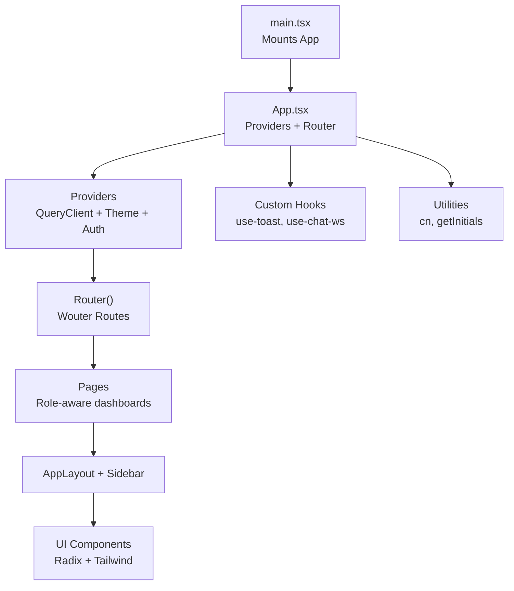

**Diagram sources**
- [main.tsx](file://client/src/main.tsx#L1-L8)
- [App.tsx](file://client/src/App.tsx#L1-L165)
- [sidebar.tsx](file://client/src/components/layout/sidebar.tsx#L1-L332)
- [dashboard.tsx](file://client/src/pages/dashboard.tsx#L1-L338)
- [button.tsx](file://client/src/components/ui/button.tsx#L1-L57)
- [utils.ts](file://client/src/lib/utils.ts#L1-L21)
- [use-toast.ts](file://client/src/hooks/use-toast.ts#L1-L192)
- [use-chat-ws.ts](file://client/src/hooks/use-chat-ws.ts#L1-L218)

**Section sources**
- [main.tsx](file://client/src/main.tsx#L1-L8)
- [App.tsx](file://client/src/App.tsx#L1-L165)

## Core Components
- App shell and routing: Centralized router with role-aware dashboards and a layout wrapper that controls margins and full-width rendering.
- Authentication provider: Manages Firebase auth state, user profiles, and exposes login/register/logout/reset flows with toast feedback.
- Theme provider: Persists theme preference and applies system/dark/light classes to the document root.
- Chat role provider: Derives chat user identity from auth profile for chat UIs.
- UI primitives: Radix UI slots with Tailwind-based variants for buttons and other components.
- Utilities: Class merging and initial extraction helpers.
- Custom hooks: Toast manager and chat WebSocket connector with reconnection logic.

**Section sources**
- [App.tsx](file://client/src/App.tsx#L24-L165)
- [firebase-auth-context.tsx](file://client/src/contexts/firebase-auth-context.tsx#L1-L267)
- [theme-context.tsx](file://client/src/contexts/theme-context.tsx#L1-L72)
- [chat-role-context.tsx](file://client/src/contexts/chat-role-context.tsx#L1-L59)
- [button.tsx](file://client/src/components/ui/button.tsx#L1-L57)
- [utils.ts](file://client/src/lib/utils.ts#L1-L21)
- [use-toast.ts](file://client/src/hooks/use-toast.ts#L1-L192)
- [use-chat-ws.ts](file://client/src/hooks/use-chat-ws.ts#L1-L218)

## Architecture Overview
The app uses a layered architecture:
- Provider layer: QueryClient, Theme, Auth, and Chat Role providers wrap the entire app.
- Routing layer: Wouter routes map URLs to pre-wrapped page components with layout.
- Presentation layer: Pages, layout components, and UI primitives.
- Data layer: React Query for server state, custom API request helper, and WebSocket for real-time chat.

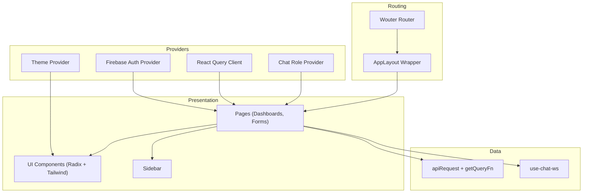

**Diagram sources**
- [App.tsx](file://client/src/App.tsx#L152-L163)
- [queryClient.ts](file://client/src/lib/queryClient.ts#L1-L62)
- [firebase-auth-context.tsx](file://client/src/contexts/firebase-auth-context.tsx#L38-L259)
- [theme-context.tsx](file://client/src/contexts/theme-context.tsx#L23-L62)
- [chat-role-context.tsx](file://client/src/contexts/chat-role-context.tsx#L23-L51)
- [sidebar.tsx](file://client/src/components/layout/sidebar.tsx#L48-L332)
- [dashboard.tsx](file://client/src/pages/dashboard.tsx#L44-L338)
- [use-chat-ws.ts](file://client/src/hooks/use-chat-ws.ts#L65-L218)

## Detailed Component Analysis

### Authentication Provider and Context
The Firebase Auth provider manages:
- Initialization via auth state listener.
- User profile fetching with a timeout to avoid hanging on offline conditions.
- Login, register, Google sign-in, and logout flows with toast notifications.
- Password reset flow.
- Loading state management during auth transitions.

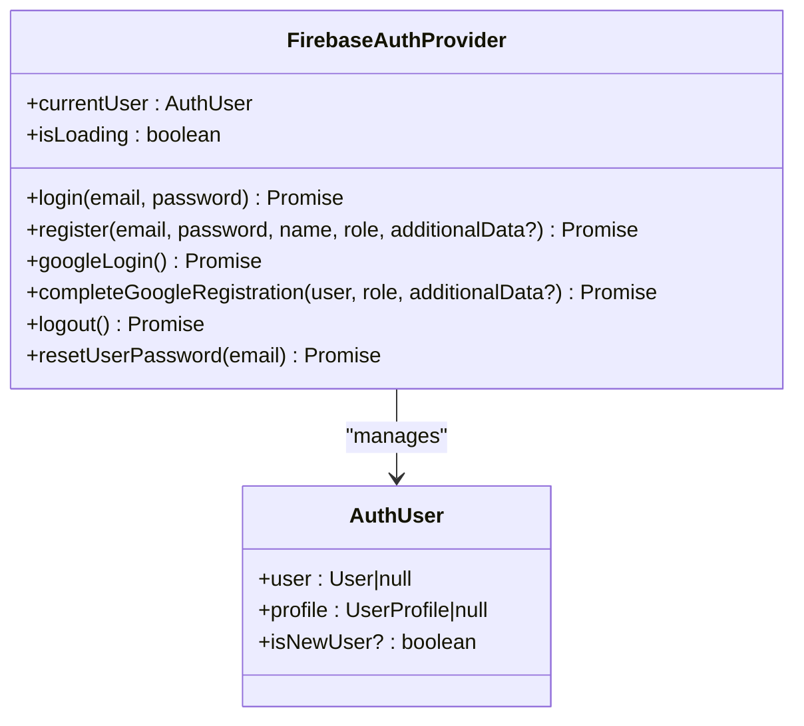

**Diagram sources**
- [firebase-auth-context.tsx](file://client/src/contexts/firebase-auth-context.tsx#L18-L34)
- [firebase-auth-context.tsx](file://client/src/contexts/firebase-auth-context.tsx#L38-L259)

**Section sources**
- [firebase-auth-context.tsx](file://client/src/contexts/firebase-auth-context.tsx#L1-L267)

### Theme Provider and System Preference
The Theme provider:
- Reads/writes theme preference to localStorage.
- Applies light/dark/system classes to document root.
- Respects OS preference when set to system.

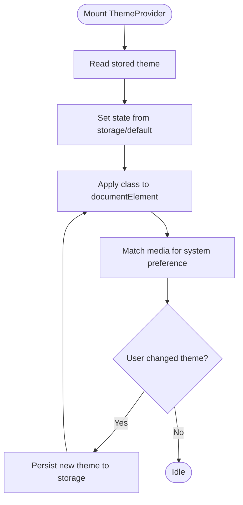

**Diagram sources**
- [theme-context.tsx](file://client/src/contexts/theme-context.tsx#L23-L48)

**Section sources**
- [theme-context.tsx](file://client/src/contexts/theme-context.tsx#L1-L72)

### Chat Role Provider
Derives chat user identity from Firebase auth profile:
- Maps roles to chat roles.
- Builds a normalized chat user object with id, name, role, and online status.
- Exposes currentRole and chat user via context.

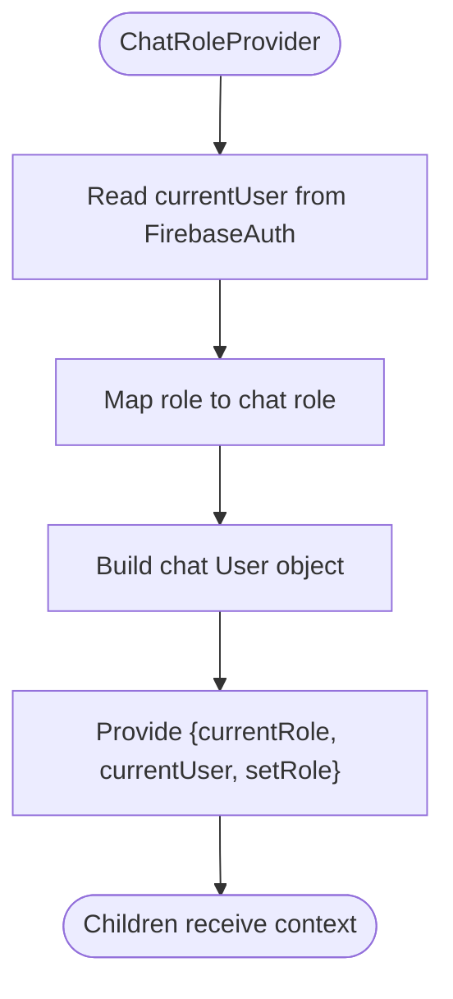

**Diagram sources**
- [chat-role-context.tsx](file://client/src/contexts/chat-role-context.tsx#L23-L51)

**Section sources**
- [chat-role-context.tsx](file://client/src/contexts/chat-role-context.tsx#L1-L59)

### Routing and Layout Composition
The App composes:
- A layout wrapper that injects a sidebar and a main content area with configurable width via CSS variable.
- A pre-wrapped set of pages to avoid recreating wrappers on each render.
- A Router that:
  - Shows a loading spinner while auth initializes.
  - Renders an authentication dialog if no user.
  - Routes to role-specific dashboards.
  - Provides common routes for features like analytics, OCR, messaging, etc.
  - Falls back to a 404 page.

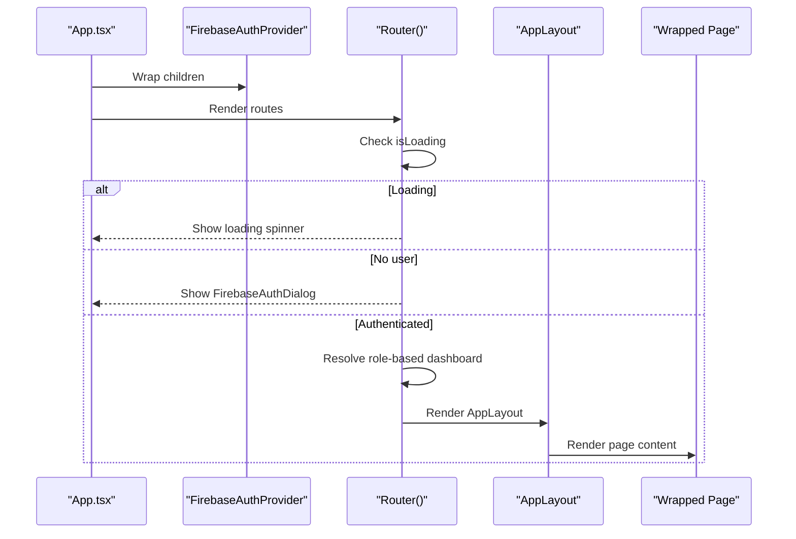

**Diagram sources**
- [App.tsx](file://client/src/App.tsx#L93-L150)
- [App.tsx](file://client/src/App.tsx#L34-L65)

**Section sources**
- [App.tsx](file://client/src/App.tsx#L1-L165)

### UI Library Usage: Radix UI + Tailwind CSS
- Buttons use Radix UI Slot to support polymorphic behavior and variant classes from Tailwind.
- Variants and sizes are centralized in component-specific variant factories.
- Utilities merge Tailwind classes safely.

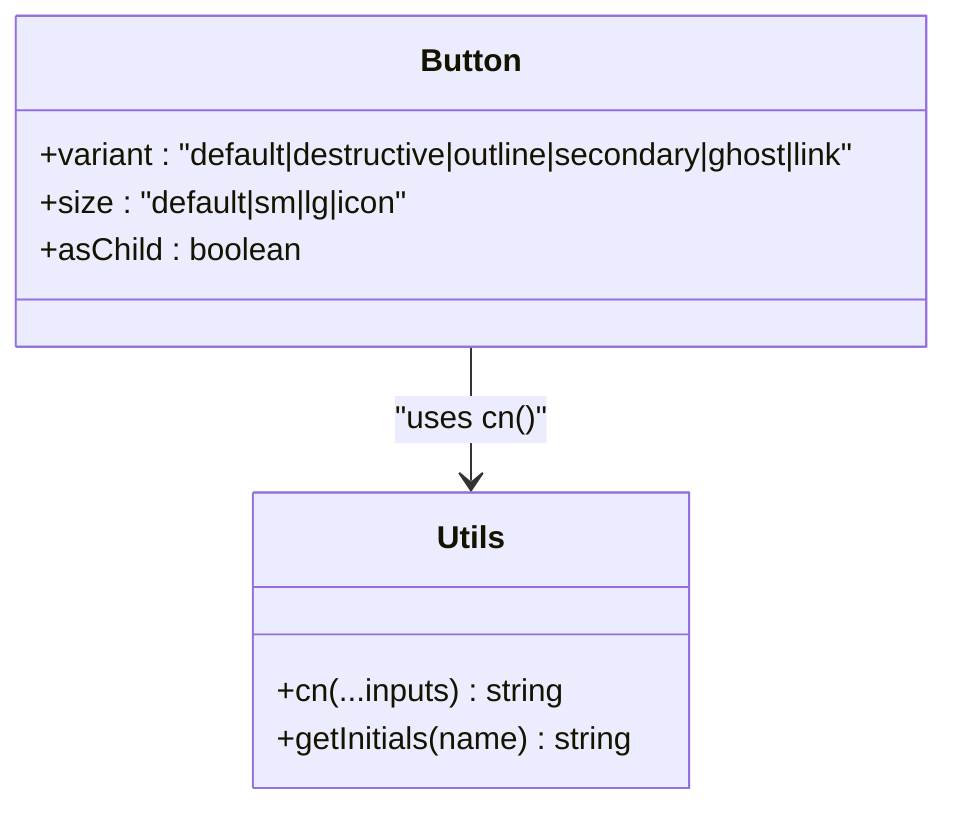

**Diagram sources**
- [button.tsx](file://client/src/components/ui/button.tsx#L7-L34)
- [utils.ts](file://client/src/lib/utils.ts#L4-L6)

**Section sources**
- [button.tsx](file://client/src/components/ui/button.tsx#L1-L57)
- [utils.ts](file://client/src/lib/utils.ts#L1-L21)

### Custom Hook Architecture
- use-toast: A toast manager with a finite queue, auto-dismiss timers, and imperative API.
- use-chat-ws: A WebSocket hook with connection lifecycle, exponential backoff, channel join/leave, and typed event handlers.

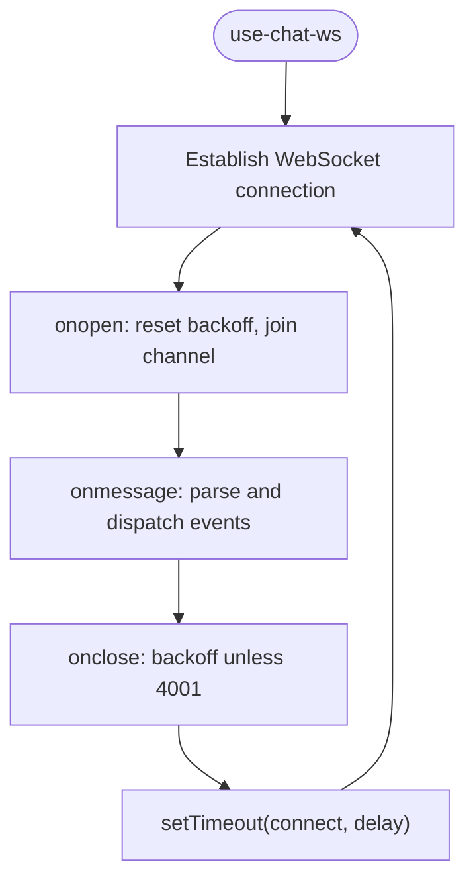

**Diagram sources**
- [use-chat-ws.ts](file://client/src/hooks/use-chat-ws.ts#L95-L162)

**Section sources**
- [use-toast.ts](file://client/src/hooks/use-toast.ts#L1-L192)
- [use-chat-ws.ts](file://client/src/hooks/use-chat-ws.ts#L1-L218)

### Data Layer and API Integration
- React Query client configured globally with custom query function that respects cookies and throws on non-OK responses.
- A generic API request helper wraps fetch with credential inclusion and JSON body handling.
- Pages use React Query to fetch data and render skeletons/loading states.

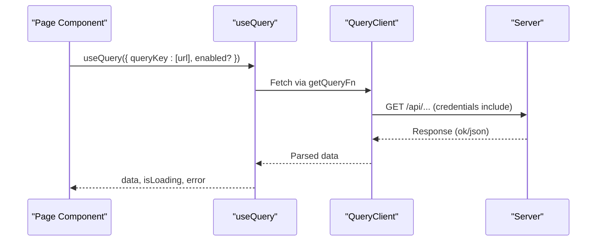

**Diagram sources**
- [queryClient.ts](file://client/src/lib/queryClient.ts#L30-L61)
- [dashboard.tsx](file://client/src/pages/dashboard.tsx#L48-L51)

**Section sources**
- [queryClient.ts](file://client/src/lib/queryClient.ts#L1-L62)
- [dashboard.tsx](file://client/src/pages/dashboard.tsx#L1-L338)

### Layout and Responsive Design
- AppLayout centers content, constrains width, and pads content; supports full-width mode.
- Sidebar is responsive, collapsible, role-aware, and syncs its width to a CSS variable.
- Tailwind theme defines a cohesive palette, spacing, and animations; dark mode toggles via class on root.

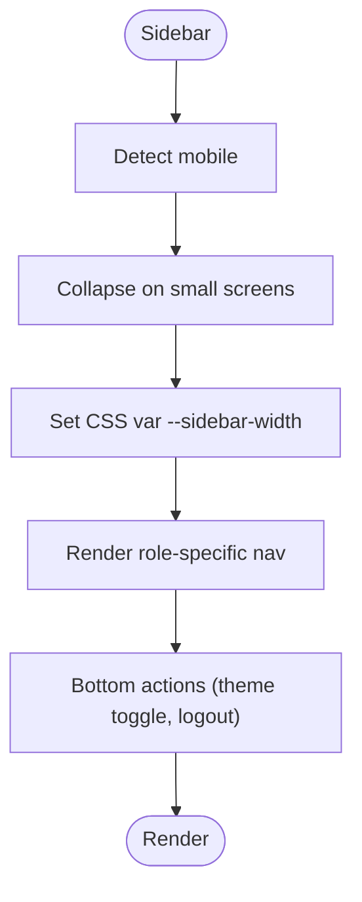

**Diagram sources**
- [sidebar.tsx](file://client/src/components/layout/sidebar.tsx#L48-L70)
- [sidebar.tsx](file://client/src/components/layout/sidebar.tsx#L143-L150)

**Section sources**
- [App.tsx](file://client/src/App.tsx#L24-L65)
- [sidebar.tsx](file://client/src/components/layout/sidebar.tsx#L1-L332)
- [index.css](file://client/src/index.css#L1-L344)
- [tailwind.config.ts](file://tailwind.config.ts#L1-L164)

## Dependency Analysis
- Provider dependencies: App depends on QueryClient, Theme, and Auth providers.
- Routing dependencies: Router depends on Auth context to decide role-based dashboards.
- Component dependencies: Pages depend on UI primitives, layout, and context providers.
- Utility dependencies: Components rely on cn and getInitials utilities.
- Data dependencies: Pages depend on React Query and API helpers; chat pages depend on use-chat-ws.

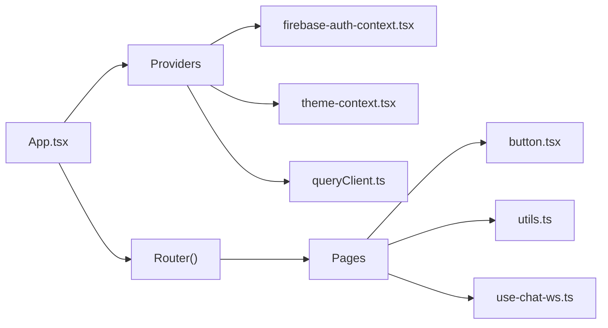

**Diagram sources**
- [App.tsx](file://client/src/App.tsx#L152-L163)
- [firebase-auth-context.tsx](file://client/src/contexts/firebase-auth-context.tsx#L38-L259)
- [theme-context.tsx](file://client/src/contexts/theme-context.tsx#L23-L62)
- [queryClient.ts](file://client/src/lib/queryClient.ts#L48-L61)
- [button.tsx](file://client/src/components/ui/button.tsx#L1-L57)
- [utils.ts](file://client/src/lib/utils.ts#L1-L21)
- [use-chat-ws.ts](file://client/src/hooks/use-chat-ws.ts#L1-L218)

**Section sources**
- [App.tsx](file://client/src/App.tsx#L1-L165)
- [firebase-auth-context.tsx](file://client/src/contexts/firebase-auth-context.tsx#L1-L267)
- [theme-context.tsx](file://client/src/contexts/theme-context.tsx#L1-L72)
- [queryClient.ts](file://client/src/lib/queryClient.ts#L1-L62)
- [button.tsx](file://client/src/components/ui/button.tsx#L1-L57)
- [utils.ts](file://client/src/lib/utils.ts#L1-L21)
- [use-chat-ws.ts](file://client/src/hooks/use-chat-ws.ts#L1-L218)

## Performance Considerations
- Memoized layout wrapper: Module-level wrappers avoid recreating components on each render.
- Pre-wrapped pages: Router uses pre-wrapped components to reduce overhead.
- React Query defaults: Infinite cache with no refetch on window focus and no retries to minimize network churn.
- Efficient class merging: Utilities consolidate Tailwind classes to reduce DOM thrash.
- Lightweight toast manager: Minimal state updates and finite queue reduce re-renders.
- WebSocket backoff: Exponential backoff prevents resource exhaustion on transient failures.
- CSS-driven animations: Tailwind animations and CSS variables minimize JS-driven layout work.

[No sources needed since this section provides general guidance]

## Troubleshooting Guide
- Authentication initialization hangs: Profile fetch uses a timeout to prevent indefinite waits; ensure backend is reachable.
- Toast not appearing: Verify Toaster is mounted and useToast is called within provider scope.
- Theme not applying: Confirm ThemeProvider is wrapping the app and system preference matches expectations.
- Sidebar not resizing: Ensure CSS variable is updated and Tailwind theme aligns with sidebar width tokens.
- API errors: React Query throws on non-OK responses; inspect thrown error messages and network tab.
- WebSocket disconnects: Hook implements exponential backoff; 4001 indicates unauthorized closure and stops reconnecting.

**Section sources**
- [firebase-auth-context.tsx](file://client/src/contexts/firebase-auth-context.tsx#L43-L71)
- [use-toast.ts](file://client/src/hooks/use-toast.ts#L171-L189)
- [theme-context.tsx](file://client/src/contexts/theme-context.tsx#L33-L48)
- [sidebar.tsx](file://client/src/components/layout/sidebar.tsx#L65-L70)
- [queryClient.ts](file://client/src/lib/queryClient.ts#L3-L8)
- [use-chat-ws.ts](file://client/src/hooks/use-chat-ws.ts#L144-L157)

## Conclusion
PersonalLearningPro’s frontend is structured around a clean provider stack, role-aware routing, and a consistent UI system built on Radix UI and Tailwind CSS. State management combines React Query for server data, custom hooks for local UI state, and context providers for global concerns like auth and theme. The architecture emphasizes composability, performance, and maintainability, with clear boundaries between routing, layout, and feature pages.