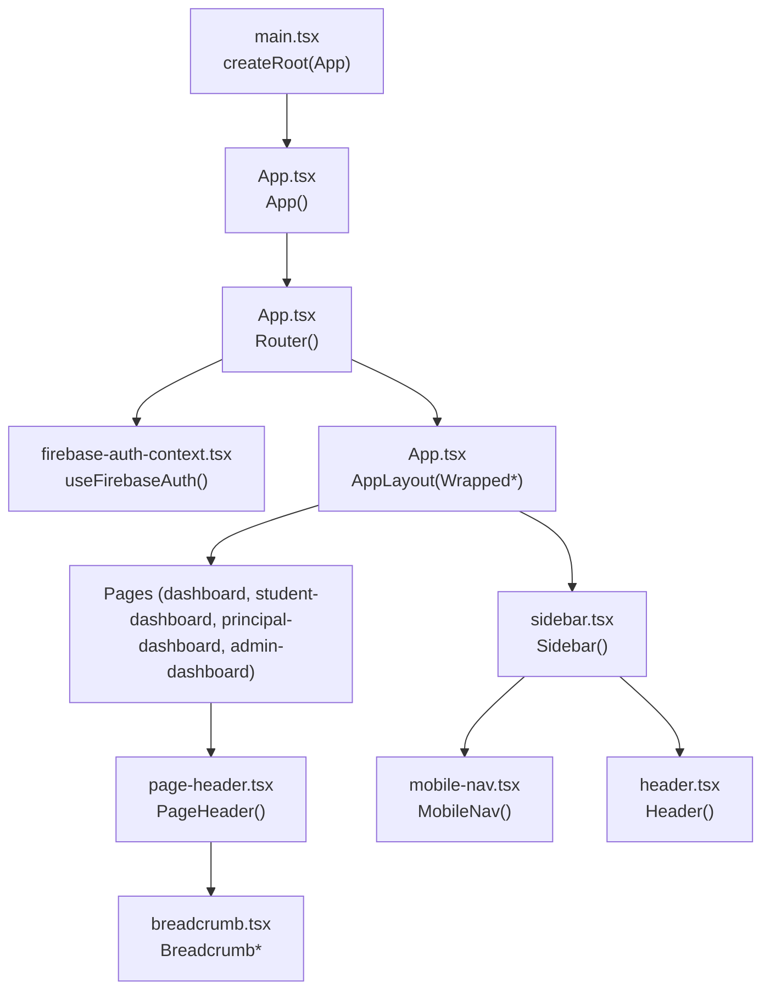
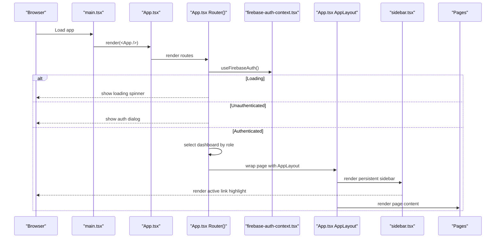
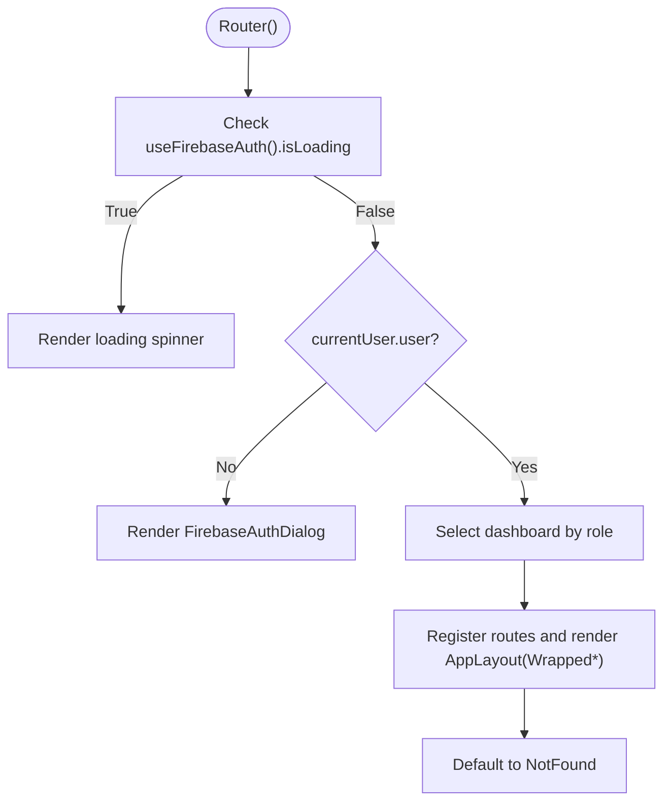
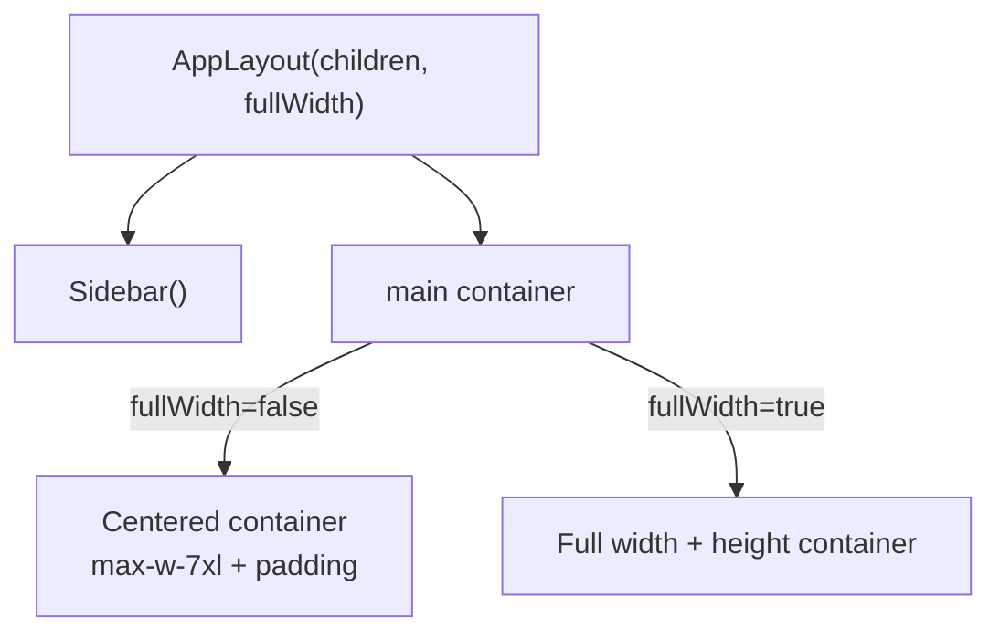
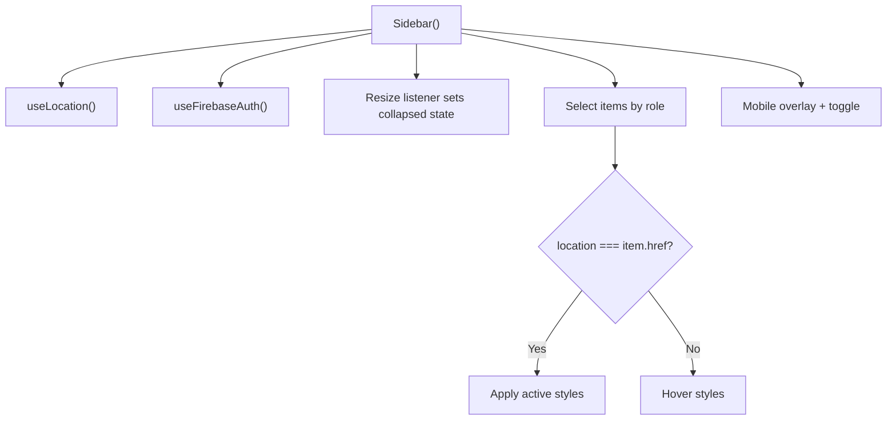
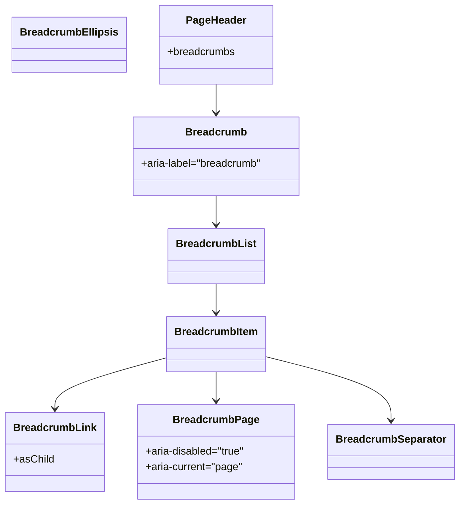
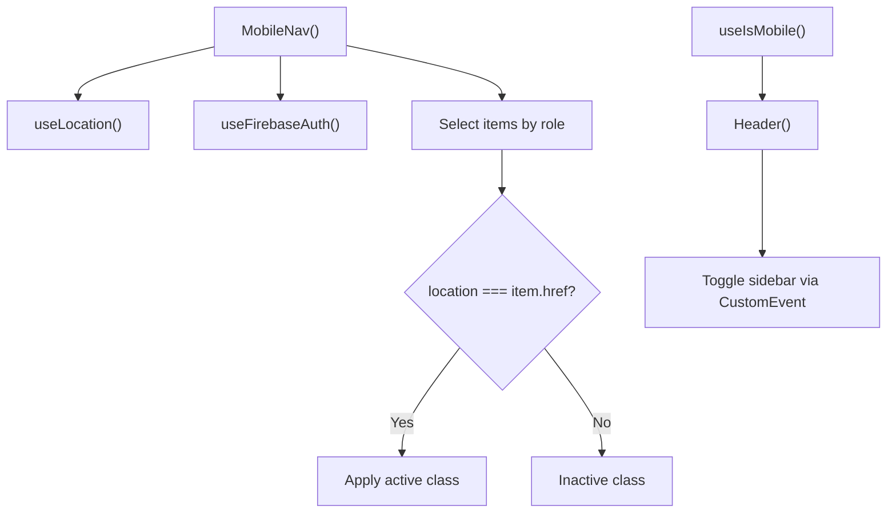
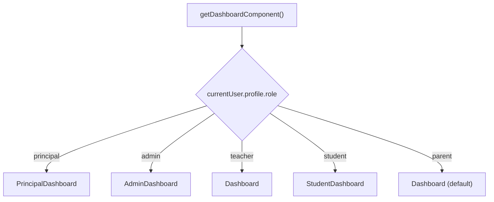
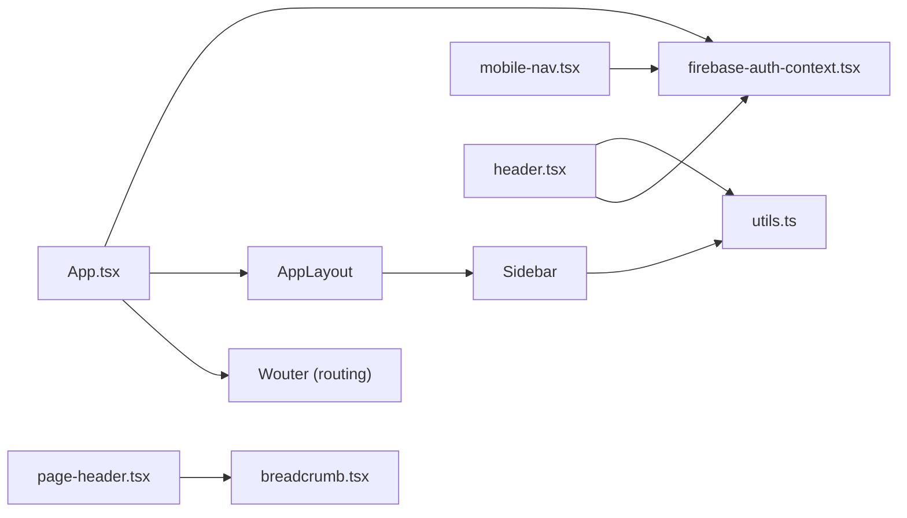

# Routing & Navigation

<cite>
**Referenced Files in This Document**
- [App.tsx](file://client/src/App.tsx)
- [main.tsx](file://client/src/main.tsx)
- [sidebar.tsx](file://client/src/components/layout/sidebar.tsx)
- [header.tsx](file://client/src/components/layout/header.tsx)
- [mobile-nav.tsx](file://client/src/components/layout/mobile-nav.tsx)
- [breadcrumb.tsx](file://client/src/components/ui/breadcrumb.tsx)
- [page-header.tsx](file://client/src/components/layout/page-header.tsx)
- [firebase-auth-context.tsx](file://client/src/contexts/firebase-auth-context.tsx)
- [use-mobile.tsx](file://client/src/hooks/use-mobile.tsx)
- [utils.ts](file://client/src/lib/utils.ts)
- [dashboard.tsx](file://client/src/pages/dashboard.tsx)
- [student-dashboard.tsx](file://client/src/pages/student-dashboard.tsx)
- [principal-dashboard.tsx](file://client/src/pages/principal-dashboard.tsx)
- [admin-dashboard.tsx](file://client/src/pages/admin-dashboard.tsx)
</cite>

## Table of Contents
1. [Introduction](#introduction)
2. [Project Structure](#project-structure)
3. [Core Components](#core-components)
4. [Architecture Overview](#architecture-overview)
5. [Detailed Component Analysis](#detailed-component-analysis)
6. [Dependency Analysis](#dependency-analysis)
7. [Performance Considerations](#performance-considerations)
8. [Troubleshooting Guide](#troubleshooting-guide)
9. [Conclusion](#conclusion)

## Introduction
This document explains the frontend routing and navigation system for PersonalLearningPro. It covers the Wouter-based routing implementation, route protection via authentication, dynamic route generation based on user roles, the sidebar and mobile navigation systems, breadcrumbs, layout wrappers, responsive behavior, navigation state management, accessibility features, and performance strategies.

## Project Structure
The routing and navigation stack centers around a single-page app built with React and Wouter. The application bootstraps at the root and mounts the routing tree after authentication resolution. Layout wrappers constrain content width for readability, while the sidebar and mobile navigation adapt to screen size and user role.

**Diagram sources**
- [main.tsx](file://client/src/main.tsx#L1-L8)
- [App.tsx](file://client/src/App.tsx#L1-L165)
- [firebase-auth-context.tsx](file://client/src/contexts/firebase-auth-context.tsx#L1-L267)
- [sidebar.tsx](file://client/src/components/layout/sidebar.tsx#L1-L332)
- [page-header.tsx](file://client/src/components/layout/page-header.tsx#L1-L69)
- [breadcrumb.tsx](file://client/src/components/ui/breadcrumb.tsx#L1-L116)
- [mobile-nav.tsx](file://client/src/components/layout/mobile-nav.tsx#L1-L76)
- [header.tsx](file://client/src/components/layout/header.tsx#L1-L133)
- [dashboard.tsx](file://client/src/pages/dashboard.tsx#L1-L338)
- [student-dashboard.tsx](file://client/src/pages/student-dashboard.tsx#L1-L800)
- [principal-dashboard.tsx](file://client/src/pages/principal-dashboard.tsx#L1-L365)
- [admin-dashboard.tsx](file://client/src/pages/admin-dashboard.tsx#L1-L302)

**Section sources**
- [main.tsx](file://client/src/main.tsx#L1-L8)
- [App.tsx](file://client/src/App.tsx#L1-L165)

## Core Components
- Wouter routing and route protection:
  - Authentication guard resolves before rendering routes. A loading state is shown while checking auth; an authentication dialog is shown when unauthenticated; authenticated users see role-aware routes.
  - Dynamic dashboard selection is performed based on the user’s role.
- Layout wrapper:
  - AppLayout wraps page content with a persistent sidebar and a main content area. It supports full-width mode for specific pages and constrains content width otherwise.
- Sidebar navigation:
  - Role-aware menu items, responsive collapse/expand, mobile overlay, and active link highlighting.
- Breadcrumb system:
  - Reusable Breadcrumb components integrated into page headers.
- Mobile navigation:
  - Bottom tab bar with role-aware items and active state.
- Authentication context:
  - Provides user profile, role, and loading state consumed by routing and navigation.

**Section sources**
- [App.tsx](file://client/src/App.tsx#L80-L165)
- [sidebar.tsx](file://client/src/components/layout/sidebar.tsx#L1-L332)
- [breadcrumb.tsx](file://client/src/components/ui/breadcrumb.tsx#L1-L116)
- [page-header.tsx](file://client/src/components/layout/page-header.tsx#L1-L69)
- [mobile-nav.tsx](file://client/src/components/layout/mobile-nav.tsx#L1-L76)
- [firebase-auth-context.tsx](file://client/src/contexts/firebase-auth-context.tsx#L1-L267)

## Architecture Overview
The routing pipeline integrates authentication, role-based route selection, and layout composition. Wouter manages URL changes and renders the appropriate page wrapped in AppLayout. The sidebar reflects the current location and highlights active items. Breadcrumbs are composed per page via PageHeader.

**Diagram sources**
- [main.tsx](file://client/src/main.tsx#L1-L8)
- [App.tsx](file://client/src/App.tsx#L80-L165)
- [firebase-auth-context.tsx](file://client/src/contexts/firebase-auth-context.tsx#L1-L267)
- [sidebar.tsx](file://client/src/components/layout/sidebar.tsx#L1-L332)

## Detailed Component Analysis

### Wouter Routing and Route Protection
- Authentication guard:
  - While authentication is resolving, a centered loader is displayed.
  - If no user is present, the authentication dialog is shown.
  - Once authenticated, routes are registered and the dashboard is selected dynamically by role.
- Role-aware dashboard:
  - The root route redirects to a role-specific dashboard determined from the user profile.
- Static routes:
  - Feature routes are declared explicitly for create-test, ocr-scan, analytics, ai-tutor, student-directory, messages, and message.
- Fallback:
  - A not-found route is used for unmatched paths.

**Diagram sources**
- [App.tsx](file://client/src/App.tsx#L93-L149)
- [firebase-auth-context.tsx](file://client/src/contexts/firebase-auth-context.tsx#L38-L71)

**Section sources**
- [App.tsx](file://client/src/App.tsx#L80-L165)
- [firebase-auth-context.tsx](file://client/src/contexts/firebase-auth-context.tsx#L1-L267)

### Layout Wrapper: AppLayout and Full-Width vs Constrained Layout
- AppLayout:
  - Renders a persistent sidebar and a main content area.
  - Uses a CSS variable to control the sidebar width and adjusts main content margins accordingly.
  - Supports two modes:
    - Constrained: center-aligned with max width and padding.
    - Full-width: edge-to-edge rendering suitable for immersive pages.
- Module-level memoization:
  - Wrapped components are pre-created to avoid re-creation on each render.

**Diagram sources**
- [App.tsx](file://client/src/App.tsx#L25-L65)

**Section sources**
- [App.tsx](file://client/src/App.tsx#L25-L65)

### Sidebar Navigation System
- Role-aware menu:
  - Different sets of navigation items are defined for principal, admin, teacher, student, and parent.
  - The active item is highlighted based on the current location.
- Responsive behavior:
  - Collapses to icons-only on smaller screens; expands on desktop.
  - Mobile overlay toggles the sidebar; clicking a link closes the overlay on mobile.
- Active link highlighting:
  - Uses the current location to compute active state and applies visual emphasis.
- User panel and actions:
  - Displays user initials and role; includes theme toggle and logout.

**Diagram sources**
- [sidebar.tsx](file://client/src/components/layout/sidebar.tsx#L48-L332)

**Section sources**
- [sidebar.tsx](file://client/src/components/layout/sidebar.tsx#L1-L332)

### Breadcrumb Implementation
- Reusable Breadcrumb components:
  - Breadcrumb, BreadcrumbList, BreadcrumbItem, BreadcrumbLink, BreadcrumbPage, BreadcrumbSeparator, BreadcrumbEllipsis.
- PageHeader integration:
  - PageHeader composes breadcrumbs with a title and optional subtitle and action buttons.
- Accessibility:
  - BreadcrumbPage marks the current page; separators and ellipsis provide navigational cues.

**Diagram sources**
- [breadcrumb.tsx](file://client/src/components/ui/breadcrumb.tsx#L1-L116)
- [page-header.tsx](file://client/src/components/layout/page-header.tsx#L1-L69)

**Section sources**
- [breadcrumb.tsx](file://client/src/components/ui/breadcrumb.tsx#L1-L116)
- [page-header.tsx](file://client/src/components/layout/page-header.tsx#L1-L69)

### Mobile-Responsive Navigation Patterns
- MobileNav:
  - Bottom tab bar with role-aware items and active state based on the current location.
  - Designed for touch-friendly, low-height navigation.
- useIsMobile hook:
  - Media query-based detection for responsive behavior.
- Header:
  - Provides a hamburger menu to toggle the sidebar on mobile and search toggle for small screens.

**Diagram sources**
- [mobile-nav.tsx](file://client/src/components/layout/mobile-nav.tsx#L1-L76)
- [use-mobile.tsx](file://client/src/hooks/use-mobile.tsx#L1-L20)
- [header.tsx](file://client/src/components/layout/header.tsx#L1-L133)

**Section sources**
- [mobile-nav.tsx](file://client/src/components/layout/mobile-nav.tsx#L1-L76)
- [use-mobile.tsx](file://client/src/hooks/use-mobile.tsx#L1-L20)
- [header.tsx](file://client/src/components/layout/header.tsx#L1-L133)

### Navigation State Management and Active Link Highlighting
- Location-based active state:
  - Sidebar computes active links using the current location.
  - MobileNav mirrors the same pattern for bottom tabs.
- CSS variable synchronization:
  - Sidebar width updates a CSS variable to drive layout transitions smoothly.
- Accessibility:
  - Sidebar items include titles for collapsed mode; Header toggles provide keyboard-accessible controls.

**Section sources**
- [sidebar.tsx](file://client/src/components/layout/sidebar.tsx#L48-L70)
- [mobile-nav.tsx](file://client/src/components/layout/mobile-nav.tsx#L14-L76)
- [header.tsx](file://client/src/components/layout/header.tsx#L32-L40)

### Dynamic Route Generation Based on User Roles
- Role-aware dashboard selection:
  - The root route resolves to a dashboard based on the authenticated user’s role.
- Role-specific routes:
  - Separate routes exist for principal-dashboard, admin-dashboard, dashboard, and student-dashboard.
- Navigation items:
  - Sidebar and MobileNav define role-specific menus and adjust visibility accordingly.

**Diagram sources**
- [App.tsx](file://client/src/App.tsx#L113-L124)
- [sidebar.tsx](file://client/src/components/layout/sidebar.tsx#L143-L149)
- [mobile-nav.tsx](file://client/src/components/layout/mobile-nav.tsx#L51-L55)

**Section sources**
- [App.tsx](file://client/src/App.tsx#L113-L124)
- [sidebar.tsx](file://client/src/components/layout/sidebar.tsx#L76-L149)
- [mobile-nav.tsx](file://client/src/components/layout/mobile-nav.tsx#L19-L55)

### Page-Level Examples and Breadcrumbs
- Teacher Dashboard:
  - Uses PageHeader with breadcrumbs pointing to the root and the teacher dashboard.
- Student Dashboard:
  - Similar breadcrumb pattern with a welcome header and quick actions.
- Principal/Admin Dashboards:
  - PageHeader with breadcrumbs and action buttons; content organized via tabs and cards.

**Section sources**
- [dashboard.tsx](file://client/src/pages/dashboard.tsx#L130-L152)
- [student-dashboard.tsx](file://client/src/pages/student-dashboard.tsx#L314-L341)
- [principal-dashboard.tsx](file://client/src/pages/principal-dashboard.tsx#L90-L109)
- [admin-dashboard.tsx](file://client/src/pages/admin-dashboard.tsx#L32-L56)

## Dependency Analysis
- Routing and layout:
  - App.tsx depends on Wouter for routing and on AppLayout to wrap pages.
  - AppLayout depends on Sidebar for navigation and on utils for class merging.
- Authentication:
  - Router and Sidebar consume useFirebaseAuth to gate routes and tailor navigation.
- UI primitives:
  - Breadcrumb components are used by PageHeader; PageHeader is used by multiple pages.
- Mobile responsiveness:
  - useIsMobile informs responsive decisions; Header toggles sidebar via a DOM event.

**Diagram sources**
- [App.tsx](file://client/src/App.tsx#L1-L165)
- [sidebar.tsx](file://client/src/components/layout/sidebar.tsx#L1-L332)
- [utils.ts](file://client/src/lib/utils.ts#L1-L21)
- [page-header.tsx](file://client/src/components/layout/page-header.tsx#L1-L69)
- [breadcrumb.tsx](file://client/src/components/ui/breadcrumb.tsx#L1-L116)
- [mobile-nav.tsx](file://client/src/components/layout/mobile-nav.tsx#L1-L76)
- [header.tsx](file://client/src/components/layout/header.tsx#L1-L133)
- [firebase-auth-context.tsx](file://client/src/contexts/firebase-auth-context.tsx#L1-L267)

**Section sources**
- [App.tsx](file://client/src/App.tsx#L1-L165)
- [sidebar.tsx](file://client/src/components/layout/sidebar.tsx#L1-L332)
- [utils.ts](file://client/src/lib/utils.ts#L1-L21)
- [page-header.tsx](file://client/src/components/layout/page-header.tsx#L1-L69)
- [breadcrumb.tsx](file://client/src/components/ui/breadcrumb.tsx#L1-L116)
- [mobile-nav.tsx](file://client/src/components/layout/mobile-nav.tsx#L1-L76)
- [header.tsx](file://client/src/components/layout/header.tsx#L1-L133)
- [firebase-auth-context.tsx](file://client/src/contexts/firebase-auth-context.tsx#L1-L267)

## Performance Considerations
- Route protection and loading:
  - Authentication resolution occurs once via onAuthStateChanged; a loading state prevents unnecessary re-renders until the user state is known.
- Layout wrapping:
  - Pre-wrapping components at module level avoids recreating wrappers on each render.
- CSS-driven layout:
  - Sidebar width is synchronized via a CSS variable, enabling smooth transitions without heavy JS computations.
- Mobile-first navigation:
  - Bottom tab bar reduces layout thrash on small screens; media queries inform responsive behavior.
- Accessibility:
  - Proper ARIA attributes and semantic markup improve performance by reducing assistive tech overhead.

[No sources needed since this section provides general guidance]

## Troubleshooting Guide
- Authentication loop or blank screen:
  - Verify that the authentication provider initializes and that onAuthStateChanged resolves. Check for errors in the toast feedback and ensure the auth context is mounted at the app root.
- Sidebar not collapsing/expanding:
  - Confirm the resize handler is attached and that the CSS variable is being set. Inspect the toggle button and overlay click behavior.
- Active link not highlighted:
  - Ensure the current location matches the item href exactly. Check for trailing slashes or query parameters differences.
- Breadcrumbs not rendering:
  - Verify breadcrumbs array is passed to PageHeader and that the last item omits an href to render as a page link.
- Mobile navigation missing:
  - Confirm the bottom tab bar is visible on small screens and that the role-aware items are populated.

**Section sources**
- [firebase-auth-context.tsx](file://client/src/contexts/firebase-auth-context.tsx#L38-L71)
- [sidebar.tsx](file://client/src/components/layout/sidebar.tsx#L54-L70)
- [page-header.tsx](file://client/src/components/layout/page-header.tsx#L31-L69)
- [mobile-nav.tsx](file://client/src/components/layout/mobile-nav.tsx#L14-L76)

## Conclusion
PersonalLearningPro’s routing and navigation system leverages Wouter for declarative routing, Firebase for authentication, and a flexible layout wrapper to deliver role-aware, responsive experiences. The sidebar and mobile navigation adapt to user roles and screen sizes, while breadcrumbs and page headers provide clear context. The design emphasizes performance through pre-wrapped layouts, CSS-driven animations, and efficient state management.