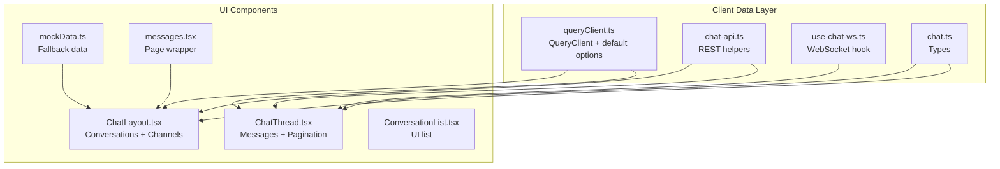
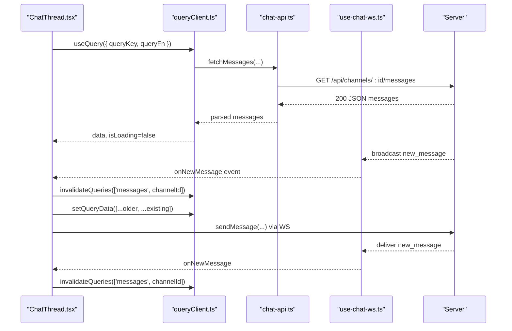
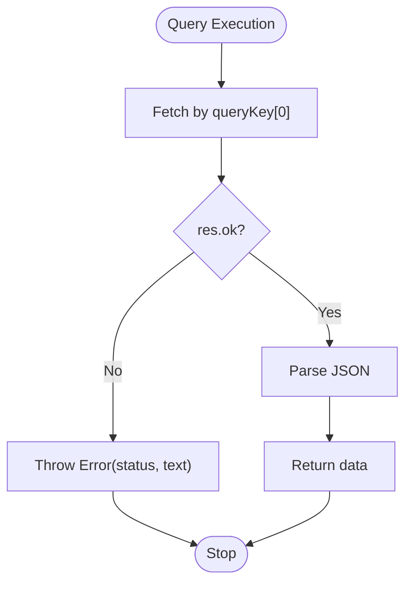
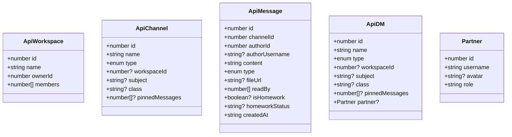
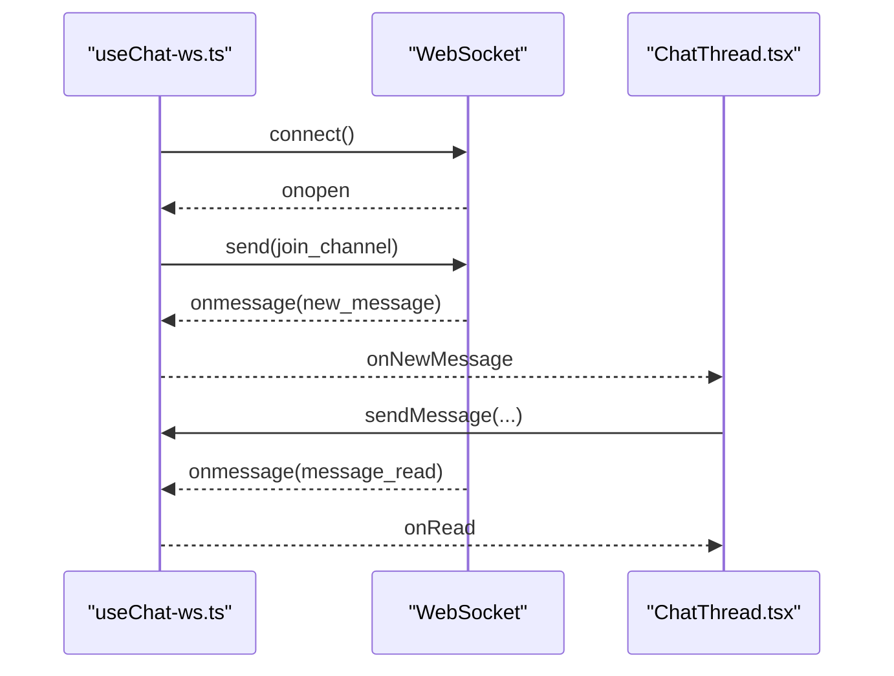
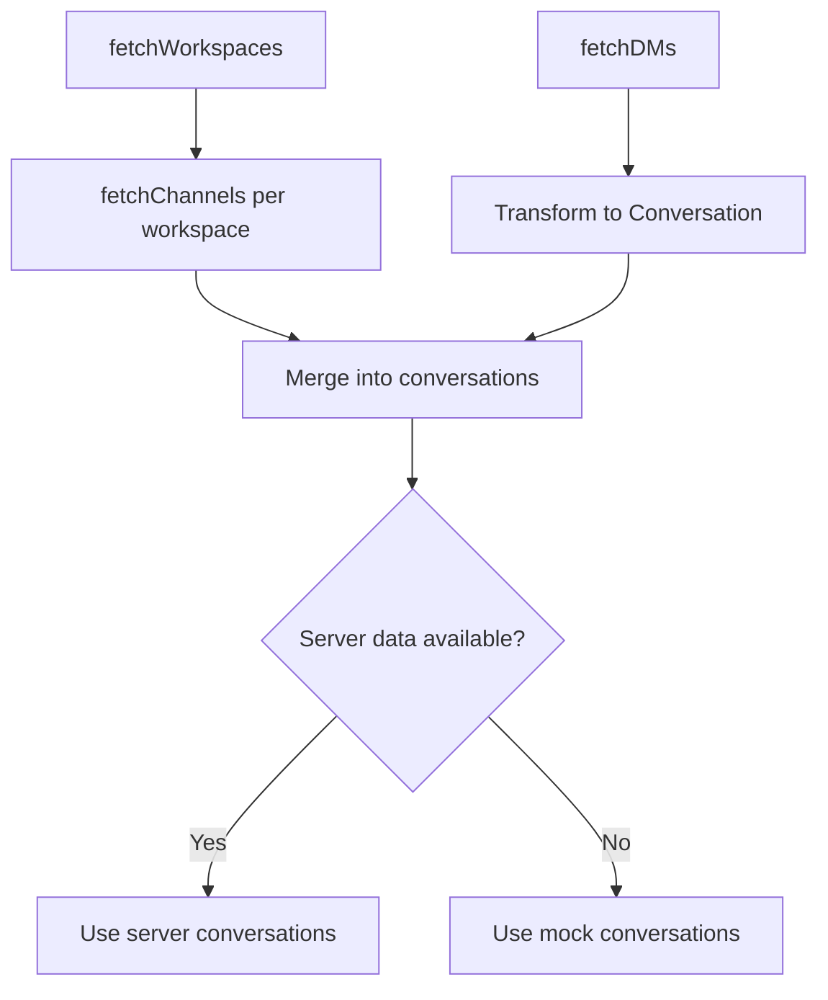
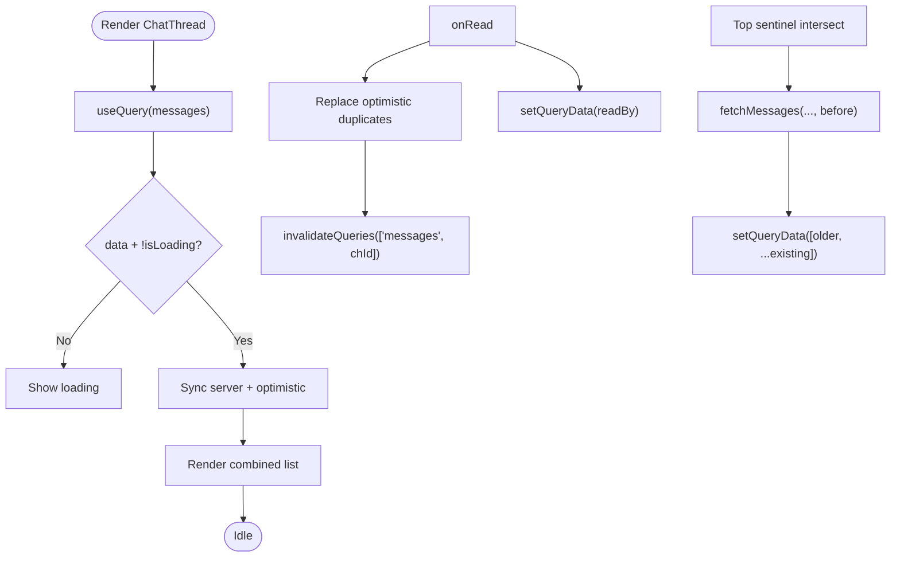
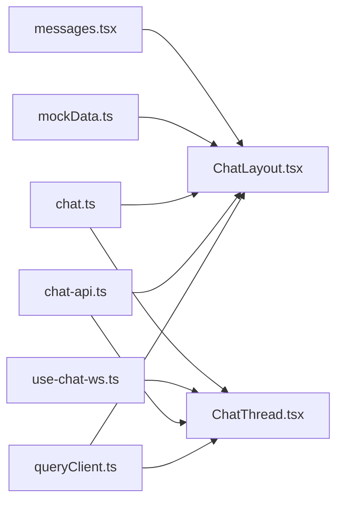

# Data Fetching & State

<cite>
**Referenced Files in This Document**
- [queryClient.ts](file://client/src/lib/queryClient.ts)
- [chat-api.ts](file://client/src/lib/chat-api.ts)
- [use-chat-ws.ts](file://client/src/hooks/use-chat-ws.ts)
- [ChatLayout.tsx](file://client/src/components/chat/ChatLayout.tsx)
- [ChatThread.tsx](file://client/src/components/chat/ChatThread.tsx)
- [ConversationList.tsx](file://client/src/components/chat/ConversationList.tsx)
- [chat.ts](file://client/src/types/chat.ts)
- [mockData.ts](file://client/src/data/mockData.ts)
- [messages.tsx](file://client/src/pages/messages.tsx)
- [firebase.ts](file://client/src/lib/firebase.ts)
</cite>

## Table of Contents
1. [Introduction](#introduction)
2. [Project Structure](#project-structure)
3. [Core Components](#core-components)
4. [Architecture Overview](#architecture-overview)
5. [Detailed Component Analysis](#detailed-component-analysis)
6. [Dependency Analysis](#dependency-analysis)
7. [Performance Considerations](#performance-considerations)
8. [Troubleshooting Guide](#troubleshooting-guide)
9. [Conclusion](#conclusion)

## Introduction
This document explains PersonalLearningPro’s data fetching and state management patterns with a focus on TanStack Query integration. It covers queryClient configuration, caching strategies, optimistic updates, server state synchronization, automatic refetching, cache invalidation, error handling, loading states, and data transformation. It also addresses performance optimization for large datasets, pagination, and real-time updates via WebSockets. Practical examples demonstrate how to use queryClient across chat message synchronization and user data management.

## Project Structure
The data layer centers around:
- A global queryClient configured with strict caching and error behavior
- REST API helpers for chat resources
- React components using TanStack Query to fetch and manage conversations and messages
- A WebSocket hook for real-time events
- UI components that orchestrate optimistic updates and cache synchronization

**Diagram sources**
- [queryClient.ts](file://client/src/lib/queryClient.ts#L48-L61)
- [chat-api.ts](file://client/src/lib/chat-api.ts#L44-L111)
- [use-chat-ws.ts](file://client/src/hooks/use-chat-ws.ts#L65-L217)
- [ChatLayout.tsx](file://client/src/components/chat/ChatLayout.tsx#L41-L184)
- [ChatThread.tsx](file://client/src/components/chat/ChatThread.tsx#L47-L375)
- [ConversationList.tsx](file://client/src/components/chat/ConversationList.tsx#L23-L161)
- [chat.ts](file://client/src/types/chat.ts#L1-L83)
- [mockData.ts](file://client/src/data/mockData.ts#L1-L240)
- [messages.tsx](file://client/src/pages/messages.tsx#L1-L15)

**Section sources**
- [queryClient.ts](file://client/src/lib/queryClient.ts#L1-L62)
- [chat-api.ts](file://client/src/lib/chat-api.ts#L1-L112)
- [use-chat-ws.ts](file://client/src/hooks/use-chat-ws.ts#L1-L218)
- [ChatLayout.tsx](file://client/src/components/chat/ChatLayout.tsx#L1-L185)
- [ChatThread.tsx](file://client/src/components/chat/ChatThread.tsx#L1-L376)
- [ConversationList.tsx](file://client/src/components/chat/ConversationList.tsx#L1-L162)
- [chat.ts](file://client/src/types/chat.ts#L1-L83)
- [mockData.ts](file://client/src/data/mockData.ts#L1-L240)
- [messages.tsx](file://client/src/pages/messages.tsx#L1-L15)

## Core Components
- Global queryClient with default queryFn and strict caching:
  - Default queryFn validates response status and throws on errors
  - Stale time is Infinity for manual cache control
  - Refetching on window focus and interval disabled globally
  - Retry disabled for predictable UX
- REST API helpers:
  - Centralized fetch with credentials and JSON handling
  - Typed DTOs for workspaces, channels, DMs, and messages
- WebSocket hook:
  - Connects to chat WS, manages reconnection with exponential backoff
  - Emits typed events for new messages, typing, read receipts, presence
- UI orchestration:
  - ChatLayout fetches workspaces, channels, and DMs
  - ChatThread fetches paginated messages, applies optimistic updates, and invalidates cache on WS events
  - ConversationList renders UI list with search and grouping

**Section sources**
- [queryClient.ts](file://client/src/lib/queryClient.ts#L30-L61)
- [chat-api.ts](file://client/src/lib/chat-api.ts#L44-L111)
- [use-chat-ws.ts](file://client/src/hooks/use-chat-ws.ts#L65-L217)
- [ChatLayout.tsx](file://client/src/components/chat/ChatLayout.tsx#L41-L184)
- [ChatThread.tsx](file://client/src/components/chat/ChatThread.tsx#L47-L375)
- [ConversationList.tsx](file://client/src/components/chat/ConversationList.tsx#L23-L161)

## Architecture Overview
The system combines TanStack Query for server state with a WebSocket for real-time updates. The flow:
- UI triggers queries via useQuery
- queryClient executes default queryFn or provided queryFn
- REST endpoints return normalized data transformed into UI types
- WebSocket events trigger cache updates or invalidations
- UI reflects loading states, optimistic updates, and synchronized server state

**Diagram sources**
- [ChatThread.tsx](file://client/src/components/chat/ChatThread.tsx#L68-L119)
- [queryClient.ts](file://client/src/lib/queryClient.ts#L30-L46)
- [chat-api.ts](file://client/src/lib/chat-api.ts#L74-L83)
- [use-chat-ws.ts](file://client/src/hooks/use-chat-ws.ts#L115-L142)

## Detailed Component Analysis

### TanStack Query Integration and queryClient
- Default queryFn:
  - Fetches by URL from queryKey[0]
  - Throws on non-OK responses
  - Supports 401 handling via on401 option
- Global defaults:
  - staleTime: Infinity for deterministic cache lifecycle
  - refetchOnWindowFocus: false to avoid unwanted network churn
  - refetchInterval: false for manual refresh control
  - retry: false for explicit error handling
- Usage patterns:
  - Queries pass queryKey and queryFn
  - Mutations use useMutation (see OCR test components)
  - Cache updates via useQueryClient: setQueryData, invalidateQueries

**Diagram sources**
- [queryClient.ts](file://client/src/lib/queryClient.ts#L30-L46)

**Section sources**
- [queryClient.ts](file://client/src/lib/queryClient.ts#L30-L61)

### REST API Layer (chat-api.ts)
- Provides typed DTOs for workspaces, channels, DMs, and messages
- Centralized fetch helper with credentials and JSON handling
- Functions:
  - fetchWorkspaces, fetchChannels, fetchDMs
  - fetchMessages with limit and before pagination
  - uploadFile for attachments

**Diagram sources**
- [chat-api.ts](file://client/src/lib/chat-api.ts#L4-L42)

**Section sources**
- [chat-api.ts](file://client/src/lib/chat-api.ts#L44-L111)

### WebSocket Integration (use-chat-ws.ts)
- Establishes WS connection with protocol derived from current location
- Manages reconnection with exponential backoff, stops on 4001
- Emits typed events: new_message, user_typing, message_read, user_presence
- Provides send helpers: sendMessage, sendTyping, markRead
- Maintains stable refs for callbacks and channel transitions

**Diagram sources**
- [use-chat-ws.ts](file://client/src/hooks/use-chat-ws.ts#L95-L162)
- [ChatThread.tsx](file://client/src/components/chat/ChatThread.tsx#L68-L103)

**Section sources**
- [use-chat-ws.ts](file://client/src/hooks/use-chat-ws.ts#L65-L217)

### ChatLayout: Server State Fetching and Merging
- Fetches workspaces, channels, and DMs with TanStack Query
- Transforms server channels to UI Conversation shape
- Merges DM partner info and categorization
- Falls back to mock data when server returns none
- Maintains active conversation and toggles sidebar/thread views

**Diagram sources**
- [ChatLayout.tsx](file://client/src/components/chat/ChatLayout.tsx#L46-L111)
- [mockData.ts](file://client/src/data/mockData.ts#L178-L240)

**Section sources**
- [ChatLayout.tsx](file://client/src/components/chat/ChatLayout.tsx#L41-L184)
- [mockData.ts](file://client/src/data/mockData.ts#L178-L240)

### ChatThread: Optimistic Updates, Pagination, and Real-Time Synchronization
- Uses useQuery to fetch initial batch of messages with select transformation
- Maintains optimistic messages appended via WebSocket
- On new_message:
  - Replace optimistic duplicates
  - Invalidate messages queryKey to refetch fresh data
- On message_read:
  - Update readBy in cache via setQueryData
- Infinite scroll:
  - Observe top sentinel to prepend older messages
  - setQueryData([...older, ...existing])
- Read receipts:
  - IntersectionObserver marks messages as read via WS
- Loading state:
  - Shows loading indicator while initial fetch resolves

**Diagram sources**
- [ChatThread.tsx](file://client/src/components/chat/ChatThread.tsx#L105-L175)
- [use-chat-ws.ts](file://client/src/hooks/use-chat-ws.ts#L115-L142)

**Section sources**
- [ChatThread.tsx](file://client/src/components/chat/ChatThread.tsx#L47-L375)
- [use-chat-ws.ts](file://client/src/hooks/use-chat-ws.ts#L65-L217)

### ConversationList: UI State and Interaction
- Filters and groups conversations by category
- Displays unread counts and last message previews
- Handles selection to open thread view

**Section sources**
- [ConversationList.tsx](file://client/src/components/chat/ConversationList.tsx#L23-L161)

### Data Transformation and Type Safety
- ServerMessage vs UI Message differences:
  - ServerMessage uses numeric IDs and different field names
  - UI Message normalizes to string IDs and consistent fields
- Transformation helper ensures compatibility between server and UI shapes

**Section sources**
- [chat.ts](file://client/src/types/chat.ts#L18-L57)
- [ChatThread.tsx](file://client/src/components/chat/ChatThread.tsx#L25-L45)

### User Data Management and Authentication
- Firebase integration provides user profiles and auth state
- Roles drive conversation categorization and UI behavior
- Auth helpers centralize login, registration, and profile updates

**Section sources**
- [firebase.ts](file://client/src/lib/firebase.ts#L47-L212)

## Dependency Analysis
- queryClient.ts defines the global cache policy and default queryFn
- chat-api.ts encapsulates REST endpoints and DTOs
- use-chat-ws.ts provides real-time event handling
- ChatLayout.tsx orchestrates server state fetching and merges with mocks
- ChatThread.tsx coordinates optimistic updates and cache synchronization
- ConversationList.tsx depends on UI types and role context
- messages.tsx wires the ChatLayout into the routing layer

**Diagram sources**
- [queryClient.ts](file://client/src/lib/queryClient.ts#L48-L61)
- [chat-api.ts](file://client/src/lib/chat-api.ts#L44-L111)
- [use-chat-ws.ts](file://client/src/hooks/use-chat-ws.ts#L65-L217)
- [ChatLayout.tsx](file://client/src/components/chat/ChatLayout.tsx#L41-L184)
- [ChatThread.tsx](file://client/src/components/chat/ChatThread.tsx#L47-L375)
- [chat.ts](file://client/src/types/chat.ts#L1-L83)
- [mockData.ts](file://client/src/data/mockData.ts#L1-L240)
- [messages.tsx](file://client/src/pages/messages.tsx#L1-L15)

**Section sources**
- [queryClient.ts](file://client/src/lib/queryClient.ts#L48-L61)
- [chat-api.ts](file://client/src/lib/chat-api.ts#L44-L111)
- [use-chat-ws.ts](file://client/src/hooks/use-chat-ws.ts#L65-L217)
- [ChatLayout.tsx](file://client/src/components/chat/ChatLayout.tsx#L41-L184)
- [ChatThread.tsx](file://client/src/components/chat/ChatThread.tsx#L47-L375)
- [chat.ts](file://client/src/types/chat.ts#L1-L83)
- [mockData.ts](file://client/src/data/mockData.ts#L1-L240)
- [messages.tsx](file://client/src/pages/messages.tsx#L1-L15)

## Performance Considerations
- Caching
  - staleTime: Infinity enforces explicit cache invalidation
  - Manual invalidation on WS events prevents stale UI
- Pagination
  - fetchMessages supports before-based pagination
  - setQueryData prepends older messages to avoid re-fetching entire history
- Real-time updates
  - WebSocket minimizes redundant polling
  - Optimistic UI reduces perceived latency; invalidated on confirm
- Loading states
  - isLoading guards prevent rendering empty lists during initial fetch
- Large datasets
  - Prefer chunked fetches and selective cache updates
  - Avoid global refetchOnWindowFocus to reduce network usage

[No sources needed since this section provides general guidance]

## Troubleshooting Guide
- Non-OK responses
  - queryClient.defaultOptions.queries.queryFn throws on non-OK responses
  - chat-api helpers throw with status and body text
- 401 handling
  - getQueryFn supports on401: "returnNull" or "throw"
  - Consider custom unauthorized behavior per query if needed
- WebSocket errors
  - 4001 closes connection without reconnecting
  - Exponential backoff applied otherwise; logs warnings on server errors
- Cache anomalies
  - Use invalidateQueries to force fresh data after WS events
  - Use setQueryData for targeted updates (e.g., readBy)

**Section sources**
- [queryClient.ts](file://client/src/lib/queryClient.ts#L30-L46)
- [chat-api.ts](file://client/src/lib/chat-api.ts#L44-L55)
- [use-chat-ws.ts](file://client/src/hooks/use-chat-ws.ts#L136-L161)

## Conclusion
PersonalLearningPro integrates TanStack Query for robust server state management, complemented by a WebSocket layer for real-time updates. The system emphasizes explicit cache control, optimistic UI, and precise cache invalidation to keep the UI consistent with server state. REST helpers and typed DTOs ensure safe transformations, while UI components orchestrate loading states, pagination, and user interactions. This approach scales to large datasets and provides responsive, reliable experiences for chat and user data workflows.