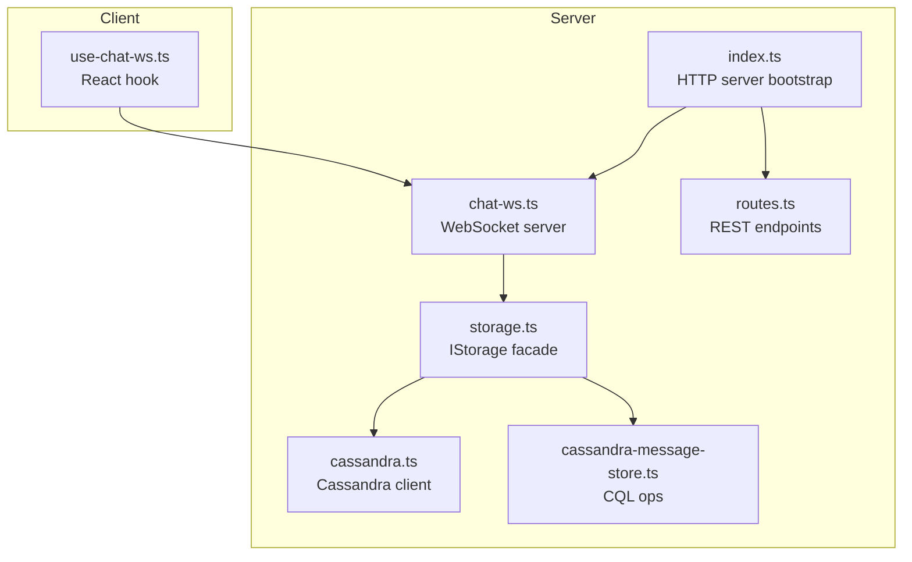
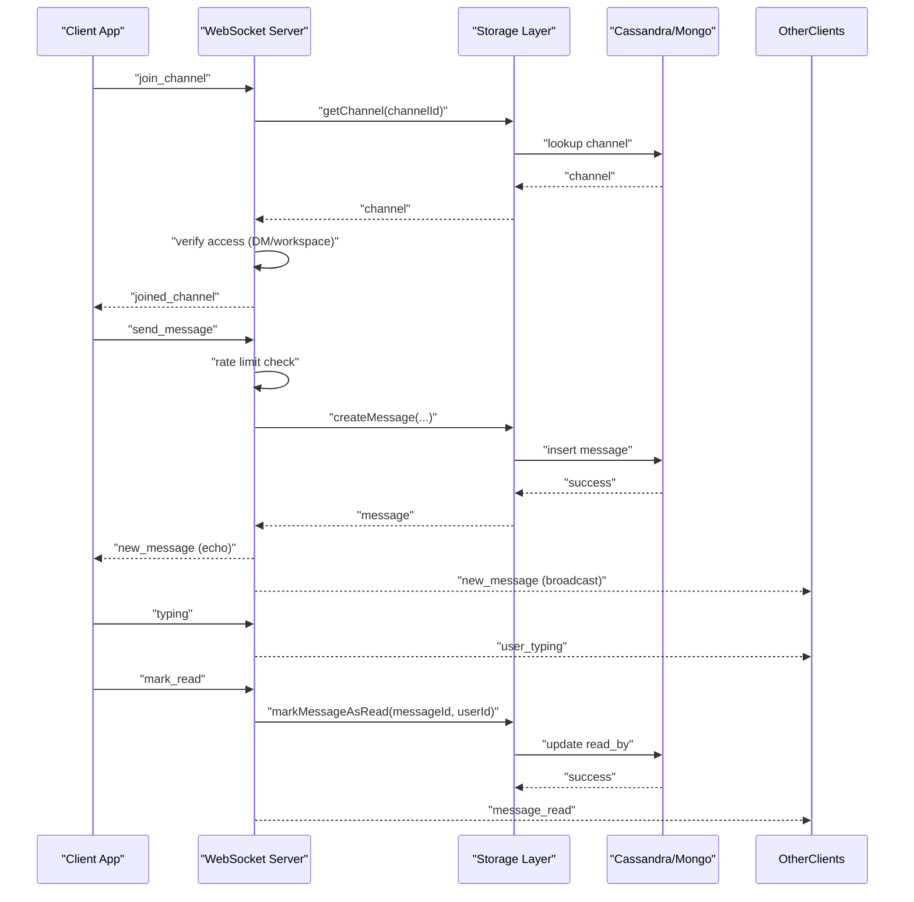
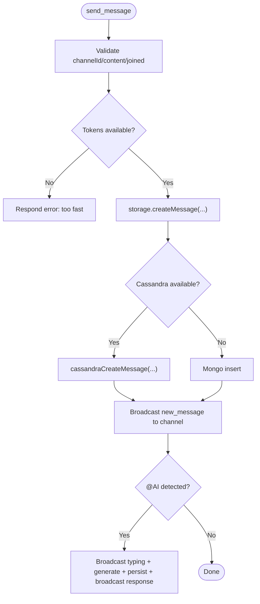
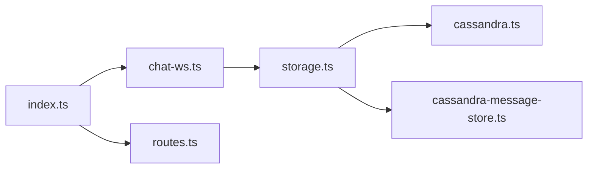

# Message Handling & Events

<cite>
**Referenced Files in This Document**
- [chat-ws.ts](file://server/chat-ws.ts)
- [use-chat-ws.ts](file://client/src/hooks/use-chat-ws.ts)
- [storage.ts](file://server/storage.ts)
- [cassandra.ts](file://server/lib/cassandra.ts)
- [cassandra-message-store.ts](file://server/lib/cassandra-message-store.ts)
- [routes.ts](file://server/routes.ts)
- [index.ts](file://server/index.ts)
</cite>

## Table of Contents
1. [Introduction](#introduction)
2. [Project Structure](#project-structure)
3. [Core Components](#core-components)
4. [Architecture Overview](#architecture-overview)
5. [Detailed Component Analysis](#detailed-component-analysis)
6. [Dependency Analysis](#dependency-analysis)
7. [Performance Considerations](#performance-considerations)
8. [Troubleshooting Guide](#troubleshooting-guide)
9. [Conclusion](#conclusion)

## Introduction
This document explains the message handling system for PersonalLearningPro’s WebSocket-based chat. It covers supported event types, validation, rate limiting, error handling, persistence, broadcasting, and real-time delivery. It also documents client-side event processing, ordering guarantees, duplicate detection, and offline handling strategies.

## Project Structure
The chat WebSocket server is implemented in the server module and integrates with a storage abstraction that can use either MongoDB or Cassandra. The client exposes a React hook to connect and interact with the WebSocket.

**Diagram sources**
- [chat-ws.ts](file://server/chat-ws.ts#L119-L392)
- [storage.ts](file://server/storage.ts#L33-L106)
- [cassandra.ts](file://server/lib/cassandra.ts#L6-L30)
- [cassandra-message-store.ts](file://server/lib/cassandra-message-store.ts#L36-L75)
- [routes.ts](file://server/routes.ts#L720-L777)
- [index.ts](file://server/index.ts)

**Section sources**
- [chat-ws.ts](file://server/chat-ws.ts#L1-L393)
- [storage.ts](file://server/storage.ts#L1-L519)
- [cassandra.ts](file://server/lib/cassandra.ts#L1-L73)
- [cassandra-message-store.ts](file://server/lib/cassandra-message-store.ts#L1-L166)
- [routes.ts](file://server/routes.ts#L1-L800)
- [index.ts](file://server/index.ts)

## Core Components
- WebSocket server for chat: handles authentication, channel subscriptions, and event routing.
- Storage abstraction: provides unified CRUD for users, channels, and messages, with a Cassandra-backed implementation for messages.
- Client hook: manages connection lifecycle, sends/receives events, and updates UI state.

Key responsibilities:
- Authentication via Express session cookie.
- Channel membership checks for DMs vs workspaces.
- Real-time broadcasting to channel subscribers.
- Persistence via storage layer with fallback to MongoDB when Cassandra is unavailable.
- Rate limiting for message bursts.

**Section sources**
- [chat-ws.ts](file://server/chat-ws.ts#L94-L115)
- [chat-ws.ts](file://server/chat-ws.ts#L185-L376)
- [storage.ts](file://server/storage.ts#L413-L422)
- [use-chat-ws.ts](file://client/src/hooks/use-chat-ws.ts#L65-L218)

## Architecture Overview
The WebSocket server listens on /ws/chat. On connection, it authenticates via session, registers client metadata, and sets up heartbeats. Incoming events are validated and dispatched to handlers that enforce access control, persist messages, and broadcast updates.

**Diagram sources**
- [chat-ws.ts](file://server/chat-ws.ts#L185-L376)
- [storage.ts](file://server/storage.ts#L413-L513)
- [cassandra-message-store.ts](file://server/lib/cassandra-message-store.ts#L36-L165)

## Detailed Component Analysis

### Supported Event Types and Schemas
- join_channel
  - Payload: { type: "join_channel"; channelId: number }
  - Behavior: Validates channel existence and access (DM membership or workspace membership), subscribes client, notifies presence.
- leave_channel
  - Payload: { type: "leave_channel"; channelId: number }
  - Behavior: Unsubscribes client and notifies others of offline presence.
- send_message
  - Payload: { type: "send_message"; channelId: number; content: string; messageType?: "text"|"file"|"image"; fileUrl?: string }
  - Behavior: Enforces join-before-send, rate limits, persists message, echoes to sender, broadcasts to channel, triggers AI assistant if @AI detected.
- typing
  - Payload: { type: "typing"; channelId: number }
  - Behavior: Broadcasts user_typing to channel except sender.
- mark_read
  - Payload: { type: "mark_read"; channelId: number; messageId: number }
  - Behavior: Marks message as read for user and broadcasts message_read to channel.

Client-side incoming event types include:
- new_message, user_typing, message_read, user_presence, plus connected, joined_channel, left_channel, error.

**Section sources**
- [chat-ws.ts](file://server/chat-ws.ts#L19-L26)
- [chat-ws.ts](file://server/chat-ws.ts#L185-L376)
- [use-chat-ws.ts](file://client/src/hooks/use-chat-ws.ts#L5-L51)

### Validation and Access Control
- Authentication: Extracts session cookie, decodes session ID, retrieves session from store, and validates presence of userId.
- Channel access:
  - DM: Requires channel name to include the user ID.
  - Non-DM: Requires workspace membership.
- Presence notifications: Online/offline events are broadcast when joining/leaving channels.

**Section sources**
- [chat-ws.ts](file://server/chat-ws.ts#L94-L115)
- [chat-ws.ts](file://server/chat-ws.ts#L194-L213)

### Rate Limiting Mechanism
- Token-bucket style limiter per connection:
  - Tokens start at 5, replenish every 5 seconds.
  - Each send_message consumes one token; excess requests are rejected with an error.

**Section sources**
- [chat-ws.ts](file://server/chat-ws.ts#L147-L149)
- [chat-ws.ts](file://server/chat-ws.ts#L262-L273)

### Error Handling Patterns
- JSON parse errors: Respond with error event and ignore malformed payloads.
- Unknown event types: Respond with error event.
- Unauthorized or missing user: Close connection with code 4001 and message.
- Channel not found or access denied: Respond with error event.
- Persistence failures: Respond with error event indicating failure to save.

**Section sources**
- [chat-ws.ts](file://server/chat-ws.ts#L175-L180)
- [chat-ws.ts](file://server/chat-ws.ts#L126-L138)
- [chat-ws.ts](file://server/chat-ws.ts#L196-L198)
- [chat-ws.ts](file://server/chat-ws.ts#L269-L271)
- [chat-ws.ts](file://server/chat-ws.ts#L335-L338)

### Message Persistence Workflow
- Storage layer:
  - createMessage inserts into Cassandra when available; otherwise falls back to MongoDB.
  - getMessagesByChannel supports pagination and optional cursor-like before parameter.
  - markMessageAsRead updates read_by set/list depending on backend.
- Cassandra integration:
  - Messages stored with partition key channel_id and clustering key message_id (Snowflake).
  - Read markers appended to read_by list/set atomically.

**Diagram sources**
- [chat-ws.ts](file://server/chat-ws.ts#L248-L340)
- [storage.ts](file://server/storage.ts#L413-L422)
- [cassandra-message-store.ts](file://server/lib/cassandra-message-store.ts#L36-L75)

**Section sources**
- [storage.ts](file://server/storage.ts#L413-L513)
- [cassandra.ts](file://server/lib/cassandra.ts#L32-L72)
- [cassandra-message-store.ts](file://server/lib/cassandra-message-store.ts#L36-L165)

### Broadcasting and Real-Time Delivery
- Subscriptions: Map of channelId to Set of WebSocket clients.
- Broadcast helpers:
  - broadcastToChannel excludes sender when echoing.
  - Presence and typing events are broadcast to the channel.
- Heartbeat: Periodic ping/pong to detect inactive clients; terminates if missed.

**Section sources**
- [chat-ws.ts](file://server/chat-ws.ts#L31-L53)
- [chat-ws.ts](file://server/chat-ws.ts#L157-L168)
- [chat-ws.ts](file://server/chat-ws.ts#L219-L226)
- [chat-ws.ts](file://server/chat-ws.ts#L347-L352)
- [chat-ws.ts](file://server/chat-ws.ts#L363-L368)

### Client-Side Event Processing
- Connection lifecycle: Establishes WebSocket to /ws/chat, auto-reconnects with exponential backoff (except 4001).
- Sending events:
  - sendMessage: { type: "send_message", channelId, content, messageType?, fileUrl? }
  - sendTyping: { type: "typing", channelId }
  - markRead: { type: "mark_read", channelId, messageId }
- Receiving events:
  - new_message: append to thread, enrich with author username.
  - user_typing: show typing indicators.
  - message_read: mark message as read.
  - user_presence: update online status.
  - error: log warning.

**Section sources**
- [use-chat-ws.ts](file://client/src/hooks/use-chat-ws.ts#L95-L162)
- [use-chat-ws.ts](file://client/src/hooks/use-chat-ws.ts#L180-L195)
- [use-chat-ws.ts](file://client/src/hooks/use-chat-ws.ts#L199-L214)
- [use-chat-ws.ts](file://client/src/hooks/use-chat-ws.ts#L115-L142)

### Message Ordering Guarantees
- Cassandra clustering key message_id (Snowflake) ensures insertion-order preservation per channel.
- Reads are returned in ascending order by converting Cassandra’s descending order to ascending on the server side before sending to clients.

**Section sources**
- [cassandra.ts](file://server/lib/cassandra.ts#L44-L59)
- [cassandra-message-store.ts](file://server/lib/cassandra-message-store.ts#L79-L102)

### Duplicate Detection
- No explicit duplicate message detection mechanism is present in the WebSocket server or storage layer. Clients should avoid resending identical payloads until acknowledged.

**Section sources**
- [chat-ws.ts](file://server/chat-ws.ts#L248-L340)
- [storage.ts](file://server/storage.ts#L413-L422)

### Offline Message Handling Strategies
- Presence events: When a client disconnects, the server removes it from all channels and broadcasts offline presence to remaining subscribers.
- History retrieval: REST endpoints support paginated retrieval of channel messages; clients can request older messages via before cursor.

**Section sources**
- [chat-ws.ts](file://server/chat-ws.ts#L71-L90)
- [routes.ts](file://server/routes.ts#L722-L777)

## Dependency Analysis

**Diagram sources**
- [chat-ws.ts](file://server/chat-ws.ts#L1-L10)
- [storage.ts](file://server/storage.ts#L1-L31)
- [cassandra.ts](file://server/lib/cassandra.ts#L1-L30)
- [cassandra-message-store.ts](file://server/lib/cassandra-message-store.ts#L1-L31)
- [index.ts](file://server/index.ts)

**Section sources**
- [chat-ws.ts](file://server/chat-ws.ts#L1-L10)
- [storage.ts](file://server/storage.ts#L1-L31)
- [cassandra.ts](file://server/lib/cassandra.ts#L1-L30)
- [cassandra-message-store.ts](file://server/lib/cassandra-message-store.ts#L1-L31)
- [index.ts](file://server/index.ts)

## Performance Considerations
- Rate limiting prevents bursty traffic at the cost of throughput; adjust token refill window/rate as needed.
- Cassandra is optimized for high write throughput and ordered reads; ensure proper partition sizing and consider compaction tuning.
- Heartbeat pings keep connections alive; tune interval based on network conditions.
- Client-side exponential backoff reduces server load during transient failures.

[No sources needed since this section provides general guidance]

## Troubleshooting Guide
Common issues and resolutions:
- Unauthorized connection: Ensure session cookie is present and valid; server closes with code 4001.
- Channel access denied: Verify DM membership or workspace membership before joining.
- Rate limit exceeded: Wait for token refill window or reduce message frequency.
- Persistence failures: Confirm Cassandra connectivity and schema initialization; fallback to MongoDB if configured incorrectly.
- Client not receiving messages: Check WebSocket readiness and subscription to the channel; verify presence of heartbeat and reconnection logic.

**Section sources**
- [chat-ws.ts](file://server/chat-ws.ts#L126-L138)
- [chat-ws.ts](file://server/chat-ws.ts#L202-L213)
- [chat-ws.ts](file://server/chat-ws.ts#L269-L271)
- [cassandra.ts](file://server/lib/cassandra.ts#L32-L72)
- [use-chat-ws.ts](file://client/src/hooks/use-chat-ws.ts#L144-L161)

## Conclusion
The chat WebSocket server provides a robust foundation for real-time messaging with strong access control, rate limiting, and scalable persistence via Cassandra. Client integration is straightforward through the provided React hook, enabling seamless presence, typing, read receipts, and message delivery across channels.