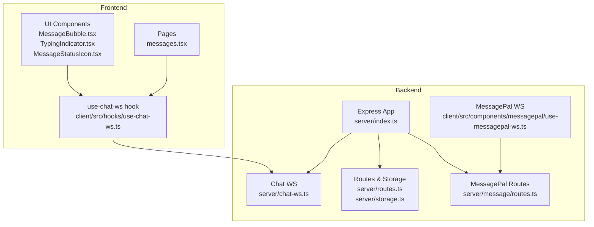
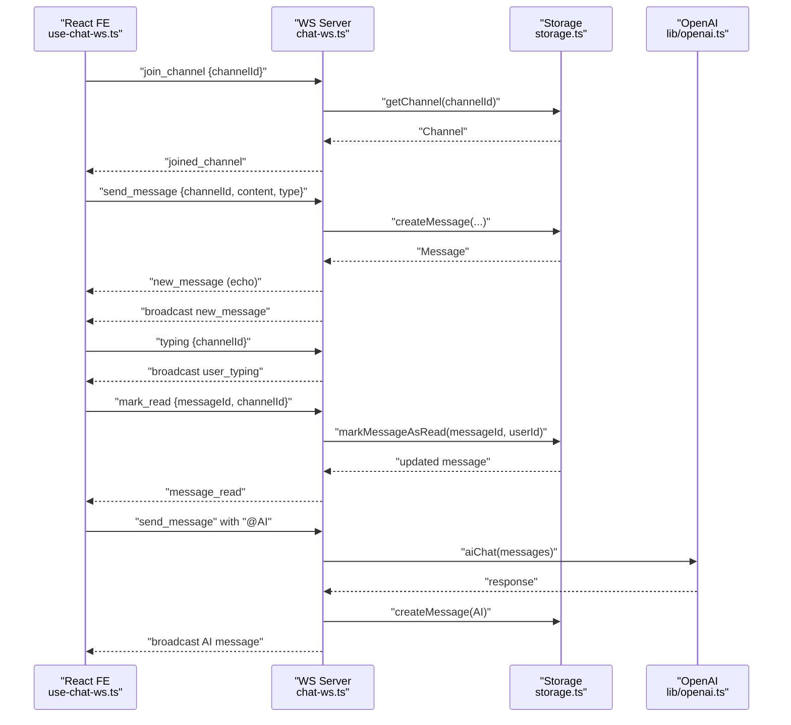
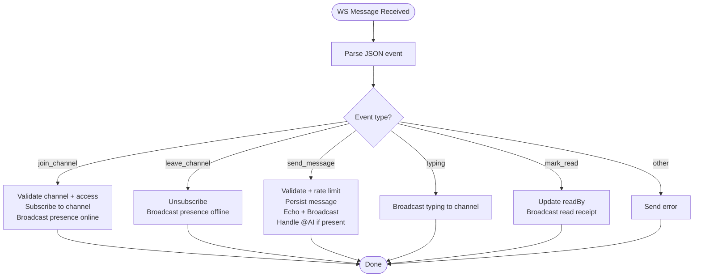
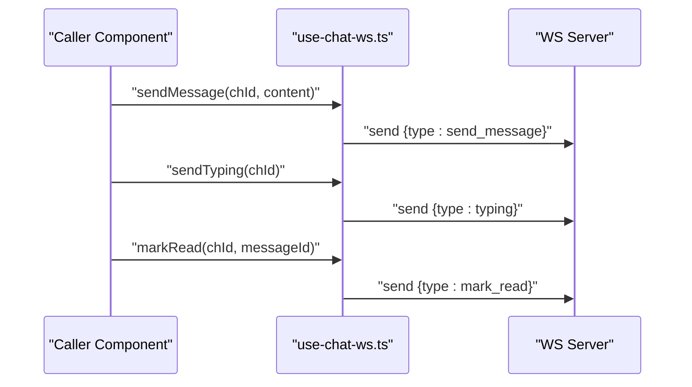
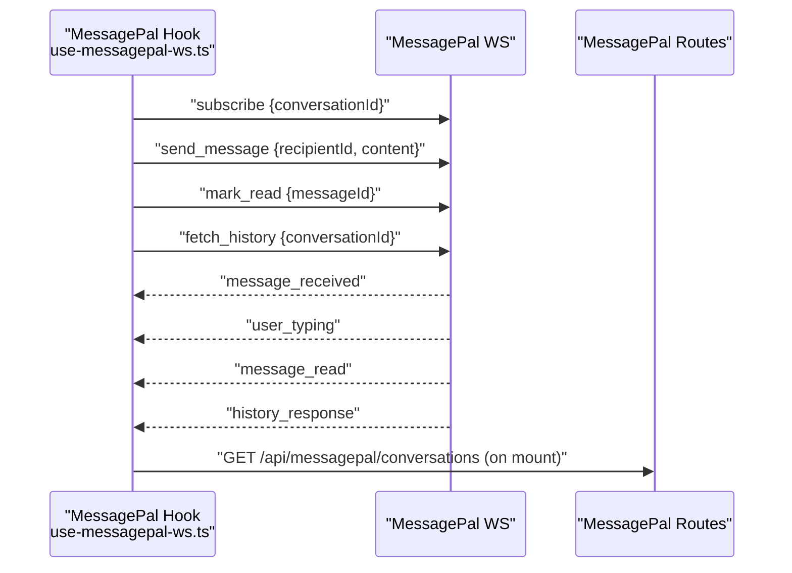
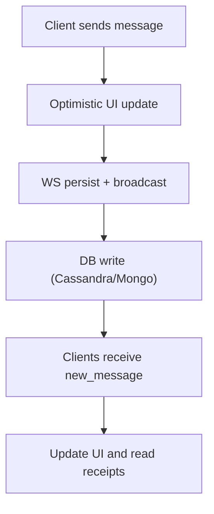
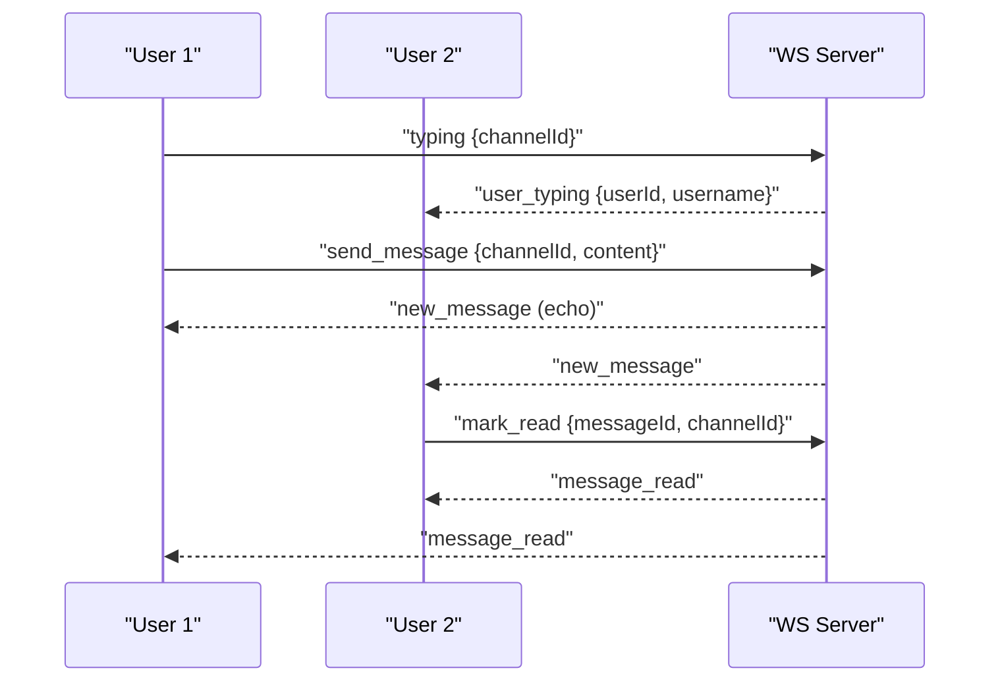
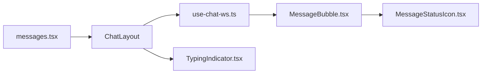
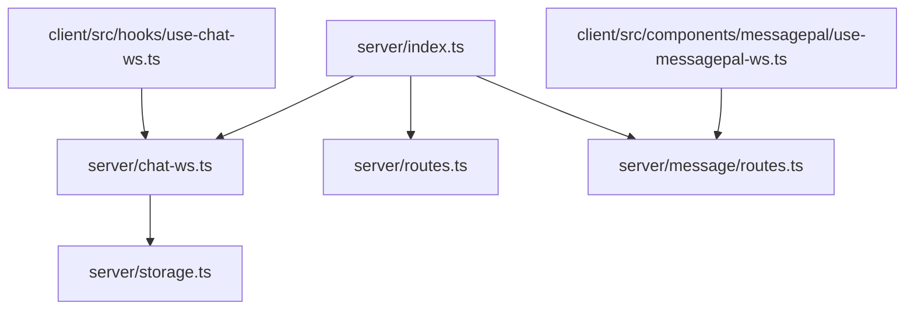

# Real-time Communication System

<cite>
**Referenced Files in This Document**
- [server/index.ts](file://server/index.ts)
- [server/chat-ws.ts](file://server/chat-ws.ts)
- [server/routes.ts](file://server/routes.ts)
- [server/storage.ts](file://server/storage.ts)
- [server/message/routes.ts](file://server/message/routes.ts)
- [client/src/hooks/use-chat-ws.ts](file://client/src/hooks/use-chat-ws.ts)
- [client/src/components/messagepal/use-messagepal-ws.ts](file://client/src/components/messagepal/use-messagepal-ws.ts)
- [client/src/components/chat/MessageBubble.tsx](file://client/src/components/chat/MessageBubble.tsx)
- [client/src/components/chat/MessageStatusIcon.tsx](file://client/src/components/chat/MessageStatusIcon.tsx)
- [client/src/components/chat/TypingIndicator.tsx](file://client/src/components/chat/TypingIndicator.tsx)
- [client/src/pages/messages.tsx](file://client/src/pages/messages.tsx)
- [client/src/types/chat.ts](file://client/src/types/chat.ts)
</cite>

## Table of Contents
1. [Introduction](#introduction)
2. [Project Structure](#project-structure)
3. [Core Components](#core-components)
4. [Architecture Overview](#architecture-overview)
5. [Detailed Component Analysis](#detailed-component-analysis)
6. [Dependency Analysis](#dependency-analysis)
7. [Performance Considerations](#performance-considerations)
8. [Troubleshooting Guide](#troubleshooting-guide)
9. [Conclusion](#conclusion)
10. [Appendices](#appendices)

## Introduction
This document describes the real-time communication system powering PersonalLearningPro’s chat platform. It covers the WebSocket architecture, connection lifecycle, message handling, chat rooms and DMs, typing indicators, presence management, message persistence, offline handling, and the integration between frontend React components and backend WebSocket handlers. It also outlines scalability considerations, connection pooling, and error recovery mechanisms.

## Project Structure
The real-time system spans:
- Backend server with Express, WebSocket servers, and storage abstractions
- Frontend React hooks and components for WebSocket integration and UI rendering
- Separate WebSocket endpoints for different chat domains (workspaces vs. personal messaging)

**Diagram sources**
- [server/index.ts](file://server/index.ts#L76-L84)
- [server/chat-ws.ts](file://server/chat-ws.ts#L119-L120)
- [server/routes.ts](file://server/routes.ts#L11-L11)
- [server/storage.ts](file://server/storage.ts#L109-L106)
- [server/message/routes.ts](file://server/message/routes.ts#L1-L5)
- [client/src/hooks/use-chat-ws.ts](file://client/src/hooks/use-chat-ws.ts#L65-L162)
- [client/src/components/messagepal/use-messagepal-ws.ts](file://client/src/components/messagepal/use-messagepal-ws.ts#L32-L89)
- [client/src/components/chat/MessageBubble.tsx](file://client/src/components/chat/MessageBubble.tsx#L1-L157)
- [client/src/components/chat/TypingIndicator.tsx](file://client/src/components/chat/TypingIndicator.tsx#L1-L19)
- [client/src/components/chat/MessageStatusIcon.tsx](file://client/src/components/chat/MessageStatusIcon.tsx#L1-L24)
- [client/src/pages/messages.tsx](file://client/src/pages/messages.tsx#L1-L15)

**Section sources**
- [server/index.ts](file://server/index.ts#L76-L113)
- [client/src/pages/messages.tsx](file://client/src/pages/messages.tsx#L1-L15)

## Core Components
- Backend WebSocket server for workspace chat (/ws/chat)
  - Handles join/leave channels, send message, typing, read receipts, presence, rate limiting, and heartbeat
- Frontend React hook for workspace chat
  - Manages connection lifecycle, auto-reconnect, event dispatch, and exposes send APIs
- MessagePal WebSocket for personal/private messaging
  - Dedicated endpoint and message types for conversations, typing, read receipts, and history
- Storage abstraction
  - Unified interface for user/channel/message operations, with Cassandra-backed message persistence and MongoDB fallback
- Frontend UI components
  - Message rendering, typing indicators, and read status icons

**Section sources**
- [server/chat-ws.ts](file://server/chat-ws.ts#L119-L392)
- [client/src/hooks/use-chat-ws.ts](file://client/src/hooks/use-chat-ws.ts#L65-L217)
- [client/src/components/messagepal/use-messagepal-ws.ts](file://client/src/components/messagepal/use-messagepal-ws.ts#L32-L295)
- [server/storage.ts](file://server/storage.ts#L97-L106)

## Architecture Overview
The system uses two primary WebSocket endpoints:
- /ws/chat for workspace-based group chat and DMs
- A separate WebSocket endpoint for MessagePal personal messaging

**Diagram sources**
- [server/chat-ws.ts](file://server/chat-ws.ts#L185-L375)
- [server/storage.ts](file://server/storage.ts#L413-L422)
- [client/src/hooks/use-chat-ws.ts](file://client/src/hooks/use-chat-ws.ts#L115-L141)

## Detailed Component Analysis

### Backend WebSocket Server (Workspace Chat)
- Connection lifecycle
  - Authenticates via Express session cookie and stores user metadata per socket
  - Heartbeat ping/pong to detect inactive connections
  - Cleanup removes sockets from all channels and notifies others of offline presence
- Event handling
  - join_channel: validates channel membership and workspace access, subscribes to channel
  - leave_channel: unsubscribes and notifies others of offline presence
  - send_message: rate-limits (tokens refill every 5s), persists message, broadcasts to channel, supports @AI assistant
  - typing: broadcasts typing indicator to channel except sender
  - mark_read: updates readBy and broadcasts read receipt
- Persistence
  - Uses storage.createMessage and related helpers; falls back to MongoDB if Cassandra client unavailable

**Diagram sources**
- [server/chat-ws.ts](file://server/chat-ws.ts#L172-L375)

**Section sources**
- [server/chat-ws.ts](file://server/chat-ws.ts#L119-L392)

### Frontend React Hook (use-chat-ws)
- Connection management
  - Builds WS URL from current origin, auto-reconnects with exponential backoff, stops reconnect on 4001 (unauthorized)
  - On mount, connects and optionally joins a channel; on unmount, leaves channel and closes socket
- Event handling
  - Parses incoming events and invokes callbacks for new messages, typing, read receipts, and presence
- Public APIs
  - sendMessage, sendTyping, markRead exposed to UI components

**Diagram sources**
- [client/src/hooks/use-chat-ws.ts](file://client/src/hooks/use-chat-ws.ts#L199-L214)

**Section sources**
- [client/src/hooks/use-chat-ws.ts](file://client/src/hooks/use-chat-ws.ts#L65-L217)

### MessagePal WebSocket (Personal Messaging)
- Endpoint and lifecycle
  - Connects to a dedicated WebSocket endpoint, auto-reconnects with exponential backoff
  - Supports subscribing to conversations, fetching history, and managing read receipts
- Events and UI
  - Handles message_received, user_typing, message_read, and history_response
  - Typing indicators auto-clear after a short delay

**Diagram sources**
- [client/src/components/messagepal/use-messagepal-ws.ts](file://client/src/components/messagepal/use-messagepal-ws.ts#L32-L295)
- [server/message/routes.ts](file://server/message/routes.ts#L1-L194)

**Section sources**
- [client/src/components/messagepal/use-messagepal-ws.ts](file://client/src/components/messagepal/use-messagepal-ws.ts#L32-L295)
- [server/message/routes.ts](file://server/message/routes.ts#L1-L194)

### Message Persistence and Offline Handling
- Persistence
  - Messages are persisted via storage.createMessage; when Cassandra client is available, Cassandra-backed store is used; otherwise falls back to MongoDB
  - Additional operations include pinning, grading, and read receipts
- Offline handling
  - Frontend maintains optimistic UI for send status and local typing indicators
  - On reconnect, the backend rebroadcasts messages and presence updates; clients should reconcile state accordingly

**Diagram sources**
- [server/storage.ts](file://server/storage.ts#L413-L422)
- [server/chat-ws.ts](file://server/chat-ws.ts#L276-L296)

**Section sources**
- [server/storage.ts](file://server/storage.ts#L413-L513)
- [server/chat-ws.ts](file://server/chat-ws.ts#L276-L339)

### Presence, Typing, and Read Receipts
- Presence
  - On join: broadcast online presence to channel
  - On leave/close: broadcast offline presence to channel
- Typing
  - Clients emit typing events; server broadcasts to channel except sender
- Read receipts
  - Clients mark read; server updates readBy and broadcasts message_read to channel

**Diagram sources**
- [server/chat-ws.ts](file://server/chat-ws.ts#L219-L245)
- [server/chat-ws.ts](file://server/chat-ws.ts#L342-L370)

**Section sources**
- [server/chat-ws.ts](file://server/chat-ws.ts#L219-L245)
- [server/chat-ws.ts](file://server/chat-ws.ts#L342-L370)

### Frontend UI Integration
- Message rendering
  - MessageBubble displays content, media, mentions, and status badges
  - MessageStatusIcon reflects sending/sent/delivered/read states
  - TypingIndicator shows typing dots for other users
- Pages
  - messages.tsx renders the chat layout and role provider context

**Diagram sources**
- [client/src/pages/messages.tsx](file://client/src/pages/messages.tsx#L1-L15)
- [client/src/hooks/use-chat-ws.ts](file://client/src/hooks/use-chat-ws.ts#L65-L217)
- [client/src/components/chat/MessageBubble.tsx](file://client/src/components/chat/MessageBubble.tsx#L1-L157)
- [client/src/components/chat/MessageStatusIcon.tsx](file://client/src/components/chat/MessageStatusIcon.tsx#L1-L24)
- [client/src/components/chat/TypingIndicator.tsx](file://client/src/components/chat/TypingIndicator.tsx#L1-L19)

**Section sources**
- [client/src/pages/messages.tsx](file://client/src/pages/messages.tsx#L1-L15)
- [client/src/components/chat/MessageBubble.tsx](file://client/src/components/chat/MessageBubble.tsx#L1-L157)
- [client/src/components/chat/MessageStatusIcon.tsx](file://client/src/components/chat/MessageStatusIcon.tsx#L1-L24)
- [client/src/components/chat/TypingIndicator.tsx](file://client/src/components/chat/TypingIndicator.tsx#L1-L19)

## Dependency Analysis
- Backend
  - server/index.ts initializes Express, sessions, attaches WebSocket servers, and starts the HTTP server
  - server/chat-ws.ts depends on storage for user/channel/message operations and OpenAI for AI assistant
  - server/storage.ts abstracts persistence and selects Cassandra or MongoDB based on availability
  - server/message/routes.ts provides HTTP endpoints for MessagePal, backed by CassandraMessageStore
- Frontend
  - client/src/hooks/use-chat-ws.ts depends on browser WebSocket API and React lifecycle
  - client/src/components/messagepal/use-messagepal-ws.ts manages its own WebSocket lifecycle and HTTP fallbacks

**Diagram sources**
- [server/index.ts](file://server/index.ts#L76-L84)
- [server/chat-ws.ts](file://server/chat-ws.ts#L1-L10)
- [server/storage.ts](file://server/storage.ts#L1-L31)
- [server/message/routes.ts](file://server/message/routes.ts#L1-L5)
- [client/src/hooks/use-chat-ws.ts](file://client/src/hooks/use-chat-ws.ts#L1-L1)
- [client/src/components/messagepal/use-messagepal-ws.ts](file://client/src/components/messagepal/use-messagepal-ws.ts#L1-L1)

**Section sources**
- [server/index.ts](file://server/index.ts#L76-L113)
- [server/storage.ts](file://server/storage.ts#L413-L513)

## Performance Considerations
- Connection lifecycle
  - Heartbeat ping/pong prevents resource leaks from idle connections
  - Cleanup ensures channels are properly unsubscribed and presence is updated
- Rate limiting
  - Token-based throttling for message sending prevents spam
- Persistence
  - Cassandra-backed message store improves throughput for high-volume channels
  - Fallback to MongoDB ensures resilience when Cassandra is unavailable
- Reconnection
  - Exponential backoff reduces server load during transient failures
- Scalability
  - Current implementation uses a single WebSocket server instance
  - Consider horizontal scaling with sticky sessions and a shared pub/sub layer for multi-instance deployments

[No sources needed since this section provides general guidance]

## Troubleshooting Guide
- Unauthorized connections
  - If the session cookie is missing or invalid, the WS server closes with code 4001 and sends an error; frontend should not reconnect automatically
- Channel access denied
  - Join requests to DMs require membership in a DM named after both users; workspace channels require membership in the workspace
- Rate limit exceeded
  - Sending too frequently triggers a temporary block; retry after cooldown
- Heartbeat timeouts
  - Missing pong responses terminate inactive connections; verify network stability
- Persistence errors
  - If message creation fails, the server responds with an error; frontend should surface a retry mechanism

**Section sources**
- [server/chat-ws.ts](file://server/chat-ws.ts#L126-L138)
- [server/chat-ws.ts](file://server/chat-ws.ts#L194-L213)
- [server/chat-ws.ts](file://server/chat-ws.ts#L262-L273)
- [server/chat-ws.ts](file://server/chat-ws.ts#L157-L168)
- [server/chat-ws.ts](file://server/chat-ws.ts#L335-L338)

## Conclusion
PersonalLearningPro’s real-time communication system combines a robust WebSocket server for workspace chat with a separate personal messaging WebSocket for MessagePal. The frontend integrates seamlessly via React hooks, providing smooth presence, typing, read receipts, and message persistence. The storage abstraction enables scalable message handling with Cassandra as the primary store and MongoDB as a fallback. With heartbeat monitoring, rate limiting, and resilient reconnection, the system balances reliability and performance while supporting future horizontal scaling.

[No sources needed since this section summarizes without analyzing specific files]

## Appendices

### Message Types and Payloads
- Workspace chat (server/chat-ws.ts)
  - join_channel: { type: "join_channel", channelId: number }
  - leave_channel: { type: "leave_channel", channelId: number }
  - send_message: { type: "send_message", channelId: number, content: string, messageType?: "text"|"file"|"image", fileUrl?: string }
  - typing: { type: "typing", channelId: number }
  - mark_read: { type: "mark_read", channelId: number, messageId: number }
  - Events received: new_message, user_typing, message_read, user_presence, error
- MessagePal (client/src/components/messagepal/use-messagepal-ws.ts)
  - send_message: { type: "send_message", recipientId: number, content: string }
  - typing: { type: "typing", recipientId: number }
  - mark_read: { type: "mark_read", messageId: string }
  - subscribe/unsubscribe: { type: "subscribe"/"unsubscribe", conversationId: string }
  - fetch_history: { type: "fetch_history", conversationId: string }

**Section sources**
- [server/chat-ws.ts](file://server/chat-ws.ts#L19-L26)
- [client/src/components/messagepal/use-messagepal-ws.ts](file://client/src/components/messagepal/use-messagepal-ws.ts#L105-L187)