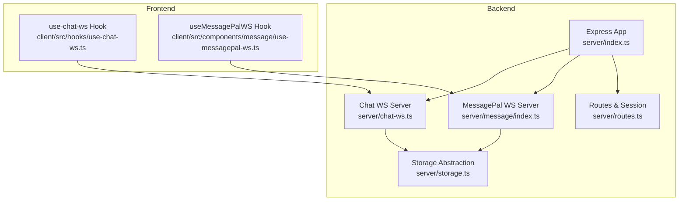
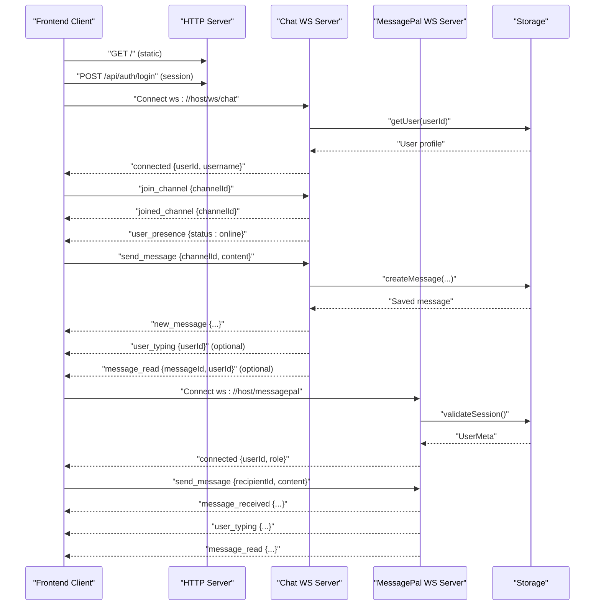
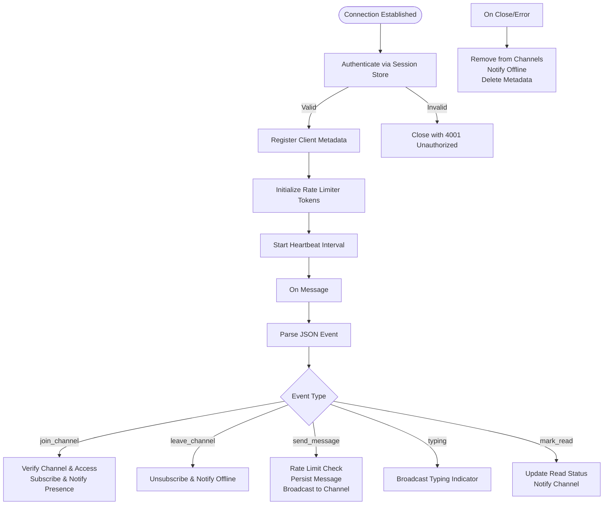
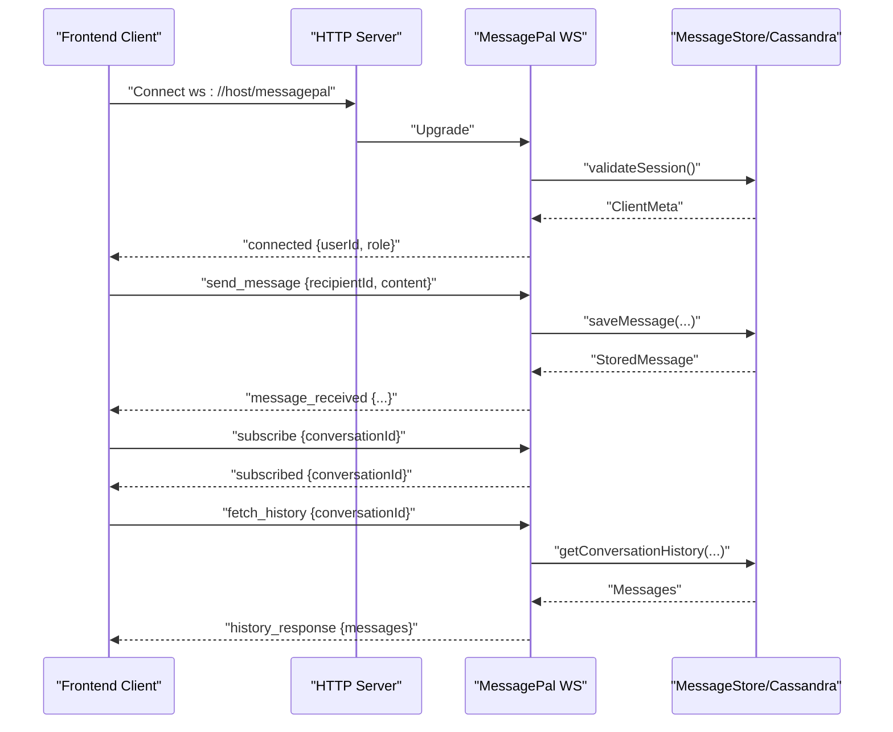
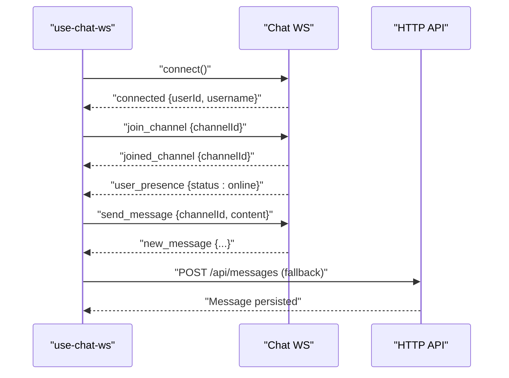
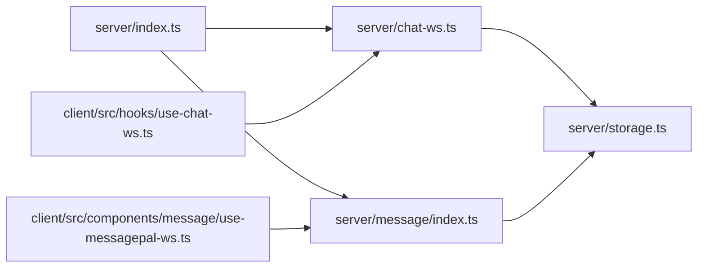

# WebSocket Architecture & Implementation

<cite>
**Referenced Files in This Document**
- [server/index.ts](file://server/index.ts)
- [server/chat-ws.ts](file://server/chat-ws.ts)
- [server/message/index.ts](file://server/message/index.ts)
- [server/message/message-store.ts](file://server/message/message-store.ts)
- [server/message/cassandra-message-store.ts](file://server/message/cassandra-message-store.ts)
- [server/storage.ts](file://server/storage.ts)
- [server/routes.ts](file://server/routes.ts)
- [client/src/hooks/use-chat-ws.ts](file://client/src/hooks/use-chat-ws.ts)
- [client/src/components/message/use-messagepal-ws.ts](file://client/src/components/message/use-messagepal-ws.ts)
</cite>

## Table of Contents
1. [Introduction](#introduction)
2. [Project Structure](#project-structure)
3. [Core Components](#core-components)
4. [Architecture Overview](#architecture-overview)
5. [Detailed Component Analysis](#detailed-component-analysis)
6. [Dependency Analysis](#dependency-analysis)
7. [Performance Considerations](#performance-considerations)
8. [Troubleshooting Guide](#troubleshooting-guide)
9. [Conclusion](#conclusion)

## Introduction
This document explains the WebSocket architecture powering PersonalLearningPro’s real-time communication systems. It covers the chat WebSocket server built with the ws library, connection lifecycle management, session-based authentication, client metadata management, channel subscription patterns, heartbeat-based health monitoring, rate limiting, and automatic cleanup. It also documents the MessagePal WebSocket server for direct messaging and outlines scalability, memory management, and performance optimization strategies for handling multiple concurrent connections.

## Project Structure
The WebSocket implementation spans backend and frontend modules:
- Backend
  - Chat WebSocket server: server/chat-ws.ts
  - MessagePal WebSocket server: server/message/index.ts
  - Shared storage abstraction: server/storage.ts
  - HTTP server bootstrap and integration: server/index.ts
  - Routes and session middleware: server/routes.ts
- Frontend
  - Chat WebSocket client hook: client/src/hooks/use-chat-ws.ts
  - MessagePal WebSocket client hook: client/src/components/message/use-messagepal-ws.ts

**Diagram sources**
- [server/index.ts](file://server/index.ts#L76-L84)
- [server/chat-ws.ts](file://server/chat-ws.ts#L119-L120)
- [server/message/index.ts](file://server/message/index.ts#L262-L266)
- [server/storage.ts](file://server/storage.ts#L109-L118)
- [server/routes.ts](file://server/routes.ts#L1-L11)
- [client/src/hooks/use-chat-ws.ts](file://client/src/hooks/use-chat-ws.ts#L95-L102)
- [client/src/components/message/use-messagepal-ws.ts](file://client/src/components/message/use-messagepal-ws.ts#L43-L48)

**Section sources**
- [server/index.ts](file://server/index.ts#L76-L84)
- [server/chat-ws.ts](file://server/chat-ws.ts#L119-L120)
- [server/message/index.ts](file://server/message/index.ts#L262-L266)
- [server/storage.ts](file://server/storage.ts#L109-L118)
- [server/routes.ts](file://server/routes.ts#L1-L11)
- [client/src/hooks/use-chat-ws.ts](file://client/src/hooks/use-chat-ws.ts#L95-L102)
- [client/src/components/message/use-messagepal-ws.ts](file://client/src/components/message/use-messagepal-ws.ts#L43-L48)

## Core Components
- Chat WebSocket Server
  - Path: /ws/chat
  - Authentication: session-based via express-session store
  - State: per-connection metadata and channel subscriptions
  - Heartbeat: periodic ping/pong to detect dead connections
  - Rate limiting: token-bucket style throttling per connection
  - Events: join_channel, leave_channel, send_message, typing, mark_read
- MessagePal WebSocket Server
  - Path: /messagepal (upgrade handler)
  - Authentication: session-based
  - State: per-user connections and active conversations
  - Events: send_message, typing, mark_read, fetch_history, subscribe, unsubscribe
- Storage Layer
  - Unified IStorage interface with Mongo-backed implementation
  - Cassandra-backed message persistence for chat messages
  - Memory session store for development
- Client Hooks
  - use-chat-ws: React hook for chat WebSocket with auto-reconnect and event handlers
  - useMessagePalWebSocket: React hook for MessagePal WebSocket with conversation management

**Section sources**
- [server/chat-ws.ts](file://server/chat-ws.ts#L13-L36)
- [server/message/index.ts](file://server/message/index.ts#L12-L44)
- [server/storage.ts](file://server/storage.ts#L33-L106)
- [client/src/hooks/use-chat-ws.ts](file://client/src/hooks/use-chat-ws.ts#L65-L217)
- [client/src/components/message/use-messagepal-ws.ts](file://client/src/components/message/use-messagepal-ws.ts#L32-L295)

## Architecture Overview
The system integrates two WebSocket servers under a single HTTP server:
- Chat WebSocket: supports channels, presence, typing indicators, read receipts, and AI assistant triggers
- MessagePal WebSocket: supports direct messaging, conversation history, and user presence

**Diagram sources**
- [server/index.ts](file://server/index.ts#L76-L84)
- [server/chat-ws.ts](file://server/chat-ws.ts#L119-L156)
- [server/message/index.ts](file://server/message/index.ts#L262-L306)
- [server/storage.ts](file://server/storage.ts#L37-L41)
- [client/src/hooks/use-chat-ws.ts](file://client/src/hooks/use-chat-ws.ts#L105-L112)
- [client/src/components/message/use-messagepal-ws.ts](file://client/src/components/message/use-messagepal-ws.ts#L49-L52)

## Detailed Component Analysis

### Chat WebSocket Server
- Setup and Integration
  - Attaches to HTTP server at path /ws/chat
  - Integrates with express-session store for authentication
- Authentication
  - Extracts connect.sid cookie from upgrade request
  - Decodes session ID and retrieves session from store
  - Validates presence of userId and loads user profile from storage
- Client Metadata Management
  - Tracks per-connection metadata: userId, username, subscribed channels
  - Maintains channelSubscribers map: channelId → Set of WebSocket instances
- Channel Subscription Patterns
  - join_channel: verifies channel existence and access (workspace membership or DM ownership), subscribes client, notifies others of presence
  - leave_channel: unsubscribes and notifies others of offline status
- Message Handling
  - send_message: validates channel membership, applies rate limiting, persists message, broadcasts to channel (excluding sender), optionally triggers AI assistant
  - typing: broadcasts typing indicator to channel except sender
  - mark_read: updates readBy set and notifies channel
- Heartbeat Mechanism
  - Periodic ping/pong to detect inactive clients; terminates if no pong received
- Automatic Cleanup
  - On close/error: removes client from all channels, notifies others of offline, deletes metadata

**Diagram sources**
- [server/chat-ws.ts](file://server/chat-ws.ts#L119-L168)
- [server/chat-ws.ts](file://server/chat-ws.ts#L172-L376)
- [server/chat-ws.ts](file://server/chat-ws.ts#L71-L90)

**Section sources**
- [server/chat-ws.ts](file://server/chat-ws.ts#L94-L115)
- [server/chat-ws.ts](file://server/chat-ws.ts#L119-L168)
- [server/chat-ws.ts](file://server/chat-ws.ts#L172-L376)
- [server/chat-ws.ts](file://server/chat-ws.ts#L71-L90)

### MessagePal WebSocket Server
- Upgrade and Connection Handling
  - Uses noServer mode with manual upgrade for /messagepal path
  - Validates session and registers client metadata (userId, username, role, connectedAt)
- State Management
  - userConnections: userId → Set of WebSocket instances
  - activeConversations: conversationId → Set of participating user IDs
- Event Handling
  - send_message: creates conversationId, saves message, broadcasts to both participants, updates conversation metadata
  - typing: broadcasts typing event to recipient
  - mark_read: marks message as read and acknowledges sender
  - fetch_history: returns paginated conversation history
  - subscribe/unsubscribe: manage conversation subscriptions
- Cleanup
  - On close: removes connection from userConnections and cleans metadata

**Diagram sources**
- [server/message/index.ts](file://server/message/index.ts#L262-L274)
- [server/message/index.ts](file://server/message/index.ts#L276-L306)
- [server/message/index.ts](file://server/message/index.ts#L105-L152)
- [server/message/index.ts](file://server/message/index.ts#L349-L366)

**Section sources**
- [server/message/index.ts](file://server/message/index.ts#L71-L93)
- [server/message/index.ts](file://server/message/index.ts#L262-L306)
- [server/message/index.ts](file://server/message/index.ts#L105-L152)
- [server/message/index.ts](file://server/message/index.ts#L349-L366)

### Client Hooks and Usage Patterns
- use-chat-ws
  - Builds WebSocket URL from current origin
  - Auto-reconnect with exponential backoff
  - Sends join_channel on mount and leave_channel on unmount
  - Handles incoming events: new_message, user_typing, message_read, user_presence
  - Provides sendMessage, sendTyping, markRead helpers
- useMessagePalWebSocket
  - Manages connection lifecycle and reconnection
  - Subscribes to conversation updates
  - Handles message_received, user_typing, message_read, history_response
  - Exposes APIs to send messages, typing indicators, read receipts, and fetch history

**Diagram sources**
- [client/src/hooks/use-chat-ws.ts](file://client/src/hooks/use-chat-ws.ts#L95-L112)
- [client/src/hooks/use-chat-ws.ts](file://client/src/hooks/use-chat-ws.ts#L115-L142)
- [client/src/hooks/use-chat-ws.ts](file://client/src/hooks/use-chat-ws.ts#L199-L214)
- [server/routes.ts](file://server/routes.ts#L779-L800)

**Section sources**
- [client/src/hooks/use-chat-ws.ts](file://client/src/hooks/use-chat-ws.ts#L65-L217)
- [client/src/components/message/use-messagepal-ws.ts](file://client/src/components/message/use-messagepal-ws.ts#L32-L295)
- [server/routes.ts](file://server/routes.ts#L779-L800)

## Dependency Analysis
- Express server initialization sets up session middleware and routes, then attaches WebSocket servers
- Both WebSocket servers depend on storage for authentication and persistence
- Client hooks depend on WebSocket servers for real-time updates

**Diagram sources**
- [server/index.ts](file://server/index.ts#L76-L84)
- [server/chat-ws.ts](file://server/chat-ws.ts#L119-L120)
- [server/message/index.ts](file://server/message/index.ts#L262-L266)
- [server/storage.ts](file://server/storage.ts#L109-L118)
- [client/src/hooks/use-chat-ws.ts](file://client/src/hooks/use-chat-ws.ts#L95-L102)
- [client/src/components/message/use-messagepal-ws.ts](file://client/src/components/message/use-messagepal-ws.ts#L43-L48)

**Section sources**
- [server/index.ts](file://server/index.ts#L76-L84)
- [server/chat-ws.ts](file://server/chat-ws.ts#L119-L120)
- [server/message/index.ts](file://server/message/index.ts#L262-L266)
- [server/storage.ts](file://server/storage.ts#L109-L118)
- [client/src/hooks/use-chat-ws.ts](file://client/src/hooks/use-chat-ws.ts#L95-L102)
- [client/src/components/message/use-messagepal-ws.ts](file://client/src/components/message/use-messagepal-ws.ts#L43-L48)

## Performance Considerations
- Connection scaling
  - Use a reverse proxy/load balancer to distribute connections across instances
  - Consider sticky sessions for session-based auth if scaling horizontally
- Memory management
  - Monitor channelSubscribers and clientMeta sizes; implement periodic pruning for idle channels
  - Use streaming or pagination for large message histories
- Rate limiting
  - Chat server enforces per-connection token-based throttling; tune tokens and refill intervals based on traffic
- Persistence
  - Prefer Cassandra-backed storage for high write throughput in chat; fallback to MongoDB for development
- Heartbeat
  - Adjust heartbeat interval to balance responsiveness and overhead
- Backpressure
  - Throttle outbound broadcasts; consider batching or rate-limiting per-channel
- Reconnection
  - Client hooks implement exponential backoff; ensure server-side cleanup on repeated failures

[No sources needed since this section provides general guidance]

## Troubleshooting Guide
- Authentication failures
  - Verify SESSION_SECRET is set in production; ensure connect.sid cookie is present and valid
  - Check session store connectivity and session retrieval
- Connection drops
  - Inspect heartbeat logs and ensure clients send pongs
  - Review cleanup routines on close/error
- Channel access denied
  - Confirm workspace membership or DM ownership before joining
- Message delivery issues
  - Validate channel existence and membership before sending
  - Check storage persistence and Cassandra connectivity
- Client reconnection loops
  - Inspect exponential backoff behavior and unauthorized close codes

**Section sources**
- [server/index.ts](file://server/index.ts#L30-L44)
- [server/chat-ws.ts](file://server/chat-ws.ts#L122-L138)
- [server/chat-ws.ts](file://server/chat-ws.ts#L194-L213)
- [server/message/index.ts](file://server/message/index.ts#L279-L284)

## Conclusion
PersonalLearningPro’s WebSocket architecture combines a robust chat system with a dedicated MessagePal service. The design leverages session-based authentication, structured client metadata, channel subscriptions, heartbeat monitoring, and rate limiting to ensure reliable real-time communication. With proper scaling, memory management, and persistence strategies, the system can efficiently support numerous concurrent connections while maintaining performance and reliability.