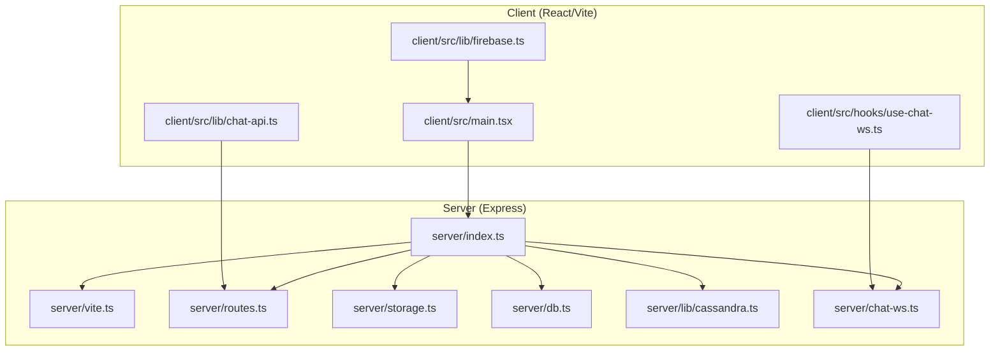
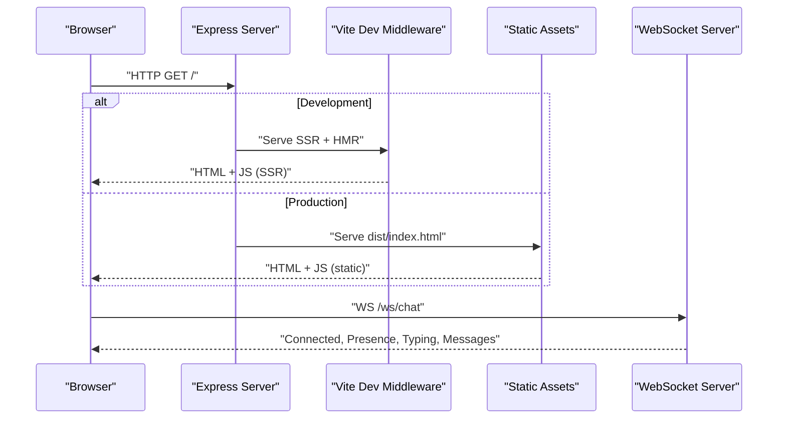
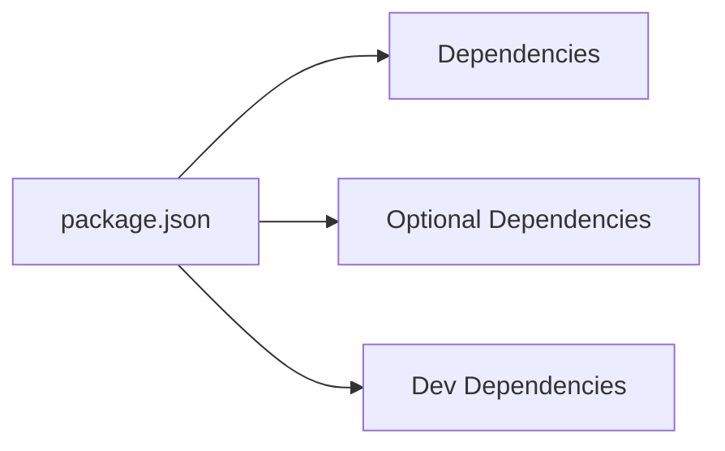

# Troubleshooting & FAQ

<cite>
**Referenced Files in This Document**
- [README.md](file://README.md)
- [LOCAL_SETUP.md](file://LOCAL_SETUP.md)
- [.env.example](file://.env.example)
- [package.json](file://package.json)
- [Dockerfile](file://Dockerfile)
- [docker-compose.yml](file://docker-compose.yml)
- [server/index.ts](file://server/index.ts)
- [server/vite.ts](file://server/vite.ts)
- [server/db.ts](file://server/db.ts)
- [server/lib/cassandra.ts](file://server/lib/cassandra.ts)
- [server/storage.ts](file://server/storage.ts)
- [server/chat-ws.ts](file://server/chat-ws.ts)
- [client/src/lib/firebase.ts](file://client/src/lib/firebase.ts)
- [client/src/lib/chat-api.ts](file://client/src/lib/chat-api.ts)
- [client/src/hooks/use-chat-ws.ts](file://client/src/hooks/use-chat-ws.ts)
</cite>

## Table of Contents
1. [Introduction](#introduction)
2. [Project Structure](#project-structure)
3. [Core Components](#core-components)
4. [Architecture Overview](#architecture-overview)
5. [Detailed Component Analysis](#detailed-component-analysis)
6. [Dependency Analysis](#dependency-analysis)
7. [Performance Considerations](#performance-considerations)
8. [Troubleshooting Guide](#troubleshooting-guide)
9. [Conclusion](#conclusion)
10. [Appendices](#appendices)

## Introduction
This document provides a comprehensive Troubleshooting & FAQ guide for PersonalLearningPro. It focuses on diagnosing and resolving common installation issues, environment configuration problems, dependency conflicts, runtime errors, WebSocket connection failures, database connectivity issues, authentication problems, API integration issues, performance bottlenecks, Docker-related problems, port conflicts, resource limitations, browser compatibility issues, React development server problems, and production deployment challenges. It also includes diagnostic commands, log analysis techniques, and escalation procedures for complex issues.

## Project Structure
PersonalLearningPro is a full-stack application with:
- A React frontend served by Vite
- An Express server that serves both API and static assets
- Optional integrations for Firebase authentication, OpenAI, MongoDB, and Cassandra/Astra DB
- Docker support for local development and production builds

**Diagram sources**
- [server/index.ts](file://server/index.ts#L1-L114)
- [server/vite.ts](file://server/vite.ts#L1-L89)
- [server/storage.ts](file://server/storage.ts#L1-L519)
- [server/db.ts](file://server/db.ts#L1-L21)
- [server/lib/cassandra.ts](file://server/lib/cassandra.ts#L1-L73)
- [server/chat-ws.ts](file://server/chat-ws.ts#L1-L393)
- [client/src/lib/firebase.ts](file://client/src/lib/firebase.ts#L1-L212)
- [client/src/hooks/use-chat-ws.ts](file://client/src/hooks/use-chat-ws.ts#L1-L218)
- [client/src/lib/chat-api.ts](file://client/src/lib/chat-api.ts#L1-L112)

**Section sources**
- [README.md](file://README.md#L70-L102)
- [package.json](file://package.json#L1-L120)

## Core Components
- Environment variables: Firebase, OpenAI, MongoDB, session secret, and optional Cassandra/Astra DB credentials.
- Express server: Initializes sessions, routes, Vite middleware, and WebSocket servers.
- Storage layer: Hybrid persistence using MongoDB with optional Cassandra/Astra DB for message storage.
- Firebase integration: Optional authentication and user profile management.
- WebSocket chat: Real-time chat with rate limiting, presence, and typing indicators.
- Vite dev server: Integrated SSR/HMR for development; static serving for production.

**Section sources**
- [.env.example](file://.env.example#L1-L36)
- [server/index.ts](file://server/index.ts#L1-L114)
- [server/storage.ts](file://server/storage.ts#L1-L519)
- [server/lib/cassandra.ts](file://server/lib/cassandra.ts#L1-L73)
- [client/src/lib/firebase.ts](file://client/src/lib/firebase.ts#L1-L212)
- [server/chat-ws.ts](file://server/chat-ws.ts#L1-L393)
- [server/vite.ts](file://server/vite.ts#L1-L89)

## Architecture Overview
The application runs on a single port for both API and client. In development, Vite handles HMR and SSR; in production, static assets are served directly. Sessions are stored in memory by default and can be configured for production. WebSocket servers are attached to the HTTP server for real-time chat.

**Diagram sources**
- [server/index.ts](file://server/index.ts#L94-L113)
- [server/vite.ts](file://server/vite.ts#L25-L89)
- [client/src/hooks/use-chat-ws.ts](file://client/src/hooks/use-chat-ws.ts#L95-L162)

## Detailed Component Analysis

### Environment Configuration and Secrets
Common issues:
- Missing or invalid environment variables cause partial functionality or startup failures.
- SESSION_SECRET must be set in production; otherwise, the server throws an error.
- Firebase credentials must be valid and properly prefixed for authentication to work.

Resolution steps:
- Copy and edit the environment file as instructed in the setup guides.
- Validate credentials in the environment file and ensure correct prefixes for Firebase keys.
- For production, set SESSION_SECRET and ensure HTTPS cookies are used.

**Section sources**
- [.env.example](file://.env.example#L1-L36)
- [server/index.ts](file://server/index.ts#L31-L44)
- [client/src/lib/firebase.ts](file://client/src/lib/firebase.ts#L27-L45)

### Database Connectivity (MongoDB and Cassandra/Astra DB)
Common issues:
- Missing MONGODB_URL prevents MongoDB connection; the server continues without it.
- Cassandra/Astra DB requires secure bundle path, token, and keyspace; missing values prevent initialization.
- Incorrect TLS settings or invalid certificates can block MongoDB connections.

Resolution steps:
- Ensure MONGODB_URL is set and reachable.
- For Cassandra/Astra DB, confirm secure bundle path, token, and keyspace are provided.
- Adjust TLS settings if connecting to self-signed or internal instances.

**Section sources**
- [server/db.ts](file://server/db.ts#L1-L21)
- [server/lib/cassandra.ts](file://server/lib/cassandra.ts#L1-L73)
- [server/storage.ts](file://server/storage.ts#L413-L422)

### WebSocket Chat Failures
Common symptoms:
- Unauthorized disconnects (code 4001) when not logged in.
- Frequent reconnections due to heartbeat timeouts.
- Rate limiting errors when sending messages too frequently.
- Access denied for DMs or workspaces.

Resolution steps:
- Ensure the session cookie is present and valid; the WebSocket authenticates via session.
- Verify channel membership and workspace permissions.
- Respect rate limits (tokens refill every 5 seconds).
- Check heartbeat intervals and network stability.

**Section sources**
- [server/chat-ws.ts](file://server/chat-ws.ts#L119-L168)
- [server/chat-ws.ts](file://server/chat-ws.ts#L122-L130)
- [server/chat-ws.ts](file://server/chat-ws.ts#L248-L274)
- [client/src/hooks/use-chat-ws.ts](file://client/src/hooks/use-chat-ws.ts#L144-L157)

### Authentication Problems (Firebase)
Common issues:
- Firebase not configured leads to disabled auth features.
- API key must start with the expected prefix; otherwise, the app warns and disables auth.
- Google sign-in may fail if the provider is not enabled or credentials are incorrect.

Resolution steps:
- Fill in all VITE_FIREBASE_* variables in the environment file.
- Enable Google as a sign-in method in Firebase.
- Verify API key prefix and project identifiers.

**Section sources**
- [client/src/lib/firebase.ts](file://client/src/lib/firebase.ts#L27-L45)
- [client/src/lib/firebase.ts](file://client/src/lib/firebase.ts#L117-L150)
- [README.md](file://README.md#L53-L69)

### API Integration Issues
Common issues:
- CORS and cookie handling with credentials.
- Non-OK responses from REST endpoints.
- Missing session cookie causing unauthorized responses.

Resolution steps:
- Use the provided API client which sends credentials automatically.
- Inspect response bodies for detailed error messages.
- Ensure the session store is configured and reachable.

**Section sources**
- [client/src/lib/chat-api.ts](file://client/src/lib/chat-api.ts#L44-L55)
- [client/src/lib/chat-api.ts](file://client/src/lib/chat-api.ts#L94-L111)
- [server/storage.ts](file://server/storage.ts#L110-L118)

### Docker and Port Conflicts
Common issues:
- Port 5001 already in use by another process.
- Volume mounts not applied or node_modules overwritten.
- Build failures due to missing dependencies.

Resolution steps:
- Change the host port mapping in the compose file if 5001 is busy.
- Keep container’s node_modules volume to avoid host overwrites.
- Rebuild with cache disabled if dependency changes occur.

**Section sources**
- [docker-compose.yml](file://docker-compose.yml#L6-L23)
- [Dockerfile](file://Dockerfile#L20-L24)
- [LOCAL_SETUP.md](file://LOCAL_SETUP.md#L114-L116)

### React Development Server Problems
Common issues:
- Vite HMR or SSR errors during development.
- Static assets not served in production builds.
- Missing build directory in production.

Resolution steps:
- Fix Vite configuration errors; the server exits on Vite logger errors.
- Ensure the client is built before running production.
- Verify the dist/public directory exists and contains index.html.

**Section sources**
- [server/vite.ts](file://server/vite.ts#L25-L46)
- [server/vite.ts](file://server/vite.ts#L73-L88)
- [package.json](file://package.json#L6-L11)

## Dependency Analysis
The project uses a mix of required and optional dependencies. Optional dependencies may be omitted in production builds. Ensure all required dependencies are installed and compatible with Node.js version requirements.

**Diagram sources**
- [package.json](file://package.json#L12-L118)

**Section sources**
- [package.json](file://package.json#L12-L118)

## Performance Considerations
- WebSocket rate limiting: Clients are limited to a fixed number of messages per interval to prevent spam.
- Heartbeat monitoring: Idle connections are terminated to free resources.
- Hybrid storage: Cassandra/Astra DB is preferred for message storage; MongoDB is used as a fallback.
- Logging: API responses are logged with timing and payload summaries.

Recommendations:
- Tune rate limits and heartbeat intervals based on expected load.
- Monitor MongoDB and Cassandra connectivity and latency.
- Use production builds and HTTPS in production to reduce overhead.

**Section sources**
- [server/chat-ws.ts](file://server/chat-ws.ts#L262-L274)
- [server/chat-ws.ts](file://server/chat-ws.ts#L157-L168)
- [server/storage.ts](file://server/storage.ts#L413-L422)
- [server/index.ts](file://server/index.ts#L46-L74)

## Troubleshooting Guide

### Installation and Setup
- npm install fails:
  - Clean install by removing node_modules and package-lock.json, then reinstall.
- Missing build artifacts in production:
  - Ensure the client is built before starting the production server.

**Section sources**
- [LOCAL_SETUP.md](file://LOCAL_SETUP.md#L126-L131)
- [package.json](file://package.json#L6-L11)

### Environment Configuration
- Port 5001 in use:
  - Change the port in the server entry point or update the compose port mapping.
- Environment variables not loading:
  - Confirm .env is at the project root and restart the dev server.

**Section sources**
- [LOCAL_SETUP.md](file://LOCAL_SETUP.md#L114-L125)
- [docker-compose.yml](file://docker-compose.yml#L6-L7)

### Database Connectivity
- MongoDB connection errors:
  - Verify MONGODB_URL and credentials; check TLS settings.
- Cassandra/Astra DB not initializing:
  - Confirm secure bundle path, token, and keyspace are set.

**Section sources**
- [server/db.ts](file://server/db.ts#L1-L21)
- [server/lib/cassandra.ts](file://server/lib/cassandra.ts#L13-L16)

### WebSocket Connection Failures
- Unauthorized disconnects:
  - Ensure a valid session cookie is present; re-authenticate if needed.
- Rate limiting errors:
  - Slow down message sending; tokens refill every 5 seconds.
- Access denied to channels:
  - Verify workspace membership or DM ownership.

**Section sources**
- [server/chat-ws.ts](file://server/chat-ws.ts#L122-L130)
- [server/chat-ws.ts](file://server/chat-ws.ts#L248-L274)
- [client/src/hooks/use-chat-ws.ts](file://client/src/hooks/use-chat-ws.ts#L144-L157)

### Authentication Problems
- Firebase auth disabled:
  - Fill in all VITE_FIREBASE_* variables and enable Google sign-in in Firebase.
- API key validation:
  - Ensure the API key starts with the expected prefix.

**Section sources**
- [client/src/lib/firebase.ts](file://client/src/lib/firebase.ts#L27-L45)
- [README.md](file://README.md#L53-L69)

### API Integration Issues
- Non-OK responses:
  - Check response body for error details; ensure credentials are sent with requests.
- Session cookie issues:
  - Verify session store availability and cookie settings.

**Section sources**
- [client/src/lib/chat-api.ts](file://client/src/lib/chat-api.ts#L44-L55)
- [server/storage.ts](file://server/storage.ts#L110-L118)

### Docker and Deployment
- Port conflicts:
  - Change host port mapping in docker-compose.yml.
- Resource limitations:
  - Increase container memory/cpu limits as needed.
- Build failures:
  - Rebuild with --no-cache after dependency changes.

**Section sources**
- [docker-compose.yml](file://docker-compose.yml#L6-L23)
- [Dockerfile](file://Dockerfile#L20-L24)
- [README.md](file://README.md#L114-L122)

### Browser Compatibility and Development Server
- Vite SSR/HMR errors:
  - Fix configuration issues; the server exits on Vite logger errors.
- Static assets missing:
  - Ensure the client is built and dist/public directory exists.

**Section sources**
- [server/vite.ts](file://server/vite.ts#L25-L46)
- [server/vite.ts](file://server/vite.ts#L73-L88)

### Diagnostic Commands and Log Analysis
- Check server logs:
  - Observe API request logs with timing and response payloads.
- Inspect WebSocket events:
  - Look for heartbeat pings/pongs and error messages.
- Validate environment variables:
  - Confirm required variables are present and correctly formatted.

**Section sources**
- [server/index.ts](file://server/index.ts#L46-L74)
- [server/chat-ws.ts](file://server/chat-ws.ts#L157-L168)
- [.env.example](file://.env.example#L1-L36)

### Escalation Procedures
- For persistent WebSocket or database issues:
  - Collect logs around the failure window and verify network connectivity.
- For production deployment issues:
  - Validate environment variables, secrets, and SSL/TLS configuration.
- For Docker-specific issues:
  - Rebuild images, clear caches, and verify volume mounts.

[No sources needed since this section provides general guidance]

## Conclusion
This guide consolidates actionable steps to troubleshoot and resolve common issues in PersonalLearningPro. By validating environment configuration, ensuring database connectivity, addressing WebSocket and authentication concerns, and following Docker and deployment best practices, most problems can be quickly identified and resolved. For complex scenarios, leverage the diagnostic commands and escalation procedures outlined above.

## Appendices

### Quick Reference: Environment Variables
- Firebase (optional): VITE_FIREBASE_API_KEY, VITE_FIREBASE_PROJECT_ID, VITE_FIREBASE_APP_ID, VITE_FIREBASE_MESSAGING_SENDER_ID, VITE_FIREBASE_MEASUREMENT_ID
- OpenAI (optional): OPENAI_API_KEY
- MongoDB (required): MONGODB_URL
- Session (required in production): SESSION_SECRET
- Cassandra/Astra DB (optional): ASTRA_DB_SECURE_BUNDLE_PATH, ASTRA_DB_APPLICATION_TOKEN, ASTRA_DB_KEYSPACE

**Section sources**
- [.env.example](file://.env.example#L7-L36)