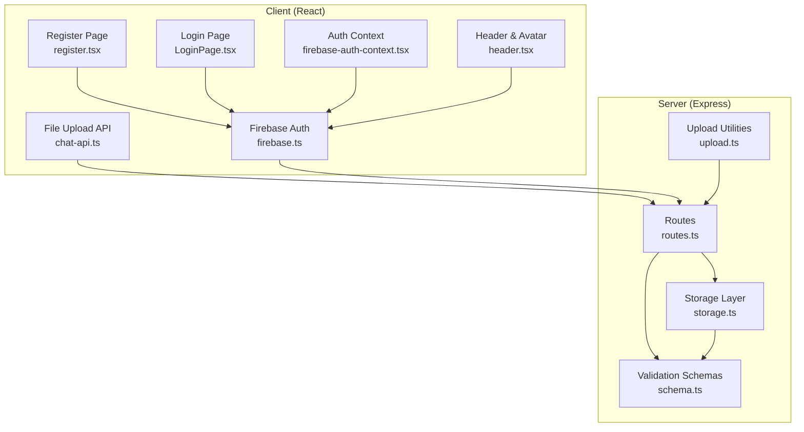
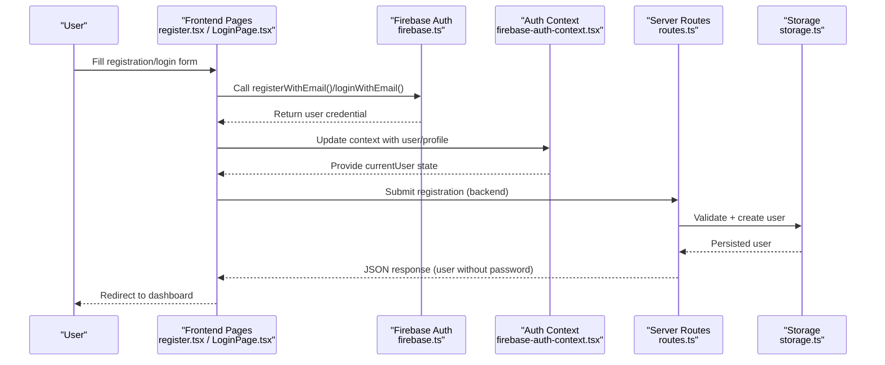
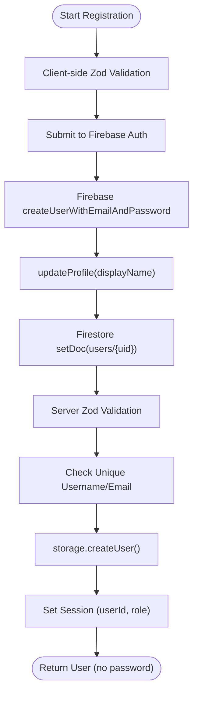
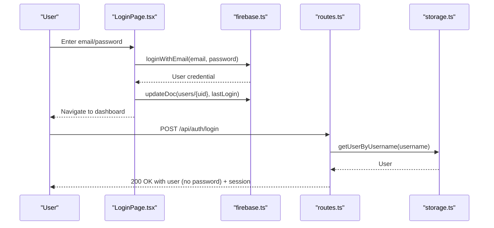
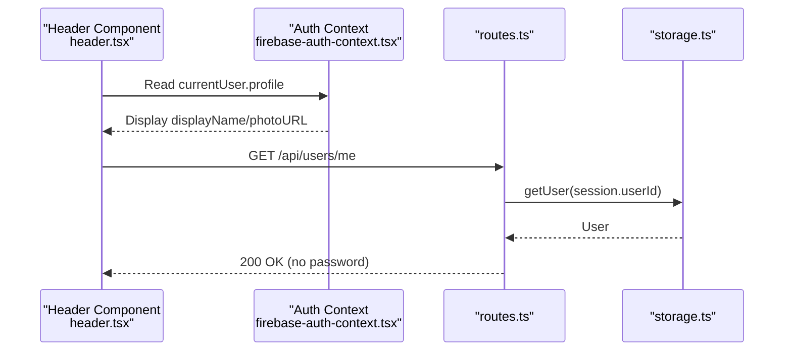
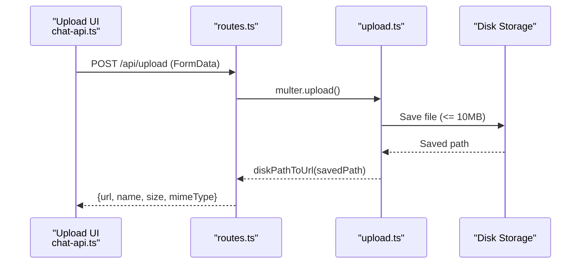
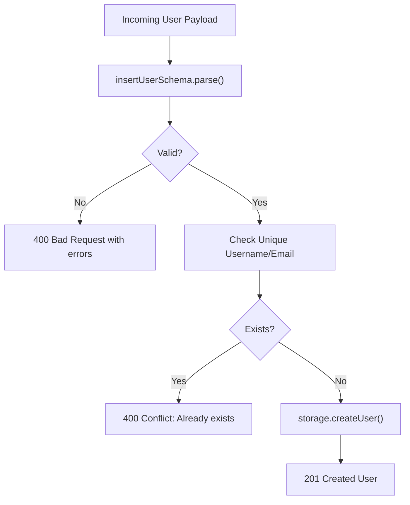
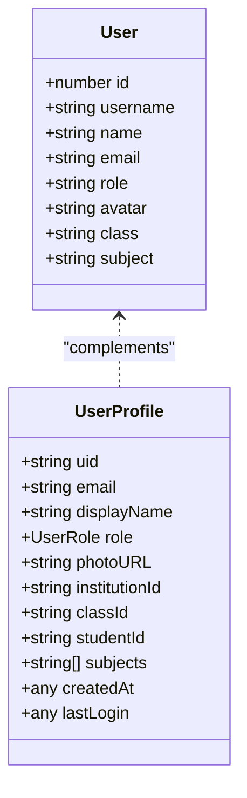
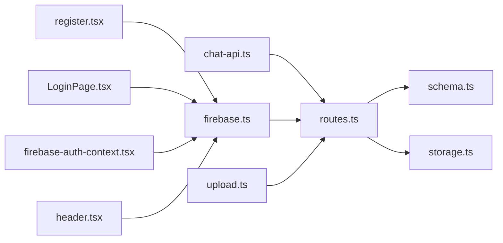

# User Profile Management

<cite>
**Referenced Files in This Document**
- [routes.ts](file://server/routes.ts)
- [schema.ts](file://shared/schema.ts)
- [storage.ts](file://server/storage.ts)
- [register.tsx](file://client/src/pages/register.tsx)
- [LoginPage.tsx](file://client/src/pages/LoginPage.tsx)
- [firebase.ts](file://client/src/lib/firebase.ts)
- [firebase-auth-context.tsx](file://client/src/contexts/firebase-auth-context.tsx)
- [header.tsx](file://client/src/components/layout/header.tsx)
- [upload.ts](file://server/lib/upload.ts)
- [chat-api.ts](file://client/src/lib/chat-api.ts)
- [README.md](file://README.md)
- [LOCAL_SETUP.md](file://LOCAL_SETUP.md)
</cite>

## Table of Contents
1. [Introduction](#introduction)
2. [Project Structure](#project-structure)
3. [Core Components](#core-components)
4. [Architecture Overview](#architecture-overview)
5. [Detailed Component Analysis](#detailed-component-analysis)
6. [Dependency Analysis](#dependency-analysis)
7. [Performance Considerations](#performance-considerations)
8. [Troubleshooting Guide](#troubleshooting-guide)
9. [Conclusion](#conclusion)

## Introduction
This document describes the user profile management functionality across the frontend and backend systems. It covers user registration and authentication flows, profile creation and retrieval, data validation schemas, avatar upload capabilities, profile customization options, and privacy-related considerations. It also outlines onboarding flows, account verification processes, and profile completion tracking, while addressing data protection measures.

## Project Structure
The user profile management spans three primary areas:
- Frontend (React + Firebase): Handles user registration, login, profile display, and avatar uploads.
- Backend (Express + Storage): Validates requests, enforces roles, persists user data, and exposes APIs.
- Shared (Zod schemas): Defines strict validation rules for user data across the stack.

**Diagram sources**
- [routes.ts](file://server/routes.ts#L1-L1104)
- [schema.ts](file://shared/schema.ts#L1-L142)
- [storage.ts](file://server/storage.ts#L1-L519)
- [register.tsx](file://client/src/pages/register.tsx#L1-L338)
- [LoginPage.tsx](file://client/src/pages/LoginPage.tsx#L1-L112)
- [firebase.ts](file://client/src/lib/firebase.ts#L1-L212)
- [firebase-auth-context.tsx](file://client/src/contexts/firebase-auth-context.tsx#L1-L267)
- [header.tsx](file://client/src/components/layout/header.tsx#L1-L133)
- [upload.ts](file://server/lib/upload.ts#L70-L84)
- [chat-api.ts](file://client/src/lib/chat-api.ts#L85-L111)

**Section sources**
- [README.md](file://README.md#L70-L102)
- [LOCAL_SETUP.md](file://LOCAL_SETUP.md#L93-L111)

## Core Components
- Validation schemas define required fields and constraints for user profiles.
- Frontend pages collect user input and integrate with Firebase Authentication.
- Backend routes validate incoming data, enforce uniqueness, and persist user records.
- Storage layer abstracts persistence and provides typed operations.
- Upload utilities support avatar/image uploads with size limits and path conversion.

Key responsibilities:
- Registration: Validate input, check duplicates, create user, and establish session.
- Login: Authenticate credentials and manage session state.
- Profile display: Retrieve and render user profile in UI components.
- Avatar upload: Accept file uploads, convert to URLs, and associate with user.

**Section sources**
- [schema.ts](file://shared/schema.ts#L4-L13)
- [register.tsx](file://client/src/pages/register.tsx#L36-L46)
- [routes.ts](file://server/routes.ts#L13-L47)
- [storage.ts](file://server/storage.ts#L142-L147)
- [firebase.ts](file://client/src/lib/firebase.ts#L80-L115)
- [upload.ts](file://server/lib/upload.ts#L70-L84)

## Architecture Overview
The user profile lifecycle integrates Firebase Authentication with server-side validation and storage. The frontend captures user input, authenticates via Firebase, and optionally stores additional profile metadata in Firestore. The backend validates and persists user records, and supports avatar uploads.

**Diagram sources**
- [register.tsx](file://client/src/pages/register.tsx#L70-L86)
- [LoginPage.tsx](file://client/src/pages/LoginPage.tsx#L40-L52)
- [firebase.ts](file://client/src/lib/firebase.ts#L66-L115)
- [firebase-auth-context.tsx](file://client/src/contexts/firebase-auth-context.tsx#L73-L125)
- [routes.ts](file://server/routes.ts#L13-L47)
- [storage.ts](file://server/storage.ts#L142-L147)

## Detailed Component Analysis

### User Registration Workflow
- Frontend collects name, email, username, password, role, optional class/subject.
- Client-side validation ensures minimum lengths and formats.
- Registration triggers Firebase createUserWithEmailAndPassword and updates Firestore user document with role and additional fields.
- Backend registration endpoint validates payload, checks uniqueness, creates user record, and sets session.

**Diagram sources**
- [register.tsx](file://client/src/pages/register.tsx#L36-L46)
- [register.tsx](file://client/src/pages/register.tsx#L70-L86)
- [firebase.ts](file://client/src/lib/firebase.ts#L80-L115)
- [routes.ts](file://server/routes.ts#L13-L47)
- [storage.ts](file://server/storage.ts#L142-L147)

**Section sources**
- [register.tsx](file://client/src/pages/register.tsx#L36-L46)
- [register.tsx](file://client/src/pages/register.tsx#L70-L86)
- [firebase.ts](file://client/src/lib/firebase.ts#L80-L115)
- [routes.ts](file://server/routes.ts#L13-L47)
- [storage.ts](file://server/storage.ts#L142-L147)

### User Login and Session Management
- Frontend validates credentials and calls loginWithEmail.
- On success, updates Firestore lastLogin timestamp and sets context state.
- Backend login endpoint verifies credentials and sets session.

**Diagram sources**
- [LoginPage.tsx](file://client/src/pages/LoginPage.tsx#L40-L52)
- [firebase.ts](file://client/src/lib/firebase.ts#L66-L78)
- [routes.ts](file://server/routes.ts#L49-L76)
- [storage.ts](file://server/storage.ts#L127-L140)

**Section sources**
- [LoginPage.tsx](file://client/src/pages/LoginPage.tsx#L20-L38)
- [firebase.ts](file://client/src/lib/firebase.ts#L66-L78)
- [routes.ts](file://server/routes.ts#L49-L76)
- [storage.ts](file://server/storage.ts#L127-L140)

### Profile Retrieval and Display
- Frontend retrieves current user profile from Firebase and displays in header.
- Backend provides /api/users/me to return authenticated user data without sensitive fields.

**Diagram sources**
- [header.tsx](file://client/src/components/layout/header.tsx#L102-L130)
- [firebase-auth-context.tsx](file://client/src/contexts/firebase-auth-context.tsx#L38-L71)
- [routes.ts](file://server/routes.ts#L88-L107)
- [storage.ts](file://server/storage.ts#L127-L130)

**Section sources**
- [header.tsx](file://client/src/components/layout/header.tsx#L102-L130)
- [routes.ts](file://server/routes.ts#L88-L107)
- [storage.ts](file://server/storage.ts#L127-L130)

### Avatar Upload Functionality
- Frontend file upload via FormData to /api/upload.
- Backend multer configuration enforces file size limits and filters.
- Disk path is converted to a web-accessible URL for storage.

**Diagram sources**
- [chat-api.ts](file://client/src/lib/chat-api.ts#L94-L111)
- [routes.ts](file://server/routes.ts#L1-L10)
- [upload.ts](file://server/lib/upload.ts#L70-L84)

**Section sources**
- [chat-api.ts](file://client/src/lib/chat-api.ts#L94-L111)
- [upload.ts](file://server/lib/upload.ts#L70-L84)

### Data Validation Schemas and Integrity
- Shared Zod schemas define strict validation for user creation and updates.
- Backend routes parse and validate payloads before persistence.
- Uniqueness checks prevent duplicate usernames and emails.

**Diagram sources**
- [schema.ts](file://shared/schema.ts#L4-L13)
- [routes.ts](file://server/routes.ts#L15-L26)
- [storage.ts](file://server/storage.ts#L142-L147)

**Section sources**
- [schema.ts](file://shared/schema.ts#L4-L13)
- [routes.ts](file://server/routes.ts#L15-L26)
- [storage.ts](file://server/storage.ts#L142-L147)

### Profile Fields and Customization Options
- User fields include username, password, name, email, role, optional avatar, class, subject.
- Additional profile metadata stored in Firestore includes role, photoURL, timestamps, and optional identifiers.

**Diagram sources**
- [schema.ts](file://shared/schema.ts#L72-L73)
- [firebase.ts](file://client/src/lib/firebase.ts#L50-L63)

**Section sources**
- [schema.ts](file://shared/schema.ts#L4-L13)
- [firebase.ts](file://client/src/lib/firebase.ts#L50-L63)

### Privacy Settings and Data Protection Measures
- Passwords are excluded from responses and not persisted in Firestore user documents.
- Session management stores only userId and role.
- Client-side profile display uses photoURL or initials; no PII is exposed unnecessarily.
- Environment variables control optional integrations (Firebase, OpenAI) and session secrets.

Recommendations:
- Enforce HTTPS in production.
- Sanitize and validate all uploaded files.
- Limit session cookie attributes appropriately.
- Apply rate limiting on auth endpoints.

**Section sources**
- [routes.ts](file://server/routes.ts#L32-L38)
- [routes.ts](file://server/routes.ts#L100-L102)
- [firebase.ts](file://client/src/lib/firebase.ts#L66-L78)
- [README.md](file://README.md#L53-L68)

## Dependency Analysis
The user profile system exhibits clear separation of concerns:
- Frontend depends on Firebase SDK and local context for authentication state.
- Backend depends on shared schemas and storage abstraction.
- Upload pipeline depends on multer and filesystem utilities.

**Diagram sources**
- [register.tsx](file://client/src/pages/register.tsx#L1-L338)
- [LoginPage.tsx](file://client/src/pages/LoginPage.tsx#L1-L112)
- [firebase.ts](file://client/src/lib/firebase.ts#L1-L212)
- [firebase-auth-context.tsx](file://client/src/contexts/firebase-auth-context.tsx#L1-L267)
- [header.tsx](file://client/src/components/layout/header.tsx#L1-L133)
- [chat-api.ts](file://client/src/lib/chat-api.ts#L85-L111)
- [routes.ts](file://server/routes.ts#L1-L1104)
- [schema.ts](file://shared/schema.ts#L1-L142)
- [storage.ts](file://server/storage.ts#L1-L519)
- [upload.ts](file://server/lib/upload.ts#L70-L84)

**Section sources**
- [routes.ts](file://server/routes.ts#L1-L1104)
- [schema.ts](file://shared/schema.ts#L1-L142)
- [storage.ts](file://server/storage.ts#L1-L519)
- [firebase.ts](file://client/src/lib/firebase.ts#L1-L212)

## Performance Considerations
- Use client-side caching for user profile data to reduce network calls.
- Debounce search inputs in header to minimize unnecessary requests.
- Optimize avatar images before upload to reduce bandwidth and storage costs.
- Consider CDN for avatar delivery to improve load times.

## Troubleshooting Guide
Common issues and resolutions:
- Firebase not configured: App runs but auth features are disabled. Ensure environment variables are set and restart the server.
- Duplicate username/email during registration: Server responds with conflict; adjust input accordingly.
- Login failures: Verify credentials and network connectivity; check server logs for detailed errors.
- Upload failures: Confirm file size (< 10MB) and MIME type filtering; inspect server response body.

**Section sources**
- [README.md](file://README.md#L67-L68)
- [routes.ts](file://server/routes.ts#L42-L46)
- [upload.ts](file://server/lib/upload.ts#L74-L76)
- [chat-api.ts](file://client/src/lib/chat-api.ts#L105-L108)

## Conclusion
The user profile management system combines robust client-side validation and Firebase Authentication with server-side Zod schemas and storage abstractions. It supports registration, login, profile display, and avatar uploads while maintaining data integrity and privacy. Extending the system to include profile updates, preferences, and advanced verification would follow similar patterns of validation, persistence, and UI integration.